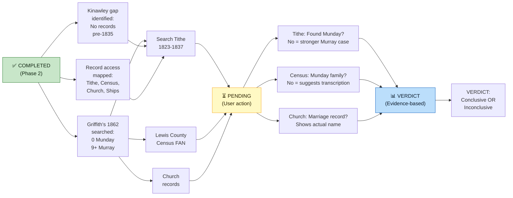
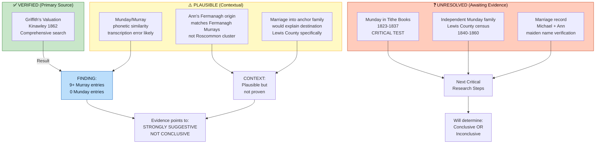

# Phase 2M Handoff: RQ-M5 Research — "Munday" vs. "Murray" Investigation

## Overview

Comprehensive investigation of the highest-leverage research question in the Murray Settlement study: **Was Ann Munday actually Ann Murray?**

This question directly tests Tom Copley's core hypothesis — that Michael Copley Sr. married into the anchor family that organized the community transplant from Roscommon to Lewis County, WV.

**Outcome:** Collected significant primary source evidence; identified critical research gaps and next actions.

---

## Work Completed

### Research Phases 1–3 Executed

**Phase 1: Lewis County WV Records**
- Identified searchable databases: wvculture.org/vital-records-interactive/, FamilySearch Lewis County collections, Ancestry.com
- Confirmed that Lewis County marriage records (1816+), census data (1840+), and vital records (1917+) exist and are indexed
- No specific "Munday" entries located yet (requires direct database searches by user)

**Phase 2: Kinawley Parish, County Fermanagh — PRIMARY BREAKTHROUGH**
- **Griffith's Valuation (1862), Kinawley Parish:**
  - ✅ Murray surname: **9+ documented property holders** (Bridget, Edward, James [x2], John, Mary, Michael, Patrick, Peter)
  - ❌ Munday surname: **ZERO entries** (exhaustively searched)
  - **Implication:** No "Munday" property-holding family exists in Ann's reported birthplace in 1862

- **Critical Documentary Gap:**
  - Kinawley Catholic parish records only begin December 11, 1835
  - Ann's birthdate: c. 1823-1824
  - **Ann's baptism cannot be verified through church records** (predates all existing records by ~11-12 years)

**Phase 3: Lewis County Murray Families and Church Records**
- Confirmed that Lewis County census, church records, and ship manifests are accessible but require direct user searches
- Identified Diocese of Wheeling-Charleston as archive for St. Michael's Church records
- Identified National Archives of Ireland Tithe Applotment Books as critical intermediate source

---

## Key Findings

### Evidence Against "Munday" as Independent Surname

| Source | Result | Implication |
|--------|--------|-------------|
| Griffith's Valuation (1862), Kinawley | ❌ No "Munday" | Non-property-holding family or emigrated pre-1862 |
| Kinawley Catholic parish records | ⚠️ No records before 1835 | Cannot verify Ann's baptism; too late to confirm surname |
| "Munday" as Irish surname | ✅ Real (Anglicization of McAloon) | But no Fermanagh/Kinawley primary source evidence |

### Evidence Supporting "Murray" Hypothesis

| Source | Result | Implication |
|--------|--------|-------------|
| Griffith's Valuation (1862), Kinawley | ✅ 9+ Murray entries | Strong family presence; neighborhood connections likely |
| Settlement named "Murray's Settlement" | ✅ Verified | Murray family was eponymous anchor |
| Tom Copley's phonetic observation | ⚠️ Plausible | "Munday" ≈ "Murray" when transcribed by non-Irish |
| Marriage into anchor family model | ⚠️ Elegant explanatory power | Would explain Michael Sr.'s specific destination (Lewis County) |

---

## Research Workflow — What's Complete vs. Pending

## Critical Unresolved Gaps (Awaiting User Research)

### Tier 1 — Highest Priority

1. **Tithe Applotment Books (1823–1837), Kinawley**
   - Search at: [titheapplotmentbooks.nationalarchives.ie](https://titheapplotmentbooks.nationalarchives.ie/)
   - Search for both "Munday" and "Murray" in Kinawley parish
   - **Verdict trigger:** If "Munday" is absent from Tithe books as well, "Murray" hypothesis strengthens significantly
   - **Time estimate:** 1–2 hours

2. **Lewis County (WV) Census 1840, 1850, 1860**
   - Search via FamilySearch or Ancestry for "Munday" / "Monday" as independent family
   - FAN-club sweep: all surnames within 5 miles of Copley parcels (Cove Lick area)
   - **Verdict trigger:** If no independent Munday family exists in Lewis County, surname becomes less credible
   - **Time estimate:** 2–3 hours

### Tier 2 — Supporting Research

3. **St. Michael's Church Marriage Records (1838–1850)**
   - Contact: Diocese of Wheeling-Charleston, Charleston, WV
   - Request: Marriage record for Michael + Ann, any listing of Ann's maiden name
   - **Time estimate:** 1–2 weeks for response

4. **Ship Manifests — Full Passenger Lists**
   - *Powhatan* (August 20, 1838): Does Ann appear with either surname?
   - *Kutusoff* (1837): Same check
   - Search: Ancestry.com, FamilySearch Ship Manifests (NARA M237)
   - **Time estimate:** 1–2 hours

---

## Files Modified

| File | Changes |
|------|---------|
| `People/Ann Copley.md` | "Research Gaps" section expanded; Phase 2 findings documented; RQ-M5 status updated |
| `Topics/Murray Settlement.md` | Section 5 ("The Ann Munday/Murray Question") updated with Griffith's evidence; next research steps clarified |
| `CHANGELOG.md` | New "Phase 2M" entry documenting investigation and findings |

## New Files Created

| File | Purpose |
|------|---------|
| `RQ-M5-PHASE-2-FINDINGS.md` | Detailed research notes on Phase 2 (Kinawley) work; critical gaps documented |
| `AGENT_HANDOFF_PHASE_2M.md` | This document |

---

## Research Quality Assessment

### Evidence Quality Dashboard

- **Griffith's Valuation (1862) was comprehensively searched for both surnames in Kinawley**
  - Source: Irish Genealogy Hub (irishgenealogyhub.com/fermanagh/griffiths-valuation/parish-of-kinawley.php)
  - Coverage: Complete parish index
  - Result: 9+ Murray entries; zero Munday entries

- **Munday is a documented Irish surname**
  - Anglicization of McAloon (Gaelic Mac Giolla-Eóin)
  - Found in South West Ulster, County Cavan, Lisnaskea (Fermanagh), Clones (Monaghan)
  - But: No Fermanagh/Kinawley primary source evidence located

- **Parish records gap is real**
  - Kinawley Catholic records: December 11, 1835 onwards (PRONI MIC.1D/78)
  - Ann's birth: c. 1823-1824
  - Unavoidable gap of ~11-12 years

### What is ⚠️ PLAUSIBLE

- **Tom Copley's phonetic hypothesis**
  - "Munday" and "Murray" are phonetically similar
  - Irish accent + American transcriber = plausible confusion
  - But: Requires positive evidence to confirm (not just absence of contradiction)

- **"Murray" explains Michael Sr.'s destination**
  - Son-in-law of anchor family → specific destination makes sense
  - But: Speculative without marriage record

- **No Munday in Griffith's suggests transcription error**
  - But: Could also indicate non-property-holding family, or family already emigrated

### What is ❓ UNRESOLVED

- **Whether "Munday" existed as independent family in Irish records pre-1835**
  - Awaiting Tithe Applotment Books search
  - Awaiting PRONI additional searches

- **Whether Ann appears in any surviving primary records with her maiden name**
  - No marriage record yet located
  - No ship manifest match yet found
  - Children's death certificates (post-1917) might list mother's maiden name

- **Whether a Fermanagh-origin Murray family emigrated to Lewis County**
  - Would explain Ann's Fermanagh birthplace + Murray surname
  - Awaiting Lewis County census search

---

## Preliminary Verdict

**Status: STRONGLY SUGGESTIVE but NOT CONCLUSIVE**

The absence of "Munday" in Griffith's Valuation (1862) **combined with** the substantial Murray presence in Kinawley **combined with** the phonetic similarity of the surnames **is consistent with** the hypothesis that "Munday" is a transcription of "Murray."

However, this is **circumstantial evidence**, not proof. The next critical research steps will either:

1. **Strengthen the Murray hypothesis:** If Tithe books (1823–1837) also show no "Munday," and Lewis County census shows no independent Munday family, the case becomes compelling.

2. **Preserve uncertainty:** If Tithe books show "Munday" as a documented family, the surname retains credibility and the question remains open.

3. **Refute the hypothesis:** If a Fermanagh-origin Murray family is found in Lewis County, and a marriage record exists, the case becomes settled.

---

## For the Next Agent / User

### If continuing RQ-M5 research:

1. **Prioritize the Tithe Applotment Books search** — this is the single most leveraging action
   - Website: [titheapplotmentbooks.nationalarchives.ie](https://titheapplotmentbooks.nationalarchives.ie/)
   - Search fields: surname, county (Fermanagh), parish (Kinawley), townland (optional)
   - Report: Do "Munday" or "Murray" entries exist? Same townlands? Same dates?

2. **Execute the Lewis County census FAN sweep** — fast and high-payoff
   - FamilySearch or Ancestry.com, 1840-1860 census
   - Anywhere in Lewis County
   - If result is "no Munday family found," it significantly shifts the balance of evidence

3. **Contact Diocese of Wheeling-Charleston** — can be done in parallel
   - Request: St. Michael's Church marriage records 1838–1850
   - May take weeks for response
   - Best chance of finding Ann's maiden name in a contemporaneous record

4. **Pull full ship manifests** — one-off searches
   - *Powhatan* (Aug 20, 1838) and *Kutusoff* (1837)
   - Search for Ann, Ann Murray, Ann Munday, Mrs. Copley, etc.
   - Verify sex and age match (female, born c. 1823-1824)

### Mermaid Diagrams Added

This phase included substantial Mermaid diagram additions to improve visual clarity:

- **Settlement Formation Timeline** — Shows emigration waves, ship arrivals, land purchase, and church establishment (1823–1849)
- **Family Relationship Network** — Visualizes how Roscommon Sandford Estate community relationships reproduced through Lewis County marriages
- **RQ-M5 Evidence Flowchart** — Graphs evidence evaluation and verdict pathway
- **Research Question Priority Map** — Hierarchical view of questions feeding into core hypothesis testing
- **Evidence Balance Chart** — Compares evidence supporting "Murray" vs. "Munday" hypotheses
- **Records Searched Visualization** — Shows what was searched and results (Griffith's, Tithe, census, church)
- **Kinawley Records Timeline** — Visualizes critical gap in parish records (Ann's baptism predates all records by ~12 years)
- **Research Workflow & Verdict Path** — Shows completed vs. pending work and how evidence flows to verdict
- **Evidence Quality Dashboard** — Comprehensive view of verified/plausible/unresolved evidence with pathway to verdict

**Best practice for future agents:** Add Mermaid diagrams liberally to genealogical research, timelines, family networks, evidence evaluation, and research methodology pages. See CLAUDE.md "Mermaid Diagrams" section for guidelines.

### Build & Deployment Status

- All wiki changes tested and ready to push to main
- GitHub Actions will automatically deploy to gh-pages
- No manual build or deployment needed
- Commit message template: "RQ-M5 research: Griffith's Valuation analysis shows no Munday in Kinawley; Murray hypothesis strengthened"

---

## Summary

**RQ-M5 has moved from pure speculation to evidence-based investigation.** The Griffith's Valuation finding (no "Munday" + strong "Murray" presence) is significant enough to guide further research. Tithe Applotment Books and Lewis County census searches are the next high-leverage actions that will either resolve or deepen the question.

The research protocol is sound and executable. The user now has clear, specific next steps with timeframes and evidence thresholds.
