# Copley Family Tree

This page provides a visual, multi-generation map of the Copley family line from the Irish immigrant ancestors through G28 descendants. The diagram is organized top-to-bottom by generation and uses branch color-coding to make lineage groups easier to follow.

> [!tip] Navigation
> In Quartz and Obsidian, use this diagram as a visual reference alongside individual profile pages. Where clickable labels are enabled, you can click names to navigate to related person pages.

## Mermaid Diagram

```mermaid
graph TD


classDef irish fill:#1a3d2e,stroke:#4caf7c,stroke-width:2px,color:#f0f0f0
classDef g23 fill:#1b3a50,stroke:#5ca8d4,stroke-width:2px,color:#f0f0f0
classDef g24sibling fill:#2a2050,stroke:#8b7fd4,stroke-width:2px,color:#f0f0f0
classDef sardoBranch fill:#1b4a3a,stroke:#2ec4b6,stroke-width:2px,color:#f0f0f0
classDef stephenLine fill:#4a2800,stroke:#e89a3c,stroke-width:2px,color:#f0f0f0
classDef tomLine fill:#5a1a2a,stroke:#e06080,stroke-width:2px,color:#f0f0f0
classDef grandchild fill:#4a3a10,stroke:#d4b850,stroke-width:2px,color:#f0f0f0
classDef greatgrand fill:#5a2050,stroke:#e070a0,stroke-width:2px,color:#f0f0f0
classDef spouse fill:#2d1a4a,stroke:#a77bda,stroke-width:1px,color:#f0f0f0,stroke-dasharray:5,5
classDef marriage fill:none,stroke:#d4a843,stroke-width:2px,color:#d4a843
classDef speculative fill:#4a5a4a,stroke:#7a9a7a,stroke-width:1px,color:#c0c0c0,stroke-dasharray:3,3

subgraph ENGLISH_ANCESTORS["📜 English Ancestors (Speculative Descent)"]
    THOMAS_SR["Thomas Copley Sr.<br>c. 1540–1593<br>Bredon's Norton, Worcestershire"]:::speculative
    THOMAS_JR["Thomas Copley Jr.<br>c. 1580–1647<br>Bredon's Norton<br>Manor sold 1649"]:::speculative
    CAPTAIN_JOHN["Captain John Copley<br>c. 1610 – post 1657<br>Italy 1634, Ireland 1657<br>Kingswood Ironworks"]:::speculative
    MARGARET_N["Margaret Newport<br>daughter of George Newport<br>of Rushock"]:::spouse
    
    THOMAS_SR --> THOMAS_JR
    THOMAS_JR --> CAPTAIN_JOHN
    CAPTAIN_JOHN --- CAP_JOHN_M{"◇"}:::marriage
    MARGARET_N --- CAP_JOHN_M
end

subgraph ROSCOMMON_SIBLINGS["🇮🇪 Roscommon Extended Family & Siblings of Michael Sr."]
    PATRICK["Patrick Copley<br>b. ~1818<br>co-emigrant Powhatan 1838<br>co-purchaser 1843 Hoffman deed"]:::irish
    BRIDGET_SIB["Bridget Copley<br>probable Kutusoff 1837<br>married Hanley<br>Griffith's Valuation Kilgefin?"]:::irish
    WILLIAM_AUS["William Copley<br>family tradition:<br>'went to Australia'<br>Q6 — unconfirmed"]:::irish
    MARY_GIBLIN["Mary Copely Giblin<br>b. 1814, Tully, Kilcorkey, Roscommon<br>d. 1884, Crawford County, Iowa<br>probable sibling — Iowa branch"]:::irish
    WILLIAM_FM["William Copely of Fairymount<br>b. ~1794, Fairymount, Kilgefin<br>d. Q4 1864, Catholic farmer<br>probable older brother/father?"]:::speculative
end

CAPTAIN_JOHN -.->|speculative descent<br>generations unknown<br>1657–1813| MICHAEL_SR
WILLIAM_FM -.->|probable sibling<br>or close relative| MICHAEL_SR
MICHAEL_SR ---|sibling| PATRICK
MICHAEL_SR ---|sister| BRIDGET_SIB
MICHAEL_SR ---|sibling| WILLIAM_AUS
MICHAEL_SR ---|likely sister| MARY_GIBLIN

MICHAEL_SR["Michael Copley<br>b. 1813, Kilgefin, Ireland<br>d. 1897"]:::irish
ANN_MUNDAY["Ann Elizabeth Munday<br>b. 1823, Kinawley, Ireland<br>d. 1909"]:::irish

MICHAEL_SR --- M1{"◇"}:::marriage
ANN_MUNDAY --- M1
M1 --- JOHN

JOHN["John Copley<br>b. Nov 3, 1843<br>d. Sep 6, 1925"]:::g23
MARY_DOLAN["Mary Ellen Dolan<br>b. Nov 28, 1855<br>d. Dec 5, 1901"]:::g23

JOHN --- M2{"◇"}:::marriage
MARY_DOLAN --- M2
M2 --- THOMAS_E
M2 --- MARY_FLESCH
M2 --- ANNE_C
M2 --- NELLE
M2 --- MICHAEL_JR

THOMAS_E["Thomas E. Copley<br>b. 1892 · d. 1968<br><i>m. Drusilla · no issue</i>"]:::g24sibling
MARY_FLESCH["Mary Copley Flesch<br>b. 1893 · d. 1971<br><i>m. Edward Flesch</i>"]:::g24sibling
ANNE_C["Anne Copley<br>b. 1895 · d. 1970<br><i>never married</i>"]:::g24sibling

NELLE["Ellen B. 'Nelle' Copley<br>b. Dec 23, 1897<br>d. Feb 11, 1977"]:::sardoBranch
ROBERT_SARDO["Robert Samuel Sardo<br>physician<br><i>m. Aug 16, 1931</i>"]:::spouse

NELLE --- M3{"◇"}:::marriage
ROBERT_SARDO --- M3
M3 --- SARAH_SARDO
M3 --- MARY_SARDO

MICHAEL_JR["Michael Joseph Copley<br>b. Sep 16, 1898<br>d. Sep 17, 1988<br><i>chemist, USDA Director</i>"]:::g24sibling
MARION["Marion Elizabeth Partlow<br><i>m. 1933</i> · d. 1977"]:::spouse

MICHAEL_JR --- M4{"◇"}:::marriage
MARION --- M4
M4 --- STEPHEN
M4 --- TOM

SARAH_SARDO["Sarah Ellen Sardo<br>b. Dec 19, 1933"]:::sardoBranch
MATT_ARENA["Matthew Paul Arena<br><i>m. Nov 1956</i>"]:::spouse

SARAH_SARDO --- M5{"◇"}:::marriage
MATT_ARENA --- M5
M5 --- CATHY_A
M5 --- ANNMARIE_A
M5 --- JIM_A
M5 --- MATT_JR_A
M5 --- JOHN_A

MARY_SARDO["Mary Carmella Sardo<br>b. May 3, 1936"]:::sardoBranch
LOUIS_RULAND["Louis Ruland"]:::spouse

MARY_SARDO --- M6{"◇"}:::marriage
LOUIS_RULAND --- M6
M6 --- LOUIS_III
M6 --- ROBERT_R
M6 --- CHARLES_R
M6 --- JOHN_R
M6 --- MICHAEL_R

STEPHEN["Stephen Michael Copley<br>b. Apr 29, 1936<br><i>physicist, professor</i>"]:::stephenLine
MARCIA["Marcia Thornton<br><i>1st wife · div. 1983</i>"]:::spouse
JUDY["Judith 'Judy' Todd<br><i>2nd wife · m. 1984</i>"]:::spouse

STEPHEN --- M7{"◇"}:::marriage
MARCIA --- M7
M7 --- MC
M7 --- SARA_C
M7 --- PHILIP
M7 --- PAUL
M7 --- PETER
M7 --- SUSAN_C
M7 --- STEPHEN_J

STEPHEN --- M7B{"◇"}:::marriage
JUDY --- M7B
M7B --- AMY

TOM["Thomas Partlow Copley<br>b. Oct 29, 1944<br><i>marketing, PhD</i>"]:::tomLine
BARBARA["Barbara Dee LaForce<br><i>m. Mar 19, 1967</i>"]:::spouse

TOM --- M8{"◇"}:::marriage
BARBARA --- M8
M8 --- ZACH
M8 --- ERIN
M8 --- CHARLES_C

CATHY_A["Cathy Arena"]:::sardoBranch
ANNMARIE_A["Ann Marie Arena"]:::sardoBranch
JIM_A["Jim Arena"]:::sardoBranch
MATT_JR_A["Matt Jr. Arena"]:::sardoBranch
JOHN_A["John Arena"]:::sardoBranch

LOUIS_III["Louis III Ruland"]:::sardoBranch
ROBERT_R["Robert Ruland"]:::sardoBranch
CHARLES_R["Charles Ruland"]:::sardoBranch
JOHN_R["John Ruland"]:::sardoBranch
MICHAEL_R["Michael Ruland"]:::sardoBranch

MC["Michael Copley<br>b. 1959<br><i>m. Patti Inman</i>"]:::stephenLine
SARA_C["Sara Copley<br>b. 1961<br><i>m. R. Cox '86</i>"]:::stephenLine
PHILIP["Philip Copley<br>b. 1962"]:::stephenLine
PAUL["Paul Copley<br>b. 1964<br><i>m. A.M. Leonhardt</i>"]:::stephenLine
PETER["Peter Copley<br>b. 1966<br><i>m. K. VanderMolen</i>"]:::stephenLine
SUSAN_C["Susan Copley<br>b. 1967"]:::stephenLine
STEPHEN_J["Stephen J. Copley<br>b. 1970 · d. 2023"]:::stephenLine

AMY["Amy E. Copley Geist<br>b. Jul 11, 1990<br><i>m. Nathan Geist 2021</i>"]:::stephenLine

ZACH["Zachary R. Copley<br>b. May 22, 1969, Bellefonte PA<br><i>m. Wendy Thorpe, Sep 2001</i>"]:::tomLine
ERIN["Erin E. Copley Bird<br>b. Apr 1973<br><i>m. Bryan Bird</i>"]:::tomLine
CHARLES_C["Charles H. Copley<br>b. Oct 1985"]:::tomLine

MC --- LAUREN
MC --- STEPHEN_GC

LAUREN["Lauren Copley Meier<br><i>m. Lane Meier</i>"]:::grandchild
STEPHEN_GC["Stephen Copley"]:::grandchild

SARA_C --- BOBBY_COX
BOBBY_COX["Robert 'Bobby' Cox<br>b. Oct 3, 1988"]:::grandchild

PAUL --- GEORGIA
GEORGIA["Georgia Leonhardt"]:::grandchild

AMY --- WILLIAM_G
WILLIAM_G["William S. Geist<br>b. Dec 9, 2023"]:::grandchild

ZACH --- WYATT
ZACH --- AUGUST
WYATT["Wyatt Copley<br>b. 2004"]:::grandchild
AUGUST["August 'Augie' Copley<br>b. 2008"]:::grandchild

ERIN --- EVELYN
ERIN --- SAMUEL
EVELYN["Evelyn 'Evy' Bird<br>b. 2010"]:::grandchild
SAMUEL["Samuel Bird<br>b. 2014"]:::grandchild

LAUREN --- ROWAN
LAUREN --- ELIZABETH_M
ROWAN["Rowan Meier"]:::greatgrand
ELIZABETH_M["Elizabeth Meier"]:::greatgrand

ARENA_G27["<b>Arena G27</b><br>Sarah, Martin Jr., James,<br>Matthew, Danielle, Siena, Luca"]:::sardoBranch
RULAND_G27["<b>Ruland G27</b><br>18+ grandchildren incl.<br>Louis IV, Chris, Taylor, Kelly,<br>Jeffrey, Jamie, Katie…"]:::sardoBranch
ARENA_RULAND_G28["<b>Arena/Ruland G28</b><br>William 'Calvin' Haker, Louis V,<br>Olivia, Luke, Cooper, Paige,<br>Peyton, John…"]:::greatgrand

CATHY_A --- ARENA_G27
ANNMARIE_A --- ARENA_G27
JIM_A --- ARENA_G27
MATT_JR_A --- ARENA_G27
JOHN_A --- ARENA_G27

LOUIS_III --- RULAND_G27
ROBERT_R --- RULAND_G27
CHARLES_R --- RULAND_G27
JOHN_R --- RULAND_G27
MICHAEL_R --- RULAND_G27

ARENA_G27 --- ARENA_RULAND_G28
RULAND_G27 --- ARENA_RULAND_G28

style M1 fill:#d4a843,stroke:#d4a843,width:8px,height:8px
style M2 fill:#d4a843,stroke:#d4a843,width:8px,height:8px
style M3 fill:#d4a843,stroke:#d4a843,width:8px,height:8px
style M4 fill:#d4a843,stroke:#d4a843,width:8px,height:8px
style M5 fill:#d4a843,stroke:#d4a843,width:8px,height:8px
style M6 fill:#d4a843,stroke:#d4a843,width:8px,height:8px
style M7 fill:#d4a843,stroke:#d4a843,width:8px,height:8px
style M7B fill:#d4a843,stroke:#d4a843,width:8px,height:8px
style M8 fill:#d4a843,stroke:#d4a843,width:8px,height:8px
```

## Legend

- **Green**: Irish ancestors (immigrant generation)
- **Blue**: G23 core John + Mary Ellen branch markers
- **Purple**: G24 siblings
- **Teal**: Nelle Copley Sardo branch
- **Orange**: Michael Joseph Copley / Stephen line
- **Rose**: Thomas (Tom) line
- **Gold**: G27 grandchildren
- **Pink**: G28 great-grandchildren
- **Amber dashed/outlined nodes**: spouses and marriage connectors

## Usage Note

Use this family tree together with [[People Directory]] and [[People/People Directory|People Directory (Individual Profiles)]] for full biographical and source context.

