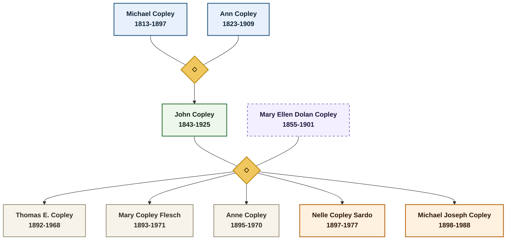
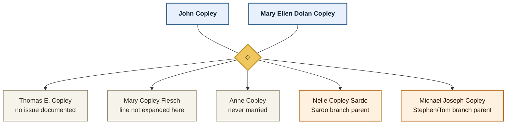
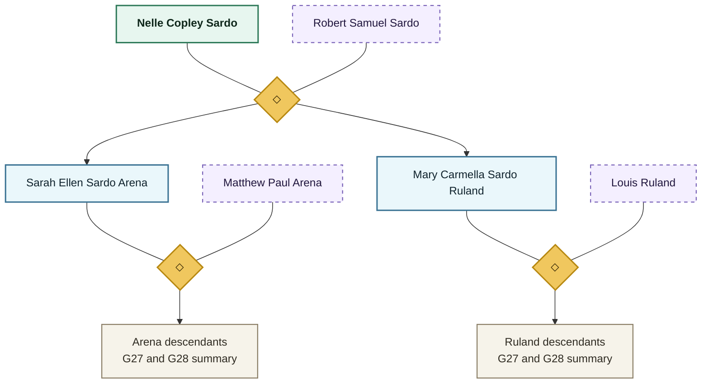
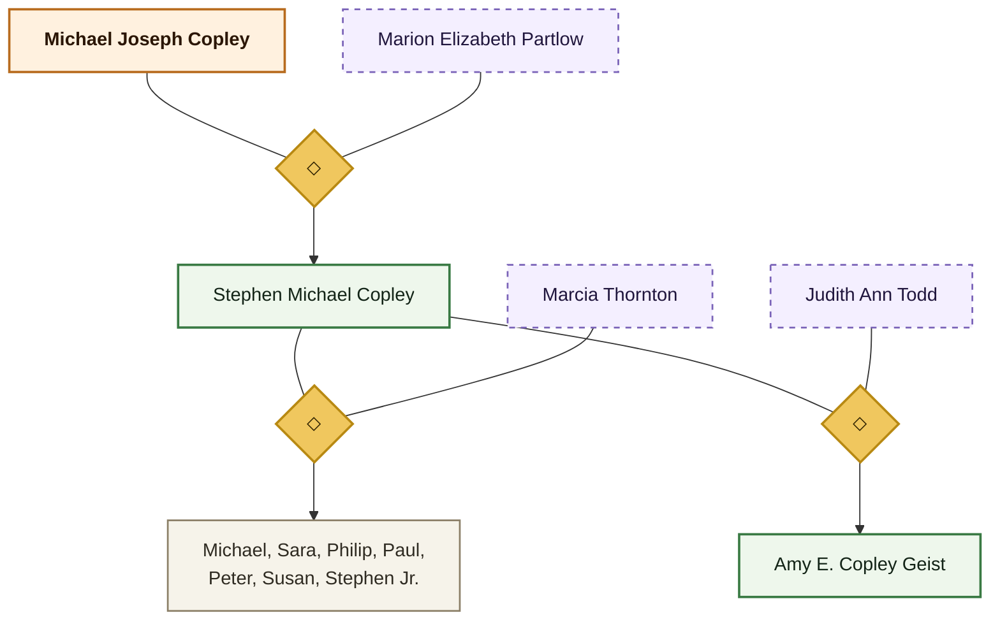
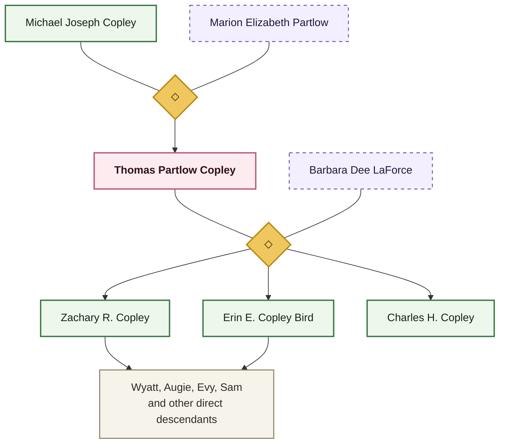

# Copley Family Tree

This page is now a relationship hub rather than a single all-family chart. Use it to orient yourself quickly, then jump to the relevant branch pages and person profiles.

For chronology, pair this page with [[Who Was Alive When]]. For story and evidence strength, keep [[Visual Story Atlas]] and [[Sources and Evidence Index]] nearby. For the older speculative English ancestry question, go to [[Topics/Bredon Descent]] and [[Topics/Captain John Copley Research]].

> [!tip] Best Way To Use This Page
> Start with the founding family overview, then open the branch chart that matches the person you care about. Use [[People Directory]] when you want the full list of profiles by generation.

## Branch Jump List

- [[#Founding Family Overview|Founding Family Overview]]
- [[#John And Mary Ellens Children|John and Mary Ellen's Children]]
- [[#Nelle--Sardo-Branch|Nelle / Sardo Branch]]
- [[#Michael Joseph To Stephen Line|Michael Joseph to Stephen Line]]
- [[#Michael Joseph To Tom Line|Michael Joseph to Tom Line]]
- [[#Older And Speculative Ancestry|Older and Speculative Ancestry]]

## How To Read These Family Charts

- **Solid family boxes** show direct family members in the documented line.
- **Dashed boxes** show spouses or in-laws.
- **Gold diamond connectors** mark marriages.
- **Muted branch-summary boxes** compress a larger descendant cluster when naming everyone would make the chart unreadable.
- **Light blue / green / peach / rose fills** distinguish the main trunk and branch groupings; they are only navigation aids, not evidence rankings.

## Founding Family Overview

This chart shows the immigrant couple, their best-documented child line, and the two branch-parent children whose descendants dominate the current vault.

Best next pages for this section: [[Michael Copley Sr]], [[Ann Copley]], [[John Copley]], [[Mary Ellen Dolan Copley]], [[People Directory]].

## John And Mary Ellen's Children

This chart zooms in on the five children of John and Mary Ellen so readers can understand which lines did and did not become the main modern branches.

Best next pages for this section: [[Ellen Bernadine Nelle Copley Sardo]], [[Michael Joseph Copley]], [[Who Was Alive When]].

## Nelle / Sardo Branch

This branch carries the Baltimore, Clarksville, Sherwood Forest, Arena, and Ruland lines. The chart keeps the main relationships visible while compressing the larger G27 and G28 clusters.

Best next pages for this section: [[Ellen Bernadine Nelle Copley Sardo]], [[Sarah Ellen Sardo Arena]], [[Mary Carmella Sardo Ruland]], [[Places/Baltimore Maryland]], [[Places/Clarksville Maryland]].

## Michael Joseph To Stephen Line

This chart follows the line that leads into the Connecticut, Southern California, Hinsdale, and State College branches.

Best next pages for this section: [[Stephen Michael Copley]], [[Amy E. Copley Geist]], [[Michael Copley (b. 1959)]], [[Philip Copley]], [[People Directory]].

## Michael Joseph To Tom Line

This branch is smaller on the page and easier to read whole. It leads directly into the Zach / Erin / Charles lines and the living descendants represented elsewhere in the vault.

Best next pages for this section: [[Thomas Partlow Copley]], [[Zachary R. Copley]], [[Erin E. Copley Bird]], [[Charles H. Copley]].

## Older And Speculative Ancestry

The pre-immigrant English / Captain John line is still important, but it is a different kind of visualization problem because it mixes documented and speculative links.

- For that question, use [[Topics/Bredon Descent]].
- For the Captain John evidence and uncertainty discussion, use [[Topics/Captain John Copley Research]].
- For the Irish immigrant-forward family structure, stay on this page and the linked person profiles.

## Legacy Full Chart

The earlier all-in-one chart is kept only as a legacy reference. It is no longer the primary way to navigate the family relationships.

Open the old full-chart image

## Use With

- [[People Directory]] for the full generation-by-generation profile list
- [[Who Was Alive When]] for overlapping lifespans and era snapshots
- [[Visual Story Atlas]] for the research/story view
- [[Sources and Evidence Index]] for claim strength and open questions
