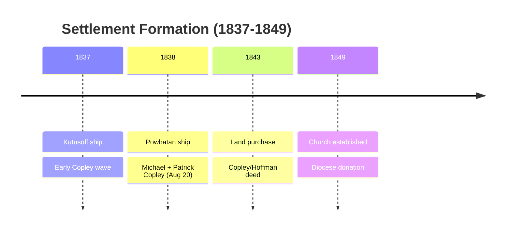
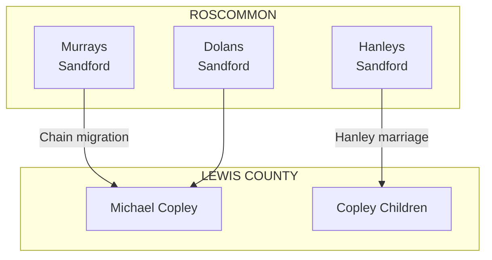
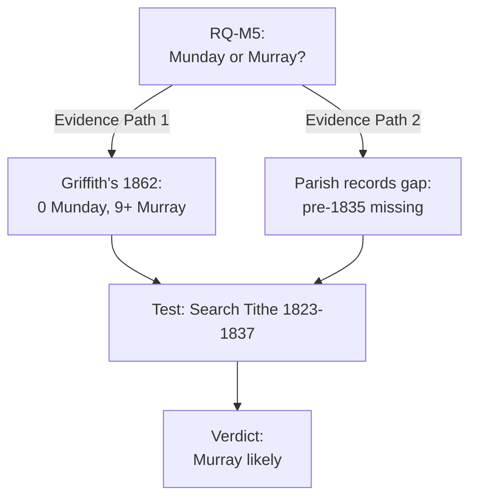
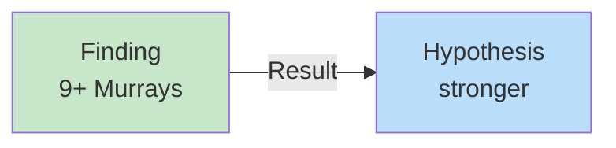
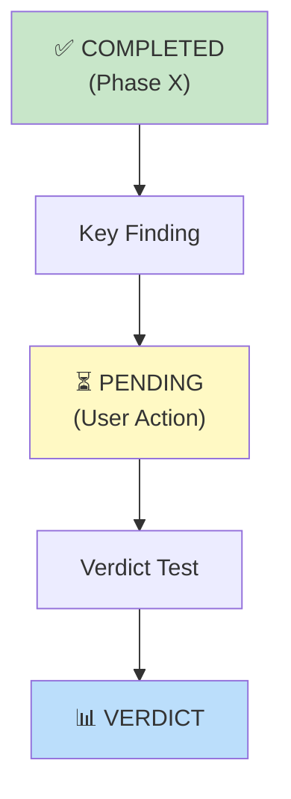
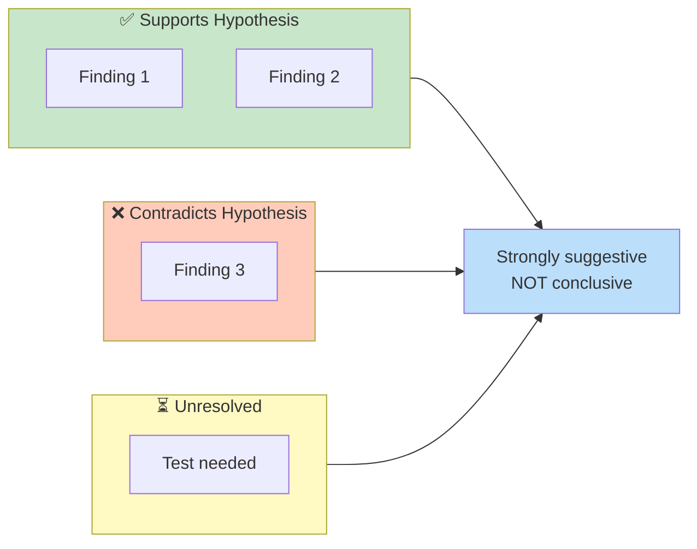
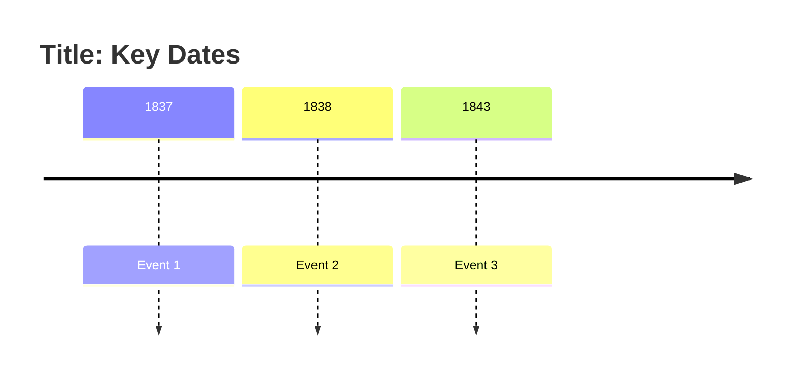
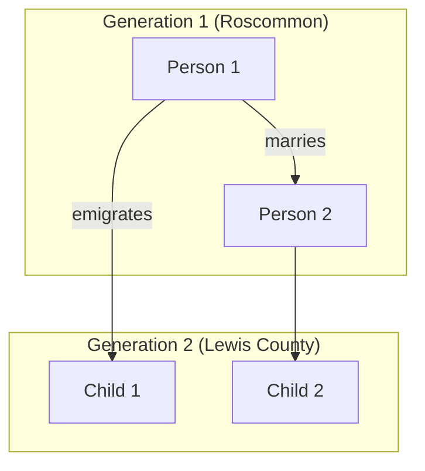
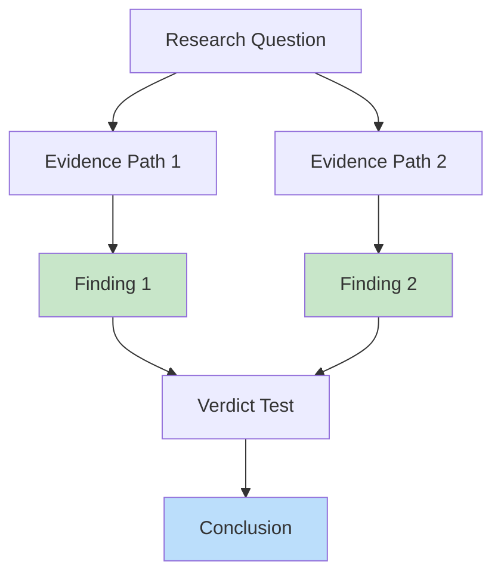
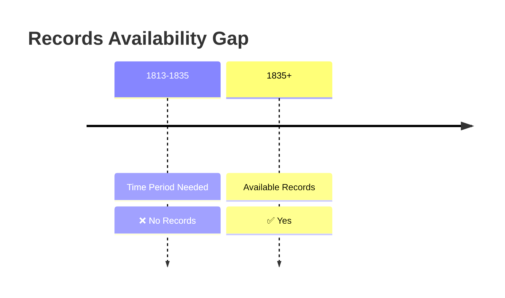

# Mermaid Diagram Usage Guide for AI Agents

This guide helps AI agents add high-quality Mermaid diagrams to genealogical research pages. Diagrams dramatically improve readability and understanding.

---

## When to Add Diagrams

**Add diagrams for:**

✅ **Timelines** — Emigration waves, settlement formation, research phases, life events
- Example: Settlement Formation Timeline showing 1837–1849 progression from labor → land purchase → church

✅ **Family Relationships** — Marriage networks, intermarriage patterns, siblings, estate-mate clustering
- Example: Roscommon estate community relationships reproduced in Lewis County marriages

✅ **Research Workflows** — Investigation phases, methodology, evidence pathways, verdict trees
- Example: RQ-M5 research flowchart showing Griffith's findings → hypothesis → next testing

✅ **Evidence Evaluation** — What's verified vs. plausible vs. unresolved, evidence chains
- Example: Evidence dashboard showing verified/plausible/unresolved status with verdict pathway

✅ **Question Hierarchies** — Research questions, priorities, relationships to core hypothesis
- Example: RQ-M1–M8 priority map showing high/medium/lower priority questions feeding into main hypothesis

✅ **Decision Trees** — Multiple hypotheses, evidence branches, verdict evaluation
- Example: RQ-M5 evidence balance showing "Munday" vs. "Murray" evidence with verdict test

✅ **Records Availability** — Time periods, document gaps, coverage by source
- Example: Kinawley records timeline showing Ann's baptism predates all parish records by 12 years

✅ **Geographic Relationships** — Townland clustering, parish boundaries, settlement areas, distances
- Example: Sandford Estate showing multiple families living under same landlord

---

## Diagram Types for Genealogy

### 1. Timeline (`timeline`)

**Best for:** Emigration waves, settlement formation, research phases, life events

**Example:**


**Uses:**
- Shows chronological progression
- Highlights key events
- Easy to scan vertically or horizontally

---

### 2. Relationship Graph (`graph TB` or `graph LR`)

**Best for:** Family networks, estate communities, research workflows, evidence chains

**Example:**


**Uses:**
- Shows relationships and connections
- Can represent flow, hierarchy, or networks
- Flexible styling with color/shape

**Direction:**
- `graph TB` = top-to-bottom (hierarchies, workflows)
- `graph LR` = left-to-right (timelines, processes, flows)

---

### 3. Flowchart (`flowchart`)

**Best for:** Decision trees, evidence evaluation, research paths, verdict evaluation

**Example:**


**Uses:**
- Decision paths and branching logic
- Research methodology
- Evidence evaluation chains

---

## Color Coding Convention

**Use these colors to indicate status:**

| Color | Hex | Usage | Meaning |
|-------|-----|-------|---------|
| Green | `#c8e6c9` | `fill:#c8e6c9` | ✅ Verified, confirmed, found |
| Red | `#ffcdd2` | `fill:#ffcdd2` | ❌ Not found, contradiction, negative result |
| Yellow | `#fff9c4` | `fill:#fff9c4` | ⏳ Pending, in progress, awaiting action |
| Blue | `#bbdefb` | `fill:#bbdefb` | 📊 Conclusion, verdict, final result |
| Orange | `#fff3e0` | `fill:#fff3e0` | ⚠️ Plausible, contextual, likely |
| Purple | `#f3e5f5` | `fill:#f3e5f5` | 🔗 Relationships, connections, families |
| Cyan | `#e1f5fe` | `fill:#e1f5fe` | 📍 Places, locations, geographic |

**Usage example:**


---

## Template: Research Investigation Diagram

**For research phases, use this structure:**



---

## Template: Evidence Evaluation Diagram

**For evidence comparison:**



---

## Best Practices

### Layout & Clarity

✅ **DO:**
- Keep node labels concise (2–4 words maximum)
- Use emojis for quick visual scanning (✅, ❌, ⏳, 📊, 🔗, 📍)
- Group related items in subgraphs
- Use consistent styling across diagram

❌ **DON'T:**
- Overload nodes with text
- Create overly complex diagrams (if too big, split into multiple smaller diagrams)
- Mix too many different colors (use 3–4 colors maximum)
- Use diagrams for simple data (use tables instead)

### Content Focus

✅ **DO:**
- Include verification status (✅ Verified, ⚠️ Plausible, ❌ Not found, ❓ Unresolved)
- Label edges to show relationships ("Chain migration," "Marries," "Land purchase," etc.)
- Use subgraphs to organize by geography, time period, or status
- Place diagrams early in sections, before detailed prose

❌ **DON'T:**
- Diagram things better explained in prose (only use for relationships, processes, evaluations)
- Use genealogical relationships that should be in Family Tree.md
- Include outdated or unverified status

### Integration with Markdown

**Example of diagram placement in a section:**

```markdown
## Evidence Summary

This diagram shows all evidence collected and its relationship to the core hypothesis:

[MERMAID DIAGRAM HERE]

**Key findings:**
- [Finding 1]
- [Finding 2]

**Next steps:**
- [Action 1]
- [Action 2]
```

---

## Common Diagram Patterns for This Project

### Pattern 1: Immigration Wave Timeline



### Pattern 2: Multi-Generation Family Network



### Pattern 3: Research Evidence Flowchart



### Pattern 4: Records Availability Timeline



---

## Tools & Testing

**Create and test Mermaid diagrams:**
- **Mermaid Live Editor:** https://mermaid.live/
- **Quartz support:** Quartz v4 supports Mermaid syntax directly in Markdown code blocks
- **No rendering issues:** Diagrams render locally on the static site; no JavaScript dependencies needed

**Testing process:**
1. Create diagram in Mermaid Live Editor
2. Copy code into Markdown file with ```mermaid``` fence
3. Verify rendering on live site (https://zcopley.github.io/copley-family-research/)

---

## Examples in This Vault

**See these files for reference implementations:**

- `Topics/Murray Settlement.md` — Multiple diagram types (timeline, network, priority map, flowchart)
- `People/Ann Copley.md` — Evidence balance chart
- `RQ-M5-PHASE-2-FINDINGS.md` — Records visualization, timeline
- `AGENT_HANDOFF_PHASE_2M.md` — Workflow diagram, evidence dashboard

All diagrams use the color conventions and best practices described above.

---

## Final Checklist for Agents

Before considering a page complete, ask:

- [ ] Are there timelines that could be visualized? (Add timeline diagram)
- [ ] Are there family relationships or estate-mate clusters? (Add network diagram)
- [ ] Is there research methodology or evidence evaluation? (Add flowchart)
- [ ] Are there multiple hypotheses with evidence branches? (Add decision tree)
- [ ] Is there a records gap or availability issue? (Add timeline showing period coverage)
- [ ] Would a geographic visualization help? (Add subgraph showing townlands/parishes)
- [ ] Does the prose reference "verified," "plausible," "unresolved"? (Use color coding in diagrams)
- [ ] Is the diagram placed early in the section? (Before detailed prose)
- [ ] Are node labels concise (2–4 words max)? (Shorter is better)
- [ ] Do colors match the status convention (green=verified, red=not found, etc.)? (Consistent with project)

---

**Questions?** See CLAUDE.md "Mermaid Diagrams" section or refer to example diagrams throughout the vault.
