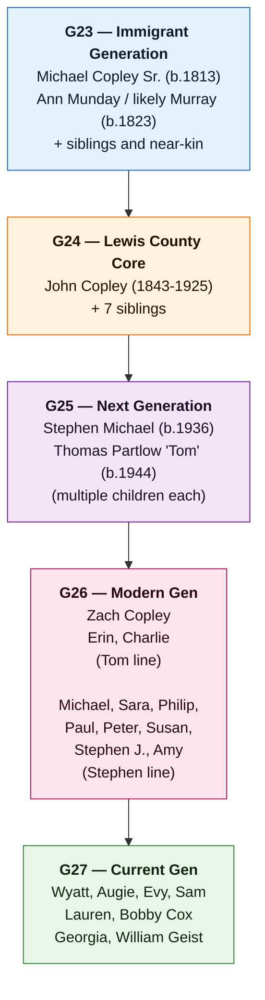

 
# People Directory

> Generational notation follows the project convention from G23 to G28 as used in the strategy and appendices.

> Phase 1A profile pages are now available in [[People/People Directory|People Directory (Individual Profiles)]] and the `People/` folder.

> 📊 Start with [[Family Tree]] for the fastest branch-by-branch orientation across generations and relationships.
> ⏳ Use [[Who Was Alive When]] if you want to understand overlapping lifespans before digging into branches and relationships.
> 🧾 Use [[Sources and Evidence Index]] to check claim-level source status.

## Generational Overview

Use this directory to find profiles for specific people. Start at the generation level you're interested in, then navigate to individual pages.

## Name Disambiguation Notes
- **Michael Copley:** use [[Michael Copley Sr|Michael Copley]] (1813–1897), [[Michael Joseph Copley]] (1898–1988), or [[Michael Copley (b. 1959)]].
- **Anne Copley:** use [[Anne Copley (b. 1850)|Anne Copley (b. 1850)]] or [[Anne Copley (daughter of John Copley)|Anne Copley (daughter of John)]].
- **Ann/Anne distinction:** [[Ann Copley]] is the G23 matriarch (1823–1909), recorded as Munday but now treated as likely Murray for working genealogy. Both Anne pages are daughters in later generations.

## Current Evidence Notes

- The central claim register is [[Sources and Evidence Index]].
- The main immigrant-community framework is [[Topics/Murray Settlement|Murray Settlement]], not a single-family migration story.
- The B&O page now provides broader infrastructure-labor context; named B&O employment for Michael or Patrick is not proven.
- The deep-origin hypothesis is maintained in [[Topics/Bredon Descent|Bredon Descent]] and [[Topics/Captain John Copley Research|Captain John Copley Research]].
- [[People/Mary Copely Giblin|Mary Copely Giblin]] is the strongest current Iowa-branch lead and likely close kin to Michael Copley Sr.

## G23 — Foundational Ancestors and Siblings

### [[Michael Copley Sr|Michael Copley]] (1813–1897)
- Born: [[Places/Kilgefin Ireland|Kilgefin, Ireland]] (per gravestone tradition).
- Died: [[Places/Lewis County West Virginia|Lewis County, West Virginia]].
- Roles: immigrant laborer/farmer; likely part of a broader infrastructure-labor and [[Topics/Murray Settlement|Murray Settlement]] context before permanent landholding.
- Key event: 1843 land agreement with brother Patrick.
- Research gaps: Q1 (parentage), Q3 (marriage), Q19 (naturalization).

### [[Ann Copley]] (1823–1909)
- Born: [[Places/Kinawley Ireland|Kinawley, Ireland]] (County Fermanagh context; reported in family narrative).
- Family tradition: father drowned in Potomac.
- Maiden surname recorded as "Munday" in secondary family sources; current working conclusion treats her original Irish surname as likely **Murray**.
- Research gaps: Q3, Q11/Q14/RQ-M5 (marriage documentation, father identity, direct surname record, and Kinawley Murray household).

### [[Patrick Copley]]
- Michael’s brother; co-purchaser in 1843 land agreement.
- Died 1865.
- Gap: stronger documentary profile beyond land references.

### [[William Copley]]
- Brother linked by oral history to anti-tithe unrest and possible Australian transport.
- Gap: Q6 documentary confirmation pending.

### [[People/Mary Copely Giblin|Mary Copely Giblin]]
- Born 1814 in Tully, Kilcorkey, County Roscommon; died 1884 in Crawford County, Iowa.
- Likely sibling or close relative of Michael Copley Sr.; key evidence for a wider Copely diaspora beyond West Virginia.

### [[Bridget Copley Reynolds]]
- Sister, born c.1808; reportedly immigrant.
- Gap: U.S. residence and descendants need systematic reconstruction.

### [[Catherine Kitty Copley Hannon]]
- Sister, born c.1811.
- Gap: Q8/Q10 unresolved immigration details and surname variants.

---

## G24 — Lewis County Continuity
### Immediate children of [[Michael Copley Sr|Michael Copley]] + [[Ann Copley]] (new Phase 1A pages)
- [[Mary Copley Quinn]]
- [[John Copley]]
- [[Catherine Kitty Copley Hannon|Catherine "Kitty" Copley Hannon]]
- [[Anne Copley (b. 1850)|Anne Copley (b. 1850)]]
- [[Bridget Bitty Copley Gillooly|Bridget "Bitty" Copley Gillooly]]
- [[Margaret Copley]]
- [[Thomas Tom Copley|Thomas "Tom" Copley]]
- [[Sarah Copley]]

### [[John Copley]] (1843–1925)
- Son of Michael/Ann; inherited family farm.
- Married [[Mary Ellen Dolan Copley]].
- Research gaps: Q20 (marriage record), Q28 (military claim), Q21 (late marriage context).

### [[Mary Ellen Dolan Copley]] (1855–1901)
- From Dolan family (Moundsville connection in current narrative).
- Mother of five surviving children.
- Research gaps: Q20 record confirmation, Q22 sibling reconstruction, Q31 death detail expansion.

---

## G24 — Children of John + Mary Ellen (branch-parent generation for Phase 1B)

### [[Thomas E. Copley]]
- Born 1892; died 1968 (reported).
- Son of [[John Copley]] and [[Mary Ellen Dolan Copley]]; married Drusilla.
- No children are documented in current family records.

### [[Mary Copley Flesch]]
- Daughter; later associated with Albuquerque.
- Gap: fuller household/career timeline.

### [[Anne Copley (daughter of John Copley)|Anne Copley (daughter of John)]]
- Daughter; reportedly unmarried; relocated to Albuquerque.
- Gap: census and city-directory continuity.

### [[Ellen Bernadine Nelle Copley Sardo|Ellen Bernadine "Nelle" Copley Sardo]] (1897–1977)
- Registered nurse, nursing educator, St. Joseph Hospital volunteer leader, and key Maryland branch matriarch.
- Parent of Phase 1B G25 descendants: [[Sarah Ellen Sardo Arena]], [[Mary Carmella Sardo Ruland]].

### [[Michael Joseph Copley]] (1898–1988)
- Research chemist; BS Catholic University; PhD University of Illinois; USDA laboratory leader in Wyndmoor and Albany.
- Parent of Phase 1B G25 descendants: [[Stephen Michael Copley]], [[Thomas Partlow Copley]].

---

## Phase 1B G25 — Children of John Copley's children (new comprehensive pages)

### [[Sarah Ellen Sardo Arena]]
- Child of [[Ellen Bernadine Nelle Copley Sardo|Ellen Bernadine "Nelle" Copley Sardo]] and Robert Samuel Sardo.
- Arena branch connector; Notre Dame College graduate, Montessori teacher, and later hospital chaplain.

### [[Mary Carmella Sardo Ruland]]
- Child of [[Ellen Bernadine Nelle Copley Sardo|Ellen Bernadine "Nelle" Copley Sardo]] and Robert Samuel Sardo.
- Ruland branch matriarch; profile expanded with evidence gaps/strategies.

### [[Stephen Michael Copley]]
- Child of [[Michael Joseph Copley]] and Marion Elizabeth Partlow.
- Physicist/professor/administrator; expanded professional biography and source map.

### [[Thomas Partlow Copley]]
- Child of [[Michael Joseph Copley]] and Marion Elizabeth Partlow.
- Marketing/academia profile expanded from Appendix 1 biographical material.

### Tentative / possible additions (explicitly unverified)
- Possible additional G25 descendants through [[Mary Copley Flesch]] or [[Anne Copley (daughter of John Copley)|Anne Copley (daughter of John)]] remain unconfirmed in currently available records.

---

## G27 — Expanded Descendant Network

### [[Marcia Thornton Copley]]
- First wife of [[Stephen Michael Copley]]; Harbor Regional Center and SVS disability-services connection.

### [[Judith Ann Todd Copley]]
- Second wife of [[Stephen Michael Copley]]; Cambridge-trained materials scientist, Penn State department head, and engineering-society leader.

### Children identified in appendices
- [[Michael Copley (b. 1959)]], [[Sara Copley Cox]], [[Philip Copley]], [[Paul Copley]], [[Peter Copley]], [[Susan Copley]], [[Stephen Joseph Copley]], [[Amy E. Copley Geist]]

Gaps for this generation:
- Standardized biographies for profiles without dedicated first-person appendix sketches
- Uniform source citations for education/profession/life events
- Privacy-aware handling of living-person details and sensitive disability-care history

---

## G28 — Recent Generations (Selected)

### [[Robert Cox]]
- Cox-line descendant; appendix-backed profile includes Sacramento / Granite Bay context and landscaping-business path.

### Additional descendants
- Multiple branch descendants appear in Appendix narratives; many require privacy-sensitive treatment and consent-aware documentation.

---

## Related Families and Historical Actors

### [[Dolan Family]]
- Michael Dolan (1824–1888), Elizabeth Dolan (1829–1913), and under-documented sibling network.

### English-origin and Irish-origin research figures
- [[People/Sir Richard Copley|Sir Richard Copley]], [[People/Roger Copley|Roger Copley]], [[People/William Copley (Woolbedding)|William Copley of Woolbedding]], [[People/Thomas Copley Sr|Thomas Copley Sr.]], [[People/Thomas Copley Jr|Thomas Copley Jr.]], and [[People/Captain John Copley|Captain John Copley]].

### Land-chain figures (contextual)
- [[Weeden Hoffman]], [[Thomas Pickering]], [[Octavius Pickering]], [[Gideon D. Camden]], [[Richard P. Camden]], [[Minter Bailey]].

Appendix 2, "Origin of the Copley Farm," ties these figures to the proposed land path behind the 1843 Hoffman-to-Copley purchase. Treat the chain as a working hypothesis until Virginia land-office and Lewis County deed records are checked.

---

## Key Source Notes

- Family analysis synthesis: [[copley_research_analysis]]
- Phase 1 findings report: [[copley_research_findings]]
- Supporting links include FamilySearch, NARA, HMDB, county histories and archival indexes (see [[Bibliography and Acquisition Guide]]).
