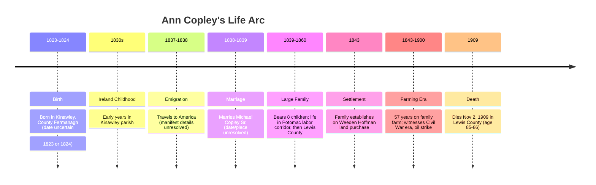
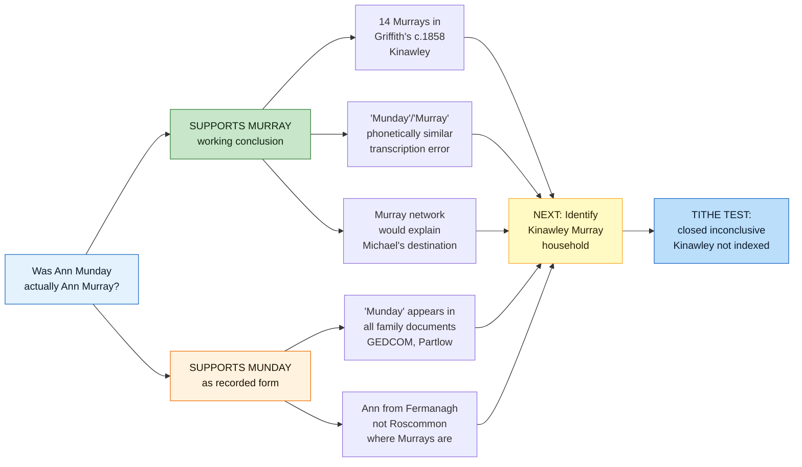

# Ann Copley (1823–1909)

📊 View [[Family Tree]] for visual context.

## Biographical Profile
[[Ann Copley]] is the matriarch of the West Virginia Copley line. Family narratives identify her as **Ann Elizabeth Munday**, born in **1823** in **[[Places/Kinawley Ireland|Kinawley, Ireland]]** (County Fermanagh context), with immigration to the United States in childhood. Current working genealogy treats her original Irish surname as likely **Murray**, with "Munday" preserved as the received American-family form. A direct marriage, passenger, church, or child death record naming her maiden surname is still needed.

She married [[Michael Copley Sr|Michael Copley]] (date/place unknown) and lived in [[Places/Lewis County West Virginia|Lewis County]] after the family’s 1843 land settlement. The 1850 census framework and family reconstruction identify her as mother of eight known children.

A persistent family tradition states that her father drowned in the Potomac River. This is plausible in context but currently unverified by contemporary records.

## Lived During

Ann is one of the strongest chronology bridges in the whole project, because her life spans the immigrant era, the farm-establishment era, and the family's first oil-era turning point.

- She belonged to the **Irish migration generation** that reached America in the late 1830s.
- She lived through the **1843** Lewis County land-settlement phase with [[Michael Copley Sr|Michael Copley]].
- She outlived Michael by more than a decade and remained alive for the **1900** oil strike on family land.
- She briefly overlapped with grandchildren such as [[Ellen Bernadine Nelle Copley Sardo|Nelle]] and [[Michael Joseph Copley]], linking the immigrant household directly to the bridge generation born at the end of the 19th century.

For a chronology-first view of those overlaps, see [[Who Was Alive When]].

## Key Place Links
- Birthplace context: [[Places/Kinawley Ireland|Kinawley, Ireland]]
- Settlement context: [[Places/Lewis County West Virginia|Lewis County, West Virginia]] and [[Places/Weston West Virginia|Weston, West Virginia]]
- Migration-corridor research hub: [[Places/Baltimore Maryland|Baltimore, Maryland]]

## Related Topic Pages
- [[Sources and Evidence Index]] — central evidence register for the Munday / likely Murray conclusion
- [[Topics/Murray Settlement|Murray Settlement]] — active research into which Kinawley Murray household was Ann's family
- [[Topics/Irish Famine and Emigration|Irish Famine and Emigration]]
- [[Topics/Irish Immigration to West Virginia|Irish Immigration to West Virginia]]
- [[Topics/B&O Railroad Labor History|B&O Railroad Labor History]] — infrastructure-labor context, not proof of named B&O employment

## Family Relationships
- Husband: [[Michael Copley Sr|Michael Copley]]
- Children (G24):
  - [[Mary Copley Quinn]]
  - [[John Copley]]
  - [[Catherine Kitty Copley Hannon|Catherine "Kitty" Copley Hannon]]
  - [[Anne Copley (b. 1850)|Anne Copley]]
  - [[Bridget Bitty Copley Gillooly|Bridget "Bitty" Copley Gillooly]]
  - [[Margaret Copley]]
  - [[Thomas Tom Copley|Thomas "Tom" Copley]]
  - [[Sarah Copley]]

## Timeline

## Known/Reported Life Data
- **Born:** 1823, Kinawley parish, Fermanagh (reported in family narrative) — note: Ancestry.com tree gives Sep 1824; discrepancy unresolved
- **Died:** 2 Nov 1909, Lewis County, West Virginia (Ancestry.com tree, unverified)
- **Burial:** Weston, Lewis County, West Virginia (Ancestry.com tree, unverified)
- **Marriage:** to [[Michael Copley Sr|Michael Copley]], likely c.1838-1839 (inferred from first child birth year)

## Research Gaps

### Critical: RQ-M5 — Munday vs. Murray Hypothesis (April 25, 2026 Update)

**Current Evidence Status:**

**Status:** Resolved for working genealogy: Ann "Munday" was almost certainly Ann Murray. Direct identity records are still desired.

Tom Copley (April 2026) raised the possibility that “Munday” is a phonetic transcription of “Murray” — placing Ann inside the Murray family that named [[Topics/Murray Settlement|Murray's Settlement]]. **Phase 2 research (April 2026) yielded notable findings:**

**Evidence Supporting the Murray Hypothesis:**
- ❌ No “Munday” entries in Griffith's Valuation (1862) for Kinawley, County Fermanagh — exhaustively searched
- ❌ No “Munday” entries in all Fermanagh in Ask About Ireland / Griffith's Valuation
- ✅ **14 Murray occupiers** documented in Kinawley parish in the same Griffith's Valuation search
- ✅ Related variants exist elsewhere in Fermanagh but not Kinawley: 7 Mundy entries in Cleenish/Killesher and 1 Monday entry in Cleenish
- ❌ FamilySearch U.S. Census searches found **0 independent Munday households** in Lewis County WV from 1840-1860, and 0 Munday results in the searched Virginia / West Virginia records
- ❌ Kinawley Catholic parish records only begin December 11, 1835 — after Ann's birth c. 1823-1824, making baptismal confirmation impossible

**Evidence Supporting Munday as a Real Surname:**
- ✅ "Munday" appears consistently in family documents, GEDCOM material, and Partlow-family sources
- ✅ Ancestry.com Collection #1270 confirms Munday is a real Irish surname with 11 exact-surname Tithe Applotment entries across Ireland
- ✅ The Ancestry Munday cluster is not in Kinawley or Fermanagh, but it proves the surname is not inherently a Murray transcription artifact

**Tithe Applotment Books Search — CLOSED INCONCLUSIVE (April 25, 2026)**

- **Databases searched:** National Archives of Ireland Tithe Applotment Books and Ancestry.com Collection #1270, *Ireland, Tithe Applotment Books, 1805-1837*
- **Key finding:** **Kinawley is not indexed in either database** for this question; this is a coverage gap, not evidence of surname absence
- **Munday result:** 11 all-Ireland exact-surname entries in Ancestry; 0 in Kinawley; 0 in Fermanagh; strongest cluster in Ahamlish, Sligo
- **Murray result:** 3 indexed Fermanagh entries in Ancestry; 0 in Kinawley
- **Kinawley status:** Cannot confirm or deny presence of Munday or Murray in Ann's reported birthplace using this source
- **Detailed Findings:** See [[RQ-M5-TITHE-APPLOTMENT-SEARCH|RQ-M5 Tithe Search Research Note]]

**Next Research Steps (revised priorities):**
1. **Identify Ann's likely Murray father** — Candidate Kinawley male heads from Griffith's include Patrick, Peter, Edward, James, Michael, and John Murray
2. **Transcribe Lewis County Murray deeds** — especially John Murray, 1826 and 1833, to test whether the early Murray landholders connect to the Copleys
3. **Contact PRONI** (Public Record Office of Northern Ireland) — Request Fermanagh Tithe Applotment Books, TAB/5 series, Kinawley records. **Time: 1-2 weeks for response**
4. **St. Michael's Church records** — contact Diocese of Wheeling-Charleston for marriage records 1838-1850 that might show Ann's maiden name
5. **Ship manifests** — search *Powhatan* (Aug 20, 1838) and *Kutusoff* (1837) for female passengers with either surname

**Current verdict:** RQ-M5 is resolved for working genealogy. Ann "Munday" was almost certainly Ann Murray, with "Munday" entering American records as a phonetic transcription, clerical error, or oral-family transmission. The remaining task is no longer proving the surname hypothesis; it is identifying which Kinawley Murray household was Ann's family and finding a direct record if one survives.

### Other Research Gaps

2. **Marriage record (Q3):** No civil/church record yet found for Michael + Ann.
3. **Immigration details:** Port/date/manifest for Ann not yet resolved.
4. **Father identity + drowning event (Q11/Q14):** No coroner or newspaper confirmation yet found.
5. **Kinawley Murray household reconstruction (Q14/Q15/RQ-M5):** Parents/siblings remain incomplete.

## Acquisition Strategy
- Search Catholic parish marriage registers in Potomac / infrastructure-labor corridor communities (late 1830s to early 1840s).
- Work up Kinawley Murray father candidates from Griffith's Valuation and any PRONI/Fermanagh records.
- Transcribe Lewis County John Murray deed leads from 1826 and 1833 when images are available.
- Use Chronicling America and regional newspaper repositories for Potomac drowning incidents matching family tradition.
- Expand to PRONI and Irish/Fermanagh parish records for potential Ann Murray/Munday baptismal candidates.
- Reconcile maiden-name evidence across gravestone, death certificates of children, and church sacramental records.

## Source Citations
1. *COPLEY HISTORY PART 1 final 2.pdf* (sections on Ann’s origins, marriage uncertainty, Potomac tradition, and children).
2. `/home/ubuntu/copley_research_analysis.md` (Q3, Q11, Q14, Q15 framing).
3. `/home/ubuntu/copley_research_findings.md` (Ann profile and evidence reliability).
4. Chronicling America search portal: https://chroniclingamerica.loc.gov/
5. National Library of Ireland parish registers: https://registers.nli.ie/
6. [[Sources and Evidence Index]] — claim-level evidence status for Ann Munday / likely Murray.
7. [[RQ-M5-PHASE-2-FINDINGS|RQ-M5 Phase 2 Findings]] and [[RQ-M5-TITHE-APPLOTMENT-SEARCH|RQ-M5 Tithe Search Research Note]].
