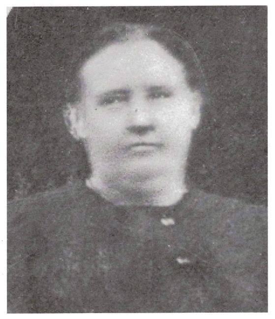

# Ann Copley (1823–1909)

📊 View [[Family Tree]] for visual context.

## Biographical Profile
[[Ann Copley]] is the matriarch of the West Virginia Copley line. Family narratives identify her as **Ann Elizabeth Munday**, born in **1823** in **[[Places/Kinawley Ireland|Kinawley, Ireland]]** (County Fermanagh context), with immigration to the United States in childhood. However, because the primary marriage and birth records have not yet been located, her maiden surname remains a **high-priority documentary verification gap**.

She married [[Michael Copley Sr|Michael Copley]] (date/place unknown) and lived in [[Places/Lewis County West Virginia|Lewis County]] after the family’s 1843 land settlement. The 1850 census framework and family reconstruction identify her as mother of eight known children.

A persistent family tradition states that her father drowned in the Potomac River. This is plausible in context but currently unverified by contemporary records.

## Key Place Links
- Birthplace context: [[Places/Kinawley Ireland|Kinawley, Ireland]]
- Settlement context: [[Places/Lewis County West Virginia|Lewis County, West Virginia]] and [[Places/Weston West Virginia|Weston, West Virginia]]
- Migration-corridor research hub: [[Places/Baltimore Maryland|Baltimore, Maryland]]

## Related Topic Pages
- [[Topics/Irish Famine and Emigration|Irish Famine and Emigration]]
- [[Topics/Irish Immigration to West Virginia|Irish Immigration to West Virginia]]
- [[Topics/B&O Railroad Labor History|B&O Railroad Labor History]]

## Family Relationships
- Husband: [[Michael Copley Sr|Michael Copley]]
- Children (G24):
  - [[Mary Copley Quinn]]
  - [[John Copley]]
  - [[Catherine Kitty Copley Hannon|Catherine "Kitty" Copley Hannon]]
  - [[Anne Copley (b. 1850)|Anne Copley]]
  - [[Bridget Bitty Copley Gillooly|Bridget "Bitty" Copley Gillooly]]
  - [[Margaret Copley]]
  - [[Thomas Tom Copley|Thomas "Tom" Copley]]
  - [[Sarah Copley]]

## Known/Reported Life Data
- **Born:** 1823, Kinawley parish, Fermanagh (reported in family narrative) — note: Ancestry.com tree gives Sep 1824; discrepancy unresolved
- **Died:** 2 Nov 1909, Lewis County, West Virginia (Ancestry.com tree, unverified)
- **Burial:** Weston, Lewis County, West Virginia (Ancestry.com tree, unverified)
- **Marriage:** to [[Michael Copley Sr|Michael Copley]], likely c.1838-1839 (inferred from first child birth year)

## Research Gaps
1. **Maiden-name proof:** “Munday” is widely used in family material but requires direct primary-record confirmation.
2. **Marriage record (Q3):** No civil/church record yet found for Michael + Ann.
3. **Immigration details:** Port/date/manifest for Ann not yet resolved.
4. **Father identity + drowning event (Q11/Q14):** No coroner or newspaper confirmation yet found.
5. **Wider Munday household reconstruction (Q14/Q15):** Parents/siblings remain incomplete.

## Acquisition Strategy
- Search Catholic parish marriage registers in Potomac/B&O labor corridor communities (late 1830s to early 1840s).
- Survey 1840-1850 census clusters near B&O settlements for Munday surname variants.
- Use Chronicling America and regional newspaper repositories for Potomac drowning incidents matching family tradition.
- Expand to PRONI and Irish/Fermanagh parish records for potential Ann Munday baptismal candidates.
- Reconcile maiden-name evidence across gravestone, death certificates of children, and church sacramental records.

## Source Citations
1. *COPLEY HISTORY PART 1 final 2.pdf* (sections on Ann’s origins, marriage uncertainty, Potomac tradition, and children).
2. `/home/ubuntu/copley_research_analysis.md` (Q3, Q11, Q14, Q15 framing).
3. `/home/ubuntu/copley_research_findings.md` (Ann profile and evidence reliability).
4. Chronicling America search portal: https://chroniclingamerica.loc.gov/
5. National Library of Ireland parish registers: https://registers.nli.ie/