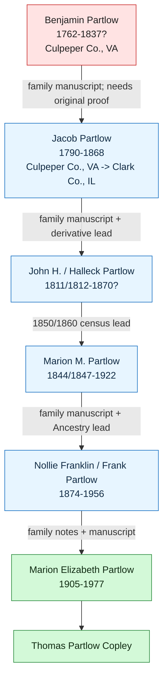

# Benjamin Partlow (c. 1762–after 1834)

📊 View [[Family Tree]] for visual context.

## Biographical Profile

[[Benjamin Partlow]] was an ancestor of [[Marion Elizabeth Partlow]], the wife of [[Michael Joseph Copley]]. He is the earliest documented Partlow family member and a **Revolutionary War veteran**.

- **Born:** c. 1762 (pension cover sheet states he was "seventy")
- **Residence at time of pension:** Culpeper County, Virginia
- **Military service:** Virginia militia, Revolutionary War
- **Pension commenced:** 6 Apr 1834 (Rappahannock County pension roll, unverified)
- **Possible death:** 1837, from Ancestry tree screenshot; unverified

## Military Service

Benjamin Partlow served in the Virginia militia during the Revolutionary War. His July 18, 1832 pension statement before Justice of the Peace William Walden, Culpeper County, VA, documents:

- Drafted in a company commanded by **Capt. Coxen** in Culpeper County, VA
- Marched to the **Albemarle Barracks** as a guard for British prisoners quartered there; served approximately three months until discharged
- Drafted again into a company commanded by **Capt. Rogers**; marched to **Malvern Hills** under **Gen. Edward Stevens**, where he was detailed from the line to drive a wagon
- Drafted several other times for short intervals (total service: more than six months)
- At time of petition (1832): confined to his house by paralysis; unable to travel to the county court
- Pension-file cover sheet identifies the case as **Benjamin Partlow, Culpeper County, Virginia**, under the Act of 7 June 1832; states the declaration was made before **a Justice of the Peace**, that he was disabled by bodily infirmity, that he was age **70**, that his rank was **private**, and that he was not in any battles.

He declared he had no documentary proof of service but could prove his time at the Albemarle Barracks through living witness **Thomas Thornhill Senior** of Culpeper County.

His pension appeared on the **Rappahannock County, Virginia pension roll** (Statement &c.) listing him as a Private with annual allowance $20, pension commencing **6 Apr 1834**, age ~74.

## Connection to the Copley Family

Benjamin Partlow is in the **Partlow ancestral line** that eventually settled in **Clark County, Illinois** by the mid-1800s. The line descends through several generations before reaching **Nollie Franklin Partlow** (b. 1874), Marion's father. Marion's middle name "Elizabeth" may honor the family line.

An Ancestry tree screenshot in the Partlow image set, refined by later online searching and a local 1977 handwritten family lineage, suggests the working paternal chain:

**Benjamin W. Partlow** (1762-1837?) -> **Jacob Newton / Jacob Partlow** (1790-1868) -> **John H. / John Halleck / Hallick Partlow** (1811/1812-1870?) -> **Marion McDonald / M. Partlow** (1844/1847-1922) -> **Nollie Franklin / Frank Partlow** (1874-1956) -> **Marion Elizabeth Partlow** (1905-1977) -> [[Thomas Partlow Copley]].

Treat this chain as a research lead, not a proved lineage. A newly found Graves Family Association page cites **Spotsylvania County, Virginia Will Book A, p. 975** for John Partlow, died 11 Dec 1789, and abstracts the will as naming son **Benjamin Partlow** and 250 acres in Culpeper County. That supports the pre-Revolution step from John Partlow II to Benjamin, but the original will-book image still needs review.

The local handwritten lineage gives useful details for the direct proof search: Jacob Partlow was born in Culpeper County, Virginia and died in Clark County, Illinois; John H. Partlow came to Illinois in 1839 and reportedly died in Arkansas in 1870; Marion M. Partlow's first wife was Martha L. Bowles; and Frank Partlow married Alice Rude on 10 Jun 1900. See [[References/Harry C Partlow 1960 Letter and Handwritten Lineage]].

Family tradition holds the Partlows emigrated from **Wales** to Virginia before the Revolutionary War.

## Research Gaps

1. Exact birth date and birthplace not established.
2. Wife's name not confirmed.
3. Full chain from Benjamin → Jacob Newton Partlow → John Halleck / Hallick Partlow → Marion McDonald / M. Partlow → Nollie Franklin Partlow needs documentary reconstruction.
4. Clarissa "Barnee" (shown as Benjamin's possible spouse in the Ancestry screenshot) needs independent confirmation.
5. Pension file (NARA) may contain additional biographical detail.
6. Original Spotsylvania County will record for John Partlow needs to be checked to verify the online abstract naming Benjamin.

## Acquisition Strategy

- NARA pension file search: Benjamin Partlow, Virginia militia, Revolutionary War (Culpeper County applicant)
- Virginia state pension rolls and Culpeper County court records, 1830s
- Clark County, Illinois probate and census records for the Partlow family, 1840–1880
- Probate, census, and land records for Jacob Newton Partlow, John Halleck / Hallick Partlow, and Marion McDonald / M. Partlow
- Spotsylvania County, Virginia Will Book A, p. 975 for John Partlow, died 11 Dec 1789
- See [[RQ-P1-PARTLOW-REVOLUTIONARY-LINE|RQ-P1 Partlow Revolutionary Line]] for the proof-chain research log.

## Sources

1. Benjamin Partlow pension statement transcript, July 18, 1832, Culpeper County, VA (from Copley family research files; original source: National Archives pension records)
2. "Statement &c. of Rappahannock county, Virginia" pension roll — lists Benjamin Partlow as Private, pension commenced 6 Apr 1834
3. [[Marion Elizabeth Partlow]] — descendant connection context
4. `/mnt/c/Users/zach/Desktop/Partlow/IMG_2437.jpg` — pension-file cover sheet image for Benjamin Partlow, Culpeper County, Virginia
5. `/mnt/c/Users/zach/Desktop/Partlow/IMG_2433.png` — Ancestry tree screenshot showing proposed Partlow line from Benjamin W. Partlow to Marion Elizabeth Partlow; derivative tree evidence only
6. `/mnt/c/Users/zach/Desktop/Partlow/IMG_2434.jpg` and `/mnt/c/Users/zach/Desktop/Partlow/IMG_2435.jpg` — Ancestry record-hint screenshots for Virginia militia and Revolutionary War pension/bounty-land file entries
7. [[RQ-P1-PARTLOW-REVOLUTIONARY-LINE]] — current online research log for the Partlow Revolutionary line.
8. [[References/Harry C Partlow 1960 Letter and Handwritten Lineage]] — local family manuscript summarizing the proposed descent from John Partlow I to Marion E. Partlow Copley.
9. Graves Family Association, "John Graves/Greaves of Northamptonshire, England," citing Spotsylvania County, Virginia Will Book A, p. 975 for John Partlow and naming son Benjamin Partlow: https://graves-fa.org/gen-histories/gens/gen270.html
