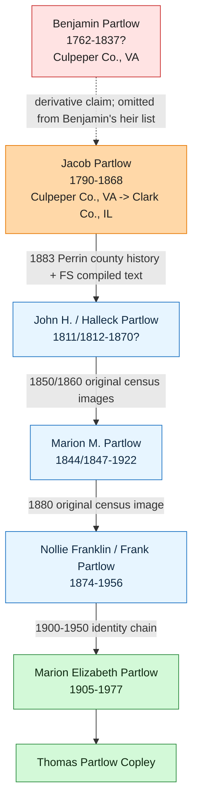

# Benjamin Partlow (c. 1762–after 1834)

📊 View [[Family Tree]] for visual context.

## Biographical Profile

[[Benjamin Partlow]] was long treated in family and derivative sources as an ancestor of [[Marion Elizabeth Partlow]], the wife of [[Michael Joseph Copley]]. He is an early documented Partlow family member and a **Revolutionary War veteran**. The direct line from Marion back to Benjamin is now contradicted at the supposed connecting generation: the complete Rappahannock chancery file for Benjamin's estate omits **Jacob Newton Partlow** from every heir, party, advancement, and distribution list.

- **Born:** c. 1762 (pension cover sheet states he was "seventy")
- **Residence at time of pension:** Culpeper County, Virginia
- **Military service:** Virginia militia, Revolutionary War
- **Pension number:** S5871, per derivative RevWar / WikiTree snippets
- **Pension commenced:** 6 Apr 1834 (Rappahannock County pension roll / derivative snippets)
- **Possible death:** 1837, from derivative family-tree and memorial sources; still needs original estate proof

## Military Service

Benjamin Partlow served in the Virginia militia during the Revolutionary War. His July 18, 1832 pension statement before Justice of the Peace William Walden, Culpeper County, VA, documents:

- Drafted in a company commanded by **Capt. Coxen** in Culpeper County, VA
- Marched to the **Albemarle Barracks** as a guard for British prisoners quartered there; served approximately three months until discharged
- Drafted again into a company commanded by **Capt. Rogers**; marched to **Malvern Hills** under **Gen. Edward Stevens**, where he was detailed from the line to drive a wagon
- Drafted several other times for short intervals (total service: more than six months)
- At time of petition (1832): confined to his house by paralysis; unable to travel to the county court
- Pension-file cover sheet identifies the case as **Benjamin Partlow, Culpeper County, Virginia**, under the Act of 7 June 1832; states the declaration was made before **a Justice of the Peace**, that he was disabled by bodily infirmity, that he was age **70**, that his rank was **private**, and that he was not in any battles.

He declared he had no documentary proof of service but could prove his time at the Albemarle Barracks through living witness **Thomas Thornhill Senior** of Culpeper County.

His pension appeared on the **Rappahannock County, Virginia pension roll** (Statement &c.) listing him as a Private with annual allowance $20, pension commencing **6 Apr 1834**, age ~74.

## Connection to the Copley Family

Benjamin Partlow is in the **Partlow ancestral line** that eventually settled in **Clark County, Illinois** by the mid-1800s. The line descends through several generations before reaching **Nollie Franklin Partlow** (b. 1874), Marion's father. Marion's middle name "Elizabeth" may honor the family line.

An Ancestry tree screenshot in the Partlow image set, refined by later online searching, a local 1977 handwritten family lineage, census-image work, and a June 2026 upstream web pass, proposed this paternal chain:

**Benjamin W. Partlow** (1762-1837?) -> **Jacob Newton / Jacob Partlow** (1790-1868) -> **John H. / John Halleck / Hallick Partlow** (1811/1812-1870?) -> **Marion McDonald / M. Partlow** (1844/1847-1922) -> **Nollie Franklin / Frank Partlow** (1874-1956) -> **Marion Elizabeth Partlow** (1905-1977) -> [[Thomas Partlow Copley]].

```mermaid
graph TD
    BP["Benjamin Partlow<br/>1762-1837?<br/>Culpeper Co., VA"]
    JP["Jacob Partlow<br/>1790-1868<br/>Culpeper Co., VA -> Clark Co., IL"]
    JH["John H. / Halleck Partlow<br/>1811/1812-1870?"]
    MM["Marion M. Partlow<br/>1844/1847-1922"]
    NF["Nollie Franklin / Frank Partlow<br/>1874-1956"]
    ME["Marion Elizabeth Partlow<br/>1905-1977"]
    TCP["Thomas Partlow Copley"]

    BP -. "derivative claim; omitted from Benjamin's heir list" .-> JP
    JP -->|"1883 Perrin county history + FS compiled text"| JH
    JH -->|"1850/1860 original census images"| MM
    MM -->|"1880 original census image"| NF
    NF -->|"1900-1950 identity chain"| ME
    ME --> TCP

    class BP patriot
    class JP questioned
    class JH,MM,NF lineage
    class ME,TCP descendant

    classDef patriot fill:#ffe3e3,stroke:#c92a2a,color:#1f1f1f;
    classDef questioned fill:#ffd8a8,stroke:#e67700,color:#1f1f1f;
    classDef lineage fill:#e7f5ff,stroke:#1971c2,color:#102a43;
    classDef descendant fill:#d3f9d8,stroke:#2b8a3e,color:#102a12;
```

Treat this chain as a contradicted research lead at **Benjamin -> Jacob**, not as a proved lineage. A Graves Family Association page and a WikiTree transcript cite **Spotsylvania County Will Book E, pp. 975-976** (also described in earlier notes as Will Book A, p. 975) for John Partlow, died 11 Dec 1789, and report that the will named son **Benjamin Partlow** and 250 acres in Culpeper County. That supports the pre-Revolution step from John Partlow II to Benjamin, but the original will-book image still needs review.

The June 2026 upstream web search found derivative support for the two previously weak links, but later work has narrowed what each source can actually prove:

- **Jacob Newton Partlow -> John H. / John Halleck Partlow:** supported by the located 1883 Perrin county-history biography of Marion Partlow, which explicitly says John H. Partlow was a son of Jacob Partlow, and by a FamilySearch-hosted / Harry C. Partlow compiled genealogy excerpt naming John Halleck as Jacob's child by Mary Halleck. A later derivative will/probate snippet for Jacob reports unnamed heirs already paid $40 each, but the original will image is still needed.
- **Benjamin Partlow -> Jacob Newton Partlow:** formerly supported by Find a Grave memorial `139145744`, Geni, FamilySearch Ancestors / snippets, and the same compiled genealogy cluster. This link is now contradicted by [[References/Rappahannock Partlow Chancery Case 1842-002]], whose complete 69-image file names Benjamin's eight child / heir lines and omits Jacob / Jacob Newton / Nute everywhere.

The local handwritten lineage gives useful details for the direct proof search: Jacob Partlow was born in Culpeper County, Virginia and died in Clark County, Illinois; John H. Partlow came to Illinois in 1839 and reportedly died in Arkansas in 1870; Marion M. Partlow's first wife was Martha L. Bowles; and Frank Partlow married Alice Rude on 10 Jun 1900. See [[References/Harry C Partlow 1960 Letter and Handwritten Lineage]].

Family tradition holds the Partlows emigrated from **Wales** to Virginia before the Revolutionary War.

## Research Gaps

1. Exact birth date and birthplace not established.
2. Wife's name not confirmed.
3. The proposed Benjamin -> Jacob Newton Partlow link is contradicted; the full Rappahannock chancery file omits Jacob and distributes Benjamin's estate through eight child-lines.
4. Clarissa "Barnee" (shown as Benjamin's possible spouse in the Ancestry screenshot) needs independent confirmation.
5. Pension file (NARA) may contain additional biographical detail.
6. Original Spotsylvania County will record for John Partlow needs to be checked to verify the online transcript / abstract naming Benjamin.
7. Rappahannock deeds, order books, administration bonds, and tax records may clarify Benjamin's collateral Partlow network, especially Henry B. and Benjamin L. Partlow as land-sale purchasers.

## Acquisition Strategy

- NARA pension file search: Benjamin Partlow, Virginia militia, Revolutionary War (Culpeper County applicant)
- Virginia state pension rolls and Culpeper County court records, 1830s
- Clark County, Illinois probate and census records for the Partlow family, 1840–1880, especially the reported Jacob Partlow will dated 3 Sep 1867 and probated 26 May 1868
- Probate, census, and land records for Jacob Newton Partlow, John Halleck / Hallick Partlow, and Marion McDonald / M. Partlow
- Spotsylvania County, Virginia Will Book E, pp. 975-976 for John Partlow, died 11 Dec 1789
- Library of Virginia Chancery Records Index: Rappahannock County case `1842-002` / original no. `53`, John Partlow v. Heir(s) of Benjamin Partlow
- Culpeper County Deed Book FF pp. 394-395 and nearby Partlow deed entries
- Rappahannock County Will Book A p. 223 and related Benjamin Partlow estate records
- See [[RQ-P1-PARTLOW-REVOLUTIONARY-LINE|RQ-P1 Partlow Revolutionary Line]] for the proof-chain research log.

## Sources

1. Benjamin Partlow pension statement transcript, July 18, 1832, Culpeper County, VA (from Copley family research files; original source: National Archives pension records)
2. "Statement &c. of Rappahannock county, Virginia" pension roll — lists Benjamin Partlow as Private, pension commenced 6 Apr 1834
3. [[Marion Elizabeth Partlow]] — descendant connection context
4. `/mnt/c/Users/zach/Desktop/Partlow/IMG_2437.jpg` — pension-file cover sheet image for Benjamin Partlow, Culpeper County, Virginia
5. `/mnt/c/Users/zach/Desktop/Partlow/IMG_2433.png` — Ancestry tree screenshot showing proposed Partlow line from Benjamin W. Partlow to Marion Elizabeth Partlow; derivative tree evidence only
6. `/mnt/c/Users/zach/Desktop/Partlow/IMG_2434.jpg` and `/mnt/c/Users/zach/Desktop/Partlow/IMG_2435.jpg` — Ancestry record-hint screenshots for Virginia militia and Revolutionary War pension/bounty-land file entries
7. [[RQ-P1-PARTLOW-REVOLUTIONARY-LINE]] — current online research log for the Partlow Revolutionary line.
8. [[References/Harry C Partlow 1960 Letter and Handwritten Lineage]] — local family manuscript summarizing the proposed descent from John Partlow I to Marion E. Partlow Copley.
9. Graves Family Association, "John Graves/Greaves of Northamptonshire, England," citing Spotsylvania County, Virginia Will Book A, p. 975 for John Partlow and naming son Benjamin Partlow: https://graves-fa.org/gen-histories/gens/gen270.html
10. [[References/Partlow Upstream Revolutionary Line Web Search]] - June 2026 web-only upstream search report for John Partlow II -> Benjamin Partlow -> Jacob Newton Partlow -> John H. / John Halleck Partlow.
11. WikiTree, "Benjamin Partlow (Partlow-163)," including DAR ancestor lead `A088405` and derivative pension S5871 details: https://www.wikitree.com/wiki/Partlow-163
12. WikiTree, "John Partlow (Partlow-164)," including transcript citing Spotsylvania County, Virginia Will Book E, pp. 975-976: https://www.wikitree.com/wiki/Partlow-164
13. Find a Grave memorial `139145744`, Benjamin Partlow, listing Jacob Newton "Nute" Partlow as child: https://www.findagrave.com/memorial/139145744/benjamin-partlow
14. [[References/Rappahannock Partlow Chancery Case 1842-002]] - primary-record search result finding Benjamin Partlow's heirs in Rappahannock Chancery Case `1842-002` and omitting Jacob / Jacob Newton / Nute Partlow.
15. Library of Virginia Chancery Records Index, Rappahannock County case `1842-002`, John Partlow v. Heir(s) of Benjamin Partlow: https://old.lva.virginia.gov/chancery/case_detail.asp?CFN=157-1842-002
16. [[References/1883 Perrin Marion Partlow Biography]] - corrected county-history source supporting John H. Partlow as son of Jacob Partlow, with no Benjamin claim.
17. [[References/Jacob Partlow Clark County Probate Will Lead]] - derivative will/probate lead for Jacob Partlow's reported 1867 will / 1868 probate; original still needed.
