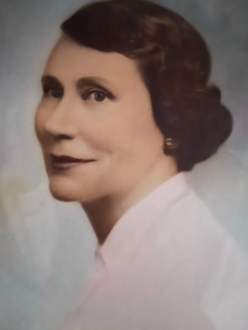

# Ellen Bernadine Nelle Copley Sardo ("Nelle") (1897–1977)

📊 View [[Family Tree]] for visual context.

## Biographical Profile
[[Ellen Bernadine Nelle Copley Sardo|Ellen Bernadine "Nelle" Copley Sardo]] is a G24 daughter of [[John Copley]] and [[Mary Ellen Dolan Copley]], and an anchor for the Sardo/Arena/Ruland branch.

- **Birth:** Three conflicting sources — (1) family biography by grandchildren: **Dec 23, 1897**, Copley WV; (2) 1910 census age 13 implies **1896**; (3) Ancestry.com tree: **25 Dec 1896**, Sand Fork, Gilmer County WV. Discrepancy (Q45) remains open; primary birth record needed.
- **Named after:** Her mother Ellen Dolan, and her aunt [[Bridget Bitty Copley Gillooly|"Bitty" (Bernadine)]]
- **Education:** DeSales Heights Academy (boarding school, Parkersburg WV); University of West Virginia (2 years); taught in a one-room schoolhouse; St. Joseph Hospital nursing school, Baltimore — RN 1926
- **Career:** By age 35 (1932), Director of Nursing Education, St. Joseph Hospital, Baltimore; past president of the St. Joseph Nursing School Alumnae Association; director of volunteers (10 years); 1976: awarded 50-year service pin
- **Death:** 11 Feb 1977
- **Parents:** [[John Copley]], [[Mary Ellen Dolan Copley]]
- **Career/occupation:** Registered nurse and nursing educator (reported in family narrative synthesis)
- **Marriage:** Robert Samuel Sardo (married 16 Aug 1931)

## Family Relationships
- **Parents:** [[John Copley]], [[Mary Ellen Dolan Copley]]
- **Grandparents:** [[Michael Copley Sr|Michael Copley]], [[Ann Copley]]
- **Siblings:**
  - [[Thomas E. Copley]]
  - [[Mary Copley Flesch]]
  - [[Anne Copley (daughter of John Copley)|Anne Copley]]
  - [[Michael Joseph Copley]]
- **Spouse:** Robert Samuel Sardo
- **Children (G25):**
  - [[Sarah Ellen Sardo Arena]]
  - [[Mary Carmella Sardo Ruland]]

## Research Gaps
1. Resolve birth-year discrepancy (1896 vs 1897) with primary records.
2. Document nursing education timeline and training institution(s).
3. Build fully sourced chronology of household moves and branch expansion.

## Acquisition Strategy
- Prioritize birth and marriage records; then census/city directory chain.
- Search nursing school records, registration/licensure sources, and hospital archives where accessible.
- Add obituary/church records for timeline closure and relationship confirmation.

## Social Media & Online Presence
- Not applicable from current high-confidence research set.

## Sources
1. `/home/ubuntu/Uploads/COPLEY HISTORY PART 1 final 2.pdf` (family structure, dates, marriage, descendants).
2. `/home/ubuntu/copley_research_findings.md` (RN/educator role and birth-year discrepancy note).
3. `/home/ubuntu/copley_research_analysis.md` (Nelle branch context and open-question mapping).
4. [[Family Tree]] (generation and child-link verification).