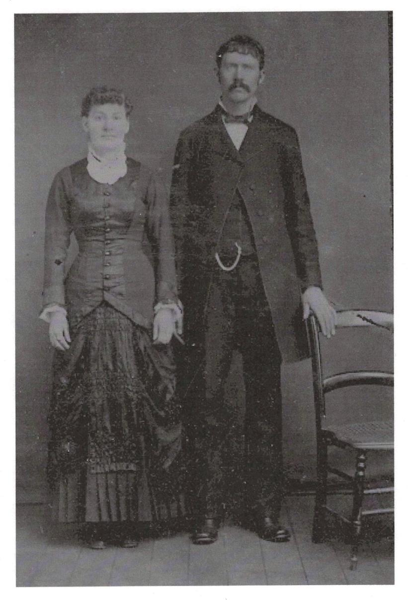
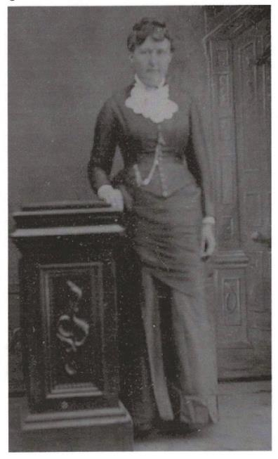
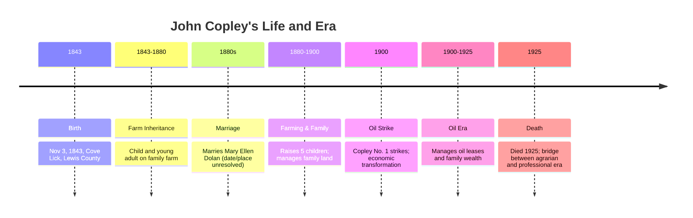

# John Copley (1843–1925)

📊 View [[Family Tree]] for visual context.

## Biographical Profile
[[John Copley]] was born **3 Nov 1843** near [[Places/Weston West Virginia|Weston, West Virginia]] (then Virginia), the son of [[Michael Copley Sr|Michael Copley]] and [[Ann Copley]]. He became the principal successor to the family farm established through the 1843 Hoffman agreement in the [[Places/Cove Lick West Virginia|Cove Lick/Copley Road area]].

He married [[Mary Ellen Dolan Copley]] (date/place unresolved) and the couple had five children: [[Thomas E. Copley]], [[Mary Copley Flesch]], [[Anne Copley (daughter of John Copley)|Anne Copley]], [[Ellen Bernadine Nelle Copley Sardo|Ellen Bernadine "Nelle" Copley Sardo]], and [[Michael Joseph Copley]].

John's household sat at the center of the family's economic transformation following the 1900 **[[Topics/1900 Copley Oil Strike|1900 Copley Oil Strike]]**. Period sources identify the South Penn property as the **Michael Copley Heirs 128-Acre Lease**, but they do not identify the individual lease signers or prove John's ownership share. A separate family exchange deed executed 22 August 1900 names John as grantee and recites an exchange involving his 27½-acre interest in a 200-acre Sand Fork tract. The deed is direct title-chain evidence but contains no oil-lease or royalty language. His generation remains the key bridge between immigrant agrarian roots and later professional mobility of descendants.

## Lived During

John is the direct bridge between the **1843 settlement generation** and the children whose lives carry the family into nursing, science, and the modern branches.

- He was born in the same year as the **1843** Hoffman-Copley land agreement.
- He lived the long family-farm succession era between immigrant settlement and industrial change.
- He was the household head during the **1900** oil strike, when the family land entered a new economic phase.
- He overlapped for decades with children such as [[Ellen Bernadine Nelle Copley Sardo|Nelle]] and [[Michael Joseph Copley]], making him the strongest living link between the immigrant farm world and the bridge generation born around 1900.

For a chronology-first view of those overlaps, see [[Who Was Alive When]].

## Timeline

```mermaid
timeline
    title John Copley's Life and Era
    
    1843 : Birth : Nov 3, 1843, Cove Lick, Lewis County
    1843-1880 : Farm Inheritance : Child and young adult on family farm
    1880s : Marriage : Marries Mary Ellen Dolan (date/place unresolved)
    1880-1900 : Farming & Family : Raises 5 children; manages family land
    1900 : Oil Strike : Copley No. 1 strikes; economic transformation
    1900-1925 : Oil Era : Manages oil leases and family wealth
    1925 : Death : Died 1925; bridge between agrarian and professional era
```

## Key Place Links
- [[Places/Lewis County West Virginia|Lewis County, West Virginia]]
- [[Places/Weston West Virginia|Weston, West Virginia]]
- [[Places/Cove Lick West Virginia|Cove Lick, West Virginia]]

## Related Topic Pages
- [[Topics/1900 Copley Oil Strike|1900 Copley Oil Strike]]
- [[Topics/Irish Immigration to West Virginia|Irish Immigration to West Virginia]]
- [[Topics/Academic and Scientific Achievement|Academic and Scientific Achievement]]

## Family Relationships
- Parents: [[Michael Copley Sr|Michael Copley]], [[Ann Copley]]
- Spouse: [[Mary Ellen Dolan Copley]]
- Children (G24 in this branch convention):
  - [[Thomas E. Copley]]
  - [[Mary Copley Flesch]]
  - [[Anne Copley (daughter of John Copley)|Anne Copley]]
  - [[Ellen Bernadine Nelle Copley Sardo|Ellen Bernadine "Nelle" Copley Sardo]]
  - [[Michael Joseph Copley]]
- Grandchildren (G25 in Phase 1B scope):
  - [[Stephen Michael Copley]]
  - [[Thomas Partlow Copley]]
  - [[Sarah Ellen Sardo Arena]]
  - [[Mary Carmella Sardo Ruland]]
- Siblings:
  - [[Mary Copley Quinn]]
  - [[Catherine Kitty Copley Hannon|Catherine "Kitty" Copley Hannon]]
  - [[Anne Copley (b. 1850)|Anne Copley]]
  - [[Bridget Bitty Copley Gillooly|Bridget "Bitty" Copley Gillooly]]
  - [[Margaret Copley]]
  - [[Thomas Tom Copley|Thomas "Tom" Copley]]
  - [[Sarah Copley]]

## Research Gaps
1. **Marriage record with Mary Ellen (Q20)** not located.
2. **Civil War Quartermaster claim (Q28)** unproven.
3. **Late marriage/childbearing context (Q21)** needs evidence-based explanation.
4. **Oil lease and inheritance economics (Q24-Q26):** The `Michael Copley Heirs 128-Acre Lease` designation is verified in a 1927 technical publication, and the separate 1900 family exchange deed is located, but the recorded oil lease, signers, shares, royalties, and family financial effect remain unresolved.

## Acquisition Strategy
- Search civil/church marriage records in Lewis and Marshall county pathways.
- File NARA military/pension request for all plausible John Copley candidates (including Quartermaster records, RG 92).
- Use FamilySearch record `6X4N-DWWY` as a located title-chain anchor; verify its cited 1 May 1878 deed, then search Lewis County Copley and South Penn indexes for the separate recorded lease and related probate / title records for 1897-1925.
- Build a dated household timeline from 1850-1920 census entries.

## Source Citations
1. *COPLEY HISTORY PART 1 final 2.pdf* (birth date, family role, spouse/children, farm continuity).
2. `/home/ubuntu/copley_research_findings.md` (Q20/Q21/Q28 framing; oil-era context).
3. `/home/ubuntu/copley_research_analysis.md` (priority matrix and unresolved evidence).
4. HMDB oil marker context: https://www.hmdb.org/results.asp?Search=County&State=West%20Virginia&County=Lewis%20County
5. [[References/Claude for Chrome Copley Heirs Oil Title Search|Claude for Chrome Copley Heirs Oil Title Search]] — period-source and deed-index access map for the Michael Copley Heirs 128-Acre Lease.
6. [[References/Claude for Chrome 1900 Copley Family Exchange Deed|Claude for Chrome 1900 Copley Family Exchange Deed]] — original-image identification of the August 1900 family exchange deed naming John as grantee.
