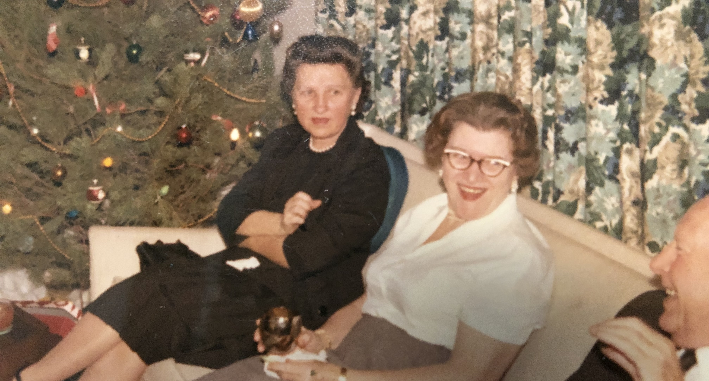

# Marion Elizabeth Partlow (1905–1977)

📊 View [[Family Tree]] for visual context.

## Biographical Profile

[[Marion Elizabeth Partlow]] was the wife of [[Michael Joseph Copley]] and mother of [[Stephen Michael Copley]] and [[Thomas Partlow Copley]]. Before marriage she had been an elementary school teacher. She was known as a devoted homemaker, excellent hostess (during Michael's years as USDA lab director), and enthusiastic gardener who wrote a weekly wildflower column for a local California newspaper.

- **Birth:** ~1905, Casey, Illinois (midway between Indianapolis and St. Louis)
- **Death:** 26 Mar 1977, Berkeley, California (Ancestry.com tree, unverified)
- **Marriage:** [[Michael Joseph Copley]], 1933
- **Burial:** Sunset View Cemetery, El Cerrito, California (with Michael) — confirmed by family; Ancestry.com tree incorrectly lists Oak Point, Clark County, IL
- **Occupation (pre-marriage):** Teacher; June 2026 family note says she was preparing to become an English teacher when she met Michael at the University of Illinois
- **Residence:** Champaign IL -> [[Places/Wyndmoor Pennsylvania|Wyndmoor PA]] -> [[Places/Berkeley California|Berkeley]] / El Cerrito CA

## Biographical Narrative

Marion came from the Partlow farm family near Casey, Illinois, and brought a schoolteacher's sensibility into the Copley household. The appendix sketches by Michael's sons describe her as a former elementary teacher, devoted homemaker, gardener, hostess, and steady presence during Michael Joseph Copley's academic and USDA career.

The June 2026 house-and-mother addendum adds a useful meeting context: Marion and [[Michael Joseph Copley]] met at the University of Illinois, Urbana, while Michael was an Assistant Professor of Chemistry and Marion was training to become an English teacher. The same family note emphasizes that both parents treated teaching as a family practice, spending long hours tutoring their sons and making sure they were ready for school.

The Michael Joseph sketch adds a fuller family-of-origin frame. It describes the Partlows as a Wales-to-Virginia-to-Indiana-to-Illinois line that settled on a large farm near Casey, and it places Marion in a sizeable sibling group of three brothers and three sisters before her 1933 marriage to Michael. Before marriage she taught in an elementary school, a detail that helps explain the educational discipline later remembered by her children.

Her adult life followed Michael's scientific appointments: Champaign during the University of Illinois years, [[Places/Wyndmoor Pennsylvania|Wyndmoor]] during the Eastern Regional Research Laboratory period, and Berkeley / [[Places/Albany California|Albany]] during the Western Regional Research Laboratory years. Their first son, [[Stephen Michael Copley]], was born in Champaign in 1936; their second, [[Thomas Partlow Copley]], was born in 1944 during the Wyndmoor / wartime USDA period. As director's wife during the WRRL era, Marion helped host visiting scientists, USDA colleagues, and guests from Washington and other regional laboratories.

Family memories emphasize her practical care for her sons' education and interests. Stephen remembered her gardening, her insistence on piano lessons, and her willingness to absorb the cost and effort of stronger schooling when local options seemed weak. He also recalled her deep investment in plants and flowers, including iris breeding and a weekly California newspaper wildflower column. The June 2026 addendum identifies that column more specifically as a weekly California native-plants column for the `Oakland Tribune`.

The same addendum sharpens Marion's agricultural and civic profile. It says she retained a lifelong interest in growing things, actively managed inherited Illinois farmland, advised the farmer on crops, fertilizers, and crop rotation, and cultivated irises, roses, native plants, and other horticultural interests at home. It also credits her with leading a successful petition effort to save the Tilden Botanical Garden when local park administrators were considering abandoning it.

Tom remembered her as central to the household and to the social side of Michael's laboratory leadership: the parent who made official entertaining work, maintained a polished home, and helped translate an institutional research world into family life. The June 2026 addendum also describes her as a writer of novels and poems, some published and many apparently preserved only in family files still being sorted decades after her death.

## Family of Origin

The Partlow family immigrated from **Wales** to Virginia before the Revolutionary War, then moved west to Indiana, then Illinois. They owned a large farm near **Casey, Illinois**. A Revolutionary War ancestor, **[[Benjamin Partlow]]**, served in the Virginia militia under Capt. Coxen and Capt. Rogers, guarding British prisoners at the Albemarle Barracks (Culpeper County, VA).

- **Father:** Nollie Franklin / Frank Partlow (b. 8 Oct 1874, Johnson Township, Clark County, IL; d. 21 Nov 1956, Terre Haute, IN; buried Oak Point, Clark County, IL) — per Ancestry.com tree and local handwritten lineage; unverified by original records
- **Mother:** Mary Alice / Alice Rude Partlow (b. 11 Oct 1880; d. 20 Jan 1962; buried Oak Point, Clark County, IL) — Ancestry.com tree gives Mary Alice Partlow; local handwritten lineage identifies her as Alice Rude Partlow; unverified by original records
- **Paternal grandparents:** Marion M. Partlow and Martha L. Bowles — per Ancestry tree screenshot, unverified
- **Maternal grandparents:** John Armstrong Rude and Mary Ellen J. Wade — per Ancestry tree screenshot, unverified
- **Brothers:** Harry Partlow, Raymond Partlow, Lester ("Leck") Partlow
- **Sisters:** Laura Partlow, Doris Partlow, Genevieve ("Gen") Partlow

The Partlow image set includes an Ancestry tree screenshot, refined by later online searching and a local 1977 handwritten family lineage, that proposes this paternal ancestral path:

**Marion Elizabeth Partlow** -> **Nollie Franklin / Frank Partlow** -> **Marion McDonald / M. Partlow** -> **John H. / John Halleck / Hallick Partlow** (1811/1812-1870?) and **Lydia Bennett** -> **Jacob Partlow / Jacob Newton Partlow** -> **Benjamin W. Partlow** (1762-1837?) -> earlier Virginia Partlows.

The **Frank Partlow -> Marion McDonald Partlow** link is now supported by online citations to the 1880 and 1900 Johnson Township, Clark County, Illinois census entries. The **Marion McDonald Partlow -> John Halleck Partlow** link is supported by online citations to the 1850 and 1860 Johnson Township census entries. The unresolved issue is proving that Frank Partlow is the same person as **Nollie Franklin Partlow**. The 1977 handwritten lineage supports the full chain but remains family manuscript evidence until confirmed with census, probate, land, cemetery, and vital records. See [[RQ-P1-PARTLOW-REVOLUTIONARY-LINE|RQ-P1 Partlow Revolutionary Line]] and [[References/Harry C Partlow 1960 Letter and Handwritten Lineage]].

## Family Relationships

- **Spouse:** [[Michael Joseph Copley]] (married 1933; Michael died Sep 17 1988)
- **Children (G25):**
  - [[Stephen Michael Copley]] (b. Apr 29, 1936, Champaign IL)
  - [[Thomas Partlow Copley]] (b. Oct 29, 1944, Philadelphia PA)

## Notes

- Thomas Partlow Copley's middle name "Partlow" honors her maiden name.
- Stephen's memoir material remembers Marion as the parent most visibly tied to gardening, music lessons, and the maintenance of extended Illinois family ties.
- After Michael's retirement in 1968, Tom's family moved back to Berkeley to help care for their parents after Marion's death.
- The photo on this page is identified by Tom Copley as a likely LaForce Christmas party snapshot, probably 1967-1968, showing Marion, [[People/Marian Agnes Hewetson|Marian Agnes Hewetson]] seated between Marion and [[Michael Joseph Copley]], and Michael partly visible. Marian Agnes Hewetson was [[Barbara Dee LaForce|Dee LaForce]]'s grandmother, known as "Grammy," and should not be confused with Marion Elizabeth Partlow; Tom noted that Marian used an `a` while Marion used an `o`. The exact event date and location should still be treated as family-photo identifications.

## Sources

1. `~/Downloads/Part 1 Appendices .pdf` — Michael Joseph Copley, Stephen Copley, and Tom Copley biographical sketches, especially pp. 1-4 and 5-8 for the Partlow marriage context, Illinois farm-family background, and family-memory material.
2. [[Family Tree]] — internal branch mapping.
3. `/mnt/c/Users/zach/Desktop/Partlow/IMG_2433.png` — Ancestry tree screenshot showing Marion's Partlow, Bowles, Rude, and Wade ancestry; derivative tree evidence only.
4. [[RQ-P1-PARTLOW-REVOLUTIONARY-LINE]] — current online research log for the Partlow Revolutionary line.
5. [[References/Harry C Partlow 1960 Letter and Handwritten Lineage]] — local family manuscript naming Marion E. Partlow Copley among the children of Frank and Alice Rude Partlow.
6. [[References/Tom and Steve Copley June 2026 House and Origin Thread]] — sanitized June 2026 source note preserving the house-and-Marion PDF, Marion photo identification, and source cautions.
