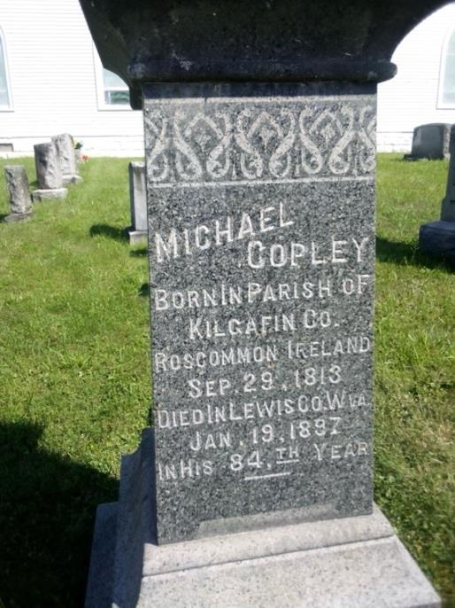
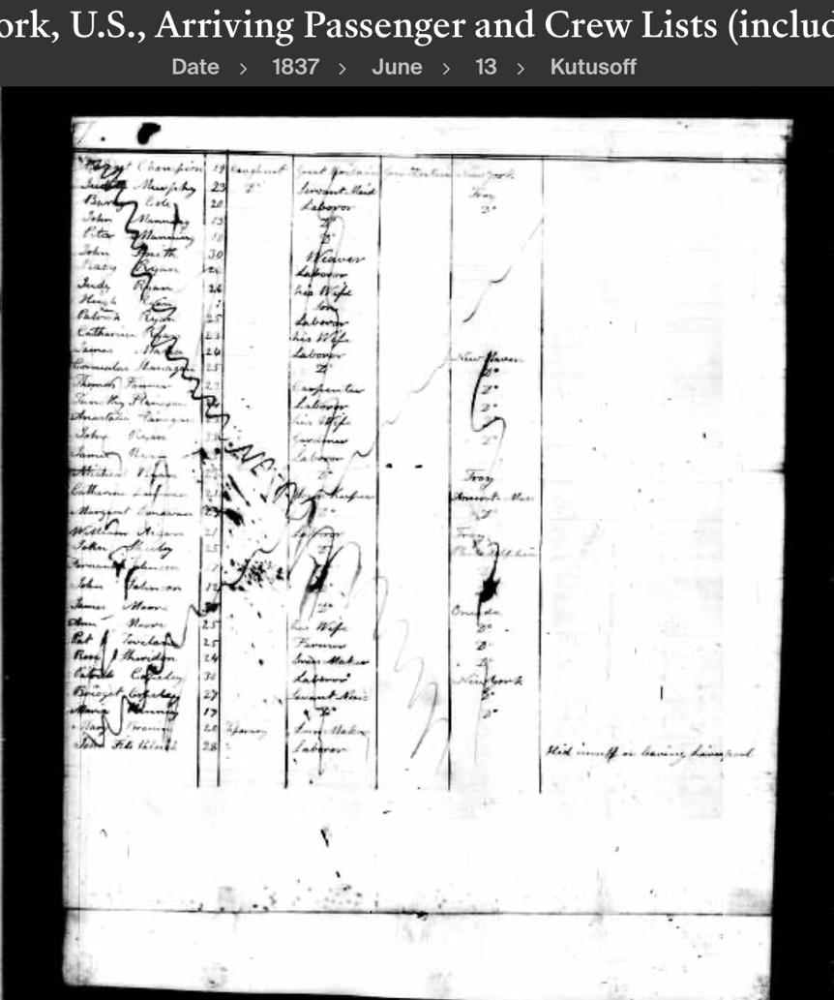
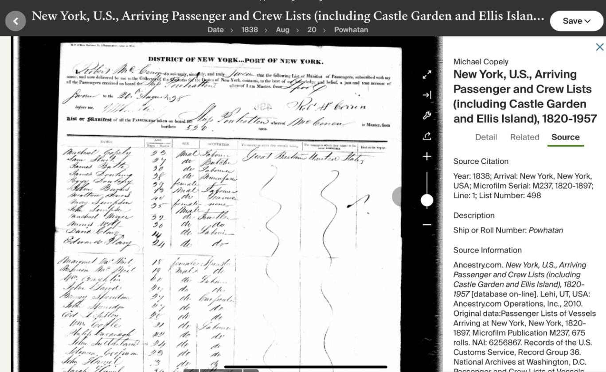
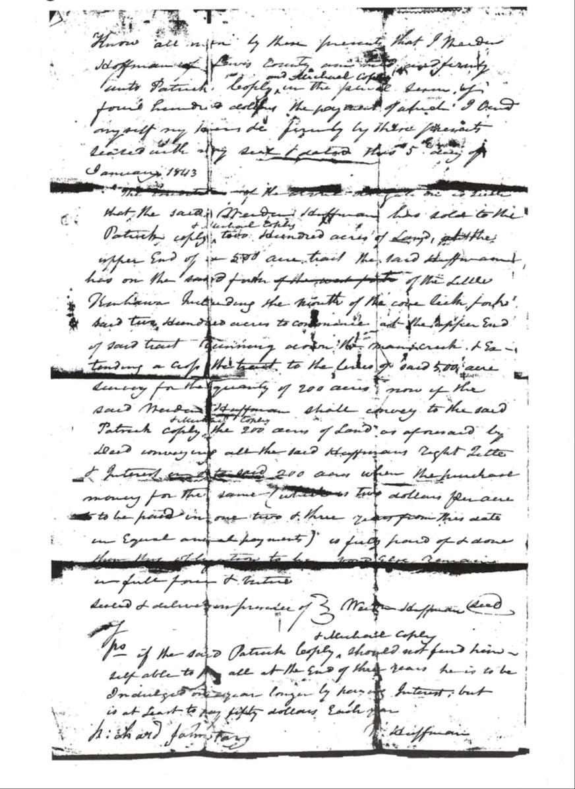
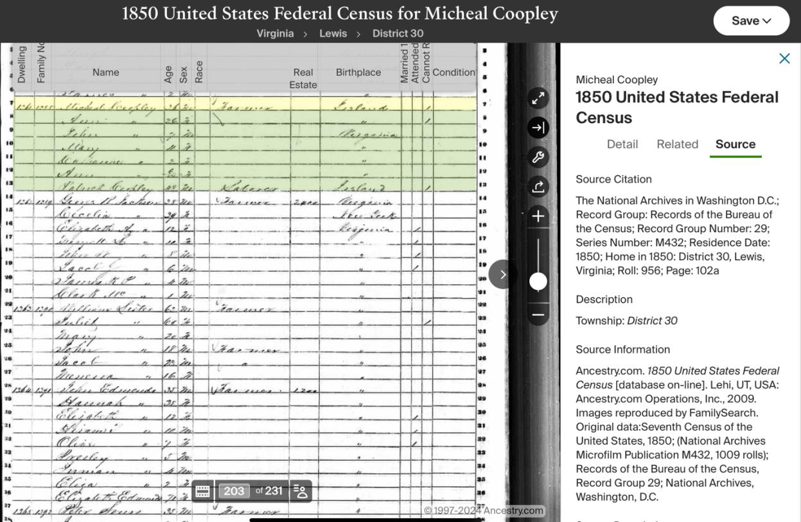
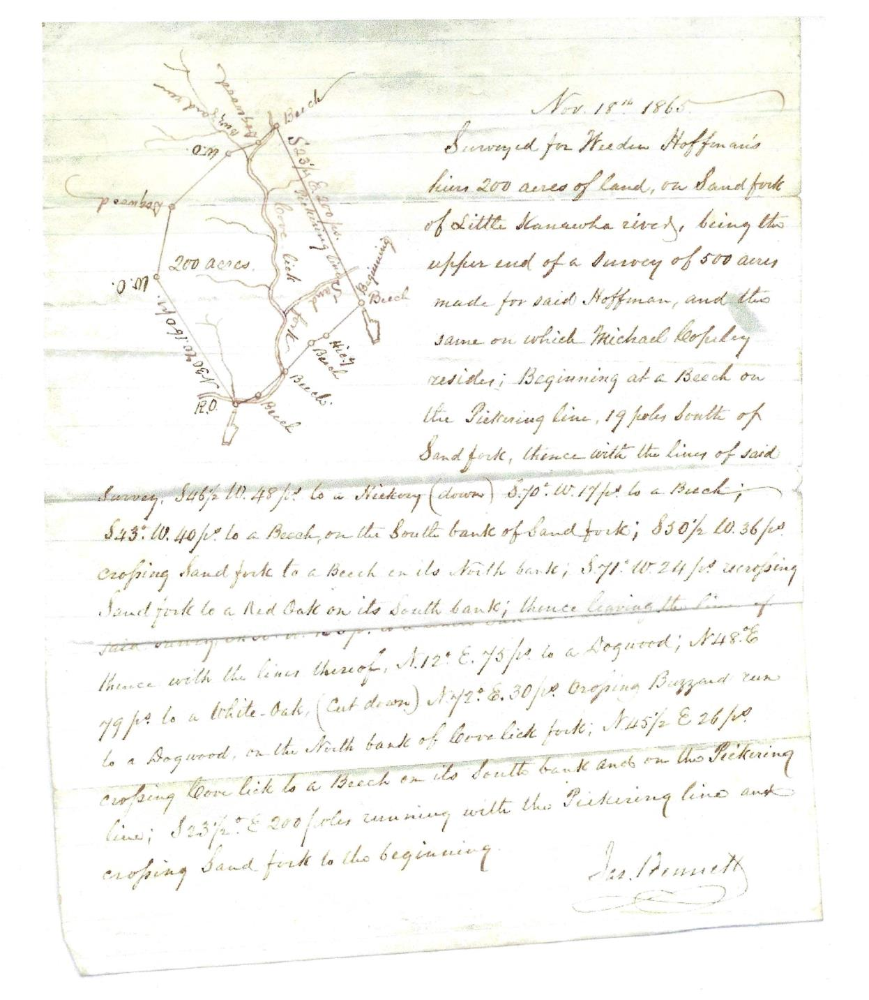
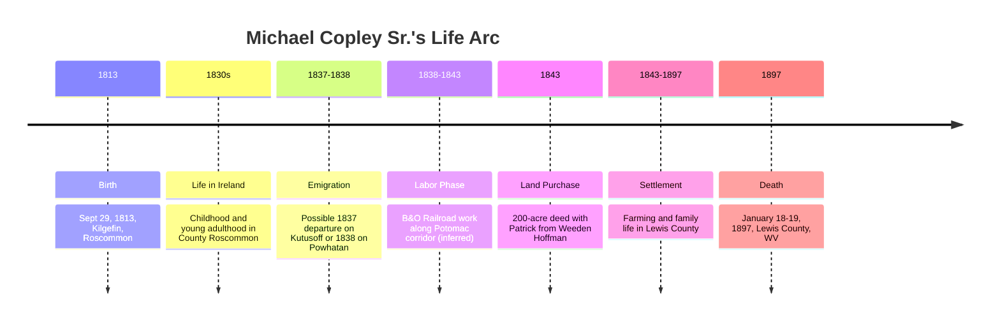

# Michael Copley Sr. (1813–1897)

📊 View [[Family Tree]] for visual context.

## Disambiguation
- Not to be confused with [[Michael Joseph Copley]] (1898–1988), his grandson.
- Not to be confused with [[Michael Copley (b. 1959)]], his great-great-grandson in the Stephen branch.

## Biographical Profile
[[Michael Copley Sr|Michael Copley]] is the documented immigrant patriarch of the Copley family branch that settled in [[Places/Lewis County West Virginia|Lewis County, West Virginia]]. Family history and grave-marker evidence identify him as born **29 Sep 1813** in the parish of **[[Places/Kilgefin Ireland|Kilgefin]], [[Places/County Roscommon Ireland|County Roscommon]], Ireland**, and deceased in **[[Places/Lewis County West Virginia|Lewis County, West Virginia]]** in **January 1897** (gravestone: 19 Jan 1897; narrative text includes 18 Jan 1897, a minor discrepancy to track).

He emigrated in the late 1830s and is strongly associated with the passenger record of **Michael “Copely”** arriving in New York on the *Powhatan* in August 1838. A possible precursor record — the brig *Kutusoff* manifested in 1837 — may reflect an earlier sibling arrival.

Family narrative and contextual evidence indicate an early labor phase connected to the **Baltimore & Ohio Railroad (B&O)** corridor, especially around [[Places/Baltimore Maryland|Baltimore, Maryland]] and Potomac-route communities, followed by transition to settled agriculture.

In 1843, Michael and his brother [[Patrick Copley]] entered a purchase agreement for a **200-acre tract** from Weeden Hoffman in what became the [[Places/Cove Lick West Virginia|Copley Road/Cove Lick area]] near [[Places/Weston West Virginia|Weston]]. This transaction marks the family’s permanent establishment in the region.

## Figure Provenance

The lead gravestone image on this page corresponds to **Figure 1** on **page 4** of `COPLEY HISTORY PART 1 final 2.pdf`, where the raw family-history narrative identifies Michael's marker at **St. Bernard's Catholic Church** on [[Places/Loveberry Ridge West Virginia|Loveberry Ridge]] near Weston. On this page the figure is doing two jobs at once: it is an illustration of the burial place, and it is also one of the main derivative sources for Michael's reported birth date (`29 Sep 1813`) and death timing (`Jan 1897`).

The same Part 1 narrative text on **page 18** gives Michael's death as `18 Jan 1897`, while the gravestone-based reading used here is `19 Jan 1897`. That discrepancy should continue to be tracked as a family-history-source conflict rather than silently harmonized.

## Lived During

Michael lived through the immigrant crossing and settlement-building era that turned an Irish family story into a permanent Lewis County line.

- He was a young adult in the **1837-1838** Atlantic migration window.
- He was an active land purchaser in the **1843** Hoffman-Copley settlement moment.
- He lived through the long Lewis County farming era that established the branch before the oil-strike generation.
- He died in **1897**, just before the **1900** oil strike that transformed the next generation's economic world.

For a chronology-first view of his overlaps with later generations, see [[Who Was Alive When]].

## Family Relationships
- Spouse: [[Ann Copley]] (family tradition/secondary narratives identify her as Ann Elizabeth Munday)
- Children (G24):
  - [[Mary Copley Quinn]]
  - [[John Copley]]
  - [[Catherine Kitty Copley Hannon|Catherine "Kitty" Copley Hannon]]
  - [[Anne Copley (b. 1850)|Anne Copley]]
  - [[Bridget Bitty Copley Gillooly|Bridget "Bitty" Copley Gillooly]]
  - [[Margaret Copley]]
  - [[Thomas Tom Copley|Thomas "Tom" Copley]]
  - [[Sarah Copley]]
- Siblings (Ireland/U.S. migration context): [[Patrick Copley]], [[Bridget Copley Reynolds]], [[Catherine Kitty Copley Hannon]], [[William Copley]]

## Timeline

## Timeline Anchors
- **1813-09-29**: Born, Kilgefin parish, Roscommon (per gravestone tradition).
- **1838-08 (manifest date 1838-08-20)**: Probable New York arrival on *Powhatan* as “Michael Copely.”
- **1838-1843 (inferred)**: Probable B&O labor period along Potomac corridor.
- **1843**: 200-acre agreement with Weeden Hoffman, Lewis County.
- **1897-01**: Death in Lewis County, WV.

## Related Topic Pages
- [[Topics/Irish Famine and Emigration|Irish Famine and Emigration]]
- [[Topics/B&O Railroad Labor History|B&O Railroad Labor History]]
- [[Topics/Irish Immigration to West Virginia|Irish Immigration to West Virginia]]

## Research Gaps
1. **Parents in Kilgefin (Q1):** No direct parish record chain yet linking Michael to named parents.
2. **Marriage record (Q3):** Date/place for marriage to Ann remains unlocated.
3. **Naturalization (Q19):** Date, court, and certificate details unknown.
4. **B&O service detail (Q16/Q17):** Specific payroll/crew records not yet located.
5. **Death-date discrepancy:** 18 Jan vs 19 Jan 1897 across derivative narratives.

## Acquisition Strategy
- **Irish parish registers (NLI):** Systematic baptism search c.1808-1820 in Kilgefin and nearby Roscommon parishes for Michael + siblings.
- **Naturalization search by corridor:** County/state courts in MD/VA/WV aligned to B&O routes; extract occupation and arrival data.
- **Marriage targeting:** Catholic sacramental records and civil records in Potomac-adjacent communities (Harpers Ferry–Cumberland corridor).
- **Railroad records:** Investigate B&O archival holdings and local historical collections for labor/contractor references.
- **Death reconciliation:** Compare grave transcription, cemetery registers, and any obituary/church burial record.

## Source Citations
1. *COPLEY HISTORY PART 1 final 2.pdf* (uploaded source; pp. 3-17 for immigrant narrative, gravestone text, 1843 land agreement context).
2. [[copley_research_analysis]] (`/home/ubuntu/copley_research_analysis.md`) — synthesis of Q1, Q3, Q19, migration and settlement findings.
3. [[copley_research_findings]] (`/home/ubuntu/copley_research_findings.md`) — reliability and research strategy framework.
4. Powhatan manifest reference via findings synthesis (NARA microfilm pathway).
5. B&O historical context: https://www.wvencyclopedia.org/entries/830
