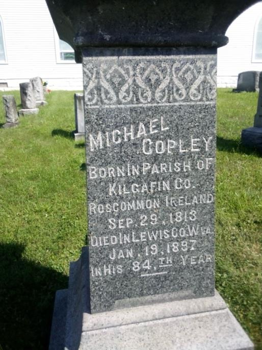
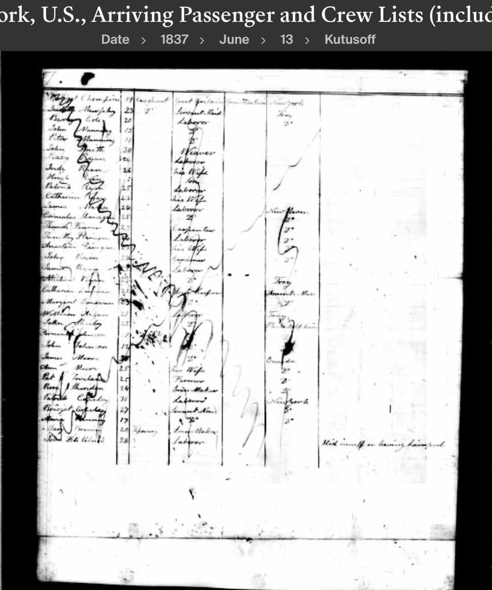
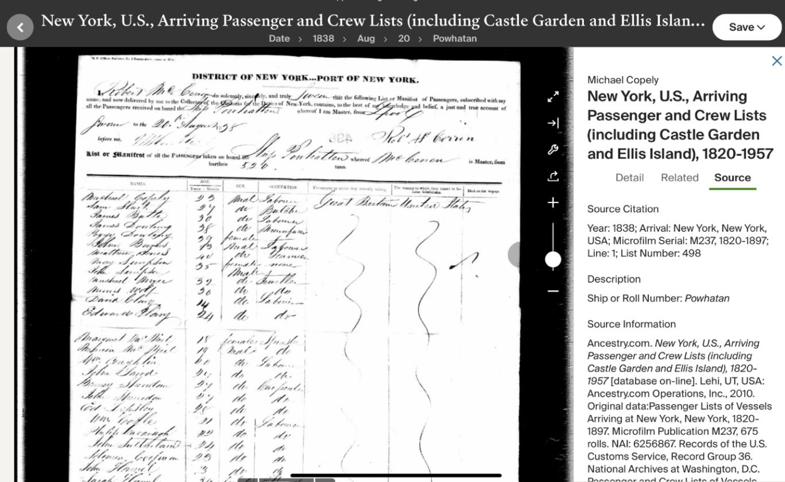
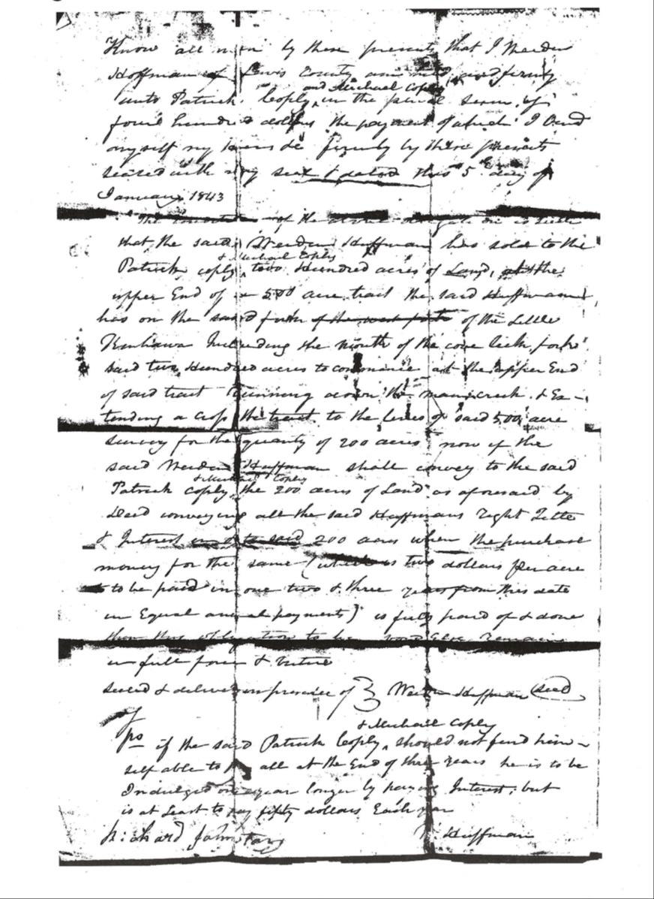
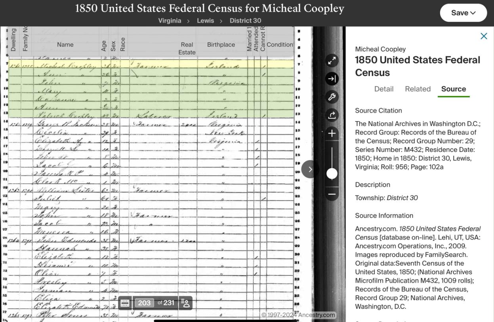
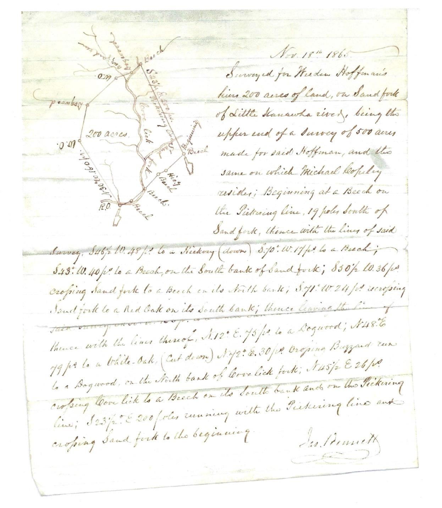
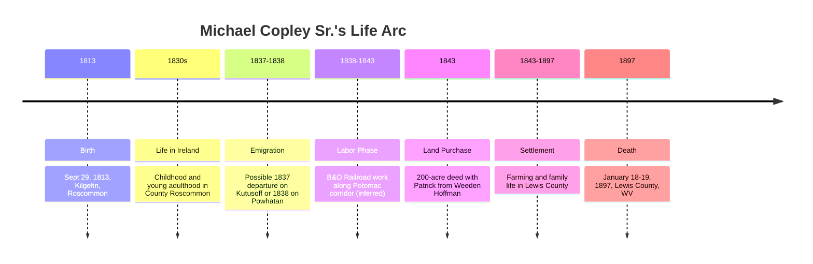

# Michael Copley Sr. (1813–1897)

📊 View [[Family Tree]] for visual context.

## Disambiguation
- Not to be confused with [[Michael Joseph Copley]] (1898–1988), his grandson.
- Not to be confused with [[Michael Copley (b. 1959)]], his great-great-grandson in the Stephen branch.

## Biographical Profile
[[Michael Copley Sr|Michael Copley]] is the documented immigrant patriarch of the Copley family branch that settled in [[Places/Lewis County West Virginia|Lewis County, West Virginia]]. Family history and grave-marker evidence identify him as born **29 Sep 1813** in the parish of **[[Places/Kilgefin Ireland|Kilgefin]], [[Places/County Roscommon Ireland|County Roscommon]], Ireland**, and deceased in **[[Places/Lewis County West Virginia|Lewis County, West Virginia]]** in **January 1897** (gravestone: 19 Jan 1897; narrative text includes 18 Jan 1897, a minor discrepancy to track).

He emigrated in the late 1830s and is strongly associated with the passenger record of **Michael “Copely”** arriving in New York on the *Powhatan* in August 1838. A possible precursor record — the brig *Kutusoff* manifested in 1837 — may reflect an earlier sibling arrival.

Family narrative and contextual evidence indicate an early labor phase connected to the **Baltimore & Ohio Railroad (B&O)** corridor, especially around [[Places/Baltimore Maryland|Baltimore, Maryland]] and Potomac-route communities, followed by transition to settled agriculture.

In 1843, Michael and his brother [[Patrick Copley]] entered a purchase agreement for a **200-acre tract** from Weeden Hoffman in what became the [[Places/Cove Lick West Virginia|Copley Road/Cove Lick area]] near [[Places/Weston West Virginia|Weston]]. A later source-title deed, executed **1 May 1880** and recorded **24 February 1881** in Lewis County Deed Book 11 page 321, conveyed the 200-acre Land Fork / Sand Fork / Cove Lick tract from Hoffman representatives to **Michael Copley and John Copley** after the $500 purchase price had already been paid. Together, the 1843 agreement and 1880 deed mark the family's permanent establishment in the region.

## Figure Provenance

The lead gravestone image on this page corresponds to **Figure 1** on **page 4** of `COPLEY HISTORY PART 1 final 2.pdf`, where the raw family-history narrative identifies Michael's marker at **St. Bernard's Catholic Church** on [[Places/Loveberry Ridge West Virginia|Loveberry Ridge]] near Weston. On this page the figure is doing two jobs at once: it is an illustration of the burial place, and it is also one of the main derivative sources for Michael's reported birth date (`29 Sep 1813`) and death timing (`Jan 1897`).

The same Part 1 narrative text on **page 18** gives Michael's death as `18 Jan 1897`, while the gravestone-based reading used here is `19 Jan 1897`. That discrepancy should continue to be tracked as a family-history-source conflict rather than silently harmonized.

## Lived During

Michael lived through the immigrant crossing and settlement-building era that turned an Irish family story into a permanent Lewis County line.

- He was a young adult in the **1837-1838** Atlantic migration window.
- He was an active land purchaser in the **1843** Hoffman-Copley settlement moment.
- He lived through the long Lewis County farming era that established the branch before the oil-strike generation.
- He died in **1897**, just before the **1900** oil strike that transformed the next generation's economic world.

For a chronology-first view of his overlaps with later generations, see [[Who Was Alive When]].

## Family Relationships
- Parents: The 1897 Lewis County death-register row records Michael's parents as **John Copley** and **Sarah Copley**. This is official county death-register evidence, but it is secondary parent information; the same record context incorrectly identifies **Bridget Copley** as Michael's wife / informant and indexes Michael's birthplace as Lewis County rather than Ireland. No source found so far gives Sarah's maiden name as Dolan. See [[References/Claude for Chrome Michael Copley Sr Parent Name Claim]].
- Spouse: [[Ann Copley]] (family tradition/secondary narratives identify her as Ann Elizabeth Munday)
- Children (G24):
  - [[Mary Copley Quinn]]
  - [[John Copley]]
  - [[Catherine Kitty Copley Hannon|Catherine "Kitty" Copley Hannon]]
  - [[Anne Copley (b. 1850)|Anne Copley]]
  - [[Bridget Bitty Copley Gillooly|Bridget "Bitty" Copley Gillooly]]
  - [[Margaret Copley]]
  - [[Thomas Tom Copley|Thomas "Tom" Copley]]
  - [[Sarah Copley]]
- Siblings (Ireland/U.S. migration context): [[Patrick Copley]], [[Bridget Copley Reynolds]], [[Catherine Kitty Copley Hannon]], [[William Copley]]

Michael's 1893 Lewis County will, probated on **4 March 1897**, confirms the estate family from Michael's own probate record: son **John Copley** received land and served as sole administrator / executor; daughters **Annie**, **Bridget**, **Margaret**, and **Sarah** received land / personal-property shares tied to their mother's lifetime; and cash bequests went to **Thomas**, likely **Catherine Hannon**, and likely **Mary Quinn**. The will references Michael's wife / the children's mother but does not name her by first name in the readable abstract, and it does **not** name Michael's parents or any Sarah Dolan. See [[References/Claude for Chrome Michael Copley Sr Probate Estate Search]].

After Michael's death, period oil-industry sources identified a South Penn property as the **Michael Copley Heirs 128-Acre Lease** and its pool-opening well as **Michael Copley Heirs well No. 1**, completed 13 September 1900. The South Penn grantee index points to the likely recorded Sand Fork lease: **Anna Copley to South Penn Oil Company, Lease, Deed Book 42 page 267, 128 acres on Sand Fork**, but Book 42 was not available in the online FamilySearch deed-book images checked. A related online lease at Book 39 page 138 names Anna, Bridget, Margaret, and Sarah E. Copley as lessors to South Penn for a Land Fork tract. A separate 22 August 1900 family exchange deed directly names Ann, Margaret, Ann, Sarah, Bridget and Patrick Gillooly, and John in a title rearrangement involving Sand Fork and a 55-acre tract. It is not the oil lease, and the 55-acre place-name reading remains unresolved. Its older source deed is visually verified at Book 11 page 321 and confirms Michael and John as grantees of the 200-acre Hoffman tract; its 21 March 1886 marginal-note deed-index path is a bounded negative in the checked FamilySearch deed materials. See [[References/Claude for Chrome Copley Heirs Oil Title Search]] and [[References/Claude for Chrome 1900 Copley Family Exchange Deed]].

## Timeline

```mermaid
timeline
    title Michael Copley Sr.'s Life Arc
    
    1813 : Birth : Sept 29, 1813, Kilgefin, Roscommon
    1830s : Life in Ireland : Childhood and young adulthood in County Roscommon
    1837-1838 : Emigration : Possible 1837 departure on Kutusoff or 1838 on Powhatan
    1838-1843 : Labor Phase : B&O Railroad work along Potomac corridor (inferred)
    1843 : Land Purchase : 200-acre deed with Patrick from Weeden Hoffman
    1843-1897 : Settlement : Farming and family life in Lewis County
    1897 : Death : January 18-19, 1897, Lewis County, WV
```

## Timeline Anchors
- **1813-09-29**: Born, Kilgefin parish, Roscommon (per gravestone tradition).
- **1838-08 (manifest date 1838-08-20)**: Probable New York arrival on *Powhatan* as “Michael Copely.”
- **1838-1843 (inferred)**: Probable B&O labor period along Potomac corridor.
- **1843**: 200-acre agreement with Weeden Hoffman, Lewis County.
- **1897-01**: Death in Lewis County, WV.

## Related Topic Pages
- [[Topics/Irish Famine and Emigration|Irish Famine and Emigration]]
- [[Topics/B&O Railroad Labor History|B&O Railroad Labor History]]
- [[Topics/Irish Immigration to West Virginia|Irish Immigration to West Virginia]]

## Research Gaps
1. **Parents in Kilgefin (Q1):** No direct parish record chain yet linking Michael to named parents.
2. **Marriage record (Q3):** Date/place for marriage to Ann remains unlocated.
3. **Naturalization (Q19):** Date, court, and certificate details unknown.
4. **B&O service detail (Q16/Q17):** Specific payroll/crew records not yet located.
5. **Death-date discrepancy:** 18 Jan vs 19 Jan 1897 across derivative narratives.
6. **Family Bible / probate lead:** Tom Copley's May 2026 email reports an unverified AI suggestion that a Copley family Bible in "Bridget Copley's" line, or a Lewis County probate filing citing that Bible, may name Michael's parents as John and Sarah. The later Tom/Steve thread makes the Bridget identity ambiguous between possible sibling [[Bridget Copley Reynolds]] and daughter [[Bridget Bitty Copley Gillooly|Bridget "Bitty" Copley Gillooly]] / Gillooly collateral lines. Treat this as a high-value lead, not evidence. See [[References/Thomas Copley May 2026 Email Leads|Thomas Copley May 2026 Email Leads]] and [[References/Tom and Steve Copley May 2026 Michael Parents Thread|Tom and Steve Copley May 2026 Michael Parents Thread]].
7. **Death-register parent-name caution:** The June 2026 WV Culture death-register check confirms that the 1897 Lewis County register names Michael's parents as **John Copley** and **Sarah Copley**, but it does not give Sarah's maiden name as Dolan. The same record context incorrectly identifies Bridget Copley as Michael's wife / source of information and gives Lewis County rather than Ireland as birthplace, so the parent names remain important but need corroboration. See [[References/Claude for Chrome Michael Copley Sr Parent Name Claim]].
8. **Probate / oil-title follow-up:** Michael's recorded will is now located and confirms the children / executor structure, but it does not name his parents. The Board of Commissioners Order Book v. 6 page 496 path on Film 825098 / DGS 8614118 has been checked and contains Conrad / Woofter entries, not Copley. The remaining probate-side targets are a separate probate / will / administration order-book series that could also be cited as Order Book No. 6 page 496, County Court Order Book v. 5, Film 825097 / DGS 8614117 for any preliminary entries, early March 1897 pages of v. 6 only if testing a page-citation error, and Film 250047 / DGS 7617564 for inventories / estate records. The 1900 family exchange deed is located at FamilySearch record `6X4N-DWWY`, its Book 11 page 321 source-title deed is visually verified, the companion South Penn lease is online at Book 39 page 138, and the likely Sand Fork lease is indexed as Anna Copley to South Penn Oil Company, Deed Book 42 page 267, 128 acres on Sand Fork. Request Book 42 page 267; do not repeat the checked 21 March 1886 deed-index path unless using original clerk materials or non-deed records. See [[References/Claude for Chrome Michael Copley Sr Probate Estate Search]], [[References/Claude for Chrome Copley Heirs Oil Title Search]], and [[References/Claude for Chrome 1900 Copley Family Exchange Deed]].

## Acquisition Strategy
- **Irish parish registers (NLI):** Systematic baptism search c.1808-1820 in Kilgefin and nearby Roscommon parishes for Michael + siblings.
- **Death-register source follow-up:** The exact death-index clue is now located and tied to WV Culture record ID `2919262` / image `4130795_00393`. Use the register as evidence that John and Sarah Copley were recorded as Michael's parents, but continue seeking corroboration because the same record context misidentifies Bridget Copley as wife / informant and gives Lewis County rather than Ireland as birthplace.
- **Lewis County probate / Bible path:** Michael's will is now located; use it as estate and child-structure evidence, not parentage proof. The checked Board of Commissioners Order Book v. 6 page 496 path is negative for Copley. Next search a separate probate / will / administration order-book series, early March 1897 pages if testing a page-citation error, estate settlement / appraisement / inventory records on Film 250047 / DGS 7617564, chancery / heirship files, and oil-lease title files after Michael's 1897 death for family Bible extracts, heirship affidavits, or filings naming his parents.
- **Oil-title path:** Use the located 1900 family exchange deed, record `6X4N-DWWY`, the visually verified Book 11 page 321 source-title deed, and the online Book 39 page 138 companion lease as title-chain anchors; request Deed Book 42 page 267, indexed as Anna Copley to South Penn Oil Company, Lease, 128 acres on Sand Fork; treat the checked 21 March 1886 marginal-note deed-index path as a bounded negative.
- **Collateral descendants:** Identify possible [[Bridget Copley Reynolds|Bridget Copley Reynolds]] descendants and Gillooly collateral relatives connected to [[Bridget Bitty Copley Gillooly|Bridget "Bitty" Copley Gillooly]], then ask whether any family Bible, transcript, probate packet, or inherited correspondence survives.
- **Will / probate packet:** Preserve and, if possible, improve the transcription of the located FamilySearch will images; request the probate order and estate packet rather than treating the will itself as still missing.
- **Naturalization search by corridor:** County/state courts in MD/VA/WV aligned to B&O routes; extract occupation and arrival data.
- **Marriage targeting:** Catholic sacramental records and civil records in Potomac-adjacent communities (Harpers Ferry–Cumberland corridor).
- **Railroad records:** Investigate B&O archival holdings and local historical collections for labor/contractor references.
- **Death reconciliation:** Compare grave transcription, cemetery registers, and any obituary/church burial record.

## Source Citations
1. *COPLEY HISTORY PART 1 final 2.pdf* (uploaded source; pp. 3-17 for immigrant narrative, gravestone text, 1843 land agreement context).
2. [[copley_research_analysis]] (`/home/ubuntu/copley_research_analysis.md`) — synthesis of Q1, Q3, Q19, migration and settlement findings.
3. [[copley_research_findings]] (`/home/ubuntu/copley_research_findings.md`) — reliability and research strategy framework.
4. Powhatan manifest reference via findings synthesis (NARA microfilm pathway).
5. B&O historical context: https://www.wvencyclopedia.org/entries/830
6. [[References/Thomas Copley May 2026 Email Leads|Thomas Copley May 2026 Email Leads]] — family-correspondence lead for possible Bridget-line Bible / Lewis County probate proof path; unverified.
7. [[References/Tom and Steve Copley May 2026 Michael Parents Thread|Tom and Steve Copley May 2026 Michael Parents Thread]] — follow-up family correspondence adding the death-index caution, will caution, and Bridget-identity ambiguity.
8. [[References/Claude for Chrome Michael Copley Sr Parent Name Claim|Claude for Chrome Michael Copley Sr Parent Name Claim]] — WV Culture death-register check confirming the John / Sarah parent-name entry while preserving the Bridget-as-wife error and lack of Dolan maiden-name evidence.
9. [[References/Claude for Chrome Michael Copley Sr Probate Estate Search|Claude for Chrome Michael Copley Sr Probate Estate Search]] — FamilySearch will-book record locating Michael's 1893 will / 1897 probate and confirming children, executor, and next probate targets.
10. [[References/Claude for Chrome Copley Heirs Oil Title Search|Claude for Chrome Copley Heirs Oil Title Search]] — period oil-source search establishing the `Michael Copley Heirs 128-Acre Lease` designation and exact restricted deed-index targets.
11. [[References/Claude for Chrome 1900 Copley Family Exchange Deed|Claude for Chrome 1900 Copley Family Exchange Deed]] — original-image identification of FamilySearch record `6X4N-DWWY` as a family land-exchange deed, not the South Penn lease.
