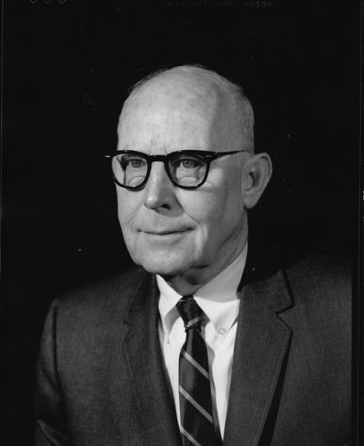

 

# Michael Joseph Copley (1898–1988)

📊 View [[Family Tree]] for visual context.

## Biographical Profile
[[Michael Joseph Copley]] is a central G24 figure connecting the [[Places/Weston West Virginia|Weston]] / [[Places/Lewis County West Virginia|Lewis County]] generation to later scientific and academic branches.

- **Birth:** 16 Sep 1898, on/near the Copley farm in [[Places/Lewis County West Virginia|Lewis County, West Virginia]] (reported in family appendix)
- **Death:** 17 Sep 1988 (his 90th birthday + one day)
- **Burial:** Sunset View Cemetery, El Cerrito, California (with Marion)
- **Parents:** [[John Copley]] and [[Mary Ellen Dolan Copley]]
- **Education (reported):**
  - BS in Chemical Engineering, Catholic University (1922)
  - PhD in Chemistry, University of Illinois (1929)
- **Career/occupation (reported):** research chemist and scientific leader
  - University of Illinois research/faculty period
  - USDA leadership at Eastern Regional Research Laboratory (Wyndmoor)
  - USDA Director role at Western Regional Research Laboratory (Albany)
- **Marriage:** Marion Elizabeth Partlow (married 1933)

## Key Place Links
- [[Places/Lewis County West Virginia|Lewis County, West Virginia]]
- [[Places/Weston West Virginia|Weston, West Virginia]]
- [[Places/Baltimore Maryland|Baltimore, Maryland]] (family migration/labor corridor context)

## Related Topic Pages
- [[Topics/Academic and Scientific Achievement|Academic and Scientific Achievement]]
- [[Topics/1900 Copley Oil Strike|1900 Copley Oil Strike]]

## Family Relationships
- **Parents:** [[John Copley]], [[Mary Ellen Dolan Copley]]
- **Grandparents:** [[Michael Copley Sr|Michael Copley]], [[Ann Copley]]
- **Siblings:**
  - [[Thomas E. Copley]]
  - [[Mary Copley Flesch]]
  - [[Anne Copley (daughter of John Copley)|Anne Copley]]
  - [[Ellen Bernadine Nelle Copley Sardo|Ellen Bernadine "Nelle" Copley Sardo]]
- **Spouse:** Marion Elizabeth Partlow
- **Children (G25):**
  - [[Stephen Michael Copley]]
  - [[Thomas Partlow Copley]]

## Notable Life Events
- Military enlistment briefly during WWI period (reported in family appendix).
- Widely described in family narrative as part of the first major educational/professional leap enabled after the family’s oil-era transition.

## Research Gaps
1. Verify military service document set and unit-level details.
2. Compile full bibliography of scientific publications and appointments.
3. Add primary citations for key career transitions (UIUC → USDA labs).

## Acquisition Strategy
- Pull draft cards/enlistment/discharge records from NARA-linked systems.
- Build publication corpus from library databases and institutional archives.
- Add USDA archival records and oral-history corroboration with confidence labels.

## Sources
1. `/home/ubuntu/Uploads/P1APPENDICES.pdf` (Appendix 1 biographical sketch: Michael J. Copley).
2. `/home/ubuntu/Uploads/COPLEY HISTORY PART 1 final 2.pdf` (family structure and timeline context).
3. `/home/ubuntu/copley_research_findings.md` (career significance summary).
4. [[Family Tree]] (branch and generation cross-links).