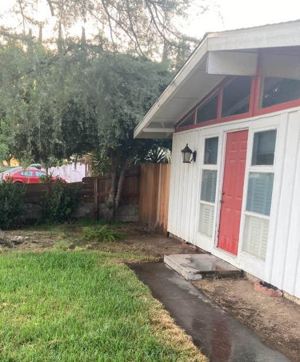

# Paul Copley (b. 1964)

📊 View [[Family Tree]] for visual context.

## Biographical Profile

[[Paul Copley]] is a G26 descendant in the [[Stephen Michael Copley]] line — the fourth of seven children from Stephen's first marriage to [[Marcia Thornton Copley]].

- **Birth:** 1964, Berkeley, California
- **Parents:** [[Stephen Michael Copley]] and [[Marcia Thornton Copley]]
- **Spouse:** Anne Marie Leonhardt (married July 1989)
- **Children (G27):**
  - James Stephen Copley (b. 1991)
  - John William Copley (b. 1994)
  - Georgia Marie Copley Leonhardt (b. 1996)
- **Current location:** Fresno, California (moved 2012; owns a fixer-upper house)
- **Occupation:** Works for Social Vocational Services (SVS)
- **Education:** University of Southern California (USC) — BS, Exercise Science

## Career

- Various early jobs including coach/counselor for incorrigible youths, care provider for developmentally disabled adults
- Teacher, Phineas Banning High School, Wilmington, CA (Los Angeles Unified School District)
- Pre-press image specialist, Office Depot
- Social Vocational Services (SVS) — moved to Fresno in 2012 to work for SVS

## Biographical Narrative

Paul's earliest memories in the appendix come from Madison, Connecticut, where the family lived near a creek and where winter sledding, summer outdoor play, and life with his older siblings shaped his childhood. He later moved with the family to Southern California around 1970, growing up in the Palos Verdes area with sports, surfing, and a large sibling household.

He attended the University of Southern California and earned a Bachelor of Science degree in Exercise Science, helping pay for school with summer jobs in Lake Tahoe. His work history continued the Stephen-line pattern of service-oriented roles: youth coaching and counseling, care work with developmentally disabled adults, teaching in Los Angeles Unified School District, pre-press image work, and later work with Social Vocational Services.

The appendix also presents Paul as practical and hands-on. After moving to Fresno in 2012 for SVS, he bought a fixer-upper house and worked steadily on repairs and improvements, including roofing, tile, plumbing, landscaping, and framing.

## Family Relationships

- **Parents:** [[Stephen Michael Copley]], [[Marcia Thornton Copley]]
- **Siblings (G26):** [[Michael Copley (b. 1959)]], [[Sara Copley Cox]], [[Philip Copley]], [[Peter Copley]], [[Susan Copley]], [[Stephen Joseph Copley]]
- **Half-sister:** [[Amy E. Copley Geist]]

## Sources

1. `~/Downloads/Part 1 Appendices .pdf` — Paul Copley biographical sketch (primary, first-person).
2. [[Family Tree]] — internal branch mapping.
