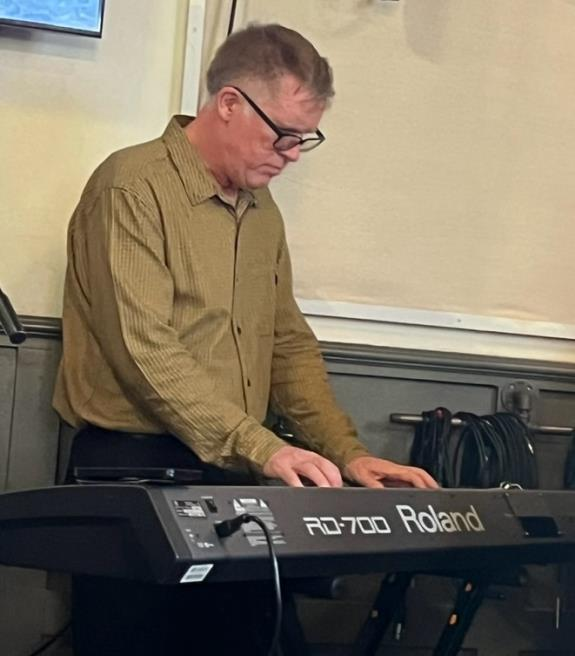

# Peter Copley (b. January 12, 1966)

📊 View [[Family Tree]] for visual context.

## Biographical Profile

[[Peter Copley]] is a G26 descendant in the [[Stephen Michael Copley]] line — the fifth of seven children from Stephen's first marriage to [[Marcia Thornton Copley]].

- **Birth:** January 12, 1966, New Haven, Connecticut (born while father worked at Pratt & Whitney in [[Places/Madison Connecticut|Madison, CT]])
- **Parents:** [[Stephen Michael Copley]] and [[Marcia Thornton Copley]]
- **First marriage:** Zhenia (divorced by 1998)
- **Second marriage:** Karen VanderMolen RN (first date August 2001; bought house together in Fillmore, CA, 2009; married 2012)
- **Current location:** Fillmore, California

## Education

- Valmonte Elementary; Malaga Cove Intermediate; Palos Verdes High School
- USC (undergraduate, 1984–1989) — Economics major; Dean's List first semester
- DeVry University — IT training (early 2000s)
- Also studied Spanish at summer program in Mexico (1986)

## Career

- USC University Bookstore; Troll store; Young American's song-and-dance review (performer)
- Social Vocational Services (SVS) — certified Self-Insurance Examiner for Workers' Compensation (1992–~1998)
- Travelers Insurance Company
- Software developer / business and data analyst (second career, ~2000s–present)
- Musician (collaborated with friend Evan Avery; brother Philip; band called ESP in junior high)

## Biographical Narrative

Peter was born in New Haven while the family lived in [[Places/Madison Connecticut|Madison, Connecticut]], and moved to [[Places/Palos Verdes Estates California|Palos Verdes Estates]] at age four when his father joined USC. His appendix sketch presents the Palos Verdes years as a mix of school, music, soccer, family activity, and academic gatherings hosted by his parents.

Like his brother [[Philip Copley]], Peter belongs to the younger half of Stephen and Marcia's first-marriage household: the set of children born after the early Berkeley / graduate-school years and during the more settled Madison / Pratt & Whitney stage. That context matters because his childhood appears less in the appendix as institutional achievement and more as family life in motion: church, schools, music, sports, performance, and the California household culture that formed after the move west in 1970.

Music is one of the strongest through-lines in Peter's biography. He took piano lessons, sang in school, formed the junior-high band ESP with Evan Avery and his brother [[Philip Copley]], and later worked with Philip on a holiday recording project. The appendix also describes a family band project supported by [[Stephen Michael Copley|his father]] and a memorable roller-rink performance in Palos Verdes.

The Stephen sketch gives his California setting additional texture even when it is not Peter-specific. Palos Verdes is remembered as the era of patio barbecues, beach life, Disneyland trips, coaching, and Sierra camping trips. That background helps explain why Peter's page reads as especially rooted in performance, collaboration, and household culture rather than in one linear academic or corporate trajectory.

After USC, Peter moved through bookstore, performance, insurance, and SVS work before retraining for information technology at DeVry. That retraining led into a second career as a software developer, business analyst, and data analyst. In branch terms, he sits at an interesting midpoint: close enough to the first USC-generation sibling cohort to share its common California upbringing, but with enough career change and reinvention to show how flexible the Stephen-line descendants became in adulthood. He and Karen VanderMolen bought a home in Fillmore, California, in 2009 and married in 2012.

## Family Relationships

- **Parents:** [[Stephen Michael Copley]], [[Marcia Thornton Copley]]
- **Siblings (G26):** [[Michael Copley (b. 1959)]], [[Sara Copley Cox]], [[Philip Copley]], [[Paul Copley]], [[Susan Copley]], [[Stephen Joseph Copley]]
- **Half-sister:** [[Amy E. Copley Geist]]
- **First spouse:** Zhenia (divorced ~1998)
- **Second spouse:** Karen VanderMolen RN (married 2012)

## Sources

1. `~/Downloads/Part 1 Appendices .pdf` — Peter Copley biographical sketch (primary, first-person).
2. [[Family Tree]] — internal branch mapping.
