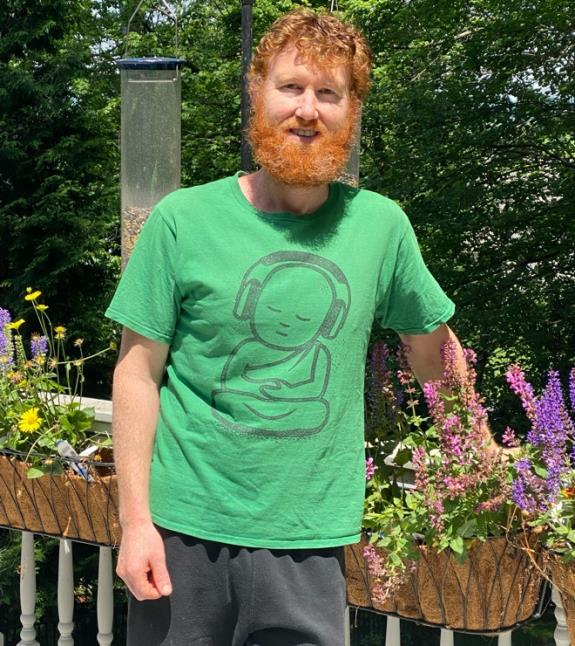

# Robert "Bobby" Anthony Cox (b. October 3, 1988)

📊 View [[Family Tree]] for visual context.

## Biographical Profile

[[Robert Cox|Robert "Bobby" Anthony Cox]] is a G27 descendant in the [[Stephen Michael Copley]] line — the son of [[Sara Copley Cox]] and Robert (Bob) Austin Cox.

- **Full name:** Robert Anthony Cox
- **Birth:** October 3, 1988, Sacramento, California
- **Parents:** [[Sara Copley Cox]] and Robert (Bob) Austin Cox
- **Current location:** Granite Bay, California (lives in his mother's house; Sara is now itinerant for work)
- **Occupation:** Owner, landscaping business
- **Partner:** Nicole Brune (dating since July 2022)

## Biography

Bobby was born in Sacramento, California, shortly after his parents moved from Southern California to the Sacramento area. His earliest childhood was in Rancho Cordova, with family routines split between home, school, and visits with relatives. After his parents divorced in 1996, he divided time between his mother in Granite Bay and his father and stepmother in Rancho Cordova.

The appendix biography is unusually candid about childhood transitions, school changes, and the difficulty of finding his footing socially. For the public page, those details are summarized at a high level: he eventually built enduring friendships, developed confidence through weight training, and found a practical path through work rather than a single linear academic route.

After high school he worked various jobs, including Ace Hardware, Cost Plus World Market, Farmer's Rice Co., and landscaping. Landscaping work eventually led him to build his own business, supported by coursework and interests that included horticulture and environmental issues. He is described in the family history as grateful to his family and committed to a mindful, purposeful lifestyle.

- **Father:** Robert Austin Cox (hails from Torrance, CA; advertising career)
- **Stepmother:** Diana (originally from Brea, CA; married Bob 1998; died October 2019)

## Family Relationships

- **Parents:** [[Sara Copley Cox]], Robert Austin Cox
- **Maternal grandparents:** [[Stephen Michael Copley]], [[Marcia Thornton Copley]]
- **Maternal great-grandparents:** [[Michael Joseph Copley]], [[Marion Elizabeth Partlow]]

## Sources

1. `~/Downloads/Part 1 Appendices .pdf` — Robert Cox biographical sketch (primary, first-person) and Sara Cox biographical sketch.
