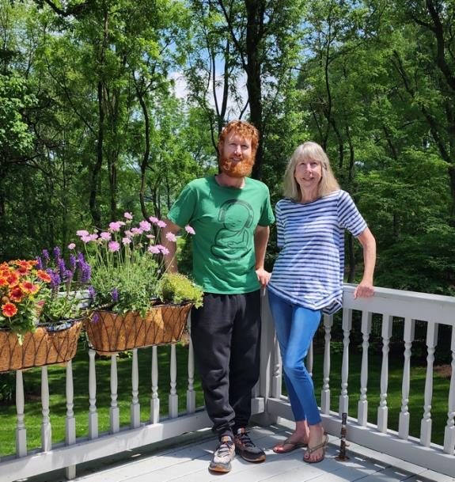

# Sara Marie Copley Cox (b. February 3, 1961)

📊 View [[Family Tree]] for visual context.

## Biographical Profile

[[Sara Copley Cox|Sara Marie Cox (née Copley)]] is a G26 descendant in the [[Stephen Michael Copley]] line — the second of seven children from his first marriage to [[Marcia Thornton Copley]].

- **Full name:** Sara Marie Cox (née Copley)
- **Birth:** February 3, 1961, Alta Bates Hospital, Berkeley, California
- **Parents:** [[Stephen Michael Copley]] and [[Marcia Thornton Copley]]
- **First marriage:** Robert (Bob) Austin Cox, 1986 (divorced 1996)
- **Current location:** Granite Bay, California (house purchased 1999); works as itinerant for SVS
- **Occupation:** Itinerant Executive Assistant, Social Vocational Services (SVS)
- **Child (G27):** [[Robert Cox|Robert "Bobby" Anthony Cox]] (b. October 3, 1988)

## Education

- Valmonte Elementary School; Malaga Cove Intermediate School; Palos Verdes High School (graduated 1979)
- Willamette College, Salem, Oregon (2 years)
- University of Southern California (USC) — majored in Social Psychology; did not graduate

## Career

- Social Vocational Services (SVS) — accounts payable, various roles (first job with the company her stepfather Ed Dawson founded)
- Verizon Wireless — General Ledger Accounting → Reporting Analyst → Data Analytics Consultant (November 1, 1989 – December 31, 2018; recognized twice as Service Legend)
- Retired from Verizon with generous exit package (September 2018)
- 2019–present: Itinerant Executive Assistant to the Executive Director and Associate Executive Director of SVS, traveling between offices in Palos Verdes, Pasadena, Fresno, and Berkeley

## Biographical Narrative

Sara's appendix sketch traces a childhood across Berkeley, Madison, and Palos Verdes. She remembers University Village in Berkeley, then Madison, Connecticut, where the family lived first on Wild Wood Avenue and then on Neck Road near Long Island Sound. In 1970 the family moved back to California, first to Lomita and then to Palos Verdes Estates, where Sara attended Valmonte Elementary, Malaga Cove Intermediate, and Palos Verdes High School.

Her college path began at Willamette College in Oregon and continued at USC, where she shifted from political science toward social psychology. She later moved into practical administrative and analytical work: first at Social Vocational Services, then in a long Verizon Wireless career that ran from 1989 through 2018 and included accounting, reporting, and data analytics roles.

After leaving Verizon, Sara returned to SVS in an itinerant executive-assistant role, traveling among divisional offices and supporting the organization's leadership. Her page now treats the appendix as a first-person family source while keeping current living-person detail at a public-facing level.

## Family Relationships

- **Parents:** [[Stephen Michael Copley]], [[Marcia Thornton Copley]]
- **Siblings (G26):** [[Michael Copley (b. 1959)]], [[Philip Copley]], [[Paul Copley]], [[Peter Copley]], [[Susan Copley]], [[Stephen Joseph Copley]]
- **Half-sister:** [[Amy E. Copley Geist]]
- **First spouse:** Robert (Bob) Austin Cox (married 1986, divorced 1996)
- **Child (G27):** [[Robert Cox|Robert "Bobby" Anthony Cox]] (b. October 3, 1988, Sacramento, CA)
- **Stepmother:** [[Judith Ann Todd Copley]] (father remarried 1984)
- **Mother remarried:** Ed Dawson (founder of SVS)

## Residences

- University Village, Berkeley CA (early childhood)
- Madison, CT — Wild Wood Ave (rented), then Neck Road (1964–1970)
- Lomita, CA (6 months); 4029 Via Nivel, Palos Verdes Estates, CA (1970–1979)
- Salem, OR; Southern California; Trabuco Canyon, CA; Rancho Cordova, CA; Roseville, CA
- Granite Bay, CA (1999–present)

## Sources

1. `~/Downloads/Part 1 Appendices .pdf` — Sara Cox biographical sketch (primary, first-person).
2. [[Family Tree]] — internal branch mapping.
