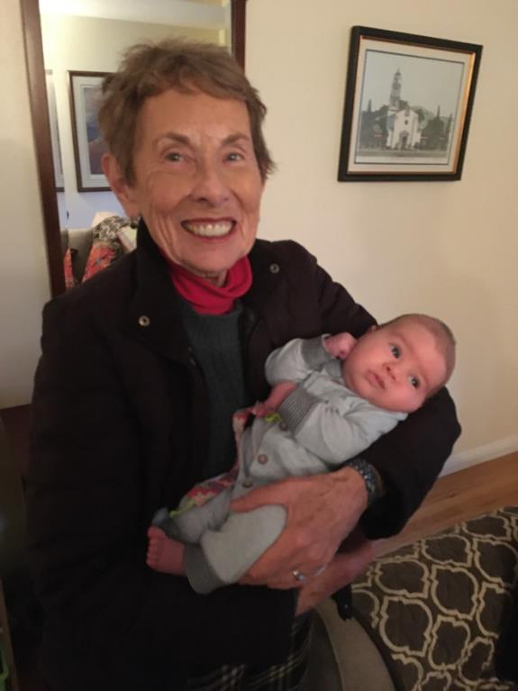

# Sarah Ellen Sardo Arena (b. 19 Dec 1933)

📊 View [[Family Tree]] for visual context.

## Biographical Profile
[[Sarah Ellen Sardo Arena]] is a G25 descendant in the [[Ellen Bernadine Nelle Copley Sardo|Ellen Bernadine "Nelle" Copley Sardo]] branch.

- **Birth:** 19 Dec 1933, St. Joseph's Hospital, Baltimore, Maryland
- **Parents:** [[Ellen Bernadine Nelle Copley Sardo|Ellen Bernadine "Nelle" Copley Sardo]] and Robert Samuel Sardo
- **Education:** Notre Dame College, BA in Sociology; Montessori teaching certificate; graduate study in instructional technology at San Jose State University; master's training at the Franciscan School of Theology / Graduate Theological Union
- **Career/occupation:** Catholic Charities social worker; Montessori teacher; hospital chaplain
- **Marriage:** Matthew Paul Arena (reported marriage: Nov 1956)
- **Children:** Cathy, Ann Marie, Jim, Matt Jr., and John Arena

## Biographical Narrative

Sarah was born in Baltimore but spent her earliest years in rural [[Places/Clarksville Maryland|Clarksville, Maryland]], where her father Robert Samuel Sardo practiced medicine and the family lived across from St. Louis Catholic Church. During World War II, Robert served in the Army Air Corps and Nelle moved with Sarah and her sister [[Mary Carmella Sardo Ruland|Carmella]] to Baltimore. The appendix biography presents Catholic school, family resilience, and Nelle's example as central influences in Sarah's childhood.

The sketch adds useful texture to those early years. Sarah remembered Depression-era rural life in Clarksville, including patients paying her father in chickens and eggs, walking with Carmella to Notre Dame school, time at camp in Vermont, and later summers at the family cottage in Sherwood Forest. It also frames Robert's return from wartime service in 1945 as a major transition: Sarah later said she was in some ways getting to know her father for the first time at age eleven.

Education and faith run through Sarah's adult biography. She attended Notre Dame College, earned a sociology degree, and worked for Catholic Charities before marrying Matthew Paul Arena in November 1956. The appendix traces the relationship back to a Johns Hopkins mixer in Sarah's first week of college in 1950. Sarah and Matt raised five children through moves from Maryland to Virginia Beach, Wilmington, and eventually the San Francisco Bay Area. Catholic parish life and Catholic education remained major anchors for the family in each community.

After her child-rearing years, Sarah restarted her professional life in education and pastoral care. The appendix portrays this as a second-career sequence driven by lifelong learning rather than a single job shift: she earned a Montessori teaching certificate near Philadelphia, taught at Ursuline Academy, carried that training to California after the 1984 Bay Area move, then completed graduate work in instructional technology at San Jose State before deciding that chaplaincy fit her gifts more closely. She then pursued theological training through the Franciscan School of Theology / Graduate Theological Union in Berkeley. Her chaplaincy work included St. Mary's Hospital in San Francisco, Alta Bates Hospital in Oakland, and John Muir Medical Center in Walnut Creek, where Matt also served as a Eucharistic minister.

The family-authored sketch emphasizes Sarah's lifelong physical activity, love of cycling and walking, advocacy for her children, and vocation for listening to patients and families in vulnerable moments. It also repeatedly returns to her role as a moral center inside the branch household: encouraging her children to speak up, defending them when needed, and later sustaining family prayer life. For public use, this page keeps the biography at a high level and avoids private medical detail.

## Family Relationships
- **Parents (G24):** [[Ellen Bernadine Nelle Copley Sardo|Ellen Bernadine "Nelle" Copley Sardo]], Robert Samuel Sardo
- **Grandparents:** [[John Copley]], [[Mary Ellen Dolan Copley]]
- **Great-grandparents (branch root):** [[Michael Copley Sr|Michael Copley]], [[Ann Copley]]
- **Sibling:** [[Mary Carmella Sardo Ruland]]
- **Spouse:** Matthew Paul Arena
- **Children (G26):**
  - [[Cathy Arena]]
  - [[Ann Marie Arena]]
  - [[Jim Arena]]
  - [[Matt Jr. Arena]]
  - [[John Arena]]

## Notable Context
- Serves as a bridge from the nursing/medical Sardo household into the Arena descendant network documented in family appendices and the family-tree branch summary.
- Carries forward several major Sardo-branch themes: Catholic education, medical service, social work, hospital ministry, and cross-country family relocation.

## Research Gaps
1. Verify education and chaplaincy milestones with school, parish, or hospital records where appropriate.
2. Marriage record and location documentation.
3. Consolidated child-by-child documentary citations (vital records, directories, obituaries where appropriate).

## Acquisition Strategy
- Search church/county marriage registers for Sarah Sardo + Matthew Arena (mid-1950s).
- Build timeline via census substitutes, newspaper notices, and local directories.
- Collect branch oral-history interviews and label clearly as family testimony until externally verified.

## Social Media & Online Presence
- No high-confidence public profile identified in prior social-media research.

## Sources
1. `~/Downloads/Part 1 Appendices .pdf` — Sarah Ellen Sardo biographical sketch, pp. 25-27, family-authored appendix source.
2. [[Family Tree]] — birth date, spouse, children, generation mapping.
3. [[References/copley_social_media_profiles|copley_social_media_profiles.md]] — prior public-profile search result.
