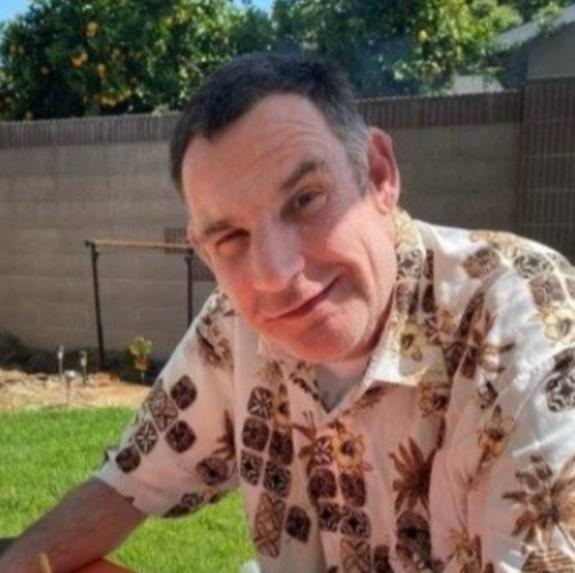

# Stephen Joseph Copley (1970–2023)

📊 View [[Family Tree]] for visual context.

## Biographical Profile

[[Stephen Joseph Copley]] was born **May 1, 1970** at Yale-New Haven Hospital, New Haven, Connecticut — the seventh and youngest child of [[Stephen Michael Copley]] and [[Marcia Thornton Copley]]. Shortly after his birth, the family relocated to Southern California when his father accepted a position at USC.

He was diagnosed early in life with autism and significant developmental disabilities. As he grew older, he needed substantial daily support, was nonverbal, and could wander away if not closely supervised. His care profoundly shaped the entire Copley family and directly influenced the careers and life paths of several relatives.

- **Birth:** May 1, 1970, Yale-New Haven Hospital, New Haven, Connecticut
- **Death:** June 10, 2023 (in his sleep, age 53)
- **Burial:** San Juan Bautista, CA, August 8, 2023
- **Care context:** Harbor Regional Center client; weekday care at the Intercommunity Exceptional Children's Home, Long Beach, CA; returned home on weekends during childhood
- **Later care:** Became a full-time client / ward of the State of California after his parents divorced in 1983

## Biographical Narrative

Stephen Joseph's appendix biography was written by his father, [[Stephen Michael Copley]]. It presents his life as both a personal family story and part of the broader history of developmental-disability services in California after the Frank Lanterman Developmental Disabilities Act of 1969.

The family first cared for Stephen at home in Palos Verdes Estates. As his support needs grew, Harbor Regional Center placed him during the week at the Intercommunity Exceptional Children's Home in Long Beach, with weekend visits home. His needs placed real strain on the family, but also led several relatives into lifelong work or service connected to disability care, including [[Marcia Thornton Copley|Marcia]]'s later Harbor Regional Center work and the family's connections with Social Vocational Services.

Stephen died in his sleep on June 10, 2023. He was buried at San Juan Bautista, California, on August 8, 2023. A Celebration of Life ceremony was held September 7, 2023, at Skylinks Golf Course in Long Beach, attended by caregivers, friends from SVS, and family members in California and by Zoom.

> *"Stephen taught us all a new meaning of love. Through Stephen, we met other young children, individuals with disabilities and their parents, who otherwise we never would have known."* — Stephen Michael Copley

## Family Relationships

- **Parents:** [[Stephen Michael Copley]], [[Marcia Thornton Copley]]
- **Siblings (G26):** [[Michael Copley (b. 1959)]], [[Sara Copley Cox]], [[Philip Copley]], [[Paul Copley]], [[Peter Copley]], [[Susan Copley]]
- **Half-sister:** [[Amy E. Copley Geist]]
- Spouse: none; children: none

## Sources

1. `~/Downloads/Part 1 Appendices .pdf` — Stephen Joseph Copley section, written by his father Stephen Michael Copley.
2. [[Family Tree]] — internal branch mapping.
