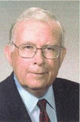

# Stephen Michael Copley (b. April 29, 1936)

📊 View [[Family Tree]] for visual context.

## Biographical Profile

[[Stephen Michael Copley]] is a G25 descendant in the [[Michael Joseph Copley]] branch. He is the father of eight children across two marriages and had a distinguished career spanning materials science research, university teaching, and academic administration.

- **Birth:** April 29, 1936, Champaign, Illinois (his father was a professor at UIUC at the time)
- **Parents:** [[Michael Joseph Copley]] and [[Marion Elizabeth Partlow]]
- **First marriage:** Marcia Thornton (married at UC Berkeley; divorced 1983)
- **Second marriage:** [[Judith Ann Todd Copley|Judith Ann Todd]] ("Judy"), 1984 (from Wakefield, Yorkshire, England; PhD, Cambridge University; 14 years younger)
- **Current residence:** State College, Pennsylvania area

## Education

- Chestnut Hill Academy (private school, Wyndmoor, PA; elementary years)
- Oxford Elementary (Berkeley, CA)
- Garfield Junior High; Berkeley High School (President of Honor Society; hosted Saturday morning radio program *"Berkeley Highlights"* senior year)
- UC Berkeley: General Curriculum → Physics major
- **PhD**, Materials Science — UC Berkeley, 1964 (advisor: Professor Joseph Pask; post-doctoral associate Charlie Hulse also influential)

## Career Timeline

| Period | Role | Institution | Location |
|--------|------|-------------|----------|
| 1964–1970 | Research Scientist → Supervisor, Alloy & Materials Research | Pratt & Whitney Aircraft (AMRDL) | Madison, Connecticut |
| 1970–1983 | Associate Professor → Full Professor (1976); Chair, Materials Science (two 3-yr terms) | University of Southern California (USC) | Los Angeles / Palos Verdes Estates, CA |
| 1990–1996 | Dean, Armour College of Engineering & Science; Vice Provost (1991) | Illinois Institute of Technology (IIT) | Hinsdale / Chicago, IL |
| 1996–1999 | President & CEO | STE, Inc. → The Packer Group | Chicago area |
| 2002–2018 | Member of Research Staff; Senior Scientist, Applied Research Laboratory (ARL) | Penn State University (PSU) | State College, PA |

Also served as President and Chair of the Board of ASM International (ASMI); received the George Roberts Award from ASMI.

## Family Relationships

- **Parents:** [[Michael Joseph Copley]], [[Marion Elizabeth Partlow]]
- **Grandparents:** [[John Copley]], [[Mary Ellen Dolan Copley]]
- **Sibling:** [[Thomas Partlow Copley]]
- **First spouse:** [[Marcia Thornton Copley]] (divorced 1983; later married Ed Dawson)
- **Second spouse:** [[Judith Ann Todd Copley]] (married 1984)
- **Children with Marcia (G26):**
  - [[Michael Copley (b. 1959)]] (b. 1959)
  - [[Sara Copley Cox]] (Sara Marie, b. Feb 3, 1961, Alta Bates Hospital, Berkeley)
  - [[Philip Copley]] (b. 1962)
  - [[Paul Copley]] (b. 1964, Berkeley)
  - [[Peter Copley]] (b. Jan 12, 1966, New Haven, CT)
  - [[Susan Copley]] (b. 1967, Madison, CT)
  - [[Stephen Joseph Copley]] (b. May 1, 1970, Yale-New Haven Hospital; d. June 10, 2023)
- **Child with Judy (G26):**
  - [[Amy E. Copley Geist]] (Amy Elizabeth, b. Jul 11, 1990, Hinsdale, IL)

## Residences

- Champaign, IL (birth–1939)
- Wyndmoor, PA — suburb of Philadelphia (1939–1947)
- Berkeley, CA (1947–1964; family home on "the Arlington")
- Madison, CT — Neck Road, house on Long Island Sound (1964–1970)
- Lomita, CA (rented 6 months, 1970)
- 4029 Via Nivel, Palos Verdes Estates, CA (1970–1990)
- Hinsdale, IL — house with 100-year-old log cabin on property (1990–2002)
- State College, PA (2002–present)

## Related Topic Pages

- [[Topics/Academic and Scientific Achievement|Academic and Scientific Achievement]]
- [[Topics/1900 Copley Oil Strike|1900 Copley Oil Strike]]

## Sources

1. `~/Downloads/Part 1 Appendices .pdf` — Stephen Copley biographical sketch (primary, first-person) and Stephen Joseph Copley section.
2. `~/Downloads/COPLEY HISTORY PART 1 final 2.pdf` — family structure and generation context.
3. [[Family Tree]] — internal branch mapping.
