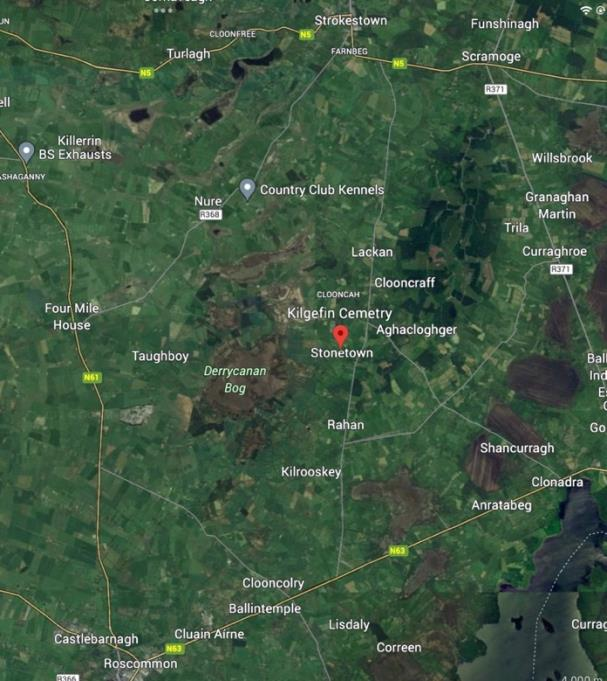
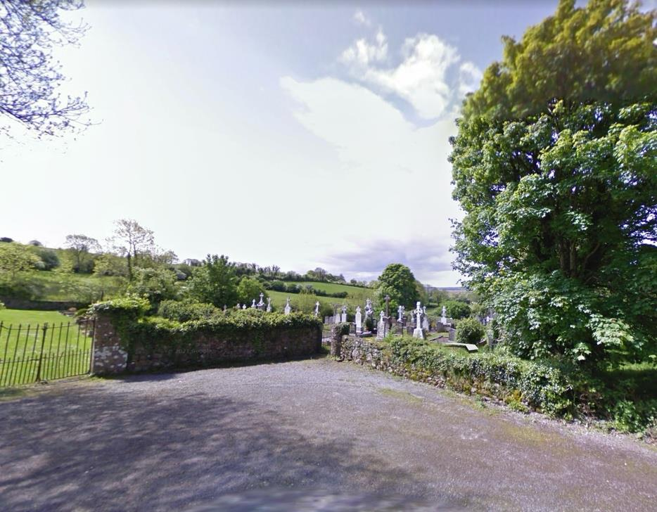
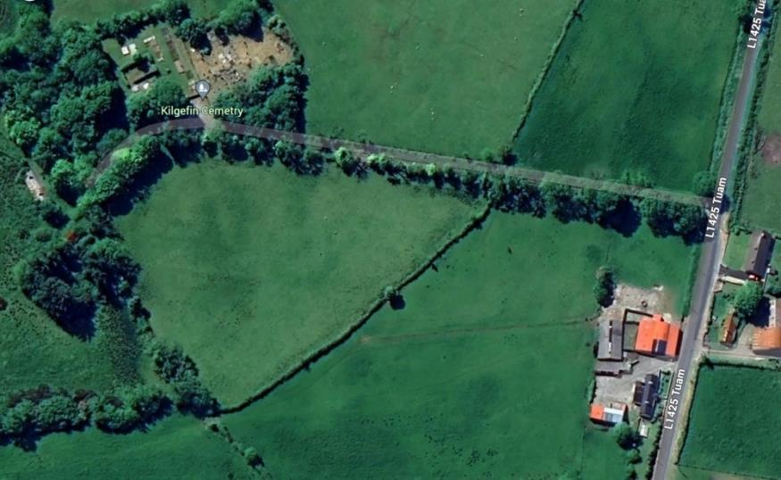

# Kilgefin, Ireland

## Geographic Information
- 🗺️ **Google Maps:** [View on Google Maps](https://www.google.com/maps/search/?api=1&query=Kilgefin+Ireland)
- **Approx. coordinates:** 53.73, -8.17 *(parish-level approximation)*
- **Current administration:** County Roscommon, Connacht, Republic of Ireland.
- **Historical names/boundaries:** Kilgefin/Kilgeffan spellings appear in older ecclesiastical records.

## Historical Context (1800s-1900s)
Kilgefin sat in a rural tenant-farming economy shaped by tithe pressure, insecure tenure, and heavy emigration. In this period, Roscommon families often left through chain migration before and after the Famine.

- **Economy:** subsistence agriculture and tenancy.
- **Migration pattern:** high out-migration to U.S. labor corridors.
- **Record challenge:** fragmented Catholic registers.
- **Regional setting:** the family-history narrative places County Roscommon east of Lough Ree and the River Shannon within the older Kingdom of Connacht.
- **Nearby reference point:** the same narrative situates Kilgefin between Roscommon town and Strokestown, the latter now associated with Ireland's Famine Museum.

## Figure-Backed Local Detail
- Family-history figures place Kilgefin Cemetery off the `L1425 Tuam` approach road.
- A later aerial/cemetery view in the same PDF is described as possible evidence that an earlier parish church may once have stood at or near the cemetery site.
- These figure captions do not prove the Copley family's exact townland, but they do give a more concrete sense of the local landscape behind the Kilgefin-origin claim.

## Figure Provenance
- `COPLEY HISTORY PART 1 final 2.pdf`, **page 5, Fig. 2**: Ireland overview used to situate Roscommon within the larger island setting.
- `COPLEY HISTORY PART 1 final 2.pdf`, **page 6, Fig. 3**: County Roscommon map used for the Roscommon-town / Strokestown / Kilgefin placement language.
- `COPLEY HISTORY PART 1 final 2.pdf`, **page 6, Fig. 4** and **page 7, Fig. 5**: cemetery access and cemetery-view figures that support the `L1425 Tuam` approach-road note and the caution about a possible earlier parish-church site.

The three images shown on this page are drawn from that Kilgefin figure cluster. They should be treated as orientation and locality evidence, not as proof by themselves that the Copley family occupied a specific grave plot or townland there.

## Copley Family Connection
- Reported birthplace of [[Michael Copley Sr]] (1813).
- Sibling-origin context for [[Patrick Copley]], [[Bridget Copley Reynolds]], [[Catherine Kitty Copley Hannon]], [[William Copley]].
- Foundation point of the immigrant branch later established in West Virginia.

## Research Resources
- National Library of Ireland registers: <https://registers.nli.ie>
- Roscommon Tithe Applotment Books: <https://titheapplotmentbooks.nationalarchives.ie/pagestab/Roscommon/>
- Griffith’s Valuation: <https://www.askaboutireland.ie/griffith-valuation/>
- Strokestown Park / estate-paper pathways for tenant lists.

### Acquisition Strategy
1. Run surname-variant parish sweeps (Copley/Copely/Copeley).
2. Correlate tithe + valuation data with sibling-age hypotheses.
3. Add local-archivist or professional genealogist lookups for parish gaps.

## Source Notes
- [[References/Copley History Part 1 and Appendix Source Audit|Copley History Part 1 and Appendix Source Audit]]
- Raw family-history source: `COPLEY HISTORY PART 1 final 2.pdf`, pp. 4-7, figs. 1-5
