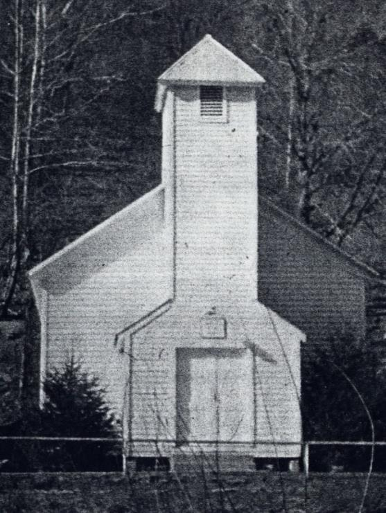

# Lewis County, West Virginia

## Geographic Information
- 🗺️ **Google Maps:** [View on Google Maps](https://www.google.com/maps/search/?api=1&query=Lewis+County+West+Virginia)
- **Approx. center coordinates:** 38.99, -80.45
- **Current administration:** Lewis County, West Virginia, USA.
- **Historical names/boundaries:** part of Virginia until 1863; county formed in 1816 from Harrison County.

## Historical Context (1800s-1900s)
Lewis County combined frontier agriculture with later oil-era economic shifts. It became the Copley family’s core settlement zone after immigration and labor-corridor movement.

- **Economy:** farming, timber, and later oil impacts.
- **Institutional relevance:** courthouse records in Weston are central to this family’s evidence trail.
- **Migration significance:** transition from labor mobility to land tenure.
- **Settlement texture:** the family-history narrative adds a more specific local landscape of farm tracts, village growth, school and church sites, and the [[Places/Loveberry Ridge West Virginia|Loveberry Ridge]] Catholic corridor near Weston.

## Built Landscape in the Family Narrative
- The county-level story in `COPLEY HISTORY PART 1 final 2.pdf` is not only about land ownership; it also describes a village of Copley forming around the family farm after the oil strike.
- That same source links Lewis County family life to a grammar school site, an Evangelical United Brethren church, and St. Bernard's Catholic Church on nearby [[Places/Loveberry Ridge West Virginia|Loveberry Ridge]].
- These details are useful for public understanding because they show how the family's Lewis County history connects farms, roads, churches, schools, and oil development rather than existing only as disconnected deed entries.

## Figure Provenance
The county-level built-landscape claims on this page are grounded mainly in the late Part 1 figure cluster rather than in the lead image shown here.

- `COPLEY HISTORY PART 1 final 2.pdf`, **pages 18-21, Figs. 16-21**: supports the statements about the Copley oil well, historical marker, village of Copley, grammar school, EUB church, and St. Bernard's Catholic Church on [[Places/Loveberry Ridge West Virginia|Loveberry Ridge]].
- `COPLEY HISTORY PART 1 final 2.pdf`, **pages 10-12, Figs. 8-9**: supports the earlier land-tenure frame behind the county's Copley settlement geography.

The white church image at the top of this page should be read as a representative Lewis County illustration, not as a claim that it is itself one of the Part 1 figures.

## Copley Family Connection
- Long-term residence for [[Michael Copley Sr]] and [[Ann Copley]].
- 1843 land transaction with [[Weeden Hoffman]] anchors settlement chronology.
- Multigenerational continuity through [[John Copley]] and descendants.
- Central to [[Topics/1900 Copley Oil Strike|1900 Copley Oil Strike]] context.
- Core destination in [[Topics/Irish Immigration to West Virginia|Irish Immigration to West Virginia]].

## Related Topic Pages
- [[Topics/1900 Copley Oil Strike|1900 Copley Oil Strike]]
- [[Topics/Irish Immigration to West Virginia|Irish Immigration to West Virginia]]
- [[Topics/Genealogical Research Methods|Genealogical Research Methods]]

## Research Resources
- Lewis County Clerk (Weston): deeds, probate, marriage records.
- FamilySearch county guide: <https://www.familysearch.org/en/wiki/Lewis_County,_West_Virginia_Genealogy>
- WV Archives and History / Vital Records indexes.
- County historical societies and local map collections.

### Acquisition Strategy
1. Reconstruct full deed chain from 1843 forward.
2. Pull probate packets for 1897/1909/1925 milestones.
3. Join land records to census/tax rolls for household continuity.

## Source Notes
- [[References/Copley History Part 1 and Appendix Source Audit|Copley History Part 1 and Appendix Source Audit]]
- Raw family-history source: `COPLEY HISTORY PART 1 final 2.pdf`, pp. 10-12 and 18-21
