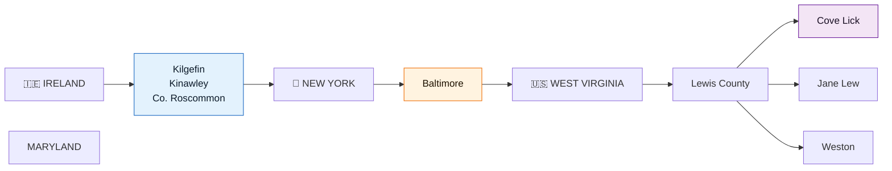

# Places Index

Use this directory for geographic context, archive planning, and cross-linking with person profiles.

## Geographic Overview: The Migration Path

## Ireland
- [[Places/Kilgefin Ireland|Kilgefin, Ireland]]
- [[Places/Kinawley Ireland|Kinawley, Ireland]]
- [[Places/County Roscommon Ireland|County Roscommon, Ireland]]

## West Virginia
- [[Places/Lewis County West Virginia|Lewis County, West Virginia]]
- [[Places/Weston West Virginia|Weston, West Virginia]]
- [[Places/Jane Lew West Virginia|Jane Lew, West Virginia]]
- [[Places/Cove Lick West Virginia|Cove Lick (Copley Road area), West Virginia]]

## Maryland
- [[Places/Baltimore Maryland|Baltimore, Maryland]]

## Suggested Use Pattern
1. Start with county-level page (Roscommon or Lewis County).
2. Narrow to parish/town page for precise record targeting.
3. Follow linked [[People Directory]] and individual person pages for event-level evidence.

See also: [[Home]], [[Topics and Themes]], [[Family Tree]], [[Bibliography and Acquisition Guide]]