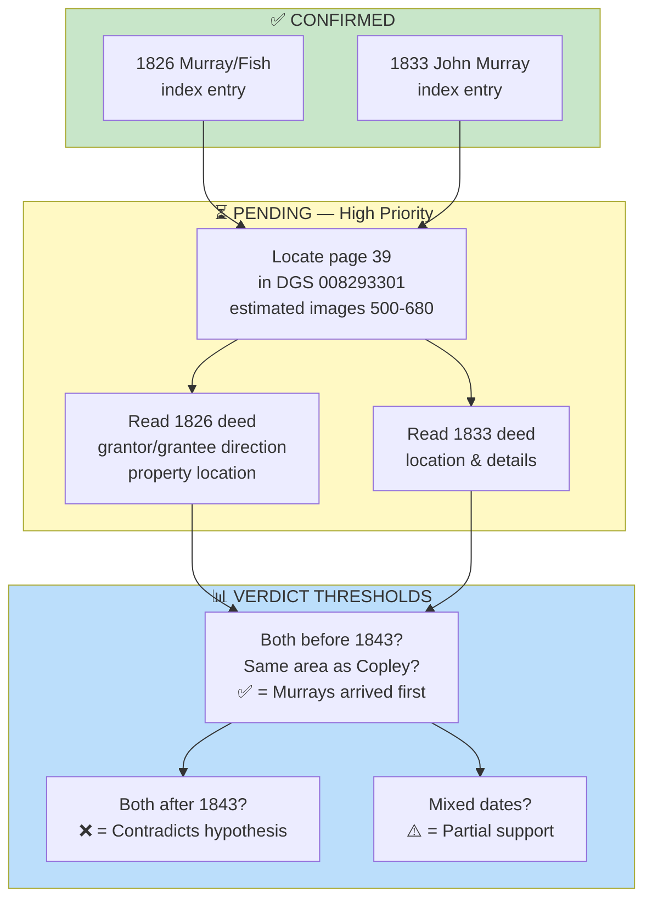

# RQ-M1 Research: Lewis County Deed Records (1825–1855)

**Research Question:** Did the Murray family purchase land in the Cove Lick / Camden / Loveberry area of Lewis County, WV **before 1843**?

**Why This Matters:** If Murrays purchased land prior to the 1843 Copley/Hoffman deed, it would establish that the Murray family **arrived first** and anchored the settlement — supporting Tom Copley's hypothesis that they initiated the chain migration.

**Research Status:** ✅ Index entries located; ⏳ Actual deed texts pending

---

## What Has Been Confirmed (April 24, 2026)

### Murray Index Entry #1 — 1826

| Field | Value |
|---|---|
| **Grantor/Grantee** | Murray John → Fred L. Fish |
| **Date** | 1826 |
| **Deed Page** | Page 39 (early Lewis County deed book) |
| **FamilySearch DGS** | 008293302 (Lewis. Deed Books 1899–1900, Image 17) |
| **FamilySearch ARK** | `/ark:/61903/1:1:6X4N-WJ51` |
| **Status** | ✅ Index entry confirmed |
| **Deed Text** | ❌ Not yet located |

### Murray Index Entry #2 — 1833

| Field | Value |
|---|---|
| **Name** | John Murray |
| **Date** | 1833 |
| **FamilySearch DGS** | 008293302 (Lewis. Deed Books 1899–1900, Image 24) |
| **Status** | ✅ Index entry confirmed |
| **Deed Text** | ❌ Not yet located |

---

## FamilySearch Collections Mapped

### Collection A: DGS 008293302 (Lewis. Deed Books 1899–1900)

- **271 total images**
- **Images 5–27:** Master deed index (alphabetical by grantor surname) — this is where the Murray entries were found
- **Images 27+:** Actual deeds from Deed Book 40 (1899–1900 era)
- **Direct URL:** `https://www.familysearch.org/ark:/61903/3:1:3Q9M-CSR7-7Q8K-W?view=index&cc=3158864`

**Note:** The index entries show Murray as grantor (seller), but whether he is selling land he purchased earlier, or just transacting, requires deed text to clarify.

### Collection B: DGS 008293301 (Lewis. Deed Books 1808–1902)

- **680 total images**
- **Critical discovery:** Collection is organized **reverse chronologically** — newest deed books first
- **Implication:** Early deed books (1808–1830s, containing "page 39" reference) are likely **toward the end of the 680-image collection** (possibly images 500–680)
- **Page-to-image offset:** Varies by section. In the 1899–1900 section, offset was approximately +2 (image 35 = page 33). The offset will be different for early deed books.
- **Direct URL:** `https://www.familysearch.org/ark:/61903/3:1:3Q9M-CSR7-7Q8D-3?view=index&cc=3158864`

---

## Navigation Strategy for Next Researcher

To locate the 1826 Murray deed at "page 39":

1. **Open DGS 008293301** (680-image collection)
2. **Jump to image 600** using the image number input box
3. **Check "Names on Page" in the left sidebar** — if page numbers shown are low (under 100), you are in early deed territory
4. **Adjust image number** forward or backward to narrow down where page 39 appears
5. **Once near page 39**, zoom in on the deed text and record:
   - Full names (grantor and grantee)
   - Property description (acreage, location, metes and bounds, neighbor names)
   - Geographic area (Cove Lick / Camden / Loveberry?)
   - Consideration (price paid)
   - Recorded vs. instrument date
   - Witness names
   - Clerk/justice name

---

## Required Data Format for Each Deed Found

```
DEED RECORD #[number]:
- Person Name: [full name]
- Date: [year]
- Property Location: [townland/area]
- Acreage/Details: [size, description]
- Transaction Type: [Bought/Sold/Leased]
- Notes: [any other details]
```

---

## Technical Notes

### FamilySearch Session Management
- Sessions expire after extended inactivity → redirects to `ident.familysearch.org`
- Re-login username: **Zach3284** (password required from account holder)

### Known Dead Ends
- **"View Original Document" link for ARK 6X4N-WJ51** → Goes to index image (Image 17) only, not actual deed
- **Full-text search** on collection CC=3158864 returns no results
- **FamilySearch Catalog search** has returned errors; not reliable for this search

### Alternate Spellings to Try
- Murry, Murrey, Murra

---

## Supplementary Research Avenues (If FamilySearch Insufficient)

If deed at page 39 cannot be located digitally:

1. **Lewis County Courthouse** (Weston, WV) — Original deed books; county clerk can search manually
2. **West Virginia State Archives** (Charleston, WV) — Microfilm copies of Lewis County deed books
3. **Family History Centers** — Local LDS centers can order microfilm for viewing
4. **Ancestry.com** — May have separate digitization of Lewis County, WV deeds
5. **WV GenWeb Lewis County** — Community transcriptions of early deeds may exist

---

## Current Status Dashboard



---

## Integration with Broader Murray Settlement Hypothesis

| Question | Status | Implication |
|---|---|---|
| **RQ-M1: Did Murrays buy land first?** | ⏳ Pending deed text | If yes → confirms anchor family hypothesis |
| **RQ-M5: Was Ann "Munday" actually Ann "Murray"?** | 🔄 In progress (Phase 2M) | If yes → Michael Sr. married into anchor family |
| **RQ-M7: How many Murray families in Lewis County?** | ⏳ Pending FAN sweep | More than one → supports chain migration |

---

## For Next Researcher

The index entries (1826 Murray/Fish, 1833 John Murray) are **promising leads**. Both predate the 1843 Copley/Hoffman reference deed, suggesting Murrays may have arrived earlier. 

**Priority action:** Locate images 500–680 of DGS 008293301 and find page 39. The deed text should resolve whether:
- Murrays were **purchasing** land (establishing settlement) or **selling** land (leaving area)
- The property was in the **Cove Lick/Camden/Loveberry cluster** (geographic match to settlement)
- Multiple Murrays were transacting in the area (supporting chain migration model)

If the digitized images don't contain page 39, contact Lewis County Courthouse directly — they hold the original deed books and can provide certified copies.

---

## Sources

- FamilySearch.org, "Lewis. Deed Books 1899–1900" (DGS 008293302)
- FamilySearch.org, "Lewis. Deed Books 1808–1902" (DGS 008293301, collection code CC=3158864)
- Research brief prepared April 24, 2026 (FamilySearch account: Zach3284)
