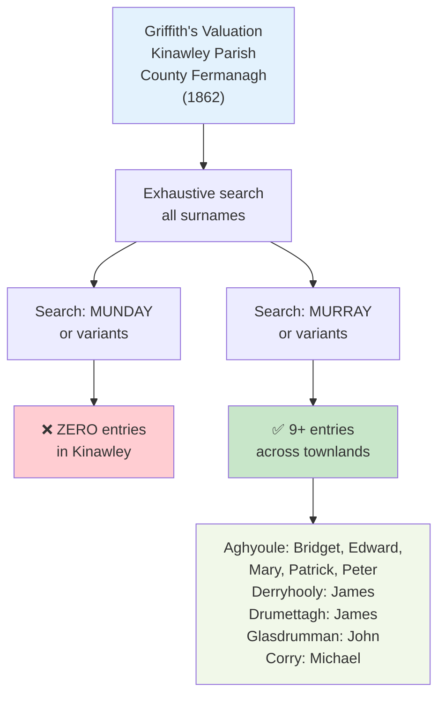
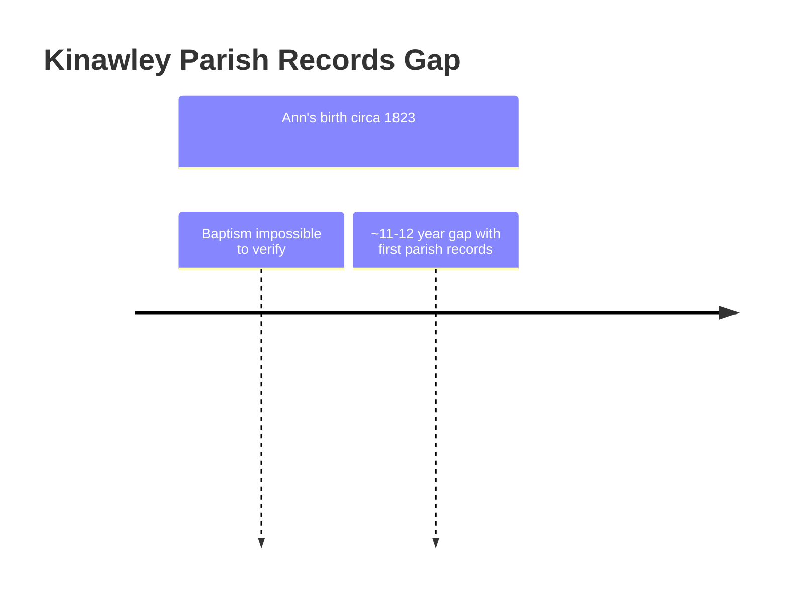

# RQ-M5 Research: Phase 2 Findings
## Search Kinawley Parish, County Fermanagh

**Date:** April 23, 2026  
**Researcher:** Claude Code  
**Question:** Was Ann Munday actually Ann Murray?

---

## Critical Documentary Findings

### 1. Griffith's Valuation (1862), Kinawley Parish, County Fermanagh

**Records Searched Visualization:**

**MUNDAY SURNAME:** ❌ **NOT FOUND**
- Zero entries for any "Munday" or variant spelling in Kinawley
- Exhaustive search of 1862 property holders by irishgenealogyhub.com

**MURRAY SURNAME:** ✅ **9+ DOCUMENTED ENTRIES**
- Bridget L: Aghyoule
- Edward L: Aghyoule
- James L: Derryhooly
- James L: Drumettagh
- John L: Glasdrumman
- Mary L: Aghyoule
- Michael L: Corry
- Patrick L: Aghyoule (multiple entries)
- Peter L: Aghyoule

**Implication:** The Murray family was a significant property-holding presence in Kinawley in 1862. The complete absence of "Munday" is notable.

---

### 2. Kinawley Catholic Parish Records — Critical Gap

**Records Availability Timeline:**

**AVAILABLE RECORDS:** December 11, 1835 onwards (baptisms and marriages)
- Source: PRONI MIC.1D/78; NLI Pos. 5346

**ANN'S BAPTISM WINDOW:** c. 1823-1824
- Predates all available parish records by ~11–12 years

**IMPLICATION:** Ann's baptism cannot be verified through Catholic parish records. **This is a fundamental research limitation.**

---

### 3. Tithe Applotment Books (1823–1837) — Next Search

**STATUS:** Not yet searched directly
- Available at: [titheapplotmentbooks.nationalarchives.ie](https://titheapplotmentbooks.nationalarchives.ie/)
- Searchable by surname, county (Fermanagh), parish (Kinawley)
- Covers the critical 1823–1837 period
- **Next step:** Search for both "Munday" and "Murray" entries to test co-occurrence hypothesis

---

## Emerging Verdict

| Evidence | Status | Implication |
|----------|--------|-------------|
| "Munday" in Griffith's Valuation (1862) | ❌ Not found | No Munday property-holding family in Kinawley by 1862 |
| "Murray" in Griffith's Valuation (1862) | ✅ 9+ entries | Strong Murray family presence in Kinawley |
| Parish records for Ann's baptism (c. 1823) | ❌ Unavailable | Cannot verify Munday via church records |
| Tithe Applotment Books (1823–1837) | ⏳ Not yet searched | Could show Munday/Murray co-occurrence before 1862 |

**Working hypothesis (tentative):** If "Munday" does not appear in the Tithe Applotment Books either, the evidence strongly suggests that "Munday" was either:
1. An error or transcription of "Murray"
2. A surname from a different townland/parish entirely
3. A surname from a very poor family without property holdings in tithe or valuation records

---

## Next Actions

1. **Search Tithe Applotment Books** (1823–1837) at [titheapplotmentbooks.nationalarchives.ie](https://titheapplotmentbooks.nationalarchives.ie/) for:
   - "Munday" surname (all variants: Monday, Munde, etc.)
   - "Murray" surname
   - Test for co-occurrence in same townlands

2. **If no Munday in Tithes:** Proceed to Phase 3 — search Lewis County records and St. Michael's Church records for evidence connecting Murray family (Fermanagh or Roscommon) to Ann

3. **If Munday found in Tithes:** Extract full details (townland, property details) and cross-reference with ship manifests and Lewis County records

---

## Sources Accessed

- [Irish Genealogy Hub — Griffith's Valuation, Kinawley Parish](https://www.irishgenealogyhub.com/fermanagh/griffiths-valuation/parish-of-kinawley.php)
- [Tithe Applotment Books, 1823-37 — National Archives of Ireland](https://titheapplotmentbooks.nationalarchives.ie/)
- [FamilySearch — Kinawley Civil Parish, County Fermanagh](https://www.familysearch.org/en/wiki/Kinawley_Civil_Parish,_County_Fermanagh,_Northern_Ireland_Genealogy)

---

## Assessment

**Confidence Level: MODERATE**

The absence of "Munday" in Griffith's Valuation (1862) is noteworthy but not conclusive:
- Munday could have emigrated before 1862 (the family left for America ~1837-1838)
- Munday could have been a non-property-holding family (laborers, servants, etc.)
- Munday could be a transcription of Murray that was recorded incorrectly in American family documents

**The Tithe Applotment Books search is critical** — it covers the period just before emigration and may reveal whether "Munday" existed independently or is a variant of "Murray."
