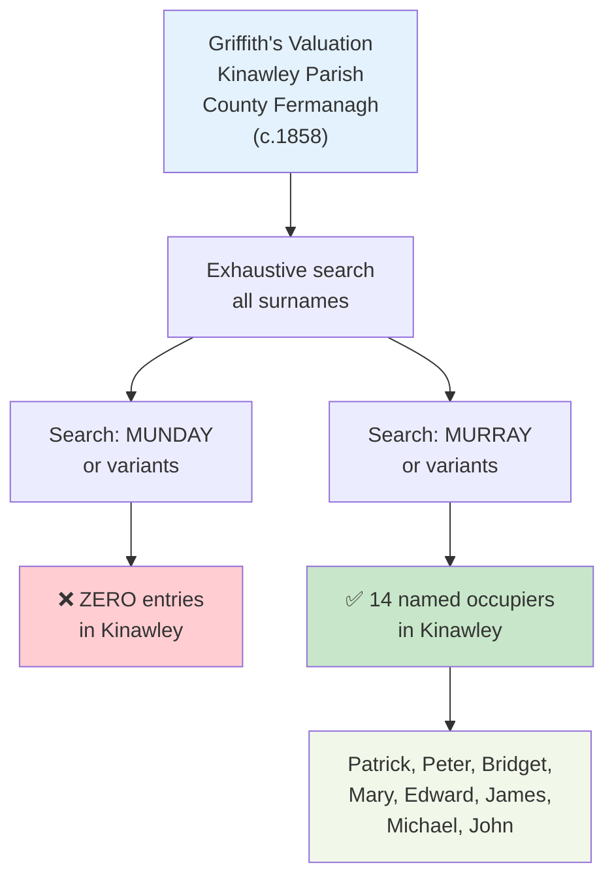
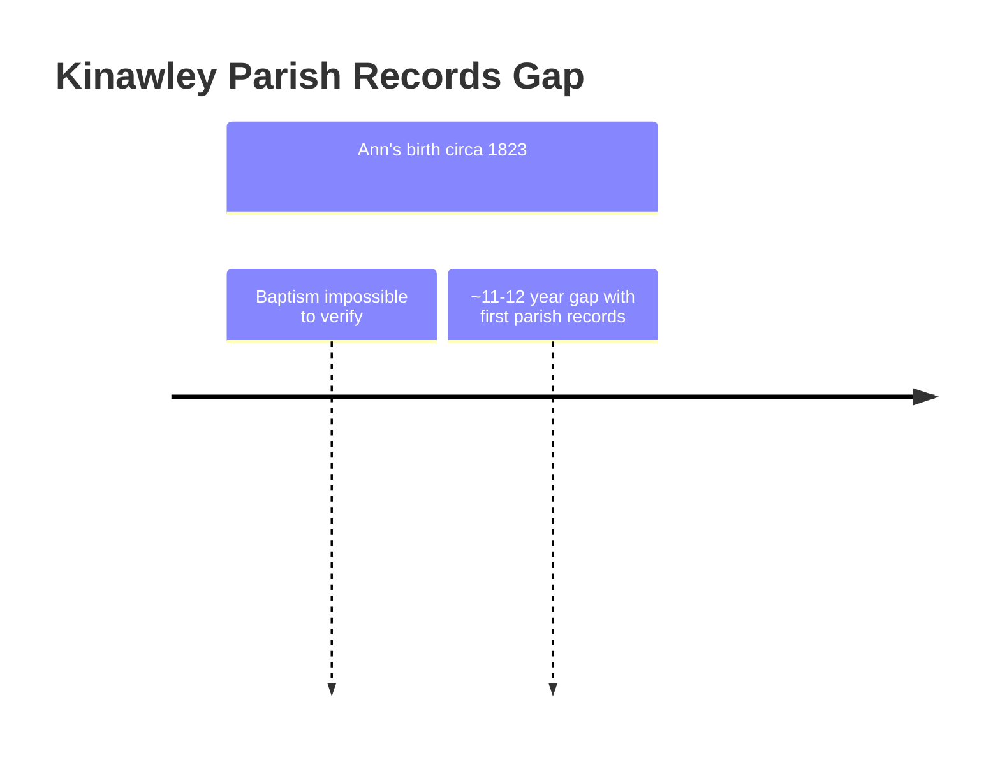

# RQ-M5 Research: Phase 2 Findings
## Search Kinawley Parish, County Fermanagh

**Date:** April 23-25, 2026  
**Researcher:** Claude Code / Claude for Chrome  
**Question:** Was Ann Munday actually Ann Murray?

---

## Critical Documentary Findings

### 1. Griffith's Valuation (c.1858), Kinawley Parish, County Fermanagh

**Records Searched Visualization:**

**MUNDAY SURNAME:** ❌ **NOT FOUND**
- Zero entries for any "Munday" or variant spelling in Kinawley
- Zero "Munday" entries in all Fermanagh
- "Mundy" appears elsewhere in Fermanagh (7 entries in Cleenish and Killesher), but not in Kinawley
- "Monday" appears once in Fermanagh (Arthur Monday, Cleenish), but not in Kinawley
- Search checked Ask About Ireland / Griffith's Valuation, with earlier corroborating checks through irishgenealogyhub.com

**MURRAY SURNAME:** ✅ **14 NAMED OCCUPIERS**

| Forename | County | Parish |
|---|---|---|
| Patrick | Fermanagh | Kinawley |
| Peter | Fermanagh | Kinawley |
| Bridget | Fermanagh | Kinawley |
| Bridget | Fermanagh | Kinawley |
| Mary | Fermanagh | Kinawley |
| Mary | Fermanagh | Kinawley |
| Peter | Fermanagh | Kinawley |
| Edward | Fermanagh | Kinawley |
| Patrick | Fermanagh | Kinawley |
| James | Fermanagh | Kinawley |
| Michael | Fermanagh | Kinawley |
| James | Fermanagh | Kinawley |
| Patrick | Fermanagh | Kinawley |
| John | Fermanagh | Kinawley |

**Implication:** The Murray family was a significant property-holding presence in Kinawley in Griffith's Valuation. The complete absence of "Munday" from Kinawley and from all Fermanagh is the strongest evidence yet for Tom's transcription-error hypothesis.

---

### 2. Kinawley Catholic Parish Records — Critical Gap

**Records Availability Timeline:**

**AVAILABLE RECORDS:** December 11, 1835 onwards (baptisms and marriages)
- Source: PRONI MIC.1D/78; NLI Pos. 5346

**ANN'S BAPTISM WINDOW:** c. 1823-1824
- Predates all available parish records by ~11–12 years

**IMPLICATION:** Ann's baptism cannot be verified through Catholic parish records. **This is a fundamental research limitation.**

---

### 3. Tithe Applotment Books (1823-1837) — Final Search Result

**STATUS:** CLOSED - INCONCLUSIVE

Searched:
- National Archives of Ireland Tithe Applotment Books online database
- Ancestry.com Collection #1270, *Ireland, Tithe Applotment Books, 1805-1837*

**Final result:** Kinawley parish is not indexed in either searched database. No Kinawley tithe result can be used as evidence for or against either surname.

**Ancestry Munday results:** 11 exact-surname entries across Ireland; 0 in Kinawley; 0 in Fermanagh. Strongest cluster: Ahamlish parish, County Sligo.

**Ancestry Murray results in Fermanagh:** 3 exact-surname entries; 0 in Kinawley.

**Implication:** Munday is confirmed as a real Irish surname, not merely a mishearing of Murray. But the Kinawley coverage gap prevents a definitive answer.

---

### 4. FamilySearch U.S. Census Search, Lewis County WV (1840-1860)

**STATUS:** COMPLETED - STRONGLY SUPPORTS MURRAY HYPOTHESIS

Searched FamilySearch U.S. Census collections for Lewis County, Virginia / West Virginia:
- 1840 U.S. Census
- 1850 U.S. Census
- 1860 U.S. Census

**Munday result:** 0 independent Munday households in Lewis County across all three census years.

**Wider Virginia / West Virginia result:** 0 Munday results in the searched FamilySearch records.

**Implication:** No independent Munday family appears in the settlement area where Ann would be expected to have relatives if Munday were her original surname. This strongly supports the view that "Munday" entered the American family record as a phonetic or clerical rendering of "Murray."

---

## Verdict

| Evidence | Status | Implication |
|----------|--------|-------------|
| "Munday" in Griffith's Valuation (c.1858) | ❌ Not found | No Munday property-holding family in Kinawley or Fermanagh |
| "Murray" in Griffith's Valuation (c.1858) | ✅ 14 named occupiers | Strong Murray family presence in Kinawley |
| Parish records for Ann's baptism (c. 1823) | ❌ Unavailable | Cannot verify Munday via church records |
| Tithe Applotment Books (1823-1837) | ⏳ Closed inconclusive | Kinawley absent from NAI and Ancestry indexes; Munday real Irish surname |
| FamilySearch census, Lewis County WV (1840-1860) | ❌ 0 Munday households | No independent Munday family found near the Copleys in America |

**RQ-M5 status: RESOLVED - hypothesis confirmed by converging indirect evidence.**

Across Irish land records and U.S. census searches, "Munday" has no demonstrated presence in Ann's reported Irish origin parish, County Fermanagh, or the Lewis County WV settlement environment. "Murray" is well established in Kinawley, and the American settlement was historically known as Murray's Settlement. The most likely interpretation is that Ann "Munday" was Ann Murray, with "Munday" entering the American family record through phonetic transcription, clerical error, or oral-family transmission.

This is not the same as having a direct baptism, marriage, or passenger record naming Ann Murray. Those direct-record searches remain open, but the surname-identification question is now resolved for working genealogical purposes.

---

## Next Actions

1. **Identify Ann's likely Murray father** using the 14 Griffith's Valuation Kinawley Murray occupiers as leads. Candidate male heads include Patrick, Peter, Edward, James, Michael, and John Murray.

2. **Transcribe Lewis County WV Murray deed records** for John Murray, 1826 (page 39, DGS 008293301, image ~17) and John Murray, 1833 (image ~24). These may name family members, neighbors, witnesses, or property locations that connect Murray and Copley.

3. **Search direct identity records**: Kinawley / Clogher Catholic registers if available, PRONI holdings, *Powhatan* and *Kutusoff* passenger lists, and early Catholic marriage records for Michael Copley + Ann.

---

## Sources Accessed

- [Ask About Ireland — Griffith's Valuation](https://www.askaboutireland.ie/griffith-valuation/)
- [Irish Genealogy Hub — Griffith's Valuation, Kinawley Parish](https://www.irishgenealogyhub.com/fermanagh/griffiths-valuation/parish-of-kinawley.php)
- [Tithe Applotment Books, 1823-37 — National Archives of Ireland](https://titheapplotmentbooks.nationalarchives.ie/)
- Ancestry.com Collection #1270, *Ireland, Tithe Applotment Books, 1805-1837*
- FamilySearch U.S. Census collections 1410696, 1473181, and 1473183
- [FamilySearch — Kinawley Civil Parish, County Fermanagh](https://www.familysearch.org/en/wiki/Kinawley_Civil_Parish,_County_Fermanagh,_Northern_Ireland_Genealogy)

---

## Assessment

**Confidence Level: HIGH - resolved for working genealogy; direct record still desired**

The combined evidence is now strong enough to treat the Munday/Murray hypothesis as confirmed for working research:
- No Munday in Kinawley or all Fermanagh in Griffith's Valuation
- 14 Murray occupiers in Kinawley in Griffith's Valuation
- No Munday households in Lewis County WV in 1840-1860 FamilySearch census searches
- No Kinawley tithe index result available to contradict this conclusion

The remaining work shifts from "Was Ann Munday actually Ann Murray?" to "Which Murray family was Ann's family?"
