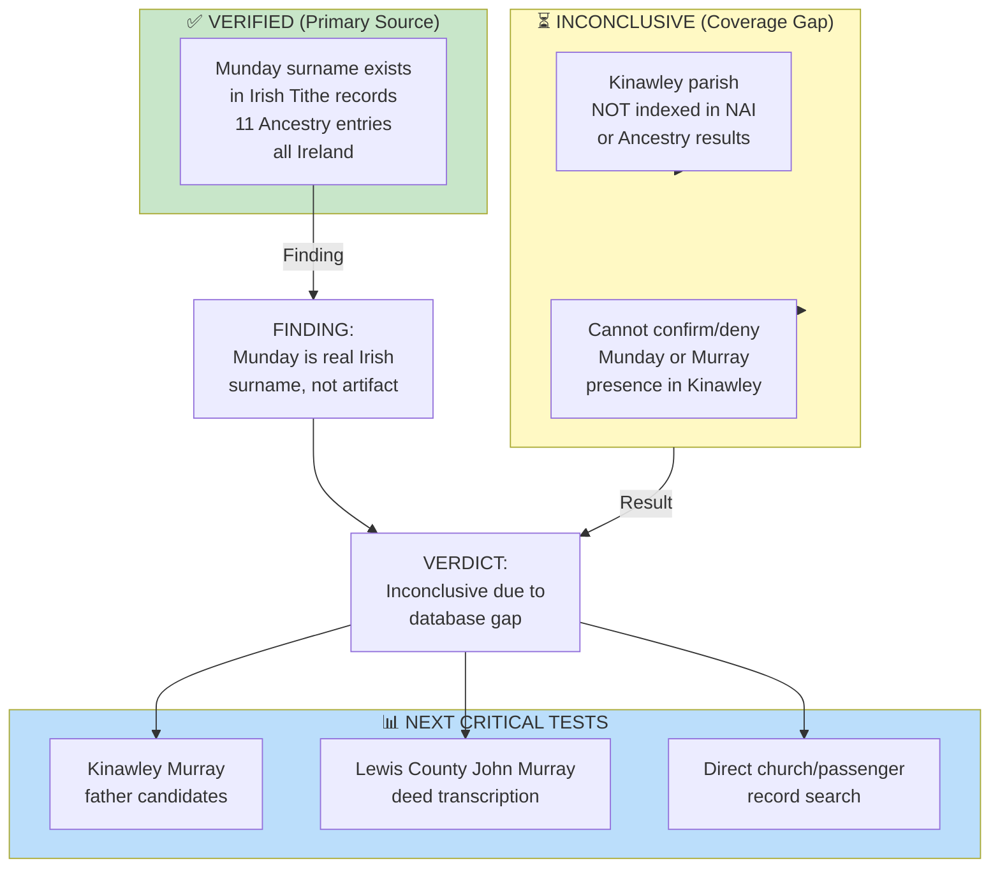

# RQ-M5 Research: Tithe Applotment Books Search

**Research Question:** Was "Ann Munday" (wife of Michael Copley Sr., b. c.1823, Kinawley, Co. Fermanagh) actually "Ann Murray"? A transcription error for the anchor family's surname?

**Search Dates:** April 24-25, 2026  
**Databases:** National Archives of Ireland Tithe Applotment Books; Ancestry.com Collection #1270, *Ireland, Tithe Applotment Books, 1805-1837*  
**Status:** **CLOSED - INCONCLUSIVE** — Coverage gap, not null evidence

---

## Final Finding: Indexed Databases Do Not Cover Kinawley Parish

Neither the National Archives of Ireland online database nor Ancestry.com Collection #1270 provides indexed Kinawley parish entries for this question. Therefore, all "No Results" returns for Kinawley searches are **coverage gaps**, not evidence that the surnames were absent from the parish.

This source cannot definitively confirm or refute whether Ann's surname was Munday or Murray.

---

## National Archives of Ireland Results

The National Archives of Ireland Tithe Applotment Books online database indexes only two Fermanagh parishes relevant to the initial search:

- Inishmacsaint
- Tomregan

**Kinawley parish is not indexed.**

Earlier NAI searches suggested possible Fermanagh Munday entries in Inishmacsaint, but the Ancestry extraction lists the relevant Inishmacsaint entries under Donegal. Inishmacsaint spans the border, so the county label differs by database. None of the entries are in Kinawley.

---

## Ancestry.com Collection #1270 Results

### Munday Search - All Ireland, Exact Surname

**Total entries:** 11  
**Entries in Kinawley:** 0  
**Entries in Fermanagh:** 0

| Name | Year | Townland | Parish | County |
|---|---:|---|---|---|
| Neal Munday | 1826 | Lifford Parks and C | Clonleigh | Donegal |
| Munday [no forename] | 1833 | Dunmuckrum | Inishmacsaint | Donegal |
| Thady Munday | 1833 | Magheraran | Inishmacsaint | Donegal |
| Mr Munday | 1826 | Williams School, Booterstown | Booterstown | Dublin |
| Francis Munday | 1826 | Creevymore | Ahamlish | Sligo |
| Patt Munday | 1826 | Creevymore | Ahamlish | Sligo |
| Patt Munday | 1826 | Creevymore | Ahamlish | Sligo |
| Francis Munday | 1826 | Creevymore | Ahamlish | Sligo |
| Dy Munday | 1826 | Poulboy | Clonmel | Waterford |
| Darby Munday | 1826 | Poulboy | Clonmel | Waterford |
| Larry Munday | 1823 | Townymonus | Cloonclare | Leitrim |

**Observation:** Munday is a real Irish surname. It appears outside Fermanagh, with the strongest cluster in Ahamlish parish, County Sligo. The Inishmacsaint entries appear under Donegal in Ancestry's data, not Fermanagh.

### Murray Search - Fermanagh, Exact Surname

**Total entries in Fermanagh:** 3  
**Entries in Kinawley:** 0

| Name | Year | Townland | Parish | County |
|---|---:|---|---|---|
| Maxwell Murray | 1834 | Belalt South | Templecarn | Donegal and Fermanagh |
| Hugh Murray | 1834 | Boes Hill | Templecarn | Donegal and Fermanagh |
| Owen Murray |  | Melgins | Clones | Fermanagh |

**Observation:** Murray appears sparsely in the indexed Fermanagh tithe data, and none of the indexed entries are in Kinawley.

---

## What This Means for RQ-M5

| Finding | Implication |
|---|---|
| **Kinawley absent from NAI and Ancestry indexed tithe coverage** | Cannot use this source to confirm/deny Ann's surname or family origin |
| **Munday exists in Ireland** (11 Ancestry entries) | Munday is a real Irish surname; not inherently a transcription error |
| **Munday has 0 indexed Fermanagh entries in Ancestry** | No indexed evidence places Munday in Ann's reported county through this database |
| **Murray has only 3 indexed Fermanagh entries, 0 in Kinawley** | Sparse indexed Fermanagh coverage; not useful for Kinawley |
| **Hypothesis remains open** | Evidence still inconclusive; need alternative sources |

**Verdict:** **RQ-M5 Tithe search is closed as inconclusive.** The result is a coverage gap, not a surname absence finding. The hypothesis that "Munday = Murray transcription error" is neither confirmed nor refuted by this source.

---

## High-Priority Next Actions

### Tier 1 — Highest Impact

**1. Contact PRONI (Public Record Office of Northern Ireland)**
- Address: 66 Balmoral Avenue, Belfast, BT9 6NY
- Phone: +44 (0)28 9025 1318
- Email: proni@dcalni.gov.uk
- **Request:** Fermanagh Tithe Applotment Books, TAB/5 series, Kinawley parish records (1823–1837)
- **Ask specifically for:** Any entries under "Munday," "Murray," "Dolan," or "Mullooly" surnames
- **Format:** Microfilm copies or digital scan (if available)
- **Time estimate:** 1–2 weeks for response
- **Priority:** Critical

**2. Lewis County, WV Census FAN Sweep (1840–1860)**
- Search FamilySearch for "Munday" or "Monday" as independent family heads in Lewis County
- If no Munday family exists independently → strengthens "transcription error" case
- If Munday family exists → complicates the hypothesis
- **Expected outcome:** Clarifies whether Munday was a real family in settlement area
- **Time estimate:** 2-3 hours

### Tier 2 — Supporting Evidence

**3. Ship Manifests Search**
- *Powhatan* (Aug 20, 1838): Look for Ann (age ~15-17) with Munday or Murray surname
- *Kutusoff* (1837): Same search
- Database: Ancestry.com, FamilySearch NARA M237 collection
- **Expected outcome:** May show Ann's actual surname as recorded by port officials
- **Time estimate:** 1 hour

---

## Related Research Threads

**Murray Settlement Anchor Family Hypothesis:**
- [[RQ-M1-LEWIS-COUNTY-DEED-SEARCH|RQ-M1 Lewis County Deed Records]] — 1826 and 1833 Murray deeds index entries confirmed; actual deed texts pending
- [[Topics/Murray Settlement|Murray Settlement]] — Tom Copley's coordinated community-transplant hypothesis

**Population & Geography:**
- [[People/Ann Copley|Ann Copley]] — Wife of Michael Copley Sr.; reported birthplace Kinawley parish
- [[Places/Kinawley Ireland|Kinawley parish, County Fermanagh]] — Catholic parish where Ann was born (c.1823)
- [[People/Michael Copley Sr.|Michael Copley Sr.]] — Emigrated c.1837–1838 to Lewis County, WV

**Phase 2M / 2N Findings:**
- Griffith's Valuation (c.1858), Kinawley: 0 Munday entries in Kinawley or all Fermanagh; 14 Murray occupiers in Kinawley
- FamilySearch U.S. Census searches: 0 independent Munday households in Lewis County WV, 1840-1860
- Current working conclusion: Ann "Munday" was almost certainly Ann Murray; the remaining task is identifying her Murray family

---

## Research Quality Assessment

---

## Summary

The Tithe Applotment Books search revealed that **Kinawley parish is not indexed in either the National Archives of Ireland online database or Ancestry.com Collection #1270** for this question. That coverage gap makes the tithe-source test inconclusive. However, the later Griffith's Valuation and FamilySearch census results resolve the larger RQ-M5 question for working genealogy: Ann "Munday" was almost certainly Ann Murray.

The next high-priority actions are a Kinawley Murray father-candidate workup, transcription of the 1826 and 1833 Lewis County John Murray deeds, and direct church/passenger/marriage record searches.

---

## Sources

- National Archives of Ireland, "Tithe Applotment Books Online Database" (titheapplotmentbooks.nationalarchives.ie)
- Ancestry.com Collection #1270, *Ireland, Tithe Applotment Books, 1805-1837* (606,726 records)
- Searches executed: April 24-25, 2026
- Coverage conclusion: Kinawley parish is not indexed in either searched database
