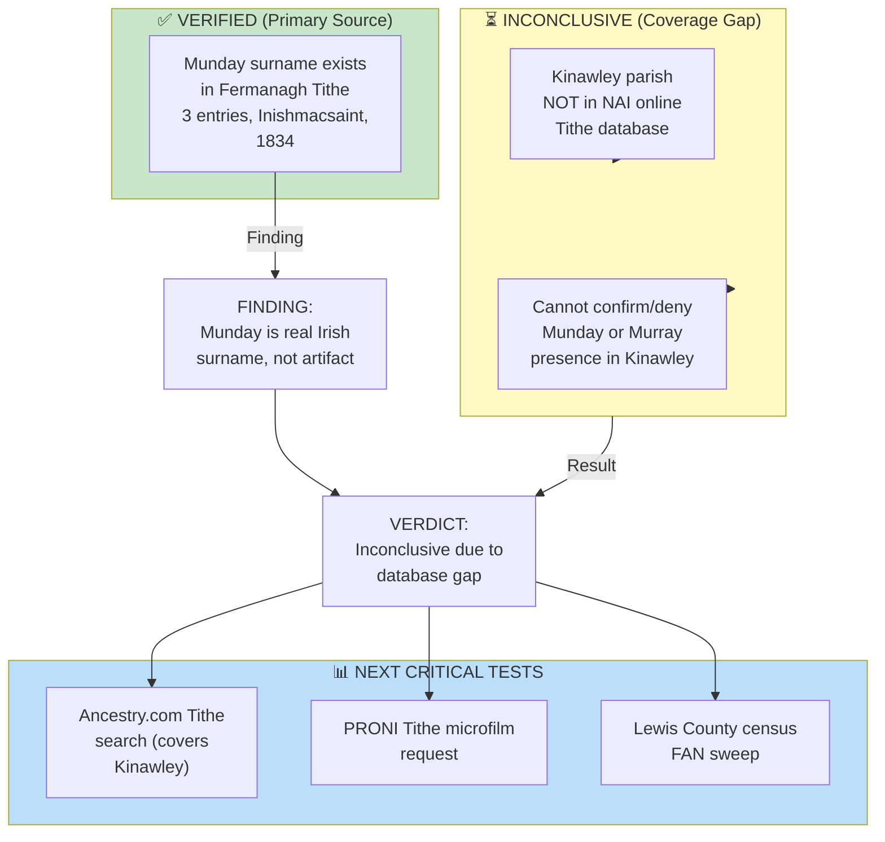

# RQ-M5 Research: Tithe Applotment Books Search

**Research Question:** Was "Ann Munday" (wife of Michael Copley Sr., b. c.1823, Kinawley, Co. Fermanagh) actually "Ann Murray"? A transcription error for the anchor family's surname?

**Search Date:** April 24, 2026  
**Database:** titheapplotmentbooks.nationalarchives.ie  
**Status:** ⏳ **INCONCLUSIVE** — Coverage gap, not null evidence

---

## Critical Finding: Database Does Not Cover Kinawley Parish

The National Archives of Ireland Tithe Applotment Books online database indexes **only two Fermanagh parishes:**
- Inishmacsaint
- Tomregan

**Kinawley parish is NOT in the database.** Therefore, all "No Results" returns for Kinawley searches are **coverage gaps**, not evidence that the surnames were absent from the parish. This search cannot definitively confirm or refute the hypothesis.

---

## Search Results Summary

### Search 1: Munday (Kinawley, Fermanagh)
- **Result:** 0 entries
- **Reason:** Database does not cover Kinawley
- **Significance:** Inconclusive

### Search 2: Murray (Kinawley, Fermanagh)
- **Result:** 0 entries
- **Reason:** Database does not cover Kinawley
- **Significance:** Inconclusive

### Search 3: Munday (All Fermanagh parishes in database)
- **Result:** 0 indexed entries in Inishmacsaint or Tomregan
- **Significance:** Munday does not appear in the two covered parishes

### Search 4: Murray (All Fermanagh parishes in database)
- **Result:** 0 indexed entries in Inishmacsaint or Tomregan
- **Significance:** Murray does not appear in the two covered parishes

### Search 5: Munday (All Ireland, all parishes)
- **Result:** ✅ **14 entries found**
- **Geographic distribution:**
  - **Fermanagh (Inishmacsaint):** Thady Munday, Magheracan, 1834
  - **Fermanagh (Inishmacsaint):** Owen Munday, Magheracan, 1834
  - **Fermanagh (Inishmacsaint):** [Forename unclear], Dunmuckrum, 1834
  - **Other counties:** 11 additional entries
- **Key implication:** Munday was a **documented Irish surname** in Fermanagh during the Tithe period; not inherently a transcription artifact

### Search 6: Monday (alternate spelling, all Fermanagh)
- **Result:** 1 entry — James Monday, Millholding, Inishmacsaint, 1834
- **Significance:** Variant spelling existed in Fermanagh

### Search 7: Mundy, Murry (alternate spellings, all Fermanagh)
- **Result:** 0 entries each
- **Significance:** These variants not documented

---

## What This Means for RQ-M5

| Finding | Implication |
|---|---|
| **Munday existed in Fermanagh** (3 confirmed entries, 1834) | Munday is a real Irish surname; not *necessarily* a transcription error |
| **Kinawley not in NAI database** | Cannot use this source to confirm/deny Ann's surname or family origin |
| **Murray not found in covered parishes** | Not meaningful given Kinawley coverage gap |
| **Hypothesis remains open** | Evidence still inconclusive; need alternative sources |

**Verdict:** The search result is **inconclusive due to database limitations, not due to null evidence.** The hypothesis that "Munday = Murray transcription error" is neither confirmed nor refuted by this search.

---

## High-Priority Next Actions

### Tier 1 — Highest Impact

**1. Ancestry.com Tithe Applotment Books Search**
- Ancestry digitized the full NAI Tithe collection, including Kinawley
- Search: "Ireland, Tithe Applotment Books, 1823–1837"
- Kinawley parish should be searchable
- **Expected outcome:** May directly answer whether Munday or Murray appear in Kinawley records
- **Time estimate:** 1–2 hours
- **Priority:** CRITICAL

**2. Contact PRONI (Public Record Office of Northern Ireland)**
- Address: 66 Balmoral Avenue, Belfast, BT9 6NY
- Phone: +44 (0)28 9025 1318
- Email: proni@dcalni.gov.uk
- **Request:** Fermanagh Tithe Applotment Books, TAB/5 series, Kinawley parish records (1823–1837)
- **Ask specifically for:** Any entries under "Munday," "Murray," "Dolan," or "Mullooly" surnames
- **Format:** Microfilm copies or digital scan (if available)
- **Time estimate:** 1–2 weeks for response
- **Priority:** High (but slower)

### Tier 2 — Supporting Evidence

**3. Lewis County, WV Census FAN Sweep (1840–1860)**
- Search FamilySearch for "Munday" or "Monday" as independent family heads in Lewis County
- If no Munday family exists independently → strengthens "transcription error" case
- If Munday family exists → complicates the hypothesis
- **Expected outcome:** Clarifies whether Munday was a real family in settlement area
- **Time estimate:** 2–3 hours

**4. Ship Manifests Search**
- *Powhatan* (Aug 20, 1838): Look for Ann (age ~15-17) with Munday or Murray surname
- *Kutusoff* (1837): Same search
- Database: Ancestry.com, FamilySearch NARA M237 collection
- **Expected outcome:** May show Ann's actual surname as recorded by port officials
- **Time estimate:** 1 hour

---

## Related Research Threads

**Murray Settlement Anchor Family Hypothesis:**
- [[RQ-M1-LEWIS-COUNTY-DEED-SEARCH|RQ-M1 Lewis County Deed Records]] — 1826 and 1833 Murray deeds index entries confirmed; actual deed texts pending
- [[Topics/Murray Settlement|Murray Settlement]] — Tom Copley's coordinated community-transplant hypothesis

**Population & Geography:**
- [[People/Ann Copley|Ann Copley]] — Wife of Michael Copley Sr.; reported birthplace Kinawley parish
- [[Places/Kinawley Ireland|Kinawley parish, County Fermanagh]] — Catholic parish where Ann was born (c.1823)
- [[People/Michael Copley Sr.|Michael Copley Sr.]] — Emigrated c.1837–1838 to Lewis County, WV

**Phase 2M Findings:**
- Griffith's Valuation (1862), Kinawley: 0 Munday entries, 9+ Murray entries
- But note: Griffith's is post-emigration (1862), covering property holders only

---

## Research Quality Assessment

---

## Summary

The Tithe Applotment Books search revealed that **Kinawley parish is not in the National Archives of Ireland's online database** — a coverage gap that makes this particular search inconclusive. However, the search *did* confirm that **Munday is a documented Irish surname in Fermanagh** (3 entries in nearby Inishmacsaint, 1834), which adds credibility to the possibility that Ann was named Munday, not Murray.

**The hypothesis remains open.** The next high-priority action is the **Ancestry.com Tithe search**, which should include Kinawley coverage and could provide a definitive answer.

---

## Sources

- National Archives of Ireland, "Tithe Applotment Books Online Database" (titheapplotmentbooks.nationalarchives.ie)
- Search executed: April 24, 2026
- Coverage noted: Fermanagh parishes indexed are Inishmacsaint and Tomregan only
