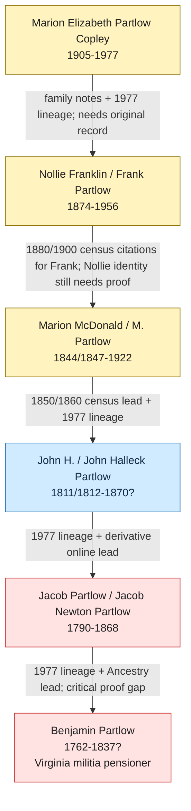
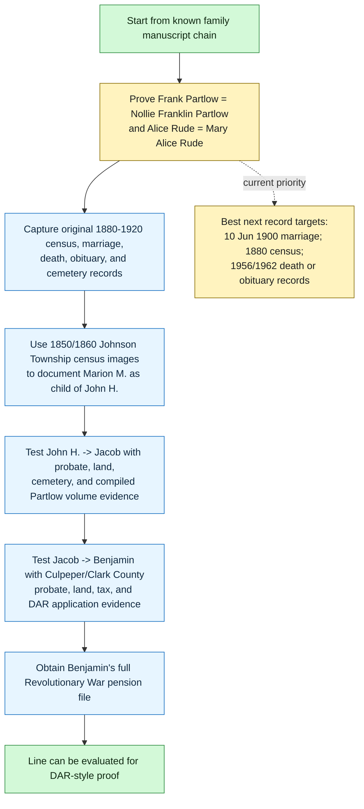

# RQ-P1 Partlow Revolutionary Line

This page tracks the proof chain from [[People/Marion Elizabeth Partlow|Marion Elizabeth Partlow]] back to [[People/Benjamin Partlow|Benjamin Partlow]], the Revolutionary War pensioner in Culpeper County, Virginia.

**Current status:** A plausible line is identified. Online sources support the middle Clark County, Illinois generation, and a local 1977 handwritten family lineage now supports the full proposed chain from Marion Elizabeth Partlow back to Benjamin Partlow. The chain is still not proved generation-by-generation with original records.

## Research Question

Can Marion Elizabeth Partlow's paternal line be documented back to Benjamin Partlow, Revolutionary War veteran of the Virginia militia?

Working line:

**Marion Elizabeth Partlow** -> **Nollie Franklin / Frank Partlow** -> **Marion McDonald / M. Partlow** -> **John H. / John Halleck / Hallick Partlow** -> **Jacob Partlow / Jacob Newton Partlow** -> **Benjamin Partlow**.

## Online Findings So Far

| Link | Current Evidence | Status | Next Action |
|---|---|---|---|
| Marion Elizabeth Partlow -> Nollie Franklin / Frank Partlow | Family notes, Ancestry tree screenshot, and 1977 handwritten lineage identify Marion E. Partlow Copley as a child of Frank/Alice Rude Partlow. | Strong family-source lead; needs original record. | Locate Marion's birth, marriage, death, or obituary record naming parents. |
| Nollie Franklin / Frank Partlow -> Marion McDonald / M. Partlow | New England Ball Project's Marion McDonald Partlow page cites 1880 Johnson Township census with Marion, wife Martha, and children **Frank, Henry, and Ora**; it also cites 1900 Johnson Township census with widower Marion and sons **Frank and Henry**. The 1977 handwritten lineage also places Frank under Marion M. Partlow. | Frank -> Marion M. is now census-supported online. Still need to prove Frank is the same person as Nollie Franklin Partlow. | Locate 1900 marriage and death/obituary/cemetery records tying Frank, Nollie Franklin, and Alice Rude together. |
| Marion McDonald / M. Partlow -> John H. / Halleck / Hallick Partlow | New England Ball Project cites 1850 and 1860 U.S. census entries for Johnson Township, Clark County, Illinois, showing John H. Partlow with wife Lydia and children including Marion; the Marion McDonald Partlow page repeats that Marion was son of John Halleck Partlow and Lydia Bennett. | Census-supported online lead plus family-source support; original images still need review. | Open original census images at FamilySearch/Ancestry and capture household details. |
| John H. / Halleck / Hallick Partlow -> Jacob Partlow | 1977 handwritten lineage names Jacob Partlow as father of John H.; New England Ball Project also states John was son of Jacob Partlow and Mary, citing a RootsWeb-era database. | Family-source and derivative online lead; not yet original-record proof. | Find Jacob probate, land, cemetery, or compiled-genealogy support. |
| Jacob Partlow / Jacob Newton Partlow -> Benjamin Partlow | 1977 handwritten lineage and Ancestry screenshot place Jacob as son of Benjamin Partlow. | Strong family-source lead; critical proof problem remains. | Search *The Partlow family and connections*, probate, tax, and land records. |
| Benjamin Partlow -> Revolutionary War service | Pension cover sheet image confirms Benjamin Partlow of Culpeper County, Virginia, age 70, private, disabled by bodily infirmity, with more than six months service under Capt. Coxen and Capt. Rogers. DAR chapter page lists Benjamin Partlow of Virginia as a patriot ancestor. | Service evidence strong; full pension file and official DAR GRS entry still needed. | Obtain full NARA/Fold3 pension file and DAR ancestor search result, if any. |
| Benjamin Partlow -> John Partlow II | A Graves Family Association page cites Spotsylvania County, Virginia Will Book A, p. 975, for John Partlow, died 11 Dec 1789, and reports that the will named son Benjamin Partlow and 250 acres in Culpeper County. | Useful online abstract pointing to an original will record; not yet checked against the will-book image. | Obtain the original Spotsylvania will-book image or a reliable transcript and compare it to Benjamin's Culpeper pension identity. |

## Local Family Manuscript Found

A local PDF at `/mnt/c/Users/zach/Dropbox (Old)/Tom/Tom/partlow_family.pdf` contains a 1960 letter from **Harry C. Partlow** and a handwritten 1977 lineage titled **"Partlow Line of Descent in America for Eight Generations."** See [[References/Harry C Partlow 1960 Letter and Handwritten Lineage]].

The handwritten lineage directly proposes:

**John Partlow I** -> **John Partlow II** -> **Benjamin Partlow** -> **Jacob Partlow** -> **John H. Partlow** -> **Marion M. Partlow** -> **Frank Partlow** and **Alice Rude Partlow** -> **Marion E. Partlow Copley** and siblings.

This is not original proof, but it materially improves the research position because it independently names the exact chain and gives useful details: Jacob was born in Culpeper County, Virginia and died in Clark County, Illinois; John H. came to Illinois in 1839 and died in Arkansas in 1870; Marion M. had three wives, with Martha L. Bowles listed first; and Frank married Alice Rude on 10 Jun 1900.

## Key Online Source: John Halleck Partlow

The New England Ball Project page for **John Halleck Partlow** provides the best online evidence found so far for the middle generation. It reports:

- John Halleck Partlow, born about 1812 in Ohio.
- Married **Lydia Bennett**, daughter of John Bennett and Elizabeth McCullen, on 1 Nov 1832.
- 1850 census: Johnson Township, Clark County, Illinois; "John H.", age 38, born Ohio, chair maker, with wife Lydia and children including Marion and Columbus; cited target **p. 550, back of stamped p. 275**.
- 1860 census: Johnson Township, Clark County, Illinois; "John", age 49, born Ohio, chair maker, with wife Lydia and children including Marion, Columbus, Jacob, and Phebe; cited target **p. 65**.
- Children listed include **Marion McDonald Partlow**, born Feb 1847, died 27 Mar 1922.

This directly improves the working chain because Marion McDonald Partlow appears as a child in John Halleck Partlow's household in two census years.

## Key Online Source: Marion McDonald Partlow

The New England Ball Project page for **Marion McDonald Partlow** materially improves the Frank/Nollie-to-Marion section of the chain. It reports:

- Marion McDonald Partlow, born Feb 1847 in Illinois; died 27 Mar 1922 at Casey, Clark County, Illinois.
- Son of **John Halleck Partlow** and **Lydia Bennett**.
- Married **Martha L. Bowles** on 15 Apr 1872 in Clark County, Illinois.
- 1880 census: Johnson Township, Clark County, Illinois; Marion with wife Martha, children **Frank, Henry, and Ora**, brother Columbus, and half-brothers John and Richard; cited target **ED 37, p. 22, back of stamped p. 87**.
- 1900 census: Johnson Township, Clark County, Illinois; Marion as a widower with sons **Frank and Henry**, living with brother Columbus; cited target **ED 8, Sheet 7A, stamped p. 85**.
- 1910 census: Johnson Township, Clark County, Illinois; Marion with second wife Julia and son Henry; cited target **ED 10, Sheet 8A, stamped p. 100**.
- 1920 census: Casey, Clark County, Illinois; Marion as a widower with son Henry and family; cited target **ED 3, Sheet 7A, stamped p. 36**.

This makes the **Frank Partlow -> Marion M. Partlow** link independently supported by online census citations. The unresolved issue is whether **Frank Partlow** in those records is the same person as **Nollie Franklin Partlow** in the Ancestry/family-tree lead and Zach's family line.

See [[References/New England Ball Project Partlow Census Citation Extract]] for the consolidated census-target table.

## FamilySearch Book Lead

FamilySearch Digital Library has public entries for Thomas E. Partlow's two-volume *The Partlow family and connections*:

- Volume 1: identifier `5481_01`, 143 pages, public / view inside.
- Volume 2: identifier `5481_02`, 194 pages, public / view inside.

The FamilySearch catalog description says the Partlow family originated in Wales; the first Partlow came to America around 1700; and the unknown immigrant was survived by three sons who settled in Caroline County, Fauquier County, and Spotsylvania County, Virginia.

This is a high-priority source because it may discuss the Virginia Partlow lines and the Jacob-to-Benjamin connection. Direct command-line access was blocked by FamilySearch's Incapsula protection, so the volume likely needs to be opened manually in a browser or accessed at FamilySearch directly.

Geneanet also has catalog pages for both volumes, which may be a second route to opening the same scans if FamilySearch access is awkward.

## DAR Lead

The Old Spanish Trail Chapter NSDAR page lists **Benjamin Partlow VA** among chapter members' patriot ancestors. That does not identify Zach's line, but it suggests at least one DAR application has been accepted through Benjamin Partlow and should be checked in the official DAR Genealogical Research System.

## Immediate Online Search Pass: Frank / Nollie Partlow and Alice Rude

The closest unresolved problem is still the identity link **Frank Partlow = Nollie Franklin Partlow** and spouse link **Alice Rude = Mary Alice Rude/Partlow**. A public-web search pass on 28 Apr 2026 found no clean public obituary, cemetery page, or transcribed record that proves the name variants.

What this search did establish:

- The official Illinois Statewide Marriage Index is the right index for the reported **10 Jun 1900** marriage, because it covers pre-1901 Illinois marriages and its entries cite county, date, and original record volume/page or license details when available.
- The Illinois Statewide Marriage Index search page is JavaScript-gated and did not return a usable direct result through command-line access, so this search likely needs a browser session or manual county/IRAD request.
- Illinois Department of Public Health says certified marriage copies are available only from the county clerk in the county where the marriage occurred; for a 1900 Clark County marriage, the practical target is the Clark County Clerk/Recorder in Marshall, Illinois.
- Clark County's current clerk page says certified marriage-license copies may be ordered online or from the office. For this line, request/search wording should include: **Frank Partlow**, **Nollie Franklin Partlow**, **N. F. Partlow**, **Alice Rude**, **Mary Alice Rude**, and date **10 Jun 1900**.
- A ready-to-send request note has been created at [[References/Clark County Illinois Partlow Rude Marriage Request]].
- The Clark County Genealogy Trails death index page for N/O/P/Q/R/S surnames includes several Partlow deaths from 1916-1947, but it does not solve Frank/Alice because the family-source dates put Frank's death in **1956** and Alice's in **1962**, outside that transcribed index window.

This does not prove the identity, but it narrows the next high-value action: obtain the Clark County marriage record/citation for the reported 10 Jun 1900 marriage.

## Pre-Revolution Partlow Lead

The Graves Family Association's online genealogy for John Graves/Greaves includes an abstract of **John Partlow** of Spotsylvania County, Virginia, citing **Spotsylvania County Will Book A, p. 975**. The abstract reports that John Partlow died **11 Dec 1789**, that executor bond was dated **6 Apr 1790**, and that the will named wife Sarah and children including **Benjamin Partlow**. It also associates Benjamin with **250 acres in Culpeper County**.

This is significant because it independently supports the local handwritten lineage's pre-Revolution step, **John Partlow II -> Benjamin Partlow**, and the Culpeper land reference fits the county where Benjamin later filed his pension. It still needs original-record verification and does not yet solve the direct-line proof gap **Jacob Partlow -> Benjamin Partlow**.

## Jacob-to-Benjamin Search Pass

A public-web search pass on 28 Apr 2026 for **"Jacob Partlow" "Benjamin Partlow"**, **"Jacob Newton Partlow" "Benjamin Partlow"**, and related phrases did not find a clean online proof that Jacob Partlow was a son of Benjamin Partlow.

What it did find:

- A MyTrees search-result preview for **Benjamin Partlow** and **Clarissa Barnes**, married 1793 in Virginia, with Benjamin born 1762 in Virginia and died 1837 in Virginia. The preview names children including **Henry H. Partlow** and **Sarah R. Partlow**, but the visible search-result text did **not** expose Jacob Partlow. Treat this only as a derivative lead to Benjamin's family group, not as proof.
- The same search results surfaced other Partlow branches in Vermilion County, Illinois; Ross County, Ohio; Meigs County, Ohio; and Arkansas. These are probably collateral unless they can be tied to Jacob/Benjamin with records.

Interpretation:

- The critical **Jacob Partlow -> Benjamin Partlow** link remains unproved.
- The next no-human-help route is still to access/search *The Partlow family and connections* or another compiled Partlow volume, because broad public search is not surfacing the needed parent-child claim.
- If compiled books remain blocked, the next best original-record targets are Benjamin's probate/estate file and Culpeper/Clark County land or tax records.

## Evidence Issues

- The Ancestry screenshot appears to show **Mary Halleck** as John Halleck / Hallick Partlow's wife, but the New England Ball Project identifies his wife as **Lydia Bennett**. Treat Mary Halleck as either a tree error, misread, or different person until supported by records.
- The spelling varies: **Halleck** appears in the New England Ball Project; **Hallick** appears in the Ancestry screenshot.
- The online John -> Jacob relationship is not census-proved, because John was already an adult by the 1850 census.
- The Jacob -> Benjamin relationship remains the critical proof problem.
- The local handwritten lineage and New England Ball Project use **Frank Partlow**, while other leads use **Nollie Franklin Partlow**. This is likely the same person, but it still needs proof from marriage, death, obituary, cemetery, or census records.
- The local handwritten lineage identifies Frank's wife as **Alice Rude Partlow**, probably resolving the earlier "Mary Alice Partlow, nee unknown" lead as Mary Alice Rude.
- The John Partlow II -> Benjamin Partlow link now has an online will-abstract lead, but the original Spotsylvania County will-book image must be checked before treating it as proved.

## Next Actions

1. Use the Illinois Statewide Marriage Index in a browser, or request the record from Clark County Clerk/Recorder, to confirm the **10 Jun 1900** marriage of Frank/Nollie Partlow and Alice/Mary Alice Rude and capture the volume/page/license citation.
2. Capture the original 1880 and 1900 Johnson Township, Clark County, Illinois census images for Marion McDonald Partlow and son Frank, using the roll/ED/sheet/page targets in [[References/New England Ball Project Partlow Census Citation Extract]].
3. Capture the original 1850 and 1860 Johnson Township, Clark County, Illinois census images for John H. Partlow, using the roll/page targets in [[References/New England Ball Project Partlow Census Citation Extract]].
4. Open FamilySearch or Geneanet copies of *The Partlow family and connections* and search within the book for Benjamin, Jacob, John H., Marion, Frank, Rude, and Clark County.
5. Search Clark County, Illinois probate for Marion McDonald Partlow, died 27 Mar 1922.
6. Search probate, land, and tax records for Jacob Partlow / Jacob Newton Partlow and Benjamin Partlow.
7. Search DAR GRS for Benjamin Partlow and, if present, note any ancestor number and approved child line.
8. Obtain the full Benjamin Partlow Revolutionary War pension file.
9. Obtain the original Spotsylvania County, Virginia Will Book A, p. 975 image for John Partlow to verify the Benjamin/Culpeper abstract.
10. Continue targeted Jacob-to-Benjamin searches in compiled Partlow books, probate, land, and tax sources; broad public web search did not prove the link.

## Sources

1. New England Ball Project, "John Halleck Partlow," person page 2754, citing 1850 and 1860 U.S. census entries for Johnson Township, Clark County, Illinois: https://newenglandballproject.com/g2/p2754.htm
2. New England Ball Project, "Lydia Bennett," person page 2753, with discussion of John Halleck Partlow's household and later census interpretation: https://www.newenglandballproject.com/g2/p2753.htm
3. New England Ball Project, "Marion McDonald Partlow," person page 3461, citing 1850, 1860, 1880, 1900, 1910, and 1920 U.S. census entries for the Clark County, Illinois Partlow family: https://www.newenglandballproject.com/g3/p3461.htm
4. FamilySearch Digital Library search results for *The Partlow family and connections*, volumes 1 and 2, identifiers `5481_01` and `5481_02`: https://www.familysearch.org/library/books/records/?navigation=default&page=1&perpage=10&search=PARTLOW
5. FamilySearch catalog entry for Thomas E. Partlow, *The Partlow family and connections*: https://www.familysearch.org/en/search/catalog/5481
6. DAR, "DAR Lineage Resources," describing the Ancestor Database, Descendants Database, and record-copy workflow: https://www.dar.org/library/collections/dar-lineage-resources
7. Old Spanish Trail Chapter NSDAR, "Patriot Ancestors," listing Benjamin Partlow VA: https://www.daroldspanishtrail.com/about.html
8. Geneanet library catalog page for *The Partlow family and connections*, volume 1: https://en.geneanet.org/library/doc/10923302/the-partlow-family-and-connections-v-01
9. Geneanet library catalog page for *The Partlow family and connections*, volume 2: https://en.geneanet.org/library/doc/10923303/the-partlow-family-and-connections-v-02
10. Graves Family Association, "John Graves/Greaves of Northamptonshire, England," section citing Spotsylvania County, Virginia Will Book A, p. 975 for John Partlow and naming son Benjamin Partlow: https://graves-fa.org/gen-histories/gens/gen270.html
11. Illinois Secretary of State / Illinois State Archives, "Illinois Statewide Marriage Index 1763-1900," describing index coverage, source basis, and copy pathways: https://www.ilsos.gov/departments/archives/databases/marriage.html
12. Illinois Department of Public Health, "Marriage Records," noting that certified marriage copies are available only from the county clerk in the county where the marriage occurred: https://dph.illinois.gov/topics-services/birth-death-other-records/marriage-records.html
13. Clark County, Illinois Clerk/Recorder, "Marriage License," including current clerk contact and certified-copy ordering note: https://www.clarkcountyil.org/departments/CountyClerk/marriage-license
14. Clark County Illinois Genealogy Trails, "Death Records - N/O/P/Q/R/S Surnames," transcribed death-index page including Partlow entries from 1916-1947: https://genealogytrails.com/ill/clark/deathindex-n.html
15. [[References/Clark County Illinois Partlow Rude Marriage Request]] - ready-to-send request note for the 10 Jun 1900 marriage record.
16. [[References/New England Ball Project Partlow Census Citation Extract]] - consolidated census citation targets for John Halleck, Lydia Bennett, and Marion McDonald Partlow.
17. MyTrees search-result preview for Isaac/Benjamin Partlow family group; derivative and not sufficient as proof: https://www.mytrees.com/names/Event/Year/1/ISAAC%2BPARTLOW
18. [[References/Harry C Partlow 1960 Letter and Handwritten Lineage]] - local family-source summary of `/mnt/c/Users/zach/Dropbox (Old)/Tom/Tom/partlow_family.pdf`.
19. `/mnt/c/Users/zach/Desktop/Partlow/IMG_2437.jpg` - pension-file cover sheet image for Benjamin Partlow, Culpeper County, Virginia.
20. `/mnt/c/Users/zach/Desktop/Partlow/IMG_2433.png` - Ancestry tree screenshot showing the proposed Partlow line; derivative tree evidence only.
