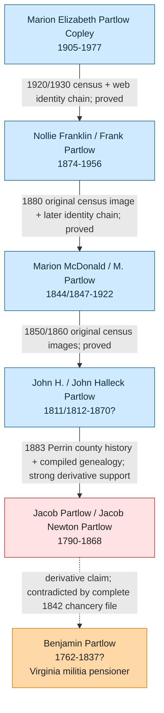
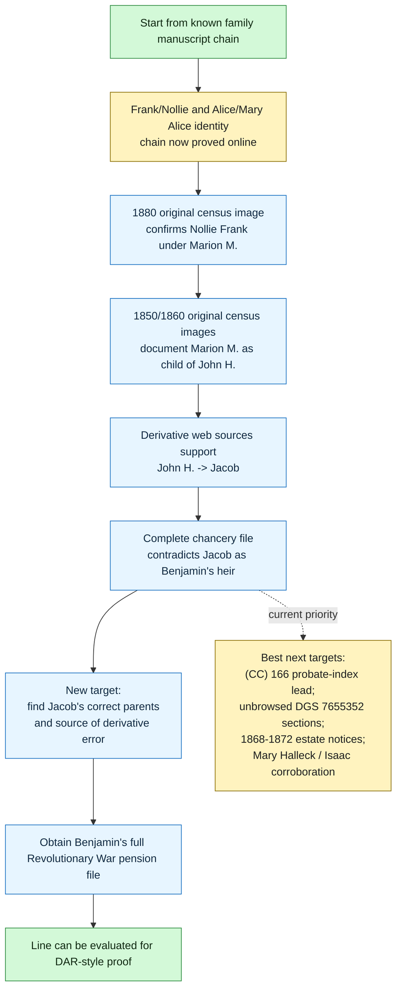

# RQ-P1 Partlow Revolutionary Line

This page tracks the former proposed proof chain from [[People/Marion Elizabeth Partlow|Marion Elizabeth Partlow]] back to [[People/Benjamin Partlow|Benjamin Partlow]], the Revolutionary War pensioner in Culpeper / Rappahannock County, Virginia.

**Current status:** The downstream Partlow line from Marion Elizabeth back to **John H. / John Halleck Partlow** is supported by original or near-original web records. The proposed upstream link **Jacob Newton Partlow -> Benjamin Partlow** is now contradicted by a complete review of **Rappahannock County Chancery Case 1842-002 / original no. 53**. The full 69-image file names Benjamin Partlow's children and heirs after his 1837 intestate death, distributes the estate through eight child-lines, and **does not include Jacob / Jacob Newton / Nute Partlow** anywhere.

## Dashboard Snapshot

| Question | Current answer |
|---|---|
| Is Benjamin Partlow's Revolutionary service supported? | Yes. Pension S5871 / pension-roll snippets, the local pension-cover image, and DAR ancestor lead `A088405` support Benjamin Partlow of Culpeper / Rappahannock County, Virginia as the Revolutionary War pensioner. |
| Is the Marion Elizabeth Partlow -> Benjamin Partlow chain proved? | No. Marion -> Frank / Nollie + Alice -> Marion M. -> John H. is supported by original or near-original records, and John H. -> Jacob has derivative support. But the complete Rappahannock chancery file for Benjamin Partlow omits Jacob from every heir, party, advancement, and distribution list. |
| Best immediate proof target | Resolve the new probate-index lead **`PARTLOW Jacob - (CC) 166`**, browse the unsearched portions of Ancestry collection 9048 / FamilySearch DGS `7655352` for guardian / conservator / chancery sections, and search 1868-1872 Marshall newspapers for estate notices. The found will and probate index still do not name John H. or all heirs. |
| Critical middle gap | Identify Jacob Newton Partlow's correct parents and determine whether the compiled Mary Halleck / Isaac Partlow brother claims have original support. The Benjamin connection remains contradicted. |
| Master queue | See [[Open Record Targets]] for the retired Partlow identity targets and the active primary-record targets. |

## Research Question

Can Marion Elizabeth Partlow's paternal line be documented back to Benjamin Partlow, Revolutionary War veteran of the Virginia militia?

Working line:

Former working line:

**Marion Elizabeth Partlow** -> **Nollie Franklin / Frank Partlow** -> **Marion McDonald / M. Partlow** -> **John H. / John Halleck / Hallick Partlow** -> **Jacob Partlow / Jacob Newton Partlow** -> **Benjamin Partlow**.

Corrective status: the line is currently supported through **John H. / John Halleck Partlow**, with derivative support for **John H. -> Jacob**, but the **Jacob -> Benjamin** link is contradicted by Benjamin's complete chancery heir file.

```mermaid
graph TD
    ME["Marion Elizabeth Partlow Copley<br/>1905-1977"]
    NF["Nollie Franklin / Frank Partlow<br/>1874-1956"]
    MM["Marion McDonald / M. Partlow<br/>1844/1847-1922"]
    JH["John H. / John Halleck Partlow<br/>1811/1812-1870?"]
    JP["Jacob Partlow / Jacob Newton Partlow<br/>1790-1868"]
    BP["Benjamin Partlow<br/>1762-1837?<br/>Virginia militia pensioner"]

    ME -->|"1920/1930 census + web identity chain; proved"| NF
    NF -->|"1880 original census image + later identity chain; proved"| MM
    MM -->|"1850/1860 original census images; proved"| JH
    JH -->|"1883 Perrin county history + compiled genealogy; strong derivative support"| JP
    JP -. "derivative claim; contradicted by complete 1842 chancery file" .-> BP

    class ME,NF,MM,JH censusLead
    class JP proofGap
    class BP contradicted

    classDef familySource fill:#fff3bf,stroke:#8a6d00,color:#1f1f1f;
    classDef censusLead fill:#d0ebff,stroke:#1864ab,color:#102a43;
    classDef proofGap fill:#ffe3e3,stroke:#c92a2a,color:#1f1f1f;
    classDef contradicted fill:#ffd8a8,stroke:#e67700,color:#1f1f1f;
```

## Online Findings So Far

| Link | Current Evidence | Status | Next Action |
|---|---|---|---|
| Marion Elizabeth Partlow -> Nollie Franklin / Frank Partlow + Alice / Mary Alice Rude | The 1920 census lists `Marian E Parttow` in the Nollie / Mary A Partlow household; the 1930 census lists `Marion Partlow` as daughter of Frank and Allee / Alice Partlow. The 1934 Indiana marriage record for Ray Partlow names parents Frank Partlow and Alice Rude. See [[References/Partlow Rude Online Identity Chain]]. | **Proven by near-original records and convergent web evidence.** | Keep the Clark County marriage return as an optional ceremony-detail target, not the identity-control target. |
| Nollie Franklin / Frank Partlow -> Marion McDonald / M. Partlow | The original 1880 Johnson Township census image, FamilySearch image `33S7-9YB4-VPC`, lists **Nollie Frank**, age 6, as son in the Marion Partlow / Marth household. New England Ball Project also cites 1900 Johnson Township census with widower Marion and sons **Frank and Henry**. The 1977 handwritten lineage places Frank under Marion M. Partlow, and the online identity-chain pass ties Frank N / Frank to Nollie Franklin and Alice / Mary Alice across 1900-1956. | **Proven by original-image census evidence plus later identity chain.** | Use this as a completed downstream anchor; do not repeat identity-chain work unless a conflict appears. |
| Marion McDonald / M. Partlow -> John H. / Halleck / Hallick Partlow | The original 1850 census image, FamilySearch image `S3HY-DTN7-NYR`, shows John H. / `Jhn Hc.` Partlow with Lydia / Sydia and a child indexed as `Momore` / read as `Momon`, age 2, identified as Marion by continuity. The original 1860 image, `33SQ-GBF7-DF4`, clearly lists **Marion M**, age 16, in the John / Sydia Partlow household. See [[References/1850 and 1860 John Halleck Partlow Household]]. | **Proven by original-image census evidence.** | Move upstream to John H. -> Jacob and Jacob's correct parentage; the Benjamin link is contradicted. |
| John H. / Halleck / Hallick Partlow -> Jacob Partlow | 1977 handwritten lineage names Jacob Partlow as father of John H.; New England Ball Project states John was son of Jacob Partlow and Mary, citing a RootsWeb-era database. The located 1883 Perrin county-history biography of Marion Partlow explicitly says John H. Partlow was a son of Jacob Partlow. A compiled Harry C. Partlow / FamilySearch snippet trail reportedly names John Halleck Partlow as a child of Jacob Partlow and Mary Halleck, and describes John as a nephew of Isaac Partlow. Jacob's original will-book entry is now found but does not name John H. or all heirs. | Strong derivative / local-history support; the found will does not settle the heir list. | Search Jacob Partlow's probate packet / settlement papers and search for original Mary Halleck / Isaac-brother corroboration. |
| Jacob Partlow / Jacob Newton Partlow -> Benjamin Partlow | 1977 handwritten lineage and Ancestry screenshot place Jacob as son of Benjamin Partlow. The June 2026 upstream web pass found Find a Grave memorial `139145744`, Geni, and FamilySearch / compiled-text snippets placing Jacob in Benjamin's child group. The later complete primary-record review found **Rappahannock County Chancery Case 1842-002 / original no. 53** names eight child / heir lines for Benjamin, distributes the estate in eight shares, and contains no Jacob / Jacob Newton / Nute Partlow in any image. | **Contradicted by complete primary-record file.** | Pivot to finding Jacob's correct parents and explaining the derivative-source error. |
| Benjamin Partlow -> Revolutionary War service | Pension cover sheet image confirms Benjamin Partlow of Culpeper County, Virginia, age 70, private, disabled by bodily infirmity, with more than six months service under Capt. Coxen and Capt. Rogers. The upstream web pass identifies pension **S5871**, derivative transcript snippets, and DAR ancestor lead `A088405`. | Service evidence strong; full pension file and directly viewable DAR GRS page still useful. | Obtain full NARA/Fold3 pension file and directly capture the DAR ancestor page if accessible. |
| Benjamin Partlow -> John Partlow II | A Graves Family Association page and WikiTree transcript cite Spotsylvania County Will Book E / p. 975-976 for John Partlow, died 11 Dec 1789, and report that the will named son **Benjamin Partlow** and 250 acres in Culpeper County. | Strong derivative transcript / abstract support pointing to an original will record; original image still needed. | Obtain the original Spotsylvania will-book image or a reliable archive scan and compare it to Benjamin's Culpeper pension identity. |

## Corrective Primary Record: Benjamin Partlow Heirs Chancery Case

The June 2026 primary-record search found **Rappahannock County Chancery Case 1842-002**, original case number **53**, indexed as **John Partlow v. Heir(s) of Benjamin Partlow** at the Library of Virginia. See [[References/Rappahannock Partlow Chancery Case 1842-002]].

Source:

- Repository: Library of Virginia Chancery Records Index.
- Case URL: https://old.lva.virginia.gov/chancery/case_detail.asp?CFN=157-1842-002
- Locality: Rappahannock County, Virginia.
- Images: 69 scanned images online.
- Folder / worksheet title: `Partlow vs. Partlow`, no. 53, 1840-1841.

This is almost certainly the "Culpeper County Chancery Papers #53" cited in earlier derivative literature. LVA indexes it under Rappahannock because Rappahannock County was formed from Culpeper County in 1833.

The bill of complaint states that Benjamin Partlow died intestate on **23 Dec 1837** and names the children and heirs as:

- John L. Partlow
- Elisha Partlow
- Sarah R. Morris
- Lucy Menefee
- Martha Behem
- Clarissa Cornwell
- the children of deceased daughter Catherine Menefee
- Thomas P. Bowran, son of deceased daughter Mary Bowran

**Jacob Partlow / Jacob Newton Partlow / Nute Partlow does not appear anywhere in the complete 69-image file.**

Interpretation: this is the best online primary record found so far for Benjamin Partlow's children. If Jacob Newton Partlow was alive until 1868, as the Clark County derivative line says, he should normally appear as a living child or heir if he were Benjamin's son. His absence from the full file materially changes the research conclusion. The derivative sources may be conflating two Benjamin Partlow families, placing Jacob under the wrong Benjamin, or skipping a generation.

The remaining images 5-69 have now been read. They confirm the eight-child structure through Benjamin's 1831 advancement schedule, eight-way land division decrees, commissioner's distribution reports, party lists, and sale report. The only Jacob is **Jacob Menefee**, a grandson through Lucy Partlow Menefee. Henry B. Partlow and Benjamin L. Partlow appear as land-sale purchasers, not heirs.

## 1883 Perrin County-History Passage: John H. to Jacob

The former "1888 Clark County history" lead has been resolved and corrected. The actual source is William Henry Perrin, ed., *History of Crawford and Clark Counties, Illinois* (Chicago: O. L. Baskin & Co., 1883), p. 138. See [[References/1883 Perrin Marion Partlow Biography]].

The biography of **Marion Partlow** states that Marion's father was **John H. Partlow**, born in 1811, and that John H. **"was a son of Jacob Partlow."** It also says John H. came from Indiana to Clark County in 1839 with wife **Lydia Bennett**, entered 80 acres on Section 35 in Johnson Township, and later died in Arkansas. The same passage identifies Marion's wife Martha L. Bowles and their children **Nollie Franklin**, Henry A., and Orie D.

Interpretation: this is strong near-contemporary local-history testimony for **John H. Partlow -> Jacob Partlow** and for the Marion / Nollie family frame. It does **not** mention Benjamin Partlow and cannot be used for **Jacob -> Benjamin**.

## Jacob Partlow Clark County Original Will

A later June 2026 probate search first located a derivative / snippet trail for **Jacob Partlow's will**. A follow-up search then found the original will-book entry. See [[References/Jacob Partlow Clark County Probate Will Lead]].

Citation and details:

- Jacob Partlow will, dated **3 Sep 1867**, proved in open court **26 May 1868**.
- Clark County, Illinois, Will Record Book 1, 1859-1882, pp. approximately 158-159, image 280 of 1338.
- Ancestry collection 9048, record `1196850`, image `007655352_00280`.
- FamilySearch DGS `7655352` / Film `1308123`, catalog `koha:317736`.
- Wife **Polly** receives a life estate in all remaining property.
- The will says Jacob had already given **all lawful heirs $50 each**.
- **William** receives the residue after Polly's life estate, but the will does not identify him as William Franklin Partlow.
- **Polly Ritenhouse / Ridenhouse** receives a cow and a bed; her relationship is not stated.
- Executor: **William W. Willison**.
- Witnesses: **Jacob Geffs** and **Roger S. Davis**.

Interpretation: the will-book entry is now an original-record anchor, but it still does **not** name John H. Partlow, does **not** name all heirs, does **not** identify William by middle name, and does **not** explain Polly Ritenhouse / Ridenhouse. The next target is the separate probate packet, docket, executor bond, inventory, sale bill, settlement, and distribution receipts, if they survive.

The probate-index follow-up found Jacob in the Clark County `INDEX TO ESTATE PAPERS` at Ancestry collection 9048 record `1196688`, image `007655352_00192`. The entries are **`PARTLOW Jacob - (CC) 166`** and **`PARTLOW Jacob - 188`**. The `188` entry points to the will-book page already found; `(CC) 166` is a new unresolved court / county-court lead. The same index page includes **`PARTLOW John M. - 1/28`**, which should not be assumed to be John H. until checked. The packet search found no online executor bond, letters, inventory, sale bill, final settlement, receipt, distribution, or guardianship record in the checked image ranges.

The same companion genealogy snippet reportedly separates Jacob's marriages into **Mary Halleck** about 1810, with children John Halleck Partlow and James Halleck Partlow III, and **Mary / Polly Abrams** in 1815 in Indiana. Treat this as a working compiled-source structure until the original Mary Halleck evidence is found. The indexed 1815 Polly Abrams marriage remains the stronger direct marriage record.

## Earlier Upstream Web Search Pass: Jacob, Benjamin, and John Partlow II

The June 2026 web-only upstream pass is preserved at [[References/Partlow Upstream Revolutionary Line Web Search]]. At the time, it appeared to move the upper Partlow line from "family-source chain with derivative leads" to "strongly supported by concordant online derivative sources, with a primary-record gap at Jacob -> Benjamin." The later Rappahannock chancery case supersedes that interpretation for the Benjamin link.

Key results:

- *The Partlow Family and Connections* was confirmed as a real two-part Thomas E. Partlow compiled genealogy held by FamilySearch Library, but no open-access scan was found through Google Books, HathiTrust, Internet Archive, or the checked catalog routes.
- DAR ancestor leads identify **Benjamin Partlow** as `A088405` and **John Partlow** as `A088406`, though the DAR pages themselves were not directly read in full.
- Benjamin's Revolutionary pension is identified as **S5871**. RevWarApps was blocked by a bot challenge, but WikiTree and snippets preserve derivative pension transcript details tying Benjamin to Culpeper / Rappahannock County, Virginia.
- WikiTree's transcript of John Partlow's Spotsylvania County will cites Will Book E, pages 975-976, and includes the relationship language naming **Benjamin Partlow** as John's son and giving him 250 acres in Culpeper County.
- Find a Grave memorial `139145744` for Benjamin Partlow lists **Jacob Newton "Nute" Partlow (1790-1868)** as Benjamin's child.
- Geni's Lucy Menefee / Partlow page and FamilySearch / compiled snippets also place Jacob Newton Partlow among Benjamin's children.
- A FamilySearch-hosted compiled genealogy snippet identifies **Jacob Newton Partlow**, born 1790 in Culpeper County and died 1868 in Clark County, Illinois, and names **John Halleck Partlow** as his child by Mary Halleck.
- The later located 1883 Perrin county-history passage directly states that **John H. Partlow** was a son of **Jacob Partlow**, but it does **not** trace Jacob back through Benjamin or John Partlow II.

Interpretation after the chancery and Perrin results: these sources remain useful clues for **Jacob -> John H.** and for identifying how derivative genealogies were built, but they can no longer be used alone to support **Benjamin -> Jacob**. The best online primary heir list for Benjamin omits Jacob, and the actual Perrin passage does not mention Benjamin.

## Local Family Manuscript Found

A local PDF at `/mnt/c/Users/zach/Dropbox (Old)/Tom/Tom/partlow_family.pdf` contains a 1960 letter from **Harry C. Partlow** and a handwritten 1977 lineage titled **"Partlow Line of Descent in America for Eight Generations."** See [[References/Harry C Partlow 1960 Letter and Handwritten Lineage]].

The handwritten lineage directly proposes:

**John Partlow I** -> **John Partlow II** -> **Benjamin Partlow** -> **Jacob Partlow** -> **John H. Partlow** -> **Marion M. Partlow** -> **Frank Partlow** and **Alice Rude Partlow** -> **Marion E. Partlow Copley** and siblings.

This is not original proof, but it materially improves the research position because it independently names the exact chain and gives useful details: Jacob was born in Culpeper County, Virginia and died in Clark County, Illinois; John H. came to Illinois in 1839 and died in Arkansas in 1870; Marion M. had three wives, with Martha L. Bowles listed first; and Frank married Alice Rude on 10 Jun 1900.

## Key Online Source: John Halleck Partlow

The New England Ball Project page for **John Halleck Partlow** provides the best online evidence found so far for the middle generation. It reports:

- John Halleck Partlow, born about 1812 in Ohio.
- Married **Lydia Bennett**, daughter of John Bennett and Elizabeth McCullen, on 1 Nov 1832.
- 1850 census: Johnson Township, Clark County, Illinois; "John H.", age 38, born Ohio, chair maker, with wife Lydia and children including Marion and Columbus; cited target **p. 550, back of stamped p. 275**.
- 1860 census: Johnson Township, Clark County, Illinois; "John", age 49, born Ohio, chair maker, with wife Lydia and children including Marion, Columbus, Jacob, and Phebe; cited target **p. 65**.
- Children listed include **Marion McDonald Partlow**, born Feb 1847, died 27 Mar 1922.

The original 1850 and 1860 images are now found and directly improve the working chain because Marion McDonald Partlow appears as a child in John Halleck Partlow's household in both census years. See [[References/1850 and 1860 John Halleck Partlow Household]].

## Key Online Source: Marion McDonald Partlow

The New England Ball Project page for **Marion McDonald Partlow** materially improves the Frank/Nollie-to-Marion section of the chain. It reports:

- Marion McDonald Partlow, born Feb 1847 in Illinois; died 27 Mar 1922 at Casey, Clark County, Illinois.
- Son of **John Halleck Partlow** and **Lydia Bennett**.
- Married **Martha L. Bowles** on 15 Apr 1872 in Clark County, Illinois.
- 1880 census: Johnson Township, Clark County, Illinois; Marion with wife Martha, children **Frank, Henry, and Ora**, brother Columbus, and half-brothers John and Richard; cited target **ED 37, p. 22, back of stamped p. 87**.
- 1900 census: Johnson Township, Clark County, Illinois; Marion as a widower with sons **Frank and Henry**, living with brother Columbus; cited target **ED 8, Sheet 7A, stamped p. 85**.
- 1910 census: Johnson Township, Clark County, Illinois; Marion with second wife Julia and son Henry; cited target **ED 10, Sheet 8A, stamped p. 100**.
- 1920 census: Casey, Clark County, Illinois; Marion as a widower with son Henry and family; cited target **ED 3, Sheet 7A, stamped p. 36**.

The original 1880 image is now found. It reads **Nollie Frank** as a son in the Marion / Marth Partlow household, upgrading **Frank / Nollie Partlow -> Marion M. Partlow** to original-image census evidence. See [[References/1880 Marion McDonald Partlow Household]].

See [[References/New England Ball Project Partlow Census Citation Extract]] for the consolidated census-target table.

## FamilySearch Book Lead

FamilySearch Digital Library has public entries for Thomas E. Partlow's two-volume *The Partlow family and connections*:

- Volume 1: identifier `5481_01`, 143 pages, public / view inside.
- Volume 2: identifier `5481_02`, 194 pages, public / view inside.

The FamilySearch catalog description says the Partlow family originated in Wales; the first Partlow came to America around 1700; and the unknown immigrant was survived by three sons who settled in Caroline County, Fauquier County, and Spotsylvania County, Virginia.

This is a high-priority source because it may discuss the Virginia Partlow lines and the Jacob-to-Benjamin connection. Direct command-line access was blocked by FamilySearch's Incapsula protection, so the volume likely needs to be opened manually in a browser or accessed at FamilySearch directly.

Geneanet also has catalog pages for both volumes, which may be a second route to opening the same scans if FamilySearch access is awkward.

## DAR Lead

The Old Spanish Trail Chapter NSDAR page lists **Benjamin Partlow VA** among chapter members' patriot ancestors. That does not identify Zach's line, but it suggests at least one DAR application has been accepted through Benjamin Partlow and should be checked in the official DAR Genealogical Research System.

## Online Identity Chain: Frank / Nollie Partlow and Alice Rude

The earlier identity problem **Frank Partlow = Nollie Franklin Partlow** and **Alice Rude = Mary Alice Rude/Partlow** is now resolved for project purposes. See [[References/Partlow Rude Online Identity Chain]] and the raw report at [Partlow-Rude online identity-chain output](/static/sources/claude-partlow/partlow-rude-online-identity-chain-claude-output.txt).

What the web chain establishes:

- **Frank / Nollie identity:** the chain runs through `Frank N Partlow` in 1900; `Frank Partlow` in 1910, 1930, 1940, and 1950; FamilySearch PID `K23C-KWG`; and Find a Grave memorial `45403346` for **Nollie Franklin "Frank" Partlow**, whose obituary calls him Frank and names wife Alice.
- **Alice / Mary Alice identity:** the chain runs through `Mary A Rude` in the 1900 census, `Alice Rude` in the 8 Jun 1900 license notice, `Alice Partlow` in 1910 / 1940 / 1950, `Mary A Parttow` in 1920, `Allee` / Alice Partlow in 1930, and the 1934 Indiana marriage record for Ray Partlow naming his mother **Alice Rude**.
- **Marion parentage:** 1920 and 1930 census records place Marion / Marian E in the Frank / Nollie and Alice / Mary A household as their daughter.
- The 1934 Indiana marriage record for Ray Partlow, FamilySearch ARK `27KF-ZB6`, is the strongest direct government-record bridge for the maiden name because it names Ray's parents as **Frank Partlow** and **Alice Rude**.
- The official Illinois Statewide Marriage Index was checked and is gap-limited for this event because Clark County coverage ends in June 1899.
- FamilySearch collection 1803970 was checked and is also gap-limited because the last Clark County marriage film ends with 1899 records.
- Illinois Department of Public Health says certified marriage copies are available only from the county clerk in the county where the marriage occurred; for a 1900 Clark County marriage, the practical target remains the Clark County Clerk/Recorder in Marshall, Illinois if exact ceremony details are needed.
- Clark County's current clerk page says certified marriage-license copies may be ordered online or from the office. For that optional ceremony-return search, request/search wording should include: **Frank Partlow**, **Nollie Franklin Partlow**, **N. F. Partlow**, **Alice Rude**, **Mary Alice Rude**, the newspaper license date **8 Jun 1900**, and the reported family marriage date **10 Jun 1900**.
- A later county-record access-path pass found no online original, reconstructed, or derivative county record. It identified active offline contacts: Clark County Clerk / Recorder Laura H. Lee for any surviving county license / return / register / genealogy certificate; Marshall Public Library for the Clark County Genealogical Society `Extract of marriages from Clark County, 1819-1900`, especially v. 3, 1881-1900; and FamilySearch Library as a fallback because it holds v. 3 at call no. `977.371 V25c` plus microfilm 1036682 / DGS 7955859.
- A ready-to-send request note has been created at [[References/Clark County Illinois Partlow Rude Marriage Request]].
- The Clark County Genealogy Trails death index page for N/O/P/Q/R/S surnames includes several Partlow deaths from 1916-1947, but it does not solve Frank/Alice because the family-source dates put Frank's death in **1956** and Alice's in **1962**, outside that transcribed index window.
- The 14 Jun 1900 *Clark County Herald* now supplies the key local notice: a license issued under **8 Jun 1900** to **Frank Partlow**, age 25, Moonshine, and **Alice Rude**, age 19.

The marriage return remains useful for exact ceremony details, but it is no longer the controlling identity proof. The web-accessible record chain now supports moving the main Partlow proof work upstream to **John H. -> Jacob** and to reassessing Jacob's correct parentage. A later complete primary-record pass found [[References/Rappahannock Partlow Chancery Case 1842-002]] names Benjamin Partlow's eight child / heir lines and omits Jacob / Jacob Newton / Nute from all 69 images, so the proposed **Jacob -> Benjamin** link is contradicted rather than merely unproved.

## FamilySearch Clark County Marriage Gap

A logged-in FamilySearch search and browse pass on 15 Jun 2026 did **not** find the reported Partlow / Rude marriage in **FamilySearch collection 1803970, "Illinois, County Marriages, 1810-1940."** See [[References/Clark County Illinois Partlow Rude Marriage Request]] and the raw source note at [Clark County Partlow-Rude FamilySearch negative search output](/static/sources/claude-partlow/clark-county-partlow-rude-marriage-familysearch-negative-claude-output.txt).

What was checked:

- Groom variants searched included **Nollie Partlow**, **Frank Partlow**, **Partlow**, and N. F. / Franklin-style searches for Clark County and Illinois.
- Bride variants included **Alice Rude** and Rude surname searches.
- The only Clark County vital-record catalog entry is FamilySearch catalog `koha:259330`, "Births, marriages, deaths, 1819-1913."
- The final Clark County marriage reel is **Film 1306062 / DGS 4539347**, covering **Vol. G 1881-1890** and **Vol. H 1890-1899**.
- Direct browse showed image 660 as the last substantive marriage-register page, **Vol. H p. 558**, with 1899 marriages only; image 664 is end of roll.
- No Clark County **Vol. I** or post-1899 marriage film exists in the FamilySearch digital folder.

Interpretation: the reported **10 Jun 1900** marriage falls in the post-1899 gap, plausibly tied to the 30 Dec 1902 Clark County courthouse fire. The online FamilySearch path should not be reassigned unless a new film, collection, or indexed record appears.

Current evidence path:

1. Treat the Clark County marriage return as optional ceremony-detail work, not the identity-control target.
2. If pursuing it anyway, ask the Clark County Clerk / Recorder for the original or reconstructed license / return / register entry corresponding to the **8 Jun 1900** license notice.
3. If pursuing a local compiled extract, ask Marshall Public Library to check the Clark County Genealogical Society `Extract of marriages from Clark County, 1819-1900` and local county-record volumes for Frank Partlow / Alice Rude.

## 1900 Census Neighborhood Check

A later FamilySearch 1900 census pass found both target people in **Johnson Township, Clark County, Illinois, ED 8**, but not as a married couple. See [[References/Clark County Illinois 1900 Partlow Rude Census Check]] and the raw source note at [Partlow-Rude 1900 Johnson Township census output](/static/sources/claude-partlow/partlow-rude-1900-census-johnson-township-claude-output.txt).

Found records:

- **Frank N Partlow**, age 25, born Apr 1875 in Illinois, single, nephew in or adjacent to the Columbus Partlow household; ED 8, sheet 7A, line 5, dwelling/family 122; FamilySearch ARK `MSS6-B4P`; digital film `004113698`, image 174 of 514.
- **Mary A Rude**, age 20, born Oct 1880 in Illinois, single, daughter in the John A. Rude household; ED 8, sheet 7B, line 85, dwelling/family 138; FamilySearch ARK `MSSD-C2Q`; digital film `004113698`, image 175 of 514.

Interpretation: the 1900 census does **not** prove the marriage. It is consistent with the reported **10 Jun 1900** marriage because the federal census reference date was **1 Jun 1900**. If the couple married nine days later, both should still be recorded as single on census day. The result strengthens the circumstantial case by placing both proposed spouses in the same township and enumeration district immediately before the reported marriage.

## Clark County Herald Marriage-License Notice

A later newspaper search found the key local notice in the **Clark County Herald** of Marshall, Illinois. See [[References/Clark County Herald 1900 Partlow Rude Marriage License Notice]] and the raw source note at [Partlow-Rude 1900 Clark County Herald marriage-license output](/static/sources/claude-partlow/partlow-rude-1900-clark-county-herald-marriage-license-claude-output.txt).

Citation and result:

- Newspaper: *Clark County Herald*, Marshall, Clark County, Illinois.
- Date: Thursday, **14 Jun 1900**.
- Page / column: page 4, `Marriage Licenses` column.
- Repository: Digital Archives of the Marshall Public Library, Advantage Archives.
- Notice heading: `Marriage Licenses - Have been issued to the following couples since our last report:`
- Under date heading **June 8**: `Frank Partlow, 25, Moonshine.` and `Alice Rude, 19.`

Interpretation: this notice proves a Clark County marriage license was issued to **Frank Partlow** and **Alice Rude** on **8 Jun 1900**. It strongly supports the family-source marriage date of about **10 Jun 1900**, but it is not a ceremony return and does not give the exact ceremony date, officiant, witnesses, parents, or license number.

## County Record Access Path Follow-Up

A later online access-path pass did not locate any original, reconstructed, or derivative county record for the license or marriage in FamilySearch, the Illinois Statewide Marriage Index, Ancestry, the FamilySearch catalog, IRAD online pages, or Clark County's online order portal. See [[References/Clark County Illinois Partlow Rude County Record Access Path]] and the raw source note at [Partlow-Rude 1900 county-record access-path output](/static/sources/claude-partlow/partlow-rude-1900-county-record-access-path-claude-output.txt).

The key practical finding is that record survival after the **30 Dec 1902** Clark County courthouse fire cannot be determined online. The fire is documented as causing **some** record loss or damage, not total loss. Therefore the next ceremony-record action is not another web search; it is direct contact with:

- **Clark County Clerk / Recorder**, Laura H. Lee, for any surviving original, reconstructed, index, register, license return, or genealogy-certificate record.
- **Marshall Public Library**, which holds former Clark County Genealogical Society materials and 300+ county-record volumes, especially the undigitized `Extract of marriages from Clark County, 1819-1900`.

A follow-up lookup pass confirmed that the extract is a real FamilySearch-cataloged three-volume publication at `koha:279795`. Volume 3 covers **1881-1900** and is the exact target for this case. FamilySearch Library holds the book at call no. `977.371 V25c` v. 3 and also holds microfilm **1036682**, Items 6-8 / DGS **7955859**, but there is no online camera access. Marshall Public Library's public ILS did not list the volume, so the genealogy-room collection must be asked directly.

Status: the Marshall Public Library email lookup has been drafted, but it has **not been sent** from this repo workflow. This is now an optional ceremony-detail follow-up because the online identity chain has resolved the Frank / Nollie and Alice / Mary Alice proof problem.

## Pre-Revolution Partlow Lead

The Graves Family Association's online genealogy for John Graves/Greaves includes an abstract of **John Partlow** of Spotsylvania County, Virginia, citing **Spotsylvania County Will Book A, p. 975**. The June 2026 upstream pass also found a WikiTree transcript citing **Spotsylvania County Will Book E, pages 975-976**. The transcript / abstracts report that John Partlow died **11 Dec 1789**, that executor bond was dated **6 Apr 1790**, and that the will named wife Sarah and children including **Benjamin Partlow**. It also associates Benjamin with **250 acres in Culpeper County**.

This is significant because it independently supports the local handwritten lineage's pre-Revolution step, **John Partlow II -> Benjamin Partlow**, and the Culpeper land reference fits the county where Benjamin later filed his pension. It still needs original-record verification. It does not by itself solve the direct-line proof gap **Jacob Partlow -> Benjamin Partlow**, because Jacob is one generation later and does not appear in John Partlow II's will.

## Earlier Jacob-to-Benjamin Search Pass

A public-web search pass on 28 Apr 2026 for **"Jacob Partlow" "Benjamin Partlow"**, **"Jacob Newton Partlow" "Benjamin Partlow"**, and related phrases did not find a clean online proof that Jacob Partlow was a son of Benjamin Partlow.

What it did find:

- A MyTrees search-result preview for **Benjamin Partlow** and **Clarissa Barnes**, married 1793 in Virginia, with Benjamin born 1762 in Virginia and died 1837 in Virginia. The preview names children including **Henry H. Partlow** and **Sarah R. Partlow**, but the visible search-result text did **not** expose Jacob Partlow. Treat this only as a derivative lead to Benjamin's family group, not as proof.
- The same search results surfaced other Partlow branches in Vermilion County, Illinois; Ross County, Ohio; Meigs County, Ohio; and Arkansas. These are probably collateral unless they can be tied to Jacob/Benjamin with records.

Interpretation after the later June 2026 pass: broad public search did eventually surface several derivative sources that name Jacob as Benjamin's son, but the complete Rappahannock chancery file contradicts that placement. The live target is therefore not another broad Benjamin search; it is Jacob Newton Partlow's correct parentage and the source trail that produced the derivative error.

## Evidence Issues

- The new probate / compiled-genealogy snippet trail suggests **Mary Halleck** was Jacob Partlow's first wife and mother of John Halleck Partlow, while **Lydia Bennett** was John H.'s wife. This resolves the earlier apparent conflict as a working hypothesis, but Mary Halleck still needs original-record support.
- The spelling varies: **Halleck** appears in the New England Ball Project; **Hallick** appears in the Ancestry screenshot.
- The online John -> Jacob relationship is not census-proved, because John was already an adult by the 1850 census.
- The Jacob -> Benjamin relationship is no longer just a primary-record proof problem; it is contradicted by Rappahannock Chancery Case `1842-002`, whose complete 69-image file names eight Benjamin child / heir lines and omits Jacob.
- The local handwritten lineage and New England Ball Project use **Frank Partlow**, while other leads use **Nollie Franklin Partlow**. The June 2026 online identity-chain pass now proves these name forms refer to the same man for project purposes.
- The local handwritten lineage identifies Frank's wife as **Alice Rude Partlow**. The 1900 census, 1900 license notice, 1910-1950 census chain, 1934 Ray Partlow Indiana marriage record, and Find a Grave / obituary cluster now prove **Alice Rude = Mary Alice Rude Partlow** by convergent evidence.
- The John Partlow II -> Benjamin Partlow link still has online will-transcript / abstract support, but the original Spotsylvania County will-book image must be checked before treating it as primary-record proof. This link does not solve Jacob's parentage.

## Next Actions

```mermaid
flowchart TD
    A["Start from known family manuscript chain"]
    B["Frank/Nollie and Alice/Mary Alice identity<br/>chain now proved online"]
    C["1880 original census image<br/>confirms Nollie Frank under Marion M."]
    D["1850/1860 original census images<br/>document Marion M. as child of John H."]
    E["Derivative web sources support<br/>John H. -> Jacob"]
    F["Complete chancery file<br/>contradicts Jacob as Benjamin's heir"]
    G["New target:<br/>find Jacob's correct parents<br/>and source of derivative error"]
    I["Obtain Benjamin's full Revolutionary War pension file"]
    H["Line can be evaluated for DAR-style proof"]

    A --> B --> C --> D --> E --> F --> G --> I --> H
    F -. "current priority" .-> P["Best next targets:<br/>(CC) 166 probate-index lead;<br/>unbrowsed DGS 7655352 sections;<br/>1868-1872 estate notices;<br/>Mary Halleck / Isaac corroboration"]

    class A,H goal
    class B,P priority
    class C,D,E,F,G,I action

    classDef goal fill:#d3f9d8,stroke:#2b8a3e,color:#102a12;
    classDef priority fill:#fff3bf,stroke:#8a6d00,color:#1f1f1f;
    classDef action fill:#e7f5ff,stroke:#1971c2,color:#102a43;
```

1. Identify the underlying record behind **`PARTLOW Jacob - (CC) 166`** in the Clark County probate index, image `007655352_00192`.
2. Browse the unsearched later sections of Ancestry collection 9048 / FamilySearch DGS `7655352`, especially possible guardian, conservator, chancery, or court-record sections after the will books.
3. Search 1868-1872 Marshall / Clark County newspapers, especially NewspaperArchive if available, for estate-sale, executor, settlement, or notice language involving **Jacob Partlow**, **William W. Willison**, or `Partlow estate`.
4. Identify the underlying record behind **`PARTLOW John M. - 1/28`** before treating it as connected to John H. Partlow.
5. Continue FAN searches for **William W. Willison**, **Jacob Geffs**, **Roger S. Davis**, and **Polly Ritenhouse / Ridenhouse**.
6. Search for original corroboration of **Mary Halleck** as Jacob's first wife and **Isaac Partlow** as Jacob's brother.
7. Retrieve the original Indiana marriage register entry for Jacob Partlow and Polly Abrams, 13 Sep 1815, FHL film `000549348`.
8. Use Rappahannock / Culpeper / Spotsylvania records for Benjamin-family collateral context, not as proof of Jacob as Benjamin's heir unless a new direct record appears.

## Sources

1. New England Ball Project, "John Halleck Partlow," person page 2754, citing 1850 and 1860 U.S. census entries for Johnson Township, Clark County, Illinois: https://newenglandballproject.com/g2/p2754.htm
2. New England Ball Project, "Lydia Bennett," person page 2753, with discussion of John Halleck Partlow's household and later census interpretation: https://www.newenglandballproject.com/g2/p2753.htm
3. New England Ball Project, "Marion McDonald Partlow," person page 3461, citing 1850, 1860, 1880, 1900, 1910, and 1920 U.S. census entries for the Clark County, Illinois Partlow family: https://www.newenglandballproject.com/g3/p3461.htm
4. FamilySearch Digital Library search results for *The Partlow family and connections*, volumes 1 and 2, identifiers `5481_01` and `5481_02`: https://www.familysearch.org/library/books/records/?navigation=default&page=1&perpage=10&search=PARTLOW
5. FamilySearch catalog entry for Thomas E. Partlow, *The Partlow family and connections*: https://www.familysearch.org/en/search/catalog/5481
6. DAR, "DAR Lineage Resources," describing the Ancestor Database, Descendants Database, and record-copy workflow: https://www.dar.org/library/collections/dar-lineage-resources
7. Old Spanish Trail Chapter NSDAR, "Patriot Ancestors," listing Benjamin Partlow VA: https://www.daroldspanishtrail.com/about.html
8. Geneanet library catalog page for *The Partlow family and connections*, volume 1: https://en.geneanet.org/library/doc/10923302/the-partlow-family-and-connections-v-01
9. Geneanet library catalog page for *The Partlow family and connections*, volume 2: https://en.geneanet.org/library/doc/10923303/the-partlow-family-and-connections-v-02
10. Graves Family Association, "John Graves/Greaves of Northamptonshire, England," section citing Spotsylvania County, Virginia Will Book A, p. 975 for John Partlow and naming son Benjamin Partlow: https://graves-fa.org/gen-histories/gens/gen270.html
11. Illinois Secretary of State / Illinois State Archives, "Illinois Statewide Marriage Index 1763-1900," describing index coverage, source basis, and copy pathways: https://www.ilsos.gov/departments/archives/databases/marriage.html
12. Illinois Department of Public Health, "Marriage Records," noting that certified marriage copies are available only from the county clerk in the county where the marriage occurred: https://dph.illinois.gov/topics-services/birth-death-other-records/marriage-records.html
13. Clark County, Illinois Clerk/Recorder, "Marriage License," including current clerk contact and certified-copy ordering note: https://www.clarkcountyil.org/departments/CountyClerk/marriage-license
14. Clark County Illinois Genealogy Trails, "Death Records - N/O/P/Q/R/S Surnames," transcribed death-index page including Partlow entries from 1916-1947: https://genealogytrails.com/ill/clark/deathindex-n.html
15. [[References/Clark County Illinois Partlow Rude Marriage Request]] - ready-to-send request note for the original or reconstructed Clark County license / return / register entry behind the 8 Jun 1900 newspaper notice.
16. [[References/New England Ball Project Partlow Census Citation Extract]] - consolidated census citation targets for John Halleck, Lydia Bennett, and Marion McDonald Partlow.
17. MyTrees search-result preview for Isaac/Benjamin Partlow family group; derivative and not sufficient as proof: https://www.mytrees.com/names/Event/Year/1/ISAAC%2BPARTLOW
18. [[References/Harry C Partlow 1960 Letter and Handwritten Lineage]] - local family-source summary of `/mnt/c/Users/zach/Dropbox (Old)/Tom/Tom/partlow_family.pdf`.
19. `/mnt/c/Users/zach/Desktop/Partlow/IMG_2437.jpg` - pension-file cover sheet image for Benjamin Partlow, Culpeper County, Virginia.
20. `/mnt/c/Users/zach/Desktop/Partlow/IMG_2433.png` - Ancestry tree screenshot showing the proposed Partlow line; derivative tree evidence only.
21. FamilySearch, "Illinois, County Marriages, 1810-1940," collection 1803970; Clark County Clerk, "Births, marriages, deaths, 1819-1913," catalog `koha:259330`; final Clark County marriage reel Film 1306062 / DGS 4539347.
22. [[References/Clark County Illinois 1900 Partlow Rude Census Check]] - 1900 census check placing Frank N Partlow and Mary A Rude in Johnson Township, Clark County, Illinois, both single at the 1 Jun 1900 census reference date.
23. [[References/Clark County Herald 1900 Partlow Rude Marriage License Notice]] - 14 Jun 1900 newspaper notice reporting the 8 Jun 1900 marriage license issued to Frank Partlow, 25, Moonshine, and Alice Rude, 19.
24. [[References/Clark County Illinois Partlow Rude County Record Access Path]] - online access-path report finding no original / reconstructed county record online and identifying the Clark County Clerk plus Marshall Public Library as the active contacts.
25. [Partlow-Rude 1900 Marshall library extract lookup output](/static/sources/claude-partlow/partlow-rude-1900-marshall-library-extract-lookup-claude-output.txt) - confirms the FamilySearch catalog record for `Extract of marriages from Clark County, 1819-1900`, v. 3, Film 1036682 / DGS 7955859, and no online copy.
26. [[References/Partlow Rude Online Identity Chain]] - web-only identity-chain report proving Frank / Nollie Franklin Partlow, Alice / Mary Alice Rude Partlow, and Marion Elizabeth Partlow's parentage through census, Indiana marriage, obituary, Find a Grave, and FamilySearch-linked records.
27. [[References/1880 Marion McDonald Partlow Household]] - original 1880 census image result for Marion Partlow, wife Marth / Martha, and son Nollie Frank, FamilySearch ARKs `MXNZ-S2M`, `MXNZ-32S`, and image `33S7-9YB4-VPC`.
28. [[References/1850 and 1860 John Halleck Partlow Household]] - original 1850 and 1860 census image results for John H. / John Halleck Partlow and Lydia / Sydia Bennett Partlow, confirming Marion / Marion M. as their child and noting FamilySearch ARKs `M85V-23D`, `M85V-232`, `MXCM-3FC`, and `MXCM-3FX`.
29. [[References/Partlow Upstream Revolutionary Line Web Search]] - web-only upstream search pass finding derivative support for John Partlow II -> Benjamin Partlow -> Jacob Newton Partlow -> John H. / John Halleck Partlow; later corrected by [[References/Rappahannock Partlow Chancery Case 1842-002]], which contradicts the Jacob -> Benjamin link, and by [[References/1883 Perrin Marion Partlow Biography]], which shows the county-history passage supports John H. -> Jacob only.
30. WikiTree, "Benjamin Partlow (Partlow-163)," including DAR ancestor lead `A088405` and derivative Revolutionary War pension S5871 details: https://www.wikitree.com/wiki/Partlow-163
31. WikiTree, "John Partlow (Partlow-164)," including a transcript citing Spotsylvania County, Virginia Will Book E, pp. 975-976: https://www.wikitree.com/wiki/Partlow-164
32. Find a Grave memorial `139145744`, Benjamin Partlow, listing Jacob Newton "Nute" Partlow as child: https://www.findagrave.com/memorial/139145744/benjamin-partlow
33. Geni, "Lucy Menefee," collaborative profile listing Jacob Newton Partlow among Benjamin Partlow's children: https://www.geni.com/people/Lucy-Menefee/6000000016000855001
34. FamilySearch Ancestors, "Mary Abrams," `LBFC-WWK`, naming Jacob Newton Partlow and Clark County context: https://ancestors.familysearch.org/en/LBFC-WWK/mary-abrams-1791-1882
35. [[References/Rappahannock Partlow Chancery Case 1842-002]] - primary-record search finding Rappahannock County Chancery Case `1842-002` / original no. `53`, whose complete 69-image file names Benjamin Partlow's eight child / heir lines and omits Jacob / Jacob Newton / Nute Partlow.
37. [Rappahannock Partlow chancery images 5-69 full review output](/static/sources/claude-partlow/rappahannock-partlow-chancery-1842-002-images-5-69-claude-output.txt)
36. Library of Virginia Chancery Records Index, Rappahannock County case `1842-002`, John Partlow v. Heir(s) of Benjamin Partlow: https://old.lva.virginia.gov/chancery/case_detail.asp?CFN=157-1842-002
38. [[References/1883 Perrin Marion Partlow Biography]] - located 1883 Perrin source passage for Marion Partlow; supports John H. -> Jacob and confirms no Benjamin claim in that source.
39. [[References/Jacob Newton Partlow Clark County Record Trail]] - Clark County / Indiana record trail for Jacob Partlow, Mary / Polly Abrams, 1830-1860 census leads, and next targets.
40. [[References/Jacob Partlow Clark County Probate Will Lead]] - original Clark County will-book entry for Jacob Partlow's 1867 will / 1868 probate, probate-index entries `PARTLOW Jacob - (CC) 166` and `PARTLOW Jacob - 188`, and remaining packet / newspaper / film-browse targets.
