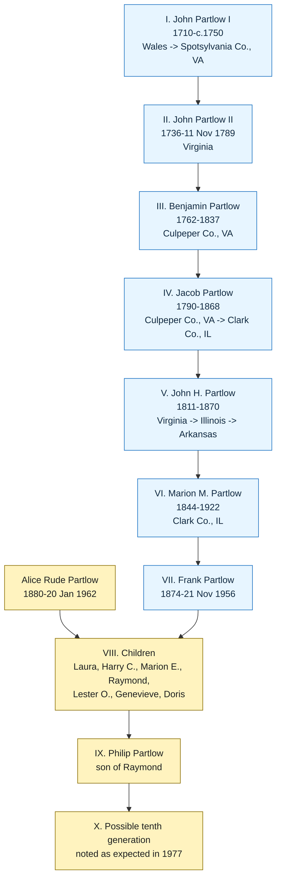
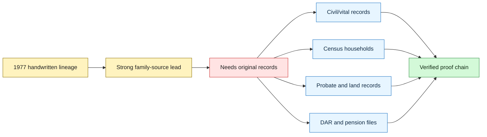

# Harry C Partlow 1960 Letter and Handwritten Lineage

This reference summarizes a three-page scanned PDF found at `/mnt/c/Users/zach/Dropbox (Old)/Tom/Tom/partlow_family.pdf`.

## Description

The PDF contains:

1. A typed letter from **Harry C. Partlow**, attorney at law, Casey, Illinois, dated **26 Aug 1960**, to **Mrs. Alice Partlow**, 23 West Pasadena Avenue, Phoenix, Arizona.
2. A handwritten page dated **29 May 1977**, titled **"Partlow Line of Descent in America for Eight Generations."**

The typed letter describes Harry's trip to Partlow, Virginia, where he visited the Partlow store, a church, and a cemetery. He reported seeing monuments for **Willie E. Partlow** and **Lancelot Partlow**, and a church window memorializing **Captain L. Partlow**, who was said to have founded the church in 1856. The letter says Harry was told Captain L. Partlow was a Revolutionary War veteran and father of Lancelot Partlow.

That Virginia branch appears related to the surname/place history, but it is not yet proved to be the same line as the Benjamin-to-Marion Elizabeth Partlow chain.

## Handwritten Lineage

The handwritten lineage gives this proposed descent:

| Generation | Person | Notes on handwritten page |
|---|---|---|
| I | John Partlow I | 1710-c. 1750; first Partlow in America in 1735; came from Wales; settled in Spotsylvania County, Virginia; founder of Partlow, Virginia. |
| II | John Partlow II | 1736-11 Nov 1789; Virginia. |
| III | Benjamin Partlow | 1762-1837; Culpeper County, Virginia. |
| IV | Jacob Partlow | 1790-1868; born Culpeper County, Virginia; died Clark County, Illinois. |
| V | John H. Partlow | 1811-1870; born Virginia; came to Illinois in 1839; died in Arkansas after going there for health; reportedly buried on Boston Mountain near Fayetteville. |
| VI | Marion M. Partlow | 1844-1922; Clark County, Illinois; wives listed as Martha L. Bowles, Julia A. Ellender, and Carrie "Willie" Berry. |
| VII | Frank Partlow | 1874-21 Nov 1956; Clark County, Illinois; married 10 Jun 1900 to Alice Rude Partlow, 1880-20 Jan 1962. |
| VIII | Children of Frank and Alice Rude Partlow | Laura Partlow Junker, Harry C. Partlow, Marion E. Partlow Copley, Raymond Partlow, Lester O. Partlow, Genevieve Partlow Elmore, Doris Partlow Wild. |
| IX | Philip Partlow | Son of Raymond Partlow. |
| X | possible child of Philip and Donna | Note says Donna, Philip's wife, was pregnant and there might soon be a tenth generation. |

## Research Value

This is the strongest family-source support found so far for the exact line:

**Marion Elizabeth Partlow Copley** -> **Frank / Nollie Franklin Partlow** -> **Marion M. Partlow** -> **John H. Partlow** -> **Jacob Partlow** -> **Benjamin Partlow**.

It also supplies targeted places and dates for follow-up research:

- Jacob Partlow: born in Culpeper County, Virginia; died in Clark County, Illinois.
- John H. Partlow: born in Virginia, migrated to Illinois in 1839, died in Arkansas in 1870.
- Marion M. Partlow: three marriages, with Martha L. Bowles as first wife and likely mother of Frank / Nollie Franklin Partlow.
- Frank / Nollie Franklin Partlow: married Alice Rude on 10 Jun 1900.

## Evidence Cautions

- This is a family manuscript, not an original civil, church, probate, land, or pension record.
- The typed letter's Captain L. / Lancelot Partlow branch may be a collateral Virginia Partlow line rather than Zach's direct line.
- The handwritten page uses **Frank Partlow**, while other notes and Ancestry leads use **Nollie Franklin Partlow**. Treat these as the same person only after confirming with marriage, census, death, obituary, or cemetery records.
- The handwritten page gives **Alice Rude Partlow** as Frank's wife, clarifying that the earlier "Mary Alice Partlow, nee unknown" lead may be **Mary Alice Rude**.

## Source

1. `/mnt/c/Users/zach/Dropbox (Old)/Tom/Tom/partlow_family.pdf` - three-page scan containing Harry C. Partlow letter dated 26 Aug 1960 and handwritten Partlow lineage dated 29 May 1977.
