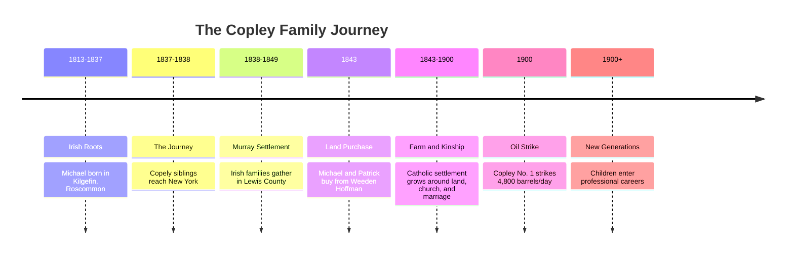

# The Copley Family Narrative

📊 For a generation-by-generation visual guide to the people in this story, see [[Family Tree]].

## The Family Arc: An Overview

## Chapter 1 — Irish Roots

The wind moved low and cold over the fields of [[Places/Kilgefin Ireland|Kilgefin, Roscommon]], and the Copley children learned early that land could be both cradle and trial. In this parish world of chapel bells and tenancy pressure, [[People/Michael Copley Sr|Michael Copley]] came of age with siblings and near-kin who would become part of the family’s migration story: [[People/Patrick Copley|Patrick Copley]], [[People/Bridget Copley Reynolds|Bridget Copley Reynolds]], [[People/Catherine Kitty Copley Hannon|Catherine Kitty Copley Hannon]], [[People/William Copley|William Copley]], and likely [[People/Mary Copely Giblin|Mary Copely Giblin]].

The records are thin, but the pressure is visible in the era itself: tithe disputes, agrarian strain, and uncertainty for Catholic families in the 1820s and 1830s.[^irish-context] Later evidence has sharpened the location. A Catholic **Copely** family remained in Fairymount, Kilgefin after Michael emigrated: William Copely, born about 1794, died there in 1864, and his son Michael Copely married Bridget Gibbons in a Roman Catholic ceremony that same year.[^fairymount]

*[_Speculative based on typical patterns in western Irish migration:_ Michael likely grew up in a kin-and-neighbor network where departure was first discussed as a temporary labor strategy, not a permanent goodbye.]*

And in nearby [[Places/Kinawley Ireland|Kinawley, County Fermanagh]], [[People/Ann Copley|Ann Copley]] began her own path. She entered American family memory as Ann Munday, but current evidence now supports a working conclusion that the original Irish surname was probably **Murray**: Griffith’s Valuation shows multiple Murray occupiers in Kinawley and no Munday entries in Kinawley or all Fermanagh, while Lewis County census searches found no independent Munday household in the settlement period.[^murray] Family memory says her father died in the Potomac far from home, a sorrow that traveled ahead of her into the American story.[^potomac-gap]

## Chapter 2 — The Journey

By the late 1830s, the Atlantic had become a bridge for survival. Passenger lists suggest the siblings did not all travel together: Patrick and Bridget likely sailed first, with Michael following as “Copely” on a later manifest.[^manifests] That spelling matters. In Ireland and in early American records, **Copely** appears to mark the Catholic Roscommon branch more consistently than the Protestant **Copley** families around Termon Beg and Castlerea.

The ships reached New York, but New York was not the destination. Work was. Roads, canals, rail grades, and rough camps pulled immigrants inland. The Copley path, like so many Irish paths, appears to have moved toward a labor frontier where wages, however harsh, could be turned into land.

*[_Speculative based on labor patterns:_ their first American years probably alternated between temporary boarding, camp work, and chain-migration support from already-arrived siblings.]*

## Chapter 3 — The Murray Settlement

In the timbered hills of [[Places/Lewis County West Virginia|Lewis County, West Virginia]] (then Virginia), the family’s center of gravity shifted from movement to settlement. The older narrative leaned heavily on B&O Railroad labor as the mechanism, and that remains plausible background. The stronger current framework is broader: the Irish community around Cove Lick, Camden, and Loveberry appears to have formed through turnpike-era labor, Catholic parish networks, land purchase, and chain migration. The [[Topics/Murray Settlement|Murray Settlement]] research now treats this as a coordinated community transplant rather than a random scattering of immigrants.[^murray-settlement]

The 1843 agreement with [[People/Weeden Hoffman|Weeden Hoffman]] was not just a contract; it was a declaration of intention. Michael and Patrick bought 200 acres, tying the family to the land that would become the base of the West Virginia line.[^land] If labor gave them entry, land gave them permanence.

The Copleys built around field seasons, church routines, and hard winters. Michael and Ann raised a large family, and one son, [[People/John Copley|John Copley]], would hold the line into the next century. Around them were related or allied Irish Catholic families: Dolans, Murrays, Hanleys, Hannons, Gilloolys, and others. The emerging pattern is not only family migration, but neighborhood migration.

## Chapter 4 — Oil and Opportunity

In September 1900, the story cracked open with the earth itself. The [[Topics/1900 Copley Oil Strike|Copley No. 1 Oil Strike]] came in with enormous force, reportedly around 4,800 barrels per day. In local memory it was spectacle: black flow, overflow into creek beds, and suddenly, new possibilities.[^oil]

For [[People/John Copley|John Copley]] and [[People/Mary Ellen Dolan Copley|Mary Ellen Dolan Copley]], this was opportunity tempered by loss. Mary Ellen died in 1901, close behind the strike, and the family had to navigate grief while managing a transformed asset base.

*[_Speculative pending lease/probate confirmation:_ the oil revenues likely financed education choices for the children in ways impossible on farm income alone.]*

## Chapter 5 — New Generations

The children of John and Mary Ellen carried the family into professional America. [[People/Ellen Bernadine Nelle Copley Sardo|Ellen Bernadine "Nelle" Copley Sardo]] moved into nursing and education; [[People/Michael Joseph Copley|Michael Joseph Copley]] moved into advanced chemistry and federal scientific leadership. Their lines spread through medicine, engineering, academia, business, social work, and policy.

The story also widened sideways. Mary Copely Giblin, born in Roscommon in 1814 and buried in Crawford County, Iowa in 1884, is now the strongest known sign that the Roscommon Copely network did not flow only to West Virginia. It branched across the American Midwest as well, carrying the same spelling, generation, and migration-era clues.[^iowa]

From Roscommon fields to Iowa cemeteries, West Virginia farms, laboratories, and lecture halls, the family arc widened across states and decades. Yet the old questions remain at the edge of the page: Who were Michael’s parents in Kilgefin? Which Kinawley Murray household was Ann’s family? What documents settle the Quartermaster claim, the Dolan reconstruction, the oil royalty story?

So the narrative closes where good genealogy always opens—at the archive door.

---

## Notes and Citation Anchors

[^irish-context]: Historical context on Irish conditions and tithe-era pressures: <https://www.askaboutireland.ie/griffith-valuation/> and Roscommon tithe resources: <https://titheapplotmentbooks.nationalarchives.ie/pagestab/Roscommon/>.
[^fairymount]: Fairymount/Kilgefin Catholic Copely evidence summarized in [[Topics/Captain John Copley Research]] and [[Topics/Bredon Descent]]; civil registration notes identify William Copely of Fairymount and Michael Copely's 1864 Catholic marriage to Bridget Gibbons.
[^murray]: RQ-M5 evidence summarized in [[RQ-M5-PHASE-2-FINDINGS]], [[RQ-M5-TITHE-APPLOTMENT-SEARCH]], and [[People/Ann Copley]].
[^potomac-gap]: Ann Munday father-drowning narrative is currently oral-history level; corroboration strategy documented in [[Phase 1 Questions and Answers]].
[^manifests]: Findings synthesis on *Kutusoff* (1837) and *Powhatan* (1838) passenger evidence in `/home/ubuntu/copley_research_findings.md`.
[^land]: 1843 land agreement context in analysis/findings synthesis; additional title-chain work needed at Lewis County records.
[^murray-settlement]: See [[Topics/Murray Settlement]] and [[Topics/Murray Settlement Research Roadmap]] for the current settlement framework, including St. Michael's Church, Staunton-Parkersburg Turnpike context, and Murray/Dolan/Hanley/Hannon estate-mate evidence.
[^oil]: Oil well documentation and marker context: <https://www.hmdb.org/results.asp?Search=County&State=West%20Virginia&County=Lewis%20County>; period publication: <https://archive.org/stream/oilwelldrillerhi00whitrich/oilwelldrillerhi00whitrich_djvu.txt>.
[^iowa]: See [[People/Mary Copely Giblin]] and related Iowa Copley pages for the current working reconstruction of the Iowa branch.

See also: [[Family Tree]], [[People Directory]], [[Topics and Themes]], [[Bibliography and Acquisition Guide]].
