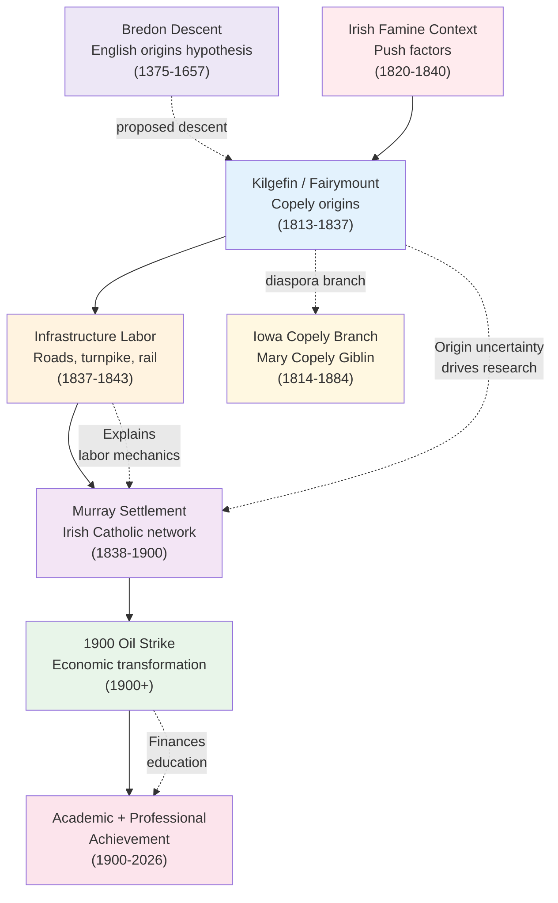

# Topics and Themes

📊 Keep [[Family Tree]] open while reading this page to connect each theme to the relevant generations and branches.

For the full event/topic directory, use [[Topics/_Topics Index|Topics Index]].

For claim-by-claim source status, use [[Sources and Evidence Index]].

## Place Reference Hub

For location-specific research plans, use [[Places/_Places Index|Places Index]]. Core anchors include [[Places/Kilgefin Ireland|Kilgefin]], [[Places/Kinawley Ireland|Kinawley]], [[Places/Lewis County West Virginia|Lewis County]], [[Places/Weston West Virginia|Weston]], and [[Places/Baltimore Maryland|Baltimore]].
## Detailed Topic Pages

- [[Topics/Bredon Descent|Bredon Descent]]
- [[Topics/Captain John Copley Research|Captain John Copley Research]]
- [[Topics/Murray Settlement|Murray Settlement]]
- [[Topics/Murray Settlement Research Roadmap|Murray Settlement Research Roadmap]]
- [[Topics/1900 Copley Oil Strike|1900 Copley Oil Strike]]
- [[Topics/Irish Famine and Emigration|Irish Famine and Emigration]]
- [[Topics/B&O Railroad Labor History|B&O Railroad Labor History]]
- [[Topics/Irish Immigration to West Virginia|Irish Immigration to West Virginia]]
- [[Topics/Academic and Scientific Achievement|Academic and Scientific Achievement]]
- [[Topics/Genealogical Research Methods|Genealogical Research Methods]]

---
## [[Topics/Murray Settlement|Murray Settlement]]

The current best framework for the immigrant generation is the Murray / Irish Settlement in southwestern Lewis County: a Catholic kin-and-neighbor cluster built around land, labor, church life, and families who may already have known one another in Ireland. It is now central to interpreting [[People/Michael Copley Sr|Michael Copley Sr.]], [[People/Ann Copley|Ann Copley]], and the Dolan, Murray, Hanley, Hannon, Gillooly, and related families.

- **Historical context:** chain migration, turnpike-era labor, Catholic parish formation, Irish neighborhood transplantation.
- **What is sourced:** Griffith's Valuation evidence for settlement surnames in Ireland; 1843 Copley land purchase; St. Michael's Church and local settlement leads.
- **What remains open:** exact Murray anchor family, Ann's Murray household, and the earliest Lewis County deed sequence.

See also: [[Topics/Murray Settlement Research Roadmap|Murray Settlement Research Roadmap]], [[RQ-M1-LEWIS-COUNTY-DEED-SEARCH|RQ-M1 Lewis County Deed Search]], [[RQ-M5-PHASE-2-FINDINGS|RQ-M5 Phase 2 Findings]].

---
## [[Topics/Bredon Descent|Bredon Descent and English Origins]]

The English-origin research connects the American Copleys to a proposed descent from the Bredon's Norton / Woolbedding Copleys through Captain John Copley, whose presence in the 1634 Visitation, the 1642 Parliament petition, the 1651 Youghal council book, and *Mettallum Martis* gives him a stronger evidentiary base than earlier AI-generated claims.

- **Historical context:** English gentry networks, recusancy, Catholic/Protestant ambiguity, Cromwellian Ireland, and later Roscommon Catholic Copelys.
- **What is sourced:** Thomas Copley Sr./Jr. family structure, Captain John's wife Margaret Newport, and Captain John's documented movement toward Ireland.
- **What remains open:** the missing generations between Captain John and Michael Copley Sr.; the exact relationship between William Copely of Fairymount and Michael Sr.

See also: [[Topics/Captain John Copley Research|Captain John Copley Research]], [[Topics/Copley Family Catholicism|Copley Family Catholicism]].

---
## [[Topics/B&O Railroad Labor History|Infrastructure Labor: Railroad and Turnpike Context]]

Irish immigrants in the 1840s–1850s were heavily recruited into difficult infrastructure work, including roads, turnpikes, canals, and rail construction. Earlier versions of the family story leaned on B&O Railroad labor; the Murray Settlement work now broadens that to a labor-frontier model with the Staunton-Parkersburg Turnpike as a likely local context.

- **Historical context:** infrastructure boom, dangerous manual labor, immigrant labor camps.
- **What is sourced:** broad pattern is well documented in regional history; turnpike context is documented as a research lead for the Lewis County settlement.
- **What remains open:** specific payroll/personnel proof for Michael or Patrick.

Sources:
- e-WV Irish in West Virginia: <https://www.wvencyclopedia.org/entries/830>
- West Virginia and the Irish (context article): <https://wvmetronews.com/2024/03/18/west-virginia-and-the-irish/>

---

## [[Topics/1900 Copley Oil Strike|1900 Copley Oil Strike]]

In September 1900, South Penn Oil’s Copley No. 1 well on family land reportedly flowed at roughly 4,800 barrels/day, becoming a landmark event in West Virginia petroleum history and a turning point in family wealth.

- **Historical context:** early 20th-century Appalachian petroleum expansion.
- **What is sourced:** marker history, period oil publications, local historical accounts.
- **What remains open:** exact lease terms, lifetime royalties, and heir distribution (Q24–Q26).

Sources:
- HMDB marker context: <https://www.hmdb.org/results.asp?Search=County&State=West%20Virginia&County=Lewis%20County>
- *The Oil Well Driller* (1905): <https://archive.org/stream/oilwelldrillerhi00whitrich/oilwelldrillerhi00whitrich_djvu.txt>

---

## Irish Origins in [[Places/Kilgefin Ireland|Kilgefin, Ireland]]

The strongest family-origin anchor is Michael’s gravestone claim of birth in Kilgefin parish, Roscommon. Later research added a Catholic Copely family at Fairymount, Kilgefin, including William Copely (b. ~1794, d. 1864) and his son Michael Copely, strengthening the case that the American line came from a real local Catholic Copely cluster.

- **Historical context:** Catholic households under tithe pressure and land insecurity.
- **What is sourced:** place-origin claim, civil-registration evidence for Fairymount Copelys, and available record systems.
- **What remains open:** parentage proof for [[People/Michael Copley Sr|Michael Copley]] (Q1), relationship proof tying William Copely of Fairymount to Michael Sr., confirmation of sibling cluster in parish records.

Sources:
- National Library of Ireland registers portal: <https://registers.nli.ie>
- Tithe Applotment portal (Roscommon): <https://titheapplotmentbooks.nationalarchives.ie/pagestab/Roscommon/>
- Griffith’s Valuation portal: <https://www.askaboutireland.ie/griffith-valuation/>

---

## Immigration to [[Places/Lewis County West Virginia|West Virginia]] via New York and the Potomac Corridor

Detailed page: [[Topics/Irish Immigration to West Virginia|Irish Immigration to West Virginia]]

Passenger records suggest staggered arrivals: Patrick/Bridget (1837, *Kutusoff*) and Michael (1838, *Powhatan* as “Copely”). Subsequent movement likely followed labor corridors toward Lewis County's Irish Settlement rather than a single, simple railroad route.

- **Historical context:** chain migration and labor-following settlement.
- **What is sourced:** manifests and local settlement chronology.
- **What remains open:** arrival route for [[Catherine Kitty Copley Hannon]] (Q8/Q10).

Sources:
- NARA immigration research hub: <https://www.archives.gov/research/immigration>
- Lewis County genealogy context: <https://www.familysearch.org/en/wiki/Lewis_County,_West_Virginia_Genealogy>

---

## [[Places/Lewis County West Virginia|Lewis County, West Virginia]] Settlement and Land Tenure

The 1843 agreement with [[Weeden Hoffman]] marks the family’s shift from mobile labor to rooted landholding. Long-horizon payment and eventual title completion mirror frontier-capital constraints of immigrant households.

- **Historical context:** installment acquisition, speculation-era title chains.
- **What is sourced:** agreement existence and locale.
- **What remains open:** full courthouse title chain and deed record alignment.

Sources:
- County history listing (book market references):
  - <https://www.amazon.com/Lewis-County-West-Virginia-crossroads/dp/0898658675>
  - <https://www.abebooks.com/Lewis-County-West-Virginia-pictorial-history/32167392339/bd>

---

## From Frontier Farming to Professional Careers

Across generations, the family transitions from immigrant labor and agrarian life to medicine, nursing, chemistry, engineering, and academic leadership. [[Ellen Bernadine Nelle Copley Sardo|Ellen Bernadine "Nelle" Copley Sardo]] and [[Michael Joseph Copley]] are central bridge figures.

- **Historical context:** education as mobility engine in 20th-century America.
- **What is sourced:** educational/professional identities in family reports and public profiles.
- **What remains open:** quantitative link between oil income and educational spending.

Sources:
- FamilySearch profile context for Michael Joseph Copley: <https://ancestors.familysearch.org/en/MVDR-37G/michael-joseph-copley-1898-1988>

---

## Cross-Theme Linkage

These themes are interdependent:

- [[Places/Kilgefin Ireland|Kilgefin, Ireland]] origin uncertainty drives Q1.
- [[Topics/Bredon Descent|Bredon Descent]] holds the English-origin hypothesis and source-quality distinctions.
- [[Topics/Murray Settlement|Murray Settlement]] is now the main framework for the Lewis County immigrant community.
- [[Topics/B&O Railroad Labor History|B&O Railroad Labor History]] remains useful as infrastructure-labor context, but the settlement explanation is broader than B&O alone.
- [[Topics/1900 Copley Oil Strike|1900 Copley Oil Strike]] likely underwrites transition to advanced professions.
- [[Topics/Academic and Scientific Achievement|Academic and Scientific Achievement]] documents professional outcomes.
- Unresolved documentary points (marriages, naturalization, service records) define the next archival phase.

See also: [[Family Tree]], [[Sources and Evidence Index]], [[Phase 1 Questions and Answers]], [[People Directory]], [[Topics/_Topics Index|Topics Index]], [[Places/_Places Index|Places Index]], [[Bibliography and Acquisition Guide]].
