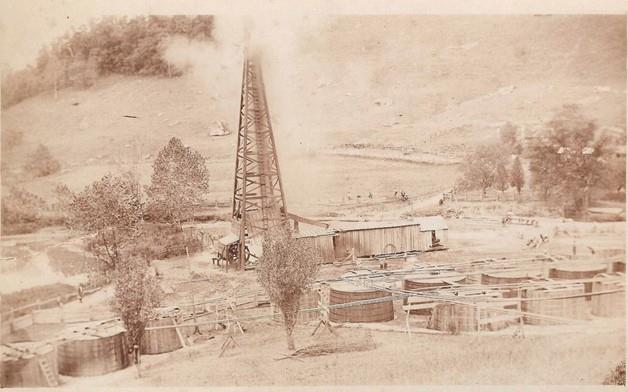
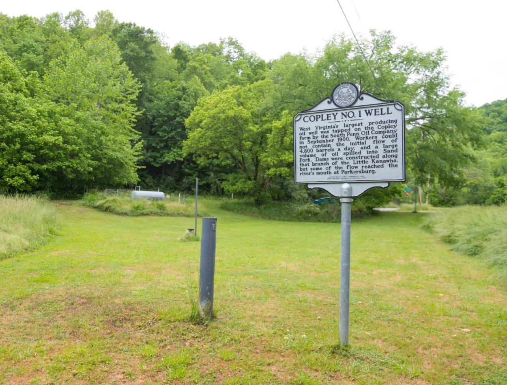
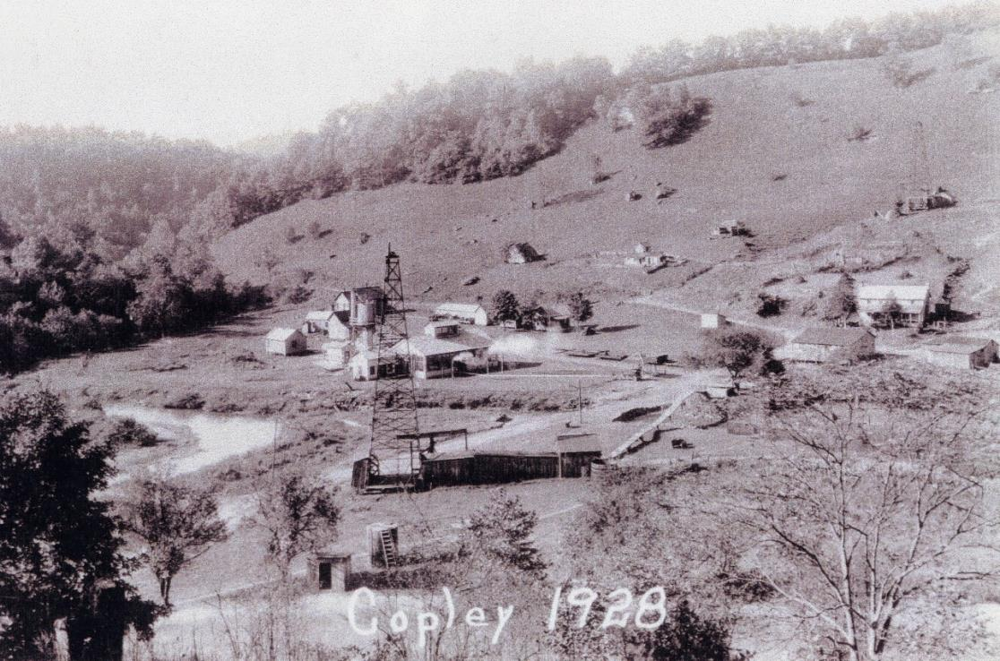

# 1900 Copley Oil Strike

## Historical Context
The **Copley No. 1 well** (South Penn Oil) was drilled on Copley-associated land in [[Places/Lewis County West Virginia|Lewis County, West Virginia]] and reportedly came in during September 1900 at roughly **4,800 barrels/day**. Within Appalachian petroleum history, this is treated as a major local strike and a turning point in the county’s oil economy.

Broader forces shaping the event:
- Rapid late-19th/early-20th century expansion of Appalachian oil leasing and drilling.
- Increasing value of private mineral rights in agrarian counties.
- Transition from household farming economies to royalty-linked cash flow.

## Copley Family Connection
- Core family figures tied to the event context:
  - [[John Copley]]
  - [[Michael Copley Sr]]
  - [[Ann Copley]]
  - [[Michael Joseph Copley]]
- Key location anchors:
  - [[Places/Lewis County West Virginia|Lewis County, West Virginia]]
  - [[Places/Cove Lick West Virginia|Cove Lick / Copley Road area]]
  - [[Places/Weston West Virginia|Weston, West Virginia]]

Family tradition and synthesis documents consistently frame the strike as the major economic inflection point that helped support later educational and professional advancement in the family’s 20th-century branches.

## Timeline
- **1843**: Hoffman-Copley land agreement establishes long-term Copley landholding base.
- **c. 1899-1900**: Leasing/drilling phase by South Penn Oil on/near Copley lands.
- **1900-09**: Copley No. 1 reportedly flows at ~4,800 bpd.
- **1900s onward**: Royalty/lease value becomes a major research question in family economic history.
- **1925**: Death of [[John Copley]]; probate period is a key target for inheritance distribution evidence.

## Primary Sources
1. Historical Marker Database (Copley No. 1 context):
   - <https://www.hmdb.org/results.asp?Search=County&State=West%20Virginia&County=Lewis%20County>
2. Charles A. Whiteshot, *The Oil Well Driller* (1905):
   - <https://archive.org/stream/oilwelldrillerhi00whitrich/oilwelldrillerhi00whitrich_djvu.txt>
3. Lewis County local history references:
   - <https://www.abebooks.com/Lewis-County-West-Virginia-pictorial-history/32167392339/bd>
4. Internal evidence synthesis:
   - [[copley_research_findings]]
   - [[copley_research_analysis]]
   - [[COPLEY HISTORY PART 1 final 2.pdf]]

Archive targets:
- Lewis County Clerk (deed/lease books c. 1899-1905).
- Lewis County probate files for John Copley estate.

## Research Gaps
- Exact lease terms (bonus, royalty percentage, duration, assignments).
- Verified lifetime production and total revenue of Copley No. 1.
- Precise distribution of oil-derived wealth among heirs.
- Whether multiple adjacent Copley-linked parcels were leased/drilled.

### Acquisition Strategies
- Pull deed + lease books around 1899-1901; extract all Copley/South Penn entries.
- Build a royalty ledger from probate, tax, and deed references.
- Cross-check production claims against period trade publications and state reports.

## See Also
- [[Topics/B&O Railroad Labor History|B&O Railroad Labor History]]
- [[Topics/Academic and Scientific Achievement|Academic and Scientific Achievement]]
- [[Topics and Themes]]
- [[Topics/_Topics Index|Topics Index]]
