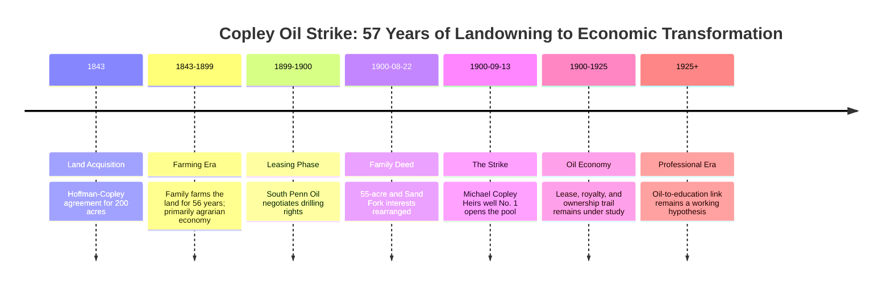

# 1900 Copley Oil Strike

## Historical Context
The **Copley No. 1 well** (South Penn Oil) was drilled on Copley-associated land in [[Places/Lewis County West Virginia|Lewis County, West Virginia]]. David B. Reger's 1927 AAPG article identifies it more precisely as **Michael Copley Heirs well No. 1**, completed **13 September 1900**, and identifies the property as the **Michael Copley Heirs 128-Acre Lease**. Within Appalachian petroleum history, this is treated as a major local strike and a turning point in the county's oil economy.

Broader forces shaping the event:
- Rapid late-19th/early-20th century expansion of Appalachian oil leasing and drilling.
- Increasing value of private mineral rights in agrarian counties.
- Transition from household farming economies to royalty-linked cash flow.

## Copley Family Connection
- Core family figures tied to the event context:
  - [[John Copley]]
  - [[Michael Copley Sr]]
  - [[Ann Copley]]
  - [[Michael Joseph Copley]]
- Key location anchors:
  - [[Places/Lewis County West Virginia|Lewis County, West Virginia]]
  - [[Places/Cove Lick West Virginia|Cove Lick / Copley Road area]]
  - [[Places/Weston West Virginia|Weston, West Virginia]]

Family tradition and synthesis documents consistently frame the strike as the major economic inflection point that helped support later educational and professional advancement in the family’s 20th-century branches.

June 2026 oil-title work substantially strengthened the property identification. Period sources use **Copley heirs' farm**, **Copley heirs' No. 3**, **Michael Copley Heirs well No. 1**, and the formal South Penn company designation **Michael Copley Heirs 128-Acre Lease**. The South Penn grantee index identifies a likely recorded Sand Fork lease: **Anna Copley to South Penn Oil Company, Lease, Deed Book 42 page 267, 128 acres on Sand Fork**. Book 42 was not available in the online FamilySearch deed-book images checked. A separate online companion lease at **Book 39 page 138** names Anna, Bridget, Margaret, and Sarah E. Copley as lessors to South Penn for a Land Fork tract. See [[References/Claude for Chrome Copley Heirs Oil Title Search]].

A separate family exchange deed, executed **22 August 1900**, records [[People/Ann Copley|Ann Copley]], daughters Margaret, Ann, Sarah, and Bridget Gillooly, Bridget's husband Patrick, and [[People/John Copley|John Copley]] rearranging interests involving Sand Fork and a 55-acre tract whose place-name reading remains unresolved. The deed was recorded **13 October 1900**, one month after the strike, and contains no oil, gas, mineral, royalty, lease, or South Penn language. It is important title-chain evidence, but it is not the 128-acre oil lease. See [[References/Claude for Chrome 1900 Copley Family Exchange Deed]].

## Timeline

```mermaid
timeline
    title Copley Oil Strike: 57 Years of Landowning to Economic Transformation
    
    1843 : Land Acquisition : Hoffman-Copley agreement for 200 acres
    1843-1899 : Farming Era : Family farms the land for 56 years; primarily agrarian economy
    1899-1900 : Leasing Phase : South Penn Oil negotiates drilling rights
    1900-08-22 : Family Deed : 55-acre and Sand Fork interests rearranged
    1900-09-13 : The Strike : Michael Copley Heirs well No. 1 opens the pool
    1900-1925 : Oil Economy : Lease, royalty, and ownership trail remains under study
    1925+ : Professional Era : Oil-to-education link remains a working hypothesis
```

### Timeline Anchors
- **1843**: Hoffman-Copley land agreement establishes long-term Copley landholding base.
- **c. 1899-1900**: Leasing/drilling phase by South Penn Oil on/near Copley lands.
- **1900-08-22**: Ann Copley, four daughters, Patrick Gillooly, and John Copley execute a family exchange deed involving Sand Fork and a 55-acre tract; the reason and connection to the separate oil lease remain unresolved.
- **1900-09-13**: South Penn completes Michael Copley Heirs well No. 1. Published initial-production figures vary by source and measurement point.
- **1900-10-13**: The family exchange deed is admitted to record.
- **1900s onward**: Royalty/lease value becomes a major research question in family economic history.
- **1925**: Death of [[John Copley]]; probate period is a key target for inheritance distribution evidence.

## Primary Sources
1. Historical Marker Database (Copley No. 1 context):
   - <https://www.hmdb.org/results.asp?Search=County&State=West%20Virginia&County=Lewis%20County>
2. Charles A. Whiteshot, *The Oil Well Driller* (1905):
   - <https://archive.org/stream/oilwelldrillerhi00whitrich/oilwelldrillerhi00whitrich_djvu.txt>
3. Lewis County local history references:
   - <https://www.abebooks.com/Lewis-County-West-Virginia-pictorial-history/32167392339/bd>
4. David B. Reger, "The Copley Oil Pool of West Virginia," *AAPG Bulletin* 11, no. 6 (June 1927):
   - <https://archive.org/details/sim_american-association-of-petroleum-geologists-aapg_1927-06_11_6/page/595/mode/1up>
5. *Oil and Gas Journal*, 14 November 1912:
   - <https://archive.org/details/sim_oil-gas-journal_1912-11-14_11_23>
6. Internal evidence synthesis:
   - [[copley_research_findings]]
   - [[copley_research_analysis]]
   - [[COPLEY HISTORY PART 1 final 2.pdf]]
   - [[References/Claude for Chrome Copley Heirs Oil Title Search]]
   - [[References/Claude for Chrome 1900 Copley Family Exchange Deed]]

Archive targets:
- Lewis County Clerk (deed/lease books c. 1899-1905).
- Lewis County probate files for John Copley estate.

## Research Gaps
- Exact lease terms (bonus, royalty percentage, duration, assignments) from the Book 42 page 267 Sand Fork lease.
- Names/signatures of every lessor on the Book 42 Anna Copley / South Penn lease.
- Exact volume, complete legal description, 55-acre place-name reading, and cited 1 May 1880 / Deed Book 11 / page 32? reference behind the located family exchange deed; page 32 and the page-92 area are negative, leaving pages 52, 62, 82, and 132 as the strongest next checks.
- Verified lifetime production and total revenue of Copley No. 1.
- Precise distribution of oil-derived wealth among heirs.
- Whether multiple adjacent Copley-linked parcels were leased/drilled.

### Acquisition Strategies
- Send the VR-06 certified-copy request for Deed Book 42 page 267 to the Lewis County Clerk or an offline microfilm source; it is indexed as Anna Copley to South Penn Oil Company, Lease, 128 acres on Sand Fork.
- Use the online Book 39 page 138 lease as companion context. Treat the Standard Oil grantee-index path as a bounded negative. Treat earlier low-resolution Eureka reads as unconfirmed; a high-resolution pass of Film 819924 images 391-392 found no Eureka Pipe Line / Copley / Book 42 entry. If continuing online deed-index work, inspect the remaining possible company / firm pages at native-tile resolution.
- Treat the Copley grantor-index Film 819917 / DGS 8219260 path as currently negative unless verifying the prior Colvin-to-Cork result.
- Search specifically for `Copley heirs`, `Michael Copley Heirs 128-Acre Lease`, `Copley Heirs Well No. 1`, `Copley heirs' No. 3`, and Sand Fork / Copley Oil Pool references in deed, lease, royalty, and title-chain records.
- Use record `6X4N-DWWY` as a located title-chain anchor, not as the oil lease; resolve its cited 1 May 1880 / Deed Book 11 / page 32? reference by checking Book 11 pages 52, 62, 82, and 132.
- Build a royalty ledger from probate, tax, and deed references.
- Cross-check production claims against period trade publications and state reports.

## See Also
- [[Topics/B&O Railroad Labor History|B&O Railroad Labor History]]
- [[Topics/Academic and Scientific Achievement|Academic and Scientific Achievement]]
- [[Topics and Themes]]
- [[Topics/_Topics Index|Topics Index]]
