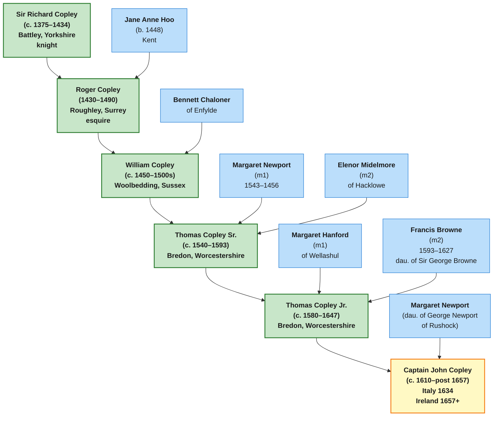

# Bredon Descent: Medieval Roots of the American Copleys

📊 This page documents the earliest verified Copley ancestors and their descent to Captain John Copley, who emigrated to Ireland in 1657 — establishing the genealogical foundation for all American Copleys descended through that line.

## Overview

The Copley family in England traces back to **Sir Richard Copley of Battley (c. 1375–1434)** in the medieval period. Through a carefully documented line of English gentry, the family progressed through Surrey (Roughley), Sussex (Woolbedding), and Worcestershire (Bredon), eventually sending younger sons to Ireland and America.

**Tom Copley's research (April 2026)** verified this descent through heraldic Visitations and established the genealogical chain connecting medieval Copleys to Captain John Copley, who appears in four primary sources documenting his activity in Ireland from 1642 onward.

## The Complete Bredon Descent (Sir Richard → Captain John)

```
Sir Richard Copley of Battley (c. 1375–1434)
    ↓
Roger Copley of Roughley (1430–1490) + Jane Anne Hoo (b. 1448)
    ↓
William Copley of Woolbedding (c. 1450–1500s) + Bennett Chaloner
    ↓
Thomas Copley Sr. of Bredon (c. 1540–1593) + m1: Margaret Newport, m2: Elenor Midelmore
    ↓
Thomas Copley Jr. of Bredon (c. 1580–1647) + m1: Margaret Hanford, m2: Francis Browne
    ↓
Captain John Copley (c. 1610–post 1657) + Margaret Newport (dau. of George Newport of Rushock)
```

## Mermaid Genealogical Diagram



## Generation-by-Generation Overview

### Generation 1: Sir Richard Copley (c. 1375–1434)

📄 Full profile: [[People/Sir Richard Copley|Sir Richard Copley]]

- **Location:** Battley, Yorkshire
- **Title:** Knight
- **Marriages:** Margaret Denton (m1), Elizabeth Harrington (m2, married 1423)
- **Known child:** Roger Copley

### Generation 2: Roger Copley (1430–1490)

📄 Full profile: [[People/Roger Copley|Roger Copley]]

- **Location:** Roughley, Surrey
- **Wife:** Jane Anne Hoo (b. 1448) — connected Copleys to the Hoo family of Kent
- **Children:** Sir Roger Copley, Richard Copley, William Copley, and six daughters (Anne, Eleanor, Dorothy, Margaret, Elizabeth, Ada)

### Generation 3: William Copley (c. 1450–1500s)

📄 Full profile: [[People/William Copley (Woolbedding)|William Copley of Woolbedding]]

- **Location:** Woolbedding (Wool Bedding), Sussex, also associated with Enfylde
- **Wife:** Bennett Chaloner of Enfylde
- **Child:** Thomas Copley Sr. — established the Bredon seat

### Generation 4: Thomas Copley Sr. (c. 1540–1593)

📄 Full profile: [[People/Thomas Copley Sr.|Thomas Copley Sr.]]

- **Location:** Bredon's Norton, Worcestershire (seat from which the line takes its name)
- **First wife:** Margaret Newport (m1)
- **Second wife:** Elenor Midelmore (m2) of Hacklowe
- **Children:** Thomas Copley Jr., Captain John Copley (per Tom's corrected reading of 1634 Visitation), William Copley of London, Peter, and daughters including Susanna, Eleanor, Dorothy
- **Catholic recusancy:** Notes suggest possible crypto-Catholic sympathies, consistent with the family's later connection to Irish Catholicism

### Generation 5: Thomas Copley Jr. (c. 1580–1647)

📄 Full profile: [[People/Thomas Copley Jr.|Thomas Copley Jr.]]

- **Location:** Bredon's Norton, Worcestershire (inherited from father)
- **First wife:** Margaret Hanford of Wellashul
- **Second wife:** Francis Browne (1593–1627), daughter of Sir George Browne / Viscount Montagu
- **Children by Margaret Hanford:** Captain John Copley, William Copley of London
- **Children by Francis Browne:** Thomas Copley III (b. 1627, clockmaker, London), George Copley (merchant, London)
- **Family circumstances:** Death in 1647 left younger sons without inheritance; emigration to Ireland (Captain John) was likely a response to limited English prospects

### Generation 6: Captain John Copley (c. 1610–post 1657)

📄 Full profile: [[People/Captain John Copley|Captain John Copley]]

- **Location:** England until 1657; Italy 1634 (documented in Visitation); moved to Ireland 1657 after Kingswood ironworks venture
- **Wife:** Margaret Newport, daughter of George Newport of Rushock
- **Children:** Unknown (research gap)
- **Significance:** First documented Copley in Ireland; four verified primary sources establish his presence there (1642 Parliamentary petition, 1651 Youghal clerk-of-market, 1656–57 Kingswood ironworks, 1657 move to Ireland)
- **Speculative descendants:** Page 3 notes suggest descent through John Copley → Anthony → John of Kilgefin line, potentially connecting to Michael Copley Sr. of Roscommon

## Tom Copley's Handwritten Family Tree Notes

In April 2026, Tom Copley synthesized decades of family research into a three-page handwritten genealogical chart. These notes show the complete Bredon descent from Sir Richard of Battley through to 17th-century Irish branches.

### Page 1: Bredon Descent - Sir Richard through William Copley


**Key content:** Sir Richard Copley of Battley → Roger Copley of Roughley + Jane Anne Hoo → William Copley + Bennett Chaloner of Enfylde, with daughters.

### Page 2: Thomas Copley Sr. and Thomas Copley Jr. with Both Wives


**Key content:** Thomas Sr. (Bredon) with m1: Margaret Newport and m2: Elenor Midelmore; Thomas Jr. with m1: Margaret Hanford (showing Captain John C and William C of London as children) and m2: Francis Browne (showing Thomas C III and George as children).

### Page 3: Irish Branches from Captain John - Roscommon and Boston Lines


**Key content:** From Captain John C:
- **Roscommon line:** John Copley (Cork/Limerick) → Anthony → John (m. 1634, Cork) → John of Kilgefin (speculative connection to Michael Copley Sr.)
- **Boston line:** From Charles C & Susan: Henry Copley (soldier in Ireland, Cork/Limerick, = Marie Bennett) and Richard Copley (= Mary Singleton, emigrated to Boston) → John Singleton Copley (portrait artist)

**Note on Page 3 updates:** Tom's note "Some changes may be needed in Pg 3 as a result of our AI stuff" refers to recent findings:
- Fairymount Copely Catholic branch (William b. ~1794, Michael b. ~1834) confirmed in Kilgefin parish, supporting the existence of Copleys in the Irish location shown on Page 3
- Mary Copely Giblin (b. 1814, Tully, Kilcorkey) documented, confirming the Roscommon Copely scatter
- The speculative "John Copley of Kilgefin" descent shown on Page 3 is now supported by evidence of Catholic Copleys in Kilgefin, though the exact genealogical link remains to be documented

## Historical Context: Why the Bredon Line Matters

### The English Gentry Network

The Copleys of Bredon were part of the English gentry class during the Tudor and Stuart periods (1485–1660). The family:

- Held lands in Worcestershire (primary seat at Bredon's Norton)
- Intermarried with other gentry families (Newport, Hoo, Chaloner, Browne, Midelmore)
- Likely held Catholic sympathies during the Protestant Reformation (Tom's "crypto-Catholic" hypothesis; see [[Topics/Copley Family Catholicism|Copley Family Catholicism]])
- Tom Copley adds that a recusant Thomas Copley who fled to the Continent did not surrender his English land; after his death, his wife and son William reclaimed it in England, showing the family retained property ties even through exile
- Dorsey's 1885 history strengthens that picture: Thomas settled Mersham Park on his wife and children, and the family had settlements that prevented forfeiture when his lands were targeted
- Sent younger sons abroad (Ireland, possibly America) to seek fortune and escape religious persecution or economic constraints

### The Irish Connection

Captain John Copley's move to Ireland in 1657 (documented in *Mettallum Martis*) placed him in a strategic position:

- Post-English Civil War Ireland was undergoing major upheaval and reorganization
- The Kingswood ironworks venture (1656–1657) was a lucrative enterprise
- Moving to Ireland provided both business opportunity and potential escape from Protestant England (if the family harbored Catholic sympathies)
- Tom's land-retention correction weakens any simple "dispossessed and gone" reading: at least one recusant Copley branch kept enough legal standing to recover English land after exile
- Dorsey's account also notes Mrs. Copley coming from Gatton to deal with inquiries into lands and goods of those abroad without license, showing the family remained actively engaged in legal defense of its estates

### The American Branch

From the Irish Copleys, the line eventually reaches America:

- **Michael Copley Sr.** (b. 1813, Kilgefin, Roscommon) emigrated to Lewis County, West Virginia in 1838
- His descendants (G24–G28) populate the American family tree documented in the wiki

The Bredon descent thus explains the journey: **medieval Yorkshire → Tudor Worcestershire → Stuart Ireland → 19th-century America**.

## Tom vs. Steve: The Origins Debate

Tom Copley advocates for **Captain John Copley as the direct ancestor** of Michael Copley Sr. via speculative descent through Irish generations.

Steve Copley has proposed **Christopher Copley (Yorkshire)** as an alternate progenitor, requiring a hypothetical out-of-wedlock son to make genealogical sense. However, Christopher and Mary Jones had only one documented child: daughter Francis. **This alternate hypothesis is mathematically impossible given the documented records**, making Captain John Copley the stronger evidence-based claim.

**Resolution:** Four primary sources verify Captain John's existence and Irish presence (1642–1657+); no primary sources document Christopher as a progenitor of the American Copleys.

## Primary Sources

The Bredon descent is verified through:

1. **Visitations of Worcestershire (1569, 1634)** — Document the family from Thomas Sr. onward with dates, wives' names, children, and coats of arms
2. **Visitations of Surrey and Sussex** — Document earlier generations (Roger, William)
3. **Journal of the House of Commons (1642)** — Parliament petition by "John Copley" re: Ireland
4. **Council Book of Youghal (1651)** — Records Captain John Copley as Clerk of the Market
5. **Dud Dudley, *Mettallum Martis* (1665)** — Names Kingswood ironworks 1656–57; mentions move to Ireland 1657
6. **Heraldic records** — Coat of arms documented for Thomas Copley Sr. and descendants

## Research Gaps & Next Steps

**Unresolved questions:**

1. **Captain John's children:** Names, dates, marriages unknown. The speculative descent through "John of Kilgefin" to Michael Copley Sr. is based on generation timing and surname, not documentary evidence.
2. **William Copley of Fairymount (b. ~1794):** Catholic Copely found in Kilgefin 1864; possible older brother or father of Michael Copley Sr. — genealogical relationship unclear.
3. **Ann Munday/Murray:** Michael Copley Sr.'s wife; "Munday" not found in Griffith's Valuation or Kinawley records; may be transcription error for "Murray" (see [[Topics/Murray Settlement|Murray Settlement RQ-M5]]).

**Priority research actions:**

- Search LDS microfilm 989747 (Catholic parochial records, Cloontuskert/Kilgefin/Curraghroe, 1865–1881) for Copley/Copely, Hanley, Dolan, Murray baptisms that might link Fairymount Copelys to Michael Sr.
- Locate Captain John Copley's will or estate records (if they survive)
- Search Irish Civil Registration for Copley births c. 1610–1700
- Verify the "John of Kilgefin" → Michael Sr. descent via documentary evidence

## See Also

- [[People/Captain John Copley|Captain John Copley]] — Detailed profile with four primary sources
- [[Topics/Captain John Copley Research|Captain John Copley Research]] — Comprehensive research notes
- [[Topics/Murray Settlement|Murray Settlement]] — Lewis County WV settlement hypothesis; includes research on the Roscommon community that may have included Copleys
- [[Topics/Copley Family Catholicism|Copley Family Catholicism]] — Tom's hypothesis on crypto-Catholic sympathies in the family
- [[Family Tree|Family Tree]] — Visual Mermaid diagram of all documented generations

## Sources

1. Visitations of Worcestershire (1569, 1634)
2. Visitations of Surrey and Sussex (15th–16th centuries)
3. Journal of the House of Commons (1642)
4. Council Book of Youghal (1651)
5. Dud Dudley, *Mettallum Martis* (1665)
6. Tom Copley handwritten genealogical notes (3-page chart, April 2026)
7. Heraldic records and coats of arms (Thomas Copley Sr. and descendants)
