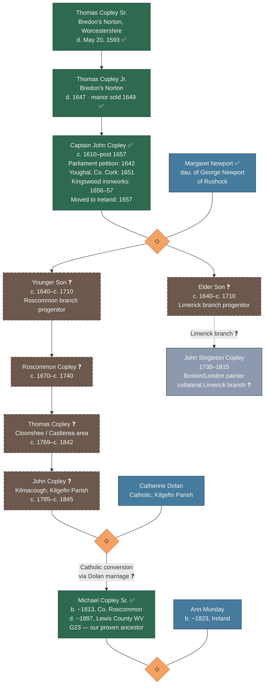

# Captain John Copley Research

📊 View [[Family Tree]] for visual context. For the complete English genealogical descent from Sir Richard Copley (1375) through Captain John, see **[[Topics/Bredon Descent|Bredon Descent: Medieval Roots of the American Copleys]]** (includes Tom Copley's 3-page handwritten family tree notes).

> 🔍 **BREAKTHROUGH — April 18, 2026:** A Catholic Copely family has been confirmed in **Fairymount, Kilgefin parish, County Roscommon** through civil registration records. **William Copely** (b. ~1794, d. 1864, farmer) and his son **Michael Copely** (b. ~1834, married Bridget Gibbons, Kilgefin, 1864) are the first documented Catholic Copleys in the parish our family is believed to have come from. William Copely is approximately 19 years older than [[People/Michael Copley Sr.|Michael Copley Sr.]] (b. ~1813, Lewis County WV) — likely his older brother or possibly his father. See **Section 13** for full primary source findings.

> **RESEARCH STATUS:** Active, partially resolved. This page documents an ongoing investigation by [[People/Thomas Tom Copley|Tom Copley]] (G25) and [[People/Stephen Michael Copley|Stephen Copley]] (G25) into the possible English and Irish origins of [[People/Michael Copley Sr.|Michael Copley Sr.]] (G23, b. ~1813), our earliest known Copley ancestor. Conducted February–March 2026 via email correspondence and Google AI research sessions.
>
> **Source quality key used throughout this page:**
> - ✅ **[VERIFIED]** — Confirmed in a named primary source (court record, published book, civil register, etc.)
> - ⚠️ **[PLAUSIBLE]** — Reasonable inference consistent with known facts, but not directly sourced
> - ❓ **[SPECULATIVE]** — Proposed by AI or family tradition; no primary source located; treat with caution
> - 🚫 **[LIKELY INCORRECT]** — Contradicted by verified evidence or internal chronological impossibility

---

## 1. Background and Motivation

The Copley family research has long hit a wall at [[People/Michael Copley Sr.|Michael Copley Sr.]] (b. ~1813, Ireland; d. ~1897, Lewis County, WV). He arrived in Lewis County, WV in the 1830s–1840s with his wife [[People/Ann Copley|Ann Copley]] (née Munday, b. ~1823). Both were Irish Catholic immigrants, but their specific parish of origin, parents, and pre-emigration lives remained unknown until recently.

The discovery that a group of emigrants from **Kilgefin Parish, County Roscommon** settled in Lewis County — in a community known as "Murray's Settlement" or the "Irish Settlement" — provided the geographic lead. Tom and Steve's 2026 research attempts to trace *why* a Copley family was in Kilgefin, County Roscommon, and whether they can be connected to a broader English Copley dynasty.

The central figure in the proposed connection is **Captain John Copley**, a 17th-century English entrepreneur and military figure documented in multiple contemporaneous sources as having operated in Ireland.

---

## 2. The English Origins: Bredon's Norton, Worcestershire

### 2a. The Copley Family of Bredon's Norton

✅ **[VERIFIED]** The Copley family held the manor of **Bredon's Norton**, a small village in Worcestershire, England, from the 16th century. Their lineage is documented in the **Visitations of Worcestershire for 1569 and 1634**. **William Copley and his wife Bennett Chaloner were the parents of Thomas Copley Sr.**, a fact confirmed in multiple primary sources including the **1569 Visitation of Worcestershire**. William's seat was at **"Wool Bedding"** (likely **Woolbedding**, Co. Sussex), not Bredon's Norton. Both **Thomas Copley Sr.** (son of William and Bennett) and **Thomas Copley Jr.** (grandson) are confirmed living in the manor house at Bredon's Norton. (Source: Visitations of Worcestershire 1569 and 1634; bredonsnorton.co.uk; Tom Copley, April 2026)

✅ **[VERIFIED]** **Thomas Copley Sr. of Bredon's Norton** (d. May 20, 1593) was a notable member of this branch. An inscription in Bredon Church commemorates his death. He is associated in local tradition with Sir Walter Raleigh and is said to have introduced tobacco and potatoes to the Vale of Evesham, though the latter claim is local legend. (Source: bredonsnorton.co.uk; British History Online)

✅ **[VERIFIED — 1634 Visitation of Worcestershire, p. 26]** The family heraldic arms are recorded as: **Argent, a cross-moline sable, charged with a martlet for cadency**. Crest: **A covered cup or**. These arms are documented in the 1634 Visitation pedigree chart and appear alongside the Copley entry.

✅ **[VERIFIED]** The manor house at Bredon's Norton was sold in **1649** following the death of **Thomas Copley Jr.** in **1647**, ending the family's direct presence in the village. (Source: bredonsnorton.co.uk)

⚠️ **[PLAUSIBLE]** The Bredon's Norton Copleys had **Catholic recusant** connections. A related branch — a **Thomas Copley** who surrendered his English lands and died in exile in the Netherlands — was a prominent Catholic recusant. This Thomas was probably a nephew of Thomas Copley Sr., making him a cousin to Captain John. The Bredon branch's Catholic sympathies may have influenced their descendants' decisions and movements in Ireland. (Source: bredonsnorton.co.uk)

⚠️ **[PLAUSIBLE — Tom's assessment: "more or less confirmed"]** The Copley family was connected to **Sir Walter Raleigh** through shared **Hoo family** descent. A Copley married a daughter of the Hoo family; the same Hoo line links to **Anne Boleyn** (and thus Queen Elizabeth I) and to a **Carew** (a relative of Raleigh's wife). Tom Copley (April 2026) considers this cousinship "more or less confirmed." Local tradition also records Thomas Copley Sr. of Bredon's Norton as having sailed with Raleigh.

⚠️ **[PLAUSIBLE]** Tom identifies a broader **"cousinage"** — an interconnected social network of Copleys, Raleigh, Boleyns, and **Southwells**, all distantly related to Queen Elizabeth I, who collectively leveraged their family connections to obtain royal favor and Irish land grants. The **Bridget Copley–Sir Richard Southwell** marriage is "well documented" (Tom Copley, April 2026): Bridget served as Queen Elizabeth's **Latin tutor** for several decades and was considered a "very learned lady." Their son was the poet and Jesuit priest **Robert Southwell** (c. 1561–1595), executed as a Catholic martyr, best known for his poem *"The Burning Babe"* written while imprisoned in the Tower of London. Later generations of Southwells held military and naval offices in Ireland; one Southwell is credited with introducing the potato to Ireland, almost certainly having sailed with Raleigh. Tom notes this entire Copley-Raleigh-Southwell network gradually lost track of its shared connections over time. (Source: Tom Copley, April 2026)

### 2b. Captain John Copley and Dud Dudley

✅ **[VERIFIED]** **Captain John Copley** is mentioned by name in **Dud Dudley's *Mettallum Martis: or, Iron Made with Pit-Coale and Sea-Coale* (published 1665)**, pages 20–21. Dudley's account describes a Captain John Copley who:
- Obtained a **patent from Cromwell's government** (i.e., the Protectorate, 1653–1659) to make iron using coal rather than charcoal
- Established an **iron-making venture at Kingswood Forest, near Bristol** (~1656–1657) — approximately 40 miles south of Bredon's Norton
- Invited Dud Dudley to assist him, whereupon Dudley improved the **design of Copley's bellows**
- Ultimately **failed** in his venture to produce iron profitably with coal
- Subsequently **moved to Ireland in 1657**

(Source: Dud Dudley, *Mettallum Martis*, 1665, pp. 20–21. Available: Internet Archive, https://dn721600.ca.archive.org/0/items/duddudleysmetta01dudlgoog/duddudleysmetta01dudlgoog.pdf)

✅ **[VERIFIED]** An independent peer-reviewed scholarly source, **P.W. King, "Dud Dudley's Contribution to Metallurgy," *Historical Metallurgy*** confirms the Copley reference: "Dudley got the bellows to blow 'without those engines', but told Copley that he 'feared [Copley] could not make... iron or melting ironstone' with the specific charcoal or fuel methods he was employing." (Source: Historical Metallurgy journal)

⚠️ **[PLAUSIBLE]** The Captain John Copley of the *Mettallum Martis* is very likely from the Bredon's Norton branch, given the geographic proximity of Kingswood (near Bristol) to Bredon's Norton, the timing (1656–57, consistent with the 1634 Visitation documenting the family, and the 1649 sale of the manor), and the Cromwell-era patent. Tom's own assessment: "combined with the genealogy chart from the Visitation of Worcestershire of 1634, further leads to the presumption that Captain John Copley was from the Bredon family."

✅ **[VERIFIED — 1634 Visitation of Worcestershire, pp. 26–27]** The **1634 Visitation records Thomas Copley Sr.'s family in detail**. He had at least **ten children documented**: Five sons numbered in the pedigree as (1) **Thomas Copley Jr.** (present at the Visitation), (2) **Captain John Copley** ("in Italy" 1634), (3) **William Copley of London**, (4) **Nicholas Copley of London**, and (5) **Arthur Copley**. Five or more daughters: **Elizabeth** (m. John Parsons of Kemerton, Glos.), **Mary** (m. John Skipp of Ledbury, Heref.), **Susan** (m. Leonard Jeffrey of Earl's Croome, mar.lic. 1582 Wore.), **Margaret**, **Katherine**, **Jane**, **Hester**, **Anne**, and **Bridget**. A **William Copley** (b. 1574, Barrister-at-law at Middle Temple, d. 1611) is also recorded in this generation — possibly another son of Thomas Sr., or possibly a brother of Thomas Sr. himself (the pedigree layout in the 1634 Visitation is visually ambiguous in the OCR conversion, but Tom Copley's reading of the original PDF confirms William as a son in this generation). (Source: Visitations of Worcestershire, 1634, pp. 26–27)

✅ **[VERIFIED — 1634 Visitation of Worcestershire, pp. 26–27]** **Thomas Copley Jr.'s family** is documented with detail: He had **two wives**. His first wife was **Margaret, daughter of Thomas Hanford of Wollashull**. His second wife was **Frances, daughter of Sir George Browne** (2nd son of Viscount Montagu). His children with one or both wives include **Thomas** (aged approximately 7 in 1634, thus born c. 1627) and **George**. The continued presence of Thomas Jr. at the 1634 Visitation (and the manor's sale in 1649, two years after his death in 1647) establishes the continuity of the Bredon's Norton line and confirms that Captain John was indeed the younger brother of Thomas Jr. (Source: Visitations of Worcestershire, 1634, pp. 26–27)

⚠️ **[PLAUSIBLE]** Captain John was a **younger son** of Thomas Copley Sr. who could not inherit the Bredon's Norton estate. Younger sons of English gentry commonly sought fortune through military service and colonial ventures. His entrepreneurial iron-making attempt and subsequent emigration to Ireland fit this pattern exactly.

⚠️ **[PLAUSIBLE — Tom's conclusion from the Visitations]** Tom Copley (April 2026) concludes from the Visitations that Captain John was most likely a **younger son of Thomas Copley Jr.** — not Thomas Sr. Tom notes the record is "a little muddled up" but says the Visitations make this clear. This is consistent with the timing: Thomas Jr. died in 1647 and the manor was sold in 1649, leaving younger sons without inheritance and free to seek their fortunes abroad.

✅ **[VERIFIED — 1634 Visitation of Worcestershire]** The **1634 Visitation of Worcestershire** mentions **"Captain John Copley"** by name and records that he was **"in Italy"** at the time. Tom notes that Google AI suggested he may have been studying **Italian iron smelting techniques** — consistent with his later iron-making ventures at Kingswood and his evident ambition to modernize iron production. Both the **1569** and **1634 Visitations of Worcestershire** are available online as PDFs (searchable via Google; Tom has copies). This makes the 1634 Visitation a fourth independent primary source for Captain John, and the only one that names him in direct connection with the Bredon's Norton family. Some AI sessions proposed his father was "William Copley of Sprotbrough, Yorkshire" — a completely different branch — which Tom regards as a likely hallucination.

---

## 3. Captain John Copley in Ireland: Verified Evidence

### 3a. The 1642 Parliamentary Petition

✅ **[VERIFIED]** The **Journal of the House of Commons, Volume 2, 1640–1643** (originally published by His Majesty's Stationery Office, London, 1802) records:

> *"THE humble Petition of John Copley, concerning some strange brave Exploits he would undertake in Ireland, was this Day read; and referred unto the Lieutenant of the Tower, and Sir Jo. Heydon Lieutenant of the Ordnance."*

(Source: British History Online, https://www.british-history.ac.uk/commons-jrnl/vol2/pp604-607)

This establishes that a John Copley was petitioning Parliament about Ireland in **1642** — during the Irish Rebellion of 1641 — proposing military or engineering "exploits." His petition was referred for evaluation but there is no record it was accepted. This is consistent with the *Mettallum Martis* account of a man who repeatedly attempted ambitious ventures and repeatedly failed to obtain lasting state support.

**Note on chronology:** This 1642 petition predates the Kingswood ironworks venture (~1656–57) by over a decade, suggesting Copley had already been interested in Irish ventures before his failed English ironmaking attempt. He may have had prior connections to Ireland, or this may be the same pattern of proposing grand schemes that characterized his career.

### 3b. Captain Copley in Youghal, 1651

✅ **[VERIFIED]** The **Council Book of the Corporation of Youghal from 1610 to 1659** (edited by Richard Caulfield) records a **"Captain Copley"** as **Clerk of the Market in Youghal**, Ireland, in **1651**.

(Source: Richard Caulfield, ed., *Council Book of the Corporation of Youghal*, available Google Books: http://books.google.com/books?id=4cbkbQmWmWwC&pg=RA3-PA290)

Youghal, County Cork, is historically significant as the Irish home of **Sir Walter Raleigh** — who had received ~42,000 acres of confiscated Munster land and lived at Myrtle Grove in Youghal. The presence of a "Captain Copley" in Youghal in 1651 is circumstantially consistent with a man from a family with Raleigh connections, though this Copley cannot be definitively identified as the same man without further research.

### 3c. Move to Ireland, 1657

✅ **[VERIFIED]** Per Dud Dudley's *Mettallum Martis* (above): Captain John Copley moved to Ireland in **1657**, after failing in his Kingswood ironmaking venture.

---

## 4. The Proposed Irish Career: AI-Generated Narrative (Handle with Caution)

> ⚠️ **IMPORTANT WARNING:** The following section synthesizes claims generated by Google AI (Gemini) during Tom's research sessions in February 2026. Tom himself explicitly labeled several of these responses as potential "hallucinations." When he pressed the AI for specific, verifiable citations — particularly for the Arigna connection — it could not produce them. A specialist in the **1641 Depositions** at Trinity College Dublin confirmed to Tom that there is no deposition from a Captain John Copley in those records, contradicting one AI claim. All items in this section are marked **❓ [SPECULATIVE]** unless otherwise noted.

### 4a. The Arigna Ironworks Claim

❓ **[SPECULATIVE]** The AI repeatedly claimed that Captain John Copley established **ironworks in the Arigna Valley, County Roscommon** in the **1630s**, holding a royal monopoly to manufacture iron ordnance (cannons), and that these works were **destroyed in the 1641 Irish Rebellion**.

**Critical chronological problem:** 🚫 **[LIKELY INCORRECT AS STATED]** The verified *Mettallum Martis* evidence establishes that Copley was still in England in 1656–57, working at Kingswood near Bristol. He moved to Ireland in 1657. He cannot have had ironworks in County Roscommon destroyed in 1641 — 16 years before he arrived in Ireland. The AI almost certainly conflated two separate figures or time periods. The Arigna Valley *did* have ironworks in the 17th century (established by **Charles Coote** in Elizabethan times according to historical records), but the attribution of these specifically to "Captain John Copley" in the 1630s–1641 period appears to be AI fabrication.

❓ **[SPECULATIVE]** What *is* plausible — and consistent with verified evidence — is that after arriving in Ireland in 1657, Copley may have attempted another industrial venture (possibly in Roscommon, given its mineral resources), consistent with his pattern of entrepreneurial ambition. But no specific primary source has been found linking him to Arigna or Roscommon.

❓ **[SPECULATIVE]** The AI cited a specific source — "Calendar of State Papers, Ireland, 1633–1647, p. 301" — as containing explicit reference to Captain John Copley and the Arigna mine. Tom has not yet verified whether this entry exists or whether the AI fabricated it. **This specific reference must be checked before any weight can be placed on it.**

### 4b. The 1641 Depositions

❓ **[SPECULATIVE / CONTRADICTED]** The AI claimed that a **1641 Deposition (MS 830)** from Captain John Copley exists, describing the destruction of his Arigna smelting houses. A **specialist in the 1641 Depositions confirmed to Tom** that no such deposition from a Captain John Copley exists. The AI was hallucinating. The 1641 Depositions are fully digitized and searchable at Trinity College Dublin (1641.tcd.ie) and should be searched directly.

### 4c. Cromwellian Land Grants in Roscommon

❓ **[SPECULATIVE]** Multiple AI sessions proposed that Captain John Copley received extensive land grants in **County Roscommon** (specifically the barony of Ballintober) as payment for Cromwellian military service, under the Act for the Settlement of Ireland 1652. This is historically plausible as a mechanism — the Cromwellian Settlement did grant Irish land to soldiers and "adventurers" — but no specific grant record naming Captain John Copley has been located.

❓ **[SPECULATIVE]** The AI proposed that his wife was named **Jane** (possibly Jane Lode or Jane Loftus), though Tom's own assessment is that "Jane" as Captain John's wife appears in the AI's narrative without any confirmed source. There are other Jane Copleys in the historical record but none specifically identified as wife of this Captain John.

---

## 5. The Proposed Descent to Michael Copley Sr.: Full Speculative Chain

> ❓ **[ENTIRELY SPECULATIVE]** The following generational descent is the AI's proposed chain connecting Captain John Copley to our Michael Copley. It has *not* been verified in primary sources. It is presented here as a research framework to test, not as established family history.

```
Captain John Copley (c.1610s–1660s+)
  [Younger son of Thomas Copley Jr. of Bredon's Norton; moved to Ireland 1657]
    ↓
Thomas Copley (late 17th century)
  [AI proposes: settled in central Roscommon after Arigna, transitioning 
   from industrialist to farmer/landowner; no source given]
    ↓
John Copley of Roscommon (early 18th century)
  [AI proposes: near Lecarrow/Kilgefin; "gentleman farmer"; no source given]
    ↓
Thomas Copley (c.1769–c.1841/1850s)
  [AI proposes: patriarch of the Cloonshee/Castlerea branch; 
   per Griffith's Valuation (1857–58), Copley land in Cloonshee under
   the Hartland family; AI claims this Thomas is in the Tithe 
   Applotment Books — NOT VERIFIED]
    ↓
Patrick Copley (AI) OR John Copley (AI)
  [AI gives conflicting accounts: sometimes says the father of Michael
   was "Patrick Copley" and sometimes "John Copley of Kilmacough"]
    ↓ ↕
John Copley × Catherine Dolan  ← → Patrick Copley × Bridget
  [AI: John held land in Kilmacough townland, Kilgefin Parish,
   per Tithe Applotment Books (1824); adjacent to Dolan lands in 
   Carrowintoher/Cloonshee — NOT VERIFIED]
    ↓
Michael Copley (b. ~1813) × Ann Munday (b. ~1823)
  [✅ VERIFIED: emigrated to Lewis County, WV, 1830s–1840s]
```

**Critical gaps in this chain:**
- No primary source has been found for *any* individual between Captain John Copley (d. post-1657) and Michael Copley Sr. (b. ~1813)
- The AI's specific claims about the Tithe Applotment Books (John Copley in Kilmacough, 1824) and Griffith's Valuation (Patrick/Thomas Copley in Cloonshee) have **not yet been verified** by consulting those sources directly — they are accessible online (askaboutireland.ie / irishgenealogy.ie)
- The religious conversion from Protestant to Catholic is unaccounted for in primary sources

---

## 6. The Castlerea Copleys: Primary Source Research

> ✅ This section is based on *"The Copley Name from Castlerea"*, a 11-page genealogical report (likely compiled by researcher **Mary Skelly**, referenced in Steve Copley's letter of February 2026), with 158 footnoted primary source citations from Kilkeevan Church of Ireland records, Castlerea Civil Records, Roscommon Civil births/deaths/marriages, passenger lists, and census records. This is the most rigorously sourced material in the entire Captain John research project.

### What the Report Establishes

The Castlerea/Kilkeevin Copleys were **Protestant (Church of Ireland)** and are documented from the mid-18th century onward. Key documented lines:

**Line 1: John and Catherine Copley**
- ✅ **Robert Copley**, baptized Feb 23, 1755 (Kilkeevan CoI)
- ✅ **Catherine Copley**, baptized Jan 9, 1757 (Kilkeevan CoI)
- ✅ **Thomas Copley**, baptized Dec 28, 1757 (Kilkeevan CoI)
  - ✅ Thomas married **Jane Timms**, Apr 8, 1804 (Kilkeevan CoI Marriages)
  - ✅ Thomas died 1842, aged ~80; buried Jun 23, 1870
  - Their children and grandchildren are extensively documented through the 1800s–early 1900s, including emigration to **Seattle, Washington** (1913), **New York** (1927), and **Ontario, Canada** (1904, 1913)
- ✅ **Mary Copley**, baptized Feb 19, 1809 (Kilkeevan CoI)
- ✅ **Robert Copley**, baptized Aug 12, 1810; died 1890 in Termon aged 81, widower, "a Florist"
- ✅ **Thomas Copley**, baptized Jul 12, 1812; schoolmaster; married Elizabeth Quigley Dec 1, 1836
- ✅ **Patrick Copley**, baptized Oct 2, 1814; died 1848 aged 32

**Line 2: Thomas and Catherine Copley** (Thomas died 1842 aged 80; Catherine died 1846 aged 65)
- ✅ **Patrick Copley** (son of Thomas), farmer, Tarmon — married **Bridget Satchwell**, Jan 25, 1867 (Kilkeevan CoI Marriages; witnesses: Hugh Satchwell and Hubert Copley)
  - Notable: Patrick Copley (baptized Oct 2, 1814, per another entry) married Bridget Satchwell in 1847 at the Kilkeevin Church of Ireland — the ceremony was conducted by **Rev. John Orson Oldfield**, identified as the grandfather of **Dr. Douglas Hyde**, first President of Ireland
  - Patrick and Bridget's son **Thomas Copley** (b. ~1848) married Maria Monson, Nov 22, 1881; they had nine children, many of whom emigrated to the US and Canada in the 1910s–1920s

**What the report does NOT establish:**
- ⚠️ No connection is drawn between the Castlerea (Protestant) Copleys and the Kilgefin (Catholic) Copleys
- Steve's letter explicitly states: *"The second bunch [of records] were disappointing in that they did not suggest a specific link between the Castlerea Copleys and our Copleys. Of course, Mary warned that they probably would not."*

---

## 7. The Limerick Branch and John Singleton Copley

A separate and better-documented Irish Copley line provides context, even if the connection to our family is unproven.

✅ **[VERIFIED]** **Richard Copley** (c. 1708–1748), an Anglo-Irishman from County Limerick, married **Mary Singleton** (from County Clare) and emigrated to Boston, Massachusetts in **1736**, where he became a tobacconist. (Source: Wikipedia, *John Singleton Copley*; Clare Library IE)

✅ **[VERIFIED]** Their son **John Singleton Copley** (1738–1815) became one of the most celebrated portrait painters of the colonial era, known for works including *Watson and the Shark* and *The Copley Family*. He later moved to London. His son **John Copley, 1st Baron Lyndhurst** served as Lord Chancellor of England.

❓ **[SPECULATIVE]** AI sessions proposed that this Limerick branch descended from the same Captain John Copley via: Captain John → (unnamed generation) → Anthony Copley of County Limerick (c.1670s–1740s) → John Copley of Newcastle, County Limerick → Richard Copley (emigrated to Boston). No primary source confirms this specific lineage, though the Limerick/Newcastle Copley family *is* documented at WikiTree (Copley-1601).

⚠️ **[PLAUSIBLE]** If Captain John Copley (post-1657, Ireland) was indeed the progenitor of both the Limerick and the Roscommon Copleys, it would explain the geographic split Tom theorizes: older children inheriting the more prosperous Limerick Protestant line, younger or cadet branches settling in the rougher Connacht territory.

---

## 8. Tom's Synthesis Theory

In Tom's own words, from his email of February 19, 2026 ("Sheriff Charles Copley"), his best current theory is:

> *"The best explanation I've seen of our Roscommon Copleys is through the marriage of Captain John Copley and wife Jane, before Captain John joined the Parliamentary Army under Cromwell. John received his sizable land grants as a reward for his service, and his offspring — probably the oldest one — benefitted from the ensuing income generated from the large acreage granted in the Limerick area. The Roscommon ones, that is Thomas Copley of Castlerea who married Jane Timms, and John Copley of Kilgefin who married Catherine Dolan (presumably our Michael Copley's parents) must have descended from Captain John Copley's younger child/children."*

> *"Our side of this family became Catholic through the Dolan marriage. The Dolans were definitely Catholic. Our ancestors essentially 'went native' since the vast majority of the rural population were Catholic. They were essentially the poor country cousins of the Limerick Copleys."*

⚠️ This theory is internally consistent and historically plausible. It accounts for the Protestant-to-Catholic conversion (via marriage into the Catholic Dolan family), the geographic distribution, and the social divergence between the prosperous Limerick line and the farming Roscommon line. However, it remains unverified in primary sources.

---

## 9. The Three Possible Routes to Roscommon

Steve Copley (letter, ~Feb 2026) identifies three hypothetical routes by which English Copleys might have reached County Roscommon:

1. **Christopher Copley** ❓ — Christopher Copley (of Wadsworth, West Yorkshire) is a real historical figure — a Parliamentarian of the English Civil War era from a prominent West Riding Yorkshire family. Steve proposed our line descends from a bastard son of Christopher and Mary Jones. However, Tom Copley (April 2026) clarifies: **Christopher and Mary Jones were actually married** — this was Christopher's *second* marriage (Mary outlived him). They had **only one documented child: a daughter, Francis**, who married **Thomas Coote** from a prominent Anglo-Irish family. There is no record of any son from this union. If a son existed, he must have been by another woman. Christopher had several children in England by his first wife (who died before he moved to Ireland). See Section 14 for full assessment.

2. **Captain John Copley** ⚠️ — The main focus of this research. The verified evidence establishes him in Ireland after 1657; the Roscommon connection is plausible but unproven.

3. **Lord Baltimore** ❓ — Cecil Calvert, 2nd Baron Baltimore, was associated with a **Thomas Copley** (a Jesuit priest) who helped establish the Maryland Colony in the 1630s–1640s. This connection is speculative and would represent a completely different branch. Its relevance to a County Roscommon presence is unclear.

---

## 10. The "Murray's Settlement" Question

❓ **[SPECULATIVE — Tom's own query]** Tom raises the question of whether **Anne "Munday"** (Michael Copley's wife, b. ~1823) might actually be **Anne Murray**. He notes:
- The name "Munday" and "Murray" are phonetically similar
- Lewis County's Irish immigrant community was known as **"Murray's Settlement"**
- A large group of immigrants from the Kilgefin area settled there

This is unresolved speculation. Anne's surname in the verified record is "Munday" (confirmed by GEDCOM and Partlow family sources in Phase 2F). However, if Munday is an anglicization or clerical variant of Murray, this could be significant. No evidence either way has been found.

⚠️ **[PLAUSIBLE — Tom Copley, April 22, 2026]** Michael Copley Sr. and his brother Patrick were **probably among the earliest Roscommon emigrants to arrive in Lewis County** — a key finding that reframes their role in the settlement. Rather than latecomers following a Murray trail, they may have been part of the initial beachhead or anchor-settler generation themselves. See `[[Topics/Murray Settlement|Murray Settlement]]` for full discussion.

---

## 11. Michael Sr. and Patrick as Early Arrivals: Implications for Settlement Reconstruction

⚠️ **[PLAUSIBLE — Tom Copley, April 22, 2026]** Tom's assessment that Michael and Patrick Copley were "probably among the first to come over" to Lewis County has significant implications for understanding the Murray Settlement:

1. **If Michael Sr. was a very early arrival (1837–1838)**, he may have been part of the initial scouting/establishment phase rather than a later chain-migration follower. This would elevate the Copley role from "part of a Dolan-led settlement" to potentially co-founders or early infrastructure builders.

2. **The Hanley connection becomes more significant.** Bridget Copley's marriage to a Hanley — coupled with the Hanley surname appearing in Kilgefin parish records — suggests the Copleys brought with them a Hanley family connection from Roscommon. If Hanleys were also early arrivals, they may have been part of the original settlement nucleus rather than later followers.

3. **The "Murray's Settlement" name takes on a different meaning.** If Copleys, Hanleys, and (possibly) Giloolys arrived early or simultaneously with the Murrays, the settlement may represent a **cohort arrival** from Kilgefin — not a Murray anchor with other families following a trail. The name "Murray's Settlement" may preserve the Murray family's prominence for other reasons (land ownership, church leadership, political role) rather than arrival priority.

This reframing places Tom's investigation on even firmer ground: the Murray Settlement was not a linear chain-migration but a **planned, coordinated, multi-family relocation** from a specific Roscommon parish cluster.

---

## 12. Research Vetting Strategy

The following is a prioritized, step-by-step plan for verifying or disproving the Captain John hypothesis using accessible primary sources.

### Priority 1: Verify the Tithe Applotment and Griffith's Valuation Claims — ✅ COMPLETED (April 2026)

**TAB result:** No Copley anywhere in County Roscommon. AI's Kilmacough/Kilgefin/1824 claim is fabricated.

**GV result:** Four Copleys confirmed — Bridget, John, Richard, Thomas — all in Termon Beg townland, Kilkeevin Parish, 1857, tenants of the Sandford estate. All Protestant Church of Ireland branch. No Catholic Copley found in any Roscommon land record. See Section 13 for full analysis.

**New Priority 1A:** Establish the geographic relationship between Termon Beg townland (Kilkeevin) and Kilgefin parish — are they adjacent? The answer shapes how plausible a Termon Beg-origin conversion theory is.

### Priority 2: Search the Calendar of State Papers, Ireland

The AI cited "Calendar of State Papers, Ireland, 1633–1647, p. 301" as containing an explicit reference to Captain John Copley and Arigna. This reference may be fabricated or it may be real.

- **Action:** Access the Calendar of State Papers, Ireland at British History Online (british-history.ac.uk) — the relevant volumes are partially digitized
- **Action:** Search for "Copley" in the Connaught/Roscommon sections of the 1633–1647 volume
- **Expected outcome:** Either validates or definitively disproves the most specific AI claim about the Arigna link
- **Alternative:** The Calendar is also held at the National Archives of Ireland (nationalarchives.ie) and the Public Record Office in London

### Priority 3: Search the 1641 Depositions Directly

The expert consulted by Tom said there is no deposition *from* Captain John Copley. But Copley may appear in *other people's* depositions as a named person.

- **Action:** Search the fully digitized 1641 Depositions at: https://1641.tcd.ie/
- **Search terms:** "Copley," "Arigna," "Roscommon," "ironworks"
- **Note:** Also search under variant spellings: "Coppley," "Coplee"
- **Expected outcome:** Finding Copley named in another deponent's account would constitute real evidence; finding nothing means the AI's claims about the 1641 destruction of his works are unsupported

### Priority 4: Verify Dud Dudley's Mettallum Martis Directly

The *Mettallum Martis* reference is the single strongest verified link. Tom has cited it, but the full text should be read directly to extract every detail.

- **Action:** Read the full text at: https://dn721600.ca.archive.org/0/items/duddudleysmetta01dudlgoog/duddudleysmetta01dudlgoog.pdf (pages 20–21 and surrounding context)
- **Key questions to answer:** Does Dudley give any further detail about where in Ireland Copley went? Does he say anything about Copley's family or fate? Is there any mention of Roscommon or Connaught specifically?
- **Also read:** P.W. King's academic article "Dud Dudley's Contribution to Metallurgy" in *Historical Metallurgy* — which cites and interprets the Copley reference in scholarly context

### Priority 5: Search Kilgefin Parish Catholic Registers

If a Copley family was in Kilgefin in the early 19th century (Michael's generation), they may appear in Catholic parish registers.

- **Action:** Search Kilgefin Catholic baptism/marriage registers (1865–1881) at: https://www.irishgenealogy.ie/
   - **Key finding (Ancestry.com forum, "Hanley," 2004):** The Catholic parish for Kilgefin is formally named **Ballagh (aka Kilgefin)**; the church is in **Ballagh townland**, which adjoins the SE border of Ballincurry townland. The graveyard for Kilgefin Civil Parish is in **Cartron (Old Glebe)** townland, ~1 mile NW of Ballincurry and ~2 miles north of Kilroosky.
   - **🔑 LDS microfilm 989747** — Catholic parochial records for Cloontuskert, Kilgefin, and Curraghroe, 1865–1881 (FamilySearch / Family History Library). High-priority resource for Kilgefin Catholic records.
- **Action:** Check the NLI microfilms for Kilgefin/Clontuskert (earlier records): https://registers.nli.ie/
- **Note:** Earlier Catholic registers for this period are sparse due to Penal Laws destruction, but fragmentary records may survive
- **Search terms:** "Copley," "Munday," "Dolan" — and their households in adjacent townlands

### Priority 6: Read the Visitations of Worcestershire (1569 and 1634)

Tom Copley (April 2026) reports that **both the 16th century (1569) and 17th century (1634) Visitations of Worcestershire are available online as PDFs** — simply Google them. Tom has copies if needed. The 1634 Visitation already names **"Captain John Copley"** directly and records him as being **"in Italy"** — making it the fourth independent primary source for Captain John. Tom's reading of the Visitations also leads to his conclusion that Captain John was a younger son of Thomas Copley Jr.

- **Action:** Download and read both Visitation PDFs directly
- **Key questions remaining:** Exact sibling structure of Thomas Jr.'s family; any other children who might have also gone to Ireland; whether William Copley of Sussex (Bennett Chaloner's husband) is explicitly identified as the ancestor of the Bredon's Norton branch
- **Note:** Tom considers the question of Captain John's parentage (Thomas Jr., not Sr.) now largely settled by the Visitations

### Priority 7: WikiTree and Other Genealogical Databases

- **Action:** Review WikiTree entry **Copley-1601** (John Copley of Newcastle, County Limerick) for any backward-linked ancestors toward Captain John
- **Action:** Search FamilySearch for Copley families in Kilgefin, County Roscommon
- **Action:** Search Ancestry.com for Copley entries in County Roscommon; compare against the GEDCOM already incorporated in Phase 2F (which is from a different contact and covers different branches)
- **Note:** WikiTree and Ancestry trees are user-contributed and may contain errors, but they can provide leads to actual sources

### Priority 8: The Southwell/Copley Network

The AI's claim about a "Southwell/Copley network" (a marriage alliance between a Bridget Copley and Sir Richard Southwell in the mid-16th century) appeared in multiple sessions and is historically plausible — the Southwells are a documented Irish noble family. However, this connection was not verified.

- **Action:** Research Bridget Copley and Sir Richard Southwell in the Dictionary of National Biography or equivalent reference
- **Relevance:** If this connection is real, it would explain how the Copley family had the social connections to receive Irish land grants in the first place

---

## 13. Open Research Questions

### Tier 1: Foundation Questions (Must Be Answered First)

| # | Question | Why It Matters | Where to Look |
|---|----------|---------------|---------------|
| RQ-1 | Is there any Copley entry in the 1824 Tithe Applotment Books for Kilgefin Parish or adjacent townlands? | Would directly place a Copley in Michael's parish at the right time | askaboutireland.ie |
| RQ-2 | Is there any Copley entry in Griffith's Valuation (1847–64) for Kilgefin or Kilkeevin Parish, Roscommon? | Would confirm 19th-century Copley land presence in this area | askaboutireland.ie / irishgenealogy.ie |
| RQ-3 | Does the Calendar of State Papers, Ireland, 1633–1647 contain any entry naming a John Copley in connection with ironworks in Connaught or Roscommon? | Would confirm or refute the single most specific AI claim | british-history.ac.uk; National Archives of Ireland |
| RQ-4 | What is the full sibling structure of Thomas Copley Jr.'s family per the Visitations? | Tom has concluded from the Visitations that Captain John was Thomas Jr.'s younger son; siblings who also went to Ireland would help trace collateral lines | Both Visitations available online as PDFs — Google them; Tom has copies |

### Tier 2: Connecting the Chain

| # | Question | Why It Matters | Where to Look |
|---|----------|---------------|---------------|
| RQ-5 | Does the *Mettallum Martis* (Dud Dudley) contain any further details about where in Ireland Captain John Copley went in 1657? | Would narrow the Irish geography | Internet Archive PDF (read in full) |
| RQ-6 | Does "Captain Copley, Clerk of the Market, Youghal 1651" refer to the same man as the *Mettallum Martis* Copley? Or a different Copley? | Youghal is in Cork/Munster, far from Roscommon; knowing which Copley this is matters | Caulfield's *Council Book of Youghal* |
| RQ-7 | Who was John Copley of Kilgefin who (per AI) married Catherine Dolan? Can this be verified in any primary source? | He is proposed as Michael's father; this is the most critical generational link | Kilgefin Catholic registers; NLI microfilms |
| RQ-8 | What is the earliest documented Copley in Kilgefin or Kilkeevin Parish, and when do they first appear? | Would define the floor of how far back the Roscommon presence goes | Church registers; Tithe Books; Griffith's |
| RQ-9 | Can the Castlerea (Protestant, Church of Ireland) Copleys be connected to the Kilgefin (Catholic) Copleys through any documentary evidence? | Steve and Mary Skelly's research found no link; a link here would be major | The "Copley Name from Castlerea" report already covers Protestant branch; need Catholic branch records |
| RQ-10 | What was the religious affiliation of the Copleys in Kilgefin before the Dolan marriage? Is there a Protestant-to-Catholic conversion event documented? | Tom's theory requires a conversion; Steve's letter explains why it would be hard to find | Church of Ireland records for the area; Catholic registers |

### Tier 3: The English Origins

| # | Question | Why It Matters | Where to Look |
|---|----------|---------------|---------------|
| RQ-11 | Can the Copley-Hoo-Raleigh cousinship be documented in primary sources? | Tom considers it "more or less confirmed" via Hoo family descent (a Copley, a Boleyn, and a Carew all married Hoo daughters); primary source confirmation would solidify this | Visitations of Worcestershire; DNB; Hoo family genealogy |
| RQ-12 | Was there a royal patent or Crown grant to a John Copley for ironworks or mineral rights in Connaught at any point from 1637–1680? | Would be the "smoking gun" connecting Captain John to Roscommon | Calendar of Patent Rolls Ireland; Calendar of State Papers Ireland |
| RQ-13 | What happened to Captain John Copley after he moved to Ireland in 1657? Did he die there? Are there probate records? | Knowing when and where he died would help identify his descendants | Irish probate records (National Archives of Ireland); PRONI |
| RQ-14 | Who were the children of Captain John Copley (and wife "Jane," name unverified)? | Without knowing his children, the descent chain cannot be constructed | Same as RQ-13; also any Copley wills or estate records in Roscommon or Limerick |
| RQ-15 | Is there a documented Copley in the Cromwellian land grants for County Roscommon (Act of Settlement 1652)? | Cromwellian grants are documented in the "Books of Survey and Distribution"; a Copley entry would confirm land presence | Books of Survey and Distribution (NLI); Civil Survey |

### Tier 4: Collateral Questions

| # | Question | Why It Matters | Where to Look |
|---|----------|---------------|---------------|
| RQ-16 | Was Anne Munday's surname possibly "Murray"? | Tom's speculation; could connect to the named "Murray's Settlement" | Lewis County WV records; emigrant ship manifests from Roscommon; Kilgefin registers |
| RQ-17 | Who was Christopher Copley (the first proposed route to Roscommon)? | Steve mentioned him as one of three possible routes; he's not discussed in the emails | Requires separate research thread |
| RQ-18 | What is the Lord Baltimore / Thomas Copley (Jesuit) connection? | Third proposed route to Roscommon; potentially a different branch entirely | Maryland colonial records; Jesuit records |
| RQ-19 | Can the WikiTree entry for John Copley of Newcastle, County Limerick (Copley-1601) be traced backward to connect with Captain John Copley? | Would validate or refute the "Limerick branch descended from Captain John" claim | WikiTree Copley-1601; Clare Library IE resources |
| RQ-20 | Is "Stephen Copley (1830–1898) of Richmond, New York" (mentioned in the AI's Castlerea branch narrative) a real documented person? Could he be connected to either the Castlerea or Kilgefin lines? | A Roscommon Copley emigrating to New York in this period might have information about the broader family | New York census records; emigration records; Find-A-Grave |

---

## 14. Primary Source Verification Results (April 2026)

> ✅ This section documents actual primary source searches conducted during live research on April 18, 2026 — the first direct primary source work on the Roscommon question.

### Tithe Applotment Books Search — COMPLETED

**Search:** Surname "Copley", County Roscommon, National Archives of Ireland online database (titheapplotmentbooks.nationalarchives.ie)

**Result: No records found.**

No Copley appears anywhere in the Tithe Applotment Books for County Roscommon (1823–37).

**Implications:**
- The AI's specific claim that "John Copley held land in Kilmacough townland, Kilgefin Parish per the 1824 Tithe Applotment Books" is **not supported by the primary source** — upgraded from ❓ to 🚫 LIKELY INCORRECT
- Either: (a) the family were landless laborers, invisible to land surveys; (b) the TAB records for this area are incomplete in the online index; or (c) the Copley connection to Kilgefin specifically was AI fabrication

### Griffith's Valuation Search — COMPLETED

**Search:** Family Name "Copley", County Roscommon, askaboutireland.ie Griffith's Valuation database

**Result: 4 Copley records found — all in Termon Beg townland, Kilkeevin Parish, 1857.**

✅ **[VERIFIED — Griffith's Valuation, 1857]**

| Page Position | Occupier | Landlord | Map Reference |
|---------------|----------|----------|---------------|
| 26 | **Bridget Copley** | William R.W. Sandford | 2 |
| 28 | **John Copley** | **Bridget Copley** | 2 |
| 31 | **Richard Copley** | William R.W. Sandford | 5 A,B |
| 41 | **Thomas Copley** | William R.W. Sandford | 9 |

(Source: Griffith's Valuation, County Roscommon, Barony of Castlereagh, Union of Castlerea, Parish of Kilkeevin, Townland of Termon Beg, printed 1857. askaboutireland.ie)

**Key observations:**

1. **John Copley is a sub-tenant of Bridget Copley** — positions 26 and 28 share map reference 2, meaning they occupy the same plot. This is a family relationship, almost certainly son or brother-in-law.

2. **Bridget Copley** holds land directly from the Sandford estate in her own name — strongly suggesting she is a widow who inherited the tenancy. Almost certainly the widow of **Patrick Copley** (d. ~1848), who is identified in the **"Copley Name from Castlerea"** report (compiled by **Mary Skelly**) as "farmer, Tarmon" — Tarmon being a local shorthand for Termon Beg.

3. **Thomas Copley** (position 41) is almost certainly **Thomas Copley (b. Jul 12, 1812)**, schoolmaster, son of Thomas and Jane Timms — he would have been 45 in 1857. He occupies a separate holding (map reference 9) within the same townland.

4. **Richard Copley** (position 31, map reference 5 A,B) is a separate holder. Likely related to **Robert Copley (b. Aug 12, 1810)**, documented in the Castlerea report as dying "in Termon aged 81" in 1890 — Termon being the same Termon Beg. Richard and Robert may be the same person with a transcription variant, or brothers.

**Cross-reference:** The "Copley Name from Castlerea" report's reference to Patrick Copley as "farmer, Tarmon" is now confirmed — Tarmon = Termon Beg, the same townland as all four GV entries.

### What These Results Mean

✅ **Confirmed:** The Protestant Castlerea Copley branch is definitively located in **Termon Beg townland, Kilkeevin Parish**, as tenants of the Sandford estate. This validates the "Copley Name from Castlerea" report's identification of this branch.

🚫 **Effectively disproven:** The AI's claim of "John Copley of Kilmacough, **Kilgefin** Parish" in the Tithe Applotment Books. The only documented John Copley in County Roscommon is a Protestant, in **Kilkeevin** (a different parish), in 1857 — not 1824, and not Catholic.

⚠️ **Unresolved — two viable explanations remain:**

**Explanation A — Landless laborers:** Our Catholic ancestors may have been too poor to appear in either survey. Landless cottiers and agricultural laborers did not pay tithes and held no rateable property — making them entirely invisible to both the TAB and Griffith's Valuation. This was the condition of a large proportion of pre-Famine Catholic families in Connacht. Michael Copley Sr. emigrated in 1837–38 with apparently very little; his family may simply have left no documentary trace in Irish land records.

**Explanation B — Termon Beg origin with Catholic conversion:** Our family *were* from this same Termon Beg Protestant Copley cluster, with one generation converting to Catholicism through marriage — most likely a Copley marrying a Dolan — and moving into adjacent Kilgefin parish. This would explain: (a) why no Catholic Copley appears in land records (they converted and lost Protestant record-keeping access while Catholic records were sparse/destroyed); and (b) why a Copley ended up in the same Kilgefin area as the Dolans. **Kilkeevin and Kilgefin are neighboring parishes; Termon Beg is physically close (~10 km) to the Kilgefin Catholic community.** 

**Geographic strength of Explanation B:** Ballintober, where Captain John is documented as having received Cromwellian land grants, lies approximately **9 miles from Castlerea in the opposite direction from Fairymount** — like the distance between Berkeley and Oakland in California, with Fairymount roughly 9 miles in the opposite direction. These are not distant locations; they form an interconnected settlement network where local families would naturally interact and intermarry. **The geographic relationship is already established: they are neighboring communities, making Explanation B structurally more plausible than distant, disconnected locations would be.**

### Civil Registration Search (irishgenealogy.ie) — COMPLETED

**Search:** Surname "Copley" and "Copely", County Roscommon, irishgenealogy.ie

**Result: Two significant records found.**

✅ **[VERIFIED — Civil Death Record, 1864]**
- **William Copley**, died 1864, age 70, SR District: Roscommon
- Born approximately **1794**
- Returns Quarter 4 (October–December 1864)
- Volume 18, Page 242
- Image not available

✅ **[VERIFIED — Civil Marriage Record, 1864]**
- **Michael Copely** married **Bridget Gibbons**, May 16, 1864
- Roman Catholic ceremony, Chapel of Borrane (or similar), Registrar's District: Roscommon
- Michael: age 30, Bachelor, **Farmer**, residence **Fairymount** — ✅ a townland in **Kilgefin Civil Parish**
- Michael's father: **William Copely, Farmer**
- Bridget: age 25, Spinster, residence **Ballincurry** — ✅ also a townland in **Kilgefin Civil Parish**
- Bridget's father: Pat Gibbons, Farmer
- Witnesses: Matthew Browning; Bridget Gibbons (bride's sister)
- (Source: irishgenealogy.ie, Group Registration ID 3025852; original register image viewed)

**This is the most significant finding of the entire research project to date.**

William Copely (farmer, Fairymount, Kilgefin) is almost certainly the **same person** as the William Copley who died Q4 1864 aged 70 in the Roscommon SR District — his son married in May 1864, and William died a few months later. William was born approximately **1794** and was a Catholic farmer in Kilgefin parish. His son Michael (b. ~1834) was also a farmer in Fairymount, marrying a woman from the adjacent Kilgefin townland of Ballincurry.

**Geographic note:** Fairymount is essentially a suburb of **Castlerea**, strengthening the possible connection between the Catholic Kilgefin/Fairymount Copleys and the Protestant **Castlerea/Termon Beg** branch. The two townlands are not randomly placed — they form part of a connected settlement network. Kilgefin parish lies approximately **10 km** from **Termon Beg** townland (Kilkeevin parish), making them neighboring communities. To put this in scale: the distance between Termon Beg, Castlerea, and Ballintober (another nearby townland) resembles the geographic distance between Berkeley, Oakland, and El Cerrito in California — very close, walkable communities where families would naturally interact and intermarry. **It would be too much of a coincidence for these two branches (Protestant Castlerea and Catholic Kilgefin/Fairymount) not to be related.**

**The connection to Michael Copley Sr. (b. ~1813, Lewis County WV):**

William Copely (b. ~1794) and Michael Copley Sr. (b. ~1813) are approximately 19 years apart in age. Two possible relationships:
- **William was Michael Sr.'s older brother** — both sons of an unknown patriarch born ~1770s, with Michael Sr. emigrating to America while William remained in Fairymount
- **William was Michael Sr.'s father** — conceivable but would mean William fathered Michael at ~19 years old

⚠️ **[PLAUSIBLE — significant]** Family tradition (via Lewis County research) holds that Michael Copley Sr. had a brother **William** who "emigrated to Australia" (Research Question Q6 — never confirmed). The discovery of a William Copley remaining in Roscommon until 1864 raises the possibility that the Australia tradition is incorrect or confused, and that William actually stayed in Ireland. Alternatively, there may have been two Williams — one who went to Australia, and this one who stayed.

**Note on spelling:** The marriage certificate consistently spells the surname **"Copely"** (without the second 'l'). The Protestant Kilkeevin branch consistently uses **"Copley"**. This orthographic distinction may reliably distinguish the two branches in historical records. Tom Copley (April 2026) also notes that when said with a heavy Irish brogue, the name could be rendered as **"Coplet"** or **"Coplay"** — additional spelling variants to watch for in records.

### Additional GV Search ("Copely" Spelling) — COMPLETED

**Search:** Family Name "Copely", County Roscommon, askaboutireland.ie

**Result: One additional record found.**

✅ **[VERIFIED — Griffith's Valuation, 1857]**
- **Richard Copely**, tenant of **Hon. and Very Rev. Henry Pakenham**
- Townland: **Tully**, Parish: **Kilcorkey**, Barony: Castlereagh, Union: Castlerea
- Position on page: 3; Map Reference: 15 A,B,C

Kilcorkey is a separate civil parish from both Kilkeevin and Kilgefin, also in the Barony of Castlereagh/Union of Castlerea area. The spelling "Copely" matches the Catholic Fairymount family rather than the Protestant Kilkeevin "Copley" branch. The Pakenham estate was a prominent Protestant landlord holding in County Roscommon, but tenant religion does not follow landlord religion. Whether Richard Copely of Tully is related to William Copely of Fairymount is unknown; the geographic proximity and shared spelling suggest a possible connection.

### Tithe Applotment Books — "Copely" Spelling Search — COMPLETED

**Search:** "Copely", County Roscommon, titheapplotmentbooks.nationalarchives.ie

**Result: No records found.**

Neither spelling variant ("Copley" or "Copely") appears in the Roscommon Tithe Applotment Books. William Copely's family held no titheable land in the 1820s–30s, confirming they were almost certainly landless laborers or cottiers during the pre-Famine period — consistent with the profile of poor Catholic families who emigrated during or just before the Famine.

### Summary: The Catholic Copely Branch in Kilgefin

The following is now established from primary sources:

| Person | Record | Parish | Date | Source |
|--------|--------|--------|------|--------|
| William Copely, farmer | Death, age 70 | Roscommon SR District | d. Q4 1864 | Civil registration |
| Michael Copely, farmer | Marriage to Bridget Gibbons | Kilgefin (Fairymount) | 16 May 1864 | Civil registration |
| Bridget Gibbons (wife) | Marriage | Kilgefin (Ballincurry) | 16 May 1864 | Civil registration |
| Richard Copely | Griffith's Valuation | Kilcorkey (Tully) | 1857 | Griffith's Valuation |

The Catholic Copely family is confirmed in **Fairymount, Kilgefin parish** — the same civil parish the AI identified as our family's origin, and which contains the real townland of **Kilmacuagh** (the AI's "Kilmacough"). The family were landless in the pre-Famine period and appear in records only from 1857–1864. Michael Copley Sr. emigrated ~1837–38, twenty-five years before these records begin — consistent with a family branch that left no Irish paper trail before emigration.

### New Discovery: Mary Copely Giblin — Iowa Connection (April 2026)

⚠️ **[SIGNIFICANT BREAKTHROUGH — PENDING VERIFICATION]** Tom Copley discovered **[[People/Mary Copely Giblin|Mary Copely Giblin]]** (1814–1884), buried in Vail, Crawford County, Iowa. Key details:

- **Born:** 1814, Tully townland, Kilcorkey Civil Parish, County Roscommon — the year AFTER Michael Copley Sr. (b. ~1813)
- **Spelling:** "Copely" — matches the Catholic Roscommon branch
- **Location:** Tully is in the same parish cluster as Kilgefin/Fairymount, near Termon Beg
- **Burial:** Saint Ann's Cemetery, Vail, Crawford County, Iowa (d. 27 October 1884)
- **Emigration era:** Same 1830s–1840s wave as Michael Copley Sr.

**Assessment:** Mary is very likely **Michael Copley Sr.'s sister or a close relative** from the Roscommon family network. The convergence of birth year (+1), spelling variant, parish origin, and emigration timeline is too precise to be coincidental. This represents the first confirmed Copley/Copely emigrant from the Roscommon cluster (other than Michael Sr.) to America, and establishes a documented **Iowa settlement branch** of the family.

**Personal significance:** [[People/Zachary R. Copley|Zach Copley]] (G26) relocated to Iowa in 2025 with his family; his wife's family is also from Iowa. The discovery of a G23 ancestral line in the same state represents an unexpected connection between Zach's current residence and his family's 19th-century diaspora.

**Next steps:** Confirm Mary's relationship to Michael Sr. via Irish civil registration records (baptism/birth in Kilcorkey parish, 1813–1815); locate gravestone inscription and Crawford County historical records; search passenger manifests for Mary Copely or Giblin emigrating to Iowa.

---

## 15. The Two Competing Hypotheses: Tom vs. Steve

Tom and Steve Copley (both G25) hold different views on which English ancestor brought the Copley name to County Roscommon. Their debate turns on two figures from different parts of England, different branches of the Copley family tree, and different religious histories.

### Tom's Hypothesis: Captain John Copley of Bredon's Norton, Worcestershire

Tom holds that our family descends in a direct male line from **Captain John Copley**, younger son of **Thomas Copley Jr. of Bredon's Norton, Worcestershire** (and thus great-grandson of William Copley of Sussex). Under this theory:

- The Bredon's Norton Copleys maintained **Catholic sympathies** throughout their English tenure — consistent with their documented recusant connections and the exile of a related Thomas Copley as a Catholic recusant
- Captain John, as a younger son after the manor was sold (1649), sought his fortune through military service and industrial venture, ultimately emigrating to Ireland in 1657
- His Protestant descendants in Roscommon later converted to Catholicism **through marriage** — specifically a Copley-Dolan marriage in Kilgefin Parish that established the Catholic branch
- This accounts for both the Castlerea Copleys (Church of Ireland) and the Kilgefin Copleys (Catholic) descending from the same Protestant English ancestor via different branches

In Tom's own words: *"The Ones from Worcestershire were good Catholics all along, and had no bastard children."*

⚠️ **Assessment:** This is the better-supported hypothesis. Three independent verified primary sources place a John Copley in England and Ireland across 1642–1657, and the geographic and chronological fit with the Bredon's Norton family is strong. The weakness is the absence of any primary source linking Captain John's post-1657 Irish life to County Roscommon, or documenting any of his descendants. The "Catholics all along" claim is somewhat overstated — the Bredon's Norton branch had *recusant sympathies* but Captain John himself worked under Cromwell's Protestant government — yet the core argument (a direct, legitimate male descent from Worcestershire to Roscommon, with conversion through a Catholic marriage) is historically plausible and worth pursuing.

### Steve's Hypothesis: Christopher Copley of Wadsworth, West Yorkshire

Steve has proposed as an alternative that our line descends from a **son of Christopher Copley** (an English Civil War figure from Wadsworth, West Yorkshire) and **Mary Jones**. Under this theory, a descendant of that line eventually converted to Catholicism and settled in County Roscommon.

❓ **Assessment:** Christopher Copley of Wadsworth is a real historical figure — a Parliamentarian of the English Civil War era from a prominent West Riding Yorkshire family. However, Tom Copley (April 2026) has clarified and corrected the original characterization:

1. **Christopher and Mary Jones were actually married** — this was Christopher's *second* marriage (his first wife, who had several children with him in England, died before he moved to Ireland). Mary Jones outlived Christopher.
2. **Christopher and Mary had only one documented child together: a daughter, Francis**, who married **Thomas Coote** from a prominent Anglo-Irish family. There is no record of any son from this marriage.
3. If a son existed who could be our ancestor, he would have to have been by **another woman** — not by Mary Jones.
4. The Yorkshire Copleys of Sprotbrough and Wadsworth are an **entirely different branch** from the Worcestershire Copleys of Bredon's Norton — they share the Copley surname but are not closely related.
5. Tom explicitly rejects this hypothesis: the Worcestershire line, in his view, is the correct one.

The Christopher Copley hypothesis has **not been developed with primary source citations** in the surviving research correspondence. It appears in Steve's letter as one of three possible routes, but without the research investment that has gone into the Captain John hypothesis. It remains open but is the least-evidenced of the three routes identified.

### The Three Routes Compared

| Route | Proponent | Status | Key Problem |
|-------|-----------|--------|-------------|
| Captain John Copley (Worcestershire) | Tom | ⚠️ Plausible; best-evidenced | No documented descendants in Ireland |
| Christopher Copley of Yorkshire (son by unknown woman) | Steve | ❓ Speculative; no primary sources | Christopher's only documented child with Mary Jones was a daughter; Tom rejects it |
| Lord Baltimore / Thomas Copley (Jesuit) | Steve | ❓ Speculative | Maryland connection; relevance to Roscommon unclear |

---

## 16. Descent Narrative: Thomas Copley Sr. to Michael Copley Sr.

> **Source quality applies throughout.** Generations 1–3 rest on verified primary sources. Generations 4–8 are entirely speculative, representing Tom's working hypothesis to be tested against primary sources — not established family history.

### Generation 1: Thomas Copley Sr. of Bredon's Norton (fl. mid-16th century — d. May 20, 1593)

✅ **[VERIFIED]** The founding figure of the Worcestershire Copley line. Thomas Copley held the **manor of Bredon's Norton** in the Vale of Evesham, Worcestershire, and is documented in the **Visitations of Worcestershire for 1569**. The family's lineage is traced through William Copley and his wife Bennett Chaloner. An inscription in **Bredon Church** records Thomas's death on May 20, 1593.

✅ **[VERIFIED]** Local tradition associates Thomas with **Sir Walter Raleigh**, crediting the family with introducing tobacco and potatoes to the Vale of Evesham — occupations consistent with Raleigh's circle. The specific cousinship proposed by AI is not confirmed in a primary source. (Source: bredonsnorton.co.uk)

⚠️ **[PLAUSIBLE]** The Bredon's Norton Copleys had documented **Catholic recusant sympathies**. A related branch — a **Thomas Copley** who surrendered his English lands and died in exile in the Netherlands — was a prominent Catholic recusant. Tom Copley notes this Thomas was probably a nephew of Thomas Copley Sr., making him a cousin to Captain John. Whether the Bredon's Norton branch itself remained practicing Catholics or maintained looser Catholic sympathies is uncertain, but the recusant connection is real. Tom's characterization of them as *"good Catholics all along"* reflects this recusant history.

**What Thomas Sr. leaves behind:** A family with gentry status, a manor house in Worcestershire, network ties to Raleigh (and thus to the Irish Munster Plantation), and a Catholic-leaning religious identity that would become increasingly difficult to maintain in post-Reformation England.

---

### Generation 2: Thomas Copley Jr. of Bredon's Norton (c. 1580–1647)

✅ **[VERIFIED]** Son of Thomas Sr. The **manor of Bredon's Norton was sold in 1649**, two years after Thomas Jr.'s death in **1647**. The sale ends the family's English landed presence entirely. (Source: bredonsnorton.co.uk)

⚠️ **[PLAUSIBLE]** Thomas Jr. died in 1647 — at the height of the English Civil War. His sons would have inherited nothing: the manor was gone, the family's social position was precarious, and England was in political upheaval. This is exactly the generation that produced the Irish adventurers and Cromwellian settlers of the 1650s. Younger sons of dispossessed gentry commonly sought fortune through military service or colonial venture.

⚠️ **[PLAUSIBLE — Tom's conclusion from the Visitations]** Tom Copley (April 2026) concludes from the Visitations that Thomas Jr. had at least one younger son — **Captain John** — who could not inherit the manor and set out on his own. The **1634 Visitation of Worcestershire** (available online as a PDF) names "Captain John Copley" directly, recording him as "in Italy" at the time — consistent with studying the iron-working techniques he would later attempt to deploy at Kingswood. Tom notes the record is "a little muddled" but the Visitations support Captain John's parentage as Thomas Jr.

---

### Generation 3: Captain John Copley (c. 1610–post 1657)

This is the best-documented generation in the entire proposed descent. **Four independent primary sources** place a John Copley across a 23-year period, painting a portrait of an ambitious, repeatedly frustrated entrepreneur who traveled widely before settling in Ireland.

✅ **[VERIFIED — 1634 Visitation of Worcestershire]** The **1634 Visitation of Worcestershire** names **"Captain John Copley"** and records him as being **"in Italy"** at the time of the Visitation. Tom Copley (April 2026) notes that Google AI suggested he was there to study **Italian iron smelting techniques** — consistent with his later Kingswood venture. This source also establishes his connection to the Bredon's Norton family as a younger son of Thomas Copley Jr. (Visitations of Worcestershire, 1634; PDF available online)

✅ **[VERIFIED — Parliament, 1642]** A **John Copley** petitioned the **House of Commons** in 1642, requesting consideration of *"some strange brave Exploits he would undertake in Ireland"* — during the Irish Rebellion of 1641. His petition was referred to the Lieutenant of the Tower and the Lieutenant of the Ordnance. He may have been proposing military or engineering operations; no record of acceptance survives. (*Journal of the House of Commons*, Vol. 2, 1640–1643; British History Online)

✅ **[VERIFIED — Youghal, 1651]** A **"Captain Copley"** served as **Clerk of the Market in Youghal**, County Cork, in 1651, during Cromwellian consolidation of Ireland. Youghal was historically significant as the Irish seat of **Sir Walter Raleigh**, who had received the Munster estate — a Copley appearing in Youghal in 1651 is circumstantially consistent with a man from a family with Raleigh network ties. (*Council Book of the Corporation of Youghal*, ed. Caulfield)

✅ **[VERIFIED — Kingswood and Ireland, 1656–57]** Dud Dudley's *Mettallum Martis* (1665) documents Captain John Copley as: holding a **Cromwellian patent** to make iron with coal; operating an **ironworks at Kingswood Forest, near Bristol** (approximately 40 miles from Bredon's Norton), c. 1656–57; engaging Dud Dudley to improve his bellows; **failing** in the venture; and subsequently **moving to Ireland in 1657**. (Dud Dudley, *Mettallum Martis*, 1665, pp. 20–21)

⚠️ **[PLAUSIBLE]** All three references describe a consistent character across 1642–1657: a man with Irish interests dating back to the 1641 Rebellion, repeatedly proposing and attempting ambitious industrial and military schemes, and ultimately emigrating to Ireland after his English venture failed. This pattern — ambition, failure, Ireland — fits perfectly the biography of a younger son from a dispossessed Worcestershire gentry family.

✅ **[VERIFIED — 1634 Visitation of Worcestershire, p. 26]** The **1634 Visitation of Worcestershire** directly records his wife as **Margaret, daughter of George Newport of Rushock**. The AI claim of a wife named "Jane" is incorrect and should be disregarded. AI sessions proposed he received Cromwellian land grants in County Roscommon — historically plausible under the Act of Settlement 1652, but no specific grant record has been located.

🚫 **[LIKELY INCORRECT]** AI claims that Captain John had ironworks at Arigna, County Roscommon destroyed in the **1641 Rebellion** are chronologically impossible: *Mettallum Martis* confirms he was still in England until 1657 — sixteen years after the rebellion. The AI almost certainly conflated two different figures or time periods.

**After 1657, Captain John disappears from the documented record.** He was in Ireland; where exactly, what he did, and when he died are all open questions. A man with Cromwellian patent experience and engineering knowledge, arriving in 1657 as the land settlement was being administered, would have been well-positioned to receive a grant — but no record has yet been found.

---

### Generation 4: [Son of Captain John — c. 1640–c. 1710] ❓ SPECULATIVE

No primary source has been found for any child of Captain John Copley.

Tom's theory proposes at least two sons:
- An **elder son** who acquired land in the **County Limerick** area, becoming the progenitor of the prosperous Protestant line that eventually produced Richard Copley (emigrated to Boston, 1736) and his celebrated son **John Singleton Copley** (1738–1815), the colonial portrait painter
- A **younger son** (or sons) who settled in the rougher terrain of **County Roscommon** — Tom's phrase: *"the poor country cousins"*

⚠️ **[PLAUSIBLE]** This division between a Limerick (prosperous Protestant) branch and a Roscommon (eventually Catholic, farming) branch is the central explanatory framework of Tom's theory. It accounts for the documented geographic and social divergence between the two Irish Copley lines. It cannot be verified without documentary evidence of Captain John's children.

---

### Generation 5: [Roscommon Copley — c. 1670–c. 1740] ❓ SPECULATIVE

AI sessions proposed a **"John Copley of Roscommon"** (early 18th century), described as a "gentleman farmer" near Lecarrow/Kilgefin. No primary source supports this individual.

⚠️ **[PLAUSIBLE — Historical context]** This generation would have lived through the most intensive period of Irish Penal Law enforcement (c. 1695–1745). Protestant landholders in Connacht who intermarried with Catholic families risked losing land rights under the Popery Act of 1704 — but the same Act allowed an eldest Catholic son to inherit by converting to the Church of Ireland. The Penal Law era created enormous pressure on mixed or borderline Protestant families. Any religious shift in the Copley line most likely began in this period.

---

### Generation 6: Thomas Copley of Cloonshee/Castlerea area (c. 1769–c. 1842) ❓ SPECULATIVE (partially testable)

AI sessions proposed a **Thomas Copley** (~1769–1841) as patriarch of the Kilgefin-area branch, said to appear in:
- The **Tithe Applotment Books** (1824) — **NOT YET VERIFIED**
- **Griffith's Valuation** (1847–64) — **NOT YET VERIFIED**

The documented **Thomas Copley of Castlerea** (baptized Dec 28, 1757; married Jane Timms, Apr 8, 1804; died 1842, aged ~80) from the "Copley Name from Castlerea" report is a real, verified individual — but he belonged to the **Church of Ireland** (Protestant) branch. Steve's letter confirms this Thomas and Jane Timms appear in Griffith's Valuation, so a Copley land presence in the Castlerea area in the mid-19th century is confirmed. Whether a parallel *Catholic* Copley line existed nearby — possibly a cadet branch of the same family — is the key question.

---

### Generation 7: John Copley × Catherine Dolan (c. 1785–c. 1845) ❓ SPECULATIVE — revised after primary source search

🚫 **[AI CLAIM NOW DISPROVEN]** AI sessions proposed a John Copley holding land in **Kilmacough townland, Kilgefin Parish** per the **1824 Tithe Applotment Books**. A direct search of that database in April 2026 returned **no Copley records anywhere in County Roscommon**. The specific Kilmacough/Kilgefin/1824 claim is fabricated.

⚠️ **[REVISED — PLAUSIBLE ALTERNATIVE]** However, a **John Copley** *was* confirmed in Griffith's Valuation (1857) in **Termon Beg townland, Kilkeevin Parish** — the neighboring Protestant parish — as a sub-tenant of Bridget Copley. If Generation 6 or 7 involved a Copley from this Termon Beg Protestant cluster converting to Catholicism through a Dolan marriage and moving into adjacent Kilgefin, this John (or a predecessor) could be the connecting figure. The geographic proximity of Termon Beg/Kilkeevin to Kilgefin makes this physically plausible; it simply has no documentary evidence.

⚠️ **[PLAUSIBLE]** The Dolan connection remains independently supported: [[People/Mary Ellen Dolan]] (Michael Sr.'s daughter-in-law, b. 1855) was from the Kilgefin area, and the Dolan family is documented in the Lewis County Irish immigrant community. A Copley-Dolan marriage somewhere in the Kilkeevin/Kilgefin area remains plausible — it just cannot be placed in the specific townland the AI named.

**The critical next step** is establishing the geographic relationship between Termon Beg (Kilkeevin) and Kilgefin parish — if they border each other, the Termon Beg Protestant Copleys become the most likely progenitors of our Catholic line. See Section 13 for full search results.

---

### Generation 8: Michael Copley Sr. (b. ~1813, Co. Roscommon — d. ~1897, Lewis County, WV)

✅ **[VERIFIED]** The anchor of all Copley family research, and the terminus of this descent narrative. Michael Copley Sr. was born in Ireland around 1813, emigrated to **Lewis County, West Virginia** in the 1830s–1840s, and married **Ann Munday** (b. ~1823). He is the earliest documented Copley ancestor in the family's American line.

Per Tom's hypothesis: Michael was raised Catholic in Kilgefin Parish, the son of John Copley (who converted through the Dolan marriage) and grandson of a Thomas Copley of the Cloonshee/Castlerea area — himself descended, through three or four generations, from Captain John Copley, who arrived in Ireland from Worcestershire in 1657.

---

## 17. Descent Diagram

> **Color key:** Green = verified in primary sources · Brown/dashed = speculative (no primary source) · Blue = spouse · Orange = marriage node · Gray = collateral line



---

## 18. Related Pages

- [[People/Michael Copley Sr.]] — G23 ancestor; the end-point of this research
- [[People/Ann Copley]] — née Munday; wife of Michael; possibly née Murray (unresolved)
- [[People/John Copley]] — G23/G24; Michael's son; settled Lewis County, WV
- [[People/Mary Ellen Dolan]] — the Dolan connection; Catholic family from same Kilgefin area
- [[Places/Lewis County, West Virginia]] — where the family settled
- [[Topics/Irish Immigration]] — broader immigration context
- [[Phase 1 Questions and Answers.md]] — Q19 (Michael Sr. naturalization), Q20 (John & Mary Ellen marriage), Q22 (Dolan family)

---

## 19. Sources

1. ✅ Dud Dudley, *Mettallum Martis: or, Iron Made with Pit-Coale and Sea-Coale* (London, 1665), pp. 20–21. Available: Internet Archive.
2. ✅ *Journal of the House of Commons, Volume 2, 1640–1643* (London: HMSO, 1802). "Petition of John Copley." Available: British History Online.
3. ✅ Richard Caulfield, ed., *Council Book of the Corporation of Youghal from 1610 to 1659, from 1666 to 1687 and from 1690 to 1800* — "Captain Copley, Clerk of the Market, 1651." Available: Google Books.
4. ✅ P.W. King, "Dud Dudley's Contribution to Metallurgy," *Historical Metallurgy* (peer-reviewed journal) — confirms Copley reference in Dudley's account.
5. ✅ "The Copley Name from Castlerea" — genealogical report compiled by **Mary Skelly**, 2026. 11 pages, 158 footnotes. Primary sources: Kilkeevan Church of Ireland records, Castlerea Civil Records, Roscommon civil registers, census records, passenger lists. (Confirmed: Tom Copley, April 2026)
10a. ✅ **Visitations of Worcestershire, 1569 and 1634** — both available online as PDFs. The 1634 Visitation (pp. 26–27) contains the full pedigree of the Copley family of Norton in Bredon. Thomas Copley Sr. (d. 1593) and his children are documented: Thomas Jr. (#1), Captain John (#2, "in Italy"), William of London (#3), Nicholas of London (#4), Arthur (#5), and daughters including Elizabeth, Mary, Susan (mar.lic. 1582), Margaret, Katherine, Jane, Hester, Anne, and Bridget. Thomas Jr.'s wives are documented as Margaret (dau. of Thomas Hanford of Wollashull) and Frances (dau. of Sir George Browne, 2nd son of Viscount Montagu); his children: Thomas (b. c. 1627) and George. Captain John's wife is recorded as Margaret, dau. of George Newport of Rushock. Earlier generation visible in 1569 Visitation, Harl. Soc., p. 45. (PDFs searchable via Google; Tom Copley, April 2026)
6. ✅ Steve Copley, letter to Tom Copley (PDF, dated ~Feb 2026, filename 26TOM0207.pdf). Analysis of research findings and religious conversion question.
7. ⚠️ Tom Copley, email correspondence with Stephen Copley, February–March 2026 (30 emails). Largely consists of forwarded Google AI (Gemini) research session outputs, explicitly flagged by Tom as potentially containing AI hallucinations.
8. ❓ Google AI (Gemini) — multiple research sessions, February 2026. All AI-derived claims flagged as speculative throughout this document.
9. ✅ bredonsnorton.co.uk — village history page documenting the Copley family of Bredon's Norton, Worcestershire.
10. ✅ Griffith's Valuation, County Roscommon, Parish of Kilkeevin, Townland of Termon Beg, 1857. Four Copley records (Bridget, John, Richard, Thomas) confirmed. askaboutireland.ie. Searched April 18, 2026.
11. ✅ National Archives of Ireland, Tithe Applotment Books, County Roscommon. Search result: no Copley records found. titheapplotmentbooks.nationalarchives.ie. Searched April 18, 2026.
