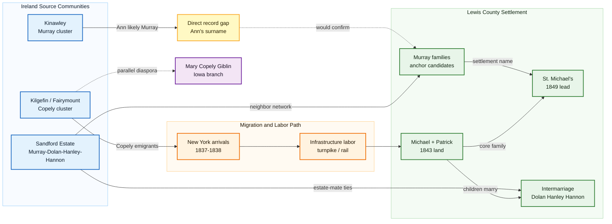

# Irish Immigration to West Virginia

## Historical Context
Irish migration into what became West Virginia came in overlapping waves tied to transportation corridors, labor demand, Catholic kinship networks, and affordable land opportunities. Workers often entered through Atlantic ports, moved through road, turnpike, canal, or rail labor systems, and then transitioned into family farming and local trade.

This pattern provides the macro-framework for Copley migration and settlement in Lewis County, but the local story is now sharper than a generic Irish-labor narrative. Current research points to the [[Topics/Murray Settlement|Murray Settlement]] as a Catholic kin-and-neighbor cluster: Copleys, Murrays, Dolans, Hanleys, Hannons, Gilloolys, and related families gathering in southwestern Lewis County and reproducing parts of an Irish social world in America.

## Settlement Network At a Glance

**How to read this:** the strongest current model is not a single straight line from Ireland to a farm. It is a network model: Irish source communities, infrastructure labor, land acquisition, Catholic parish formation, and marriage ties all reinforce one another. The main unresolved bridge is still direct proof of Ann's original surname and Murray household.

## Copley Family Connection
- Core lineage links:
  - [[Michael Copley Sr]]
  - [[Ann Copley]]
  - [[John Copley]]
  - [[People/Mary Copely Giblin|Mary Copely Giblin]]
- Primary place links:
  - [[Places/County Roscommon Ireland|County Roscommon, Ireland]]
  - [[Places/Kilgefin Ireland|Kilgefin, Ireland]]
  - [[Places/Kinawley Ireland|Kinawley, County Fermanagh]]
  - [[Places/Lewis County West Virginia|Lewis County, West Virginia]]
  - [[Places/Weston West Virginia|Weston, West Virginia]]

The Copley pathway reflects a common immigrant sequence: Irish origin locality -> Atlantic crossing -> labor frontier -> county-level landholding -> multigenerational rooted community. The best current interpretation adds a second layer: the Copleys likely moved inside a larger Catholic settlement network, not as an isolated household.

Ann's identity is central to this interpretation. She is recorded in the family as Ann Munday, but RQ-M5 now treats her original Irish surname as likely **Murray**, making her a probable member of the family network that gave Murray's Settlement its name.

## Timeline
- **1813-1837**: Michael Copley Sr. comes from Kilgefin, County Roscommon; Ann Munday / likely Murray comes from Kinawley, County Fermanagh.
- **1837-1838**: Copley/Copely-linked arrivals appear in U.S. passenger-list evidence.
- **Late 1830s-1840s**: Irish labor flows into road, turnpike, canal, and rail corridors in Mid-Atlantic/Appalachian zones.
- **1843**: Copley/Hoffman land agreement marks permanent Lewis County settlement arc for Michael and Patrick.
- **1849**: St. Michael's Church / early Catholic institutional context becomes a key verification target for the settlement.
- **Late 1800s**: Family land, church ties, intermarriage, and local social institutions consolidate the settlement.
- **1900 onward**: Oil-era inflection and later upward educational mobility.

## Primary Sources
1. FamilySearch county research guide (Lewis County):
   - <https://www.familysearch.org/en/wiki/Lewis_County,_West_Virginia_Genealogy>
2. e-WV Irish in West Virginia:
   - <https://www.wvencyclopedia.org/entries/830>
3. e-WV Lewis County overview:
   - <https://www.wvencyclopedia.org/entries/1313>
4. NARA immigration portal:
   - <https://www.archives.gov/research/immigration>
5. Internal synthesis and strategy:
   - [[copley_research_analysis]]
   - [[copley_research_findings]]
   - [[Copley_Research_Strategy.pdf]]
   - [[Topics/Murray Settlement|Murray Settlement]]
   - [[RQ-M5-PHASE-2-FINDINGS|RQ-M5 Phase 2 Findings]]
   - [[RQ-M1-LEWIS-COUNTY-DEED-SEARCH|RQ-M1 Lewis County Deed Search]]

Archive targets:
- Courthouse deed/probate/marriage records in Weston.
- Census/tax and church records for Irish household clustering.
- Diocese of Wheeling-Charleston records for St. Michael's Church and early Catholic parish history.
- Passenger manifests for *Kutusoff* and *Powhatan*, including non-Copley settlement surnames.

## The Murray Settlement

The Irish community in Lewis County was known as **"Murray's Settlement"** or the Irish Settlement. Earlier notes treated this mainly as evidence that a Murray family arrived before the Copleys. Current research is more nuanced: the name still makes the Murrays central, but Michael and Patrick Copley may also have been early members of a multi-family cohort rather than late followers.

The dedicated research page tracks the settlement as a coordinated community-transplant hypothesis:

- [[Topics/Murray Settlement|Murray Settlement]] — full research page including the anchor-family hypothesis, Ann Munday/Murray question, Roscommon geographic mapping, and prioritized research questions.
- [[Topics/Murray Settlement Research Roadmap|Murray Settlement Research Roadmap]] — current RQ-M1 through RQ-M8 strategy.

## Research Gaps
- Full reconstruction of companion/cluster migration groups with the Copleys — see [[Topics/Murray Settlement|Murray Settlement]] for active investigation.
- Identity and arrival date of the Murray family or families.
- Which Kinawley Murray household was Ann's family.
- Definitive route and arrival documentation for all Copley siblings.
- Better evidence for Catholic parish/community institutional ties in early settlement years.
- Direct marriage, passenger, church, or death-record evidence naming Ann's maiden surname.

### Acquisition Strategies
- Use FAN-club method (Friends/Associates/Neighbors) in 1840-1870 records.
- Extract all Irish-surname neighbors near Copley parcels in census + tax rolls.
- Build GIS-like locality map of Copley-adjacent Irish households across decades.
- Search Lewis County deed records for Murray surname, 1825–1855.
- Pull full *Powhatan* (1838) and *Kutusoff* (1837) passenger manifests for non-Copley Irish names.
- Contact the Diocese of Wheeling-Charleston for St. Michael's Church records and early parish history.
- Compare Lewis County families with Griffith's Valuation clusters in Kilgefin, Kilkeevin, Kilcorkey, and Kinawley.

## See Also
- [[Topics/Murray Settlement|Murray Settlement]] — dedicated research page for the Irish Settlement
- [[Topics/Murray Settlement Research Roadmap|Murray Settlement Research Roadmap]]
- [[Topics/Captain John Copley Research|Captain John Copley Research]]
- [[Topics/Bredon Descent|Bredon Descent]]
- [[Topics/Irish Famine and Emigration|Irish Famine and Emigration]]
- [[Topics/B&O Railroad Labor History|B&O Railroad Labor History]]
- [[Topics/1900 Copley Oil Strike|1900 Copley Oil Strike]]
- [[Topics/_Topics Index|Topics Index]]
