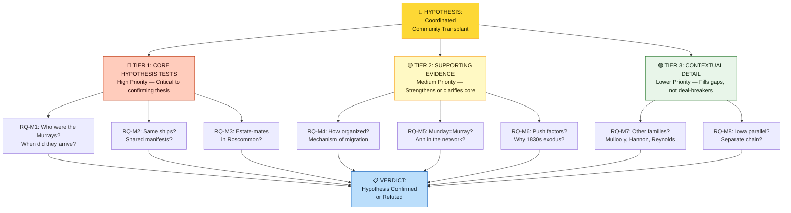
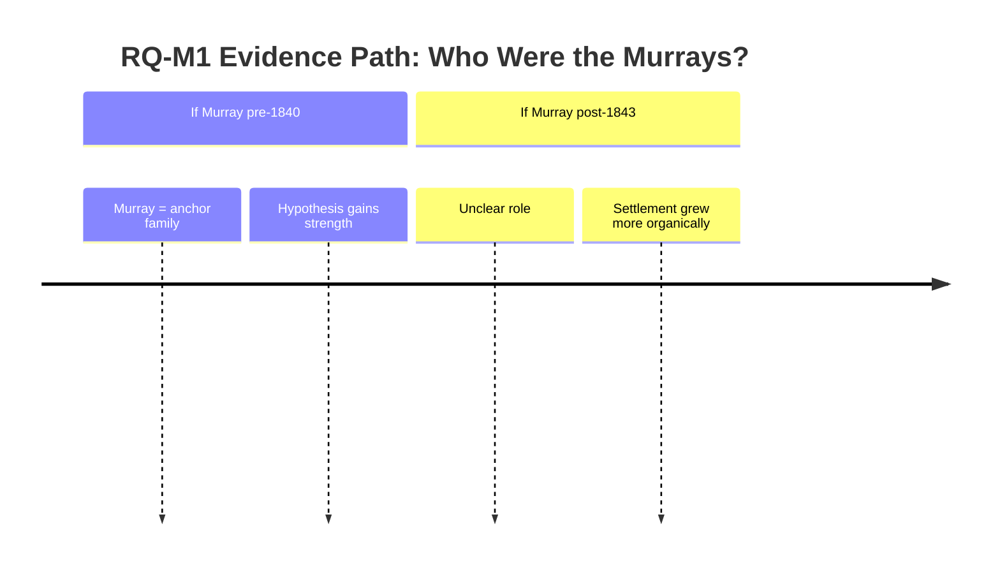
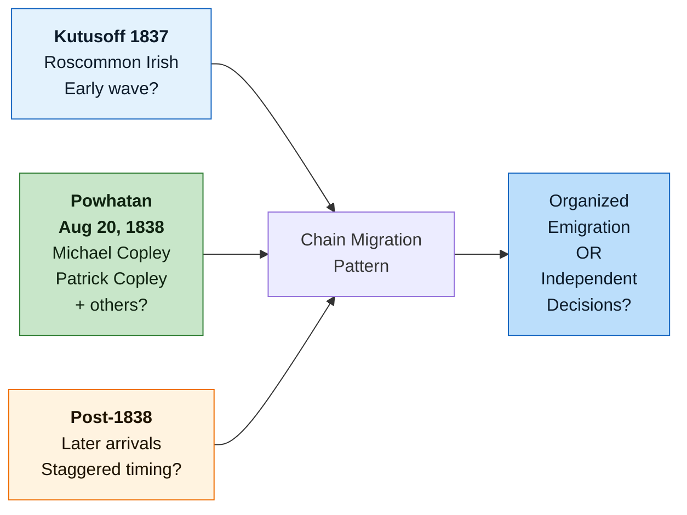
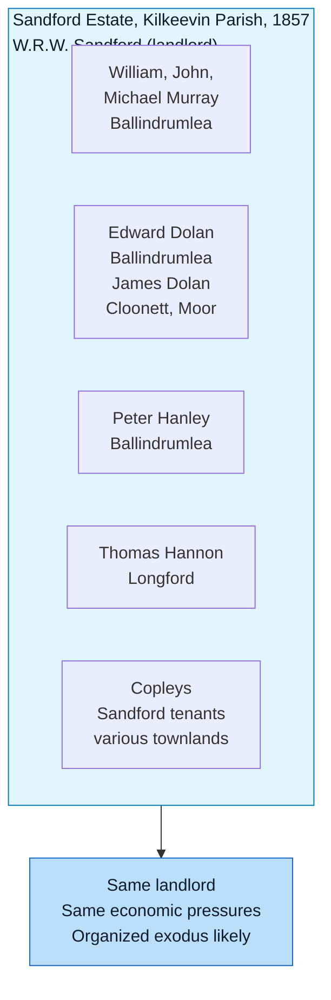
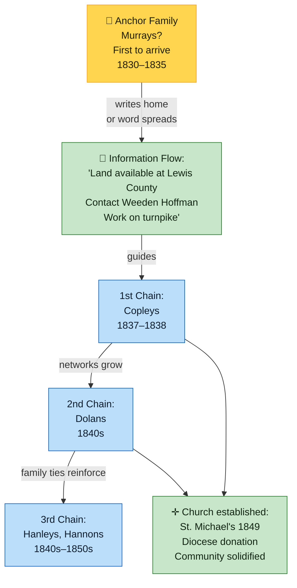
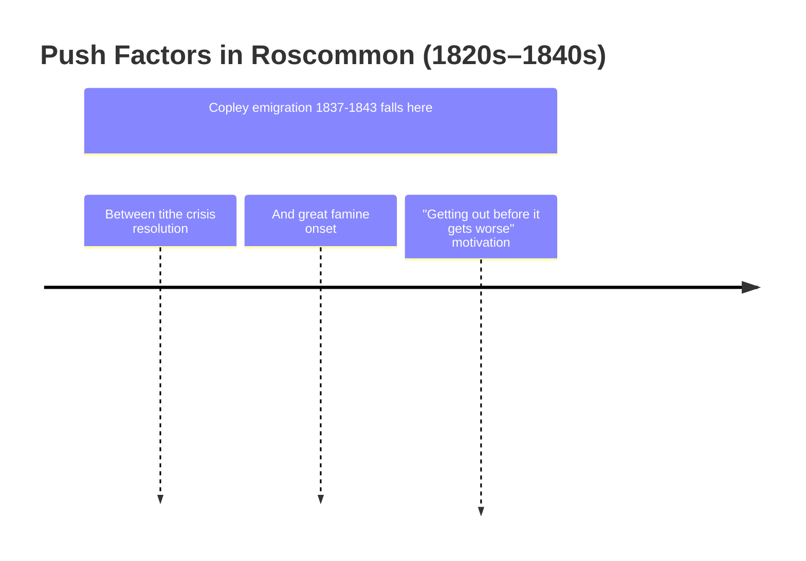
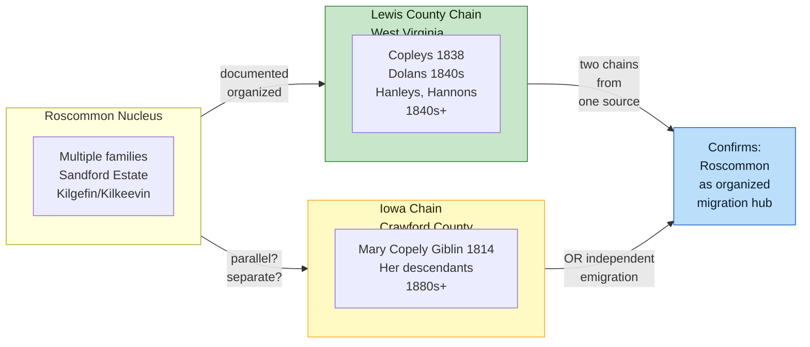

# Murray Settlement Research Roadmap

A comprehensive strategic guide to answering the **eight formal research questions (RQ-M1 through RQ-M8)** that will either confirm or refute Tom Copley's hypothesis that the Irish Settlement in Lewis County, WV was a **coordinated community transplant** from Roscommon.

This page provides the complete roadmap, evidence status, research priorities, and next actions for investigating the settlement's origins.

---

## 🎯 The Core Hypothesis

**Tom Copley's Thesis:** The Murray Settlement was not a random cluster of individual immigrants, but a deliberate, coordinated relocation of a Roscommon neighborhood that reconstituted itself in Lewis County with:
1. An **anchor family** (likely the Murrays) who arrived first
2. **Chain migration** organized by those anchor families
3. **Social ties from Roscommon reproduced in America** through marriage, church, and neighborhood networks

---

## 📊 Research Question Priority Map

---

## 📈 Evidence Status Dashboard

### Current Evidence (What We Know)

✅ **VERIFIED:**
- Murrays in Griffith's Valuation (1862), Kilgefin & Kilkeevin parishes — 9+ entries
- Copleys in Griffith's Valuation (1857), Sandford estate — estate-mate to Murrays
- Dolans in Griffith's Valuation (1857), Sandford estate — estate-mate cluster confirmed
- Hanleys in Griffith's Valuation (1857), Sandford estate — estate-mate cluster, married into Copleys
- Hannons in Griffith's Valuation (1857), Sandford estate — estate-mate, married into Copleys
- Michael Copley Sr. + Patrick Copley on *Powhatan* 1838 — primary source
- Copley-Hoffman deed 1843 — Lewis County settlement location verified
- St. Michael's Church 1849 land donation — Diocese of Richmond records (to verify)

⚠️ **PLAUSIBLE (Contextual Evidence):**
- Murray family as settlement anchor — supported by name "Murray's Settlement" but anchor identity not yet confirmed
- Chain migration model — consistent with documented arrivals but not yet documented in Lewis County deeds
- Staunton-Parkersburg Turnpike labor draw — Ancestry forum source (needs verification)
- Roscommon estate community (Sandford) as origin nucleus — supported by Griffith's clustering but pre-emigration social bonds not yet documented

❓ **UNRESOLVED:**
- Who specifically were the Murrays? When did they arrive in Lewis County?
- Did families travel on same ships (chain migration timing)?
- Pre-emigration social bonds documented (parish records, witnesses, godparents)?
- How was migration organized (letters home? priest networks? chain brokers)?
- Was Ann Munday actually Ann Murray (phonetic transcription)?
- What specific push factors in Roscommon (1830s)?
- Mullooly, Reynolds, other suspected families in settlement?
- Iowa branch as parallel organized chain or independent migration?

---

## 🎯 Quick-Start Actions (Next 1–2 Weeks)

**High Impact, Low Effort:**

| Action | Where | Time | Verdict Impact |
|--------|-------|------|-----------------|
| Resolve the early Lewis County Murray deed problem | Weston Courthouse / FamilySearch Deed Book C-D DGS 8219256, 1826/1833 index leads, and compiled grantee follow-up on image 553 | 2–3 hrs | **CRITICAL:** Identifies anchor family arrival date |
| Full *Powhatan* 1838 passenger manifest scan | Ancestry / FamilySearch NARA M237 | 1 hr | **HIGH:** Shows if Murrays/Dolans traveled with Copleys |
| 1840-1870 Lewis County census FAN sweep | Ancestry / FamilySearch; capture in [[RQ-M1-LEWIS-COUNTY-FAN-SWEEP|RQ-M1 Lewis County FAN Sweep]] | 2–3 hrs | **HIGH:** Enumerates full settlement membership |
| Contact Diocese of Wheeling-Charleston | archive request | email | **HIGH:** St. Michael's Church marriage records may show Ann's maiden name |
| Search "Murray" Griffith's Valuation other Roscommon parishes | askaboutireland.ie | 1–2 hrs | **MEDIUM:** Confirms Murrays in Roscommon origin cluster |

---

## 📋 Detailed Research Questions (RQ-M1 through RQ-M8)

### **RQ-M1: Who were the Murrays? When did they arrive in Lewis County?** 🔴 HIGH

**Objective:** Identify the specific Murray family (or families) that gave the settlement its name, and establish their arrival date in Lewis County relative to the Copleys.

**Why This Matters:**
- If Murrays arrived **before 1843** (before Copleys bought land), they are the anchor family
- If Murrays arrived **after** or **alongside** Copleys, the settlement grew more organically

**Verdict Triggers:**
- ✅ **"Murray family is anchor"** — First Murray land purchase in Lewis County deed records pre-1840; documented residence in 1840 census
- ❓ **"Unclear role"** — No Murray found in deeds but appeared later in census
- ❌ **"No Murrays found"** — Hypothesis refuted; "Murray's Settlement" name origin unresolved

**Primary Sources to Search:**
1. **Lewis County deed records (1825–1855)** — Weston Courthouse, FamilySearch. Look for any "Murray" land purchase in Cove Lick/Camden/Loveberry area. The exact-surname compiled grantee index search is now complete and produced only 1865-1934 Murray entries on images 553-554. Current high-value targets are Deed Book C-D DGS 8219256 pages 334, obscured 3??, and 404 for "Marwee" / possible Murray entries, plus the unresolved 1826 and 1833 John Murray leads.
2. **US Census 1840, 1850, 1860, 1870** — Ancestry / FamilySearch. FAN-club sweep: all Irish surnames within Copley settlement zone; capture raw findings in [[RQ-M1-LEWIS-COUNTY-FAN-SWEEP|RQ-M1 Lewis County FAN Sweep]]
3. **Lewis County local histories** — *History of Lewis County, West Virginia* (1881+), Archive.org, HathiTrust. May contain founding narratives
4. **Catholic parish records (St. Michael's Church)** — Diocese of Wheeling-Charleston archive. Marriage/baptism records 1838–1870 showing Murray witnesses/godparents

**Timeline Hypothesis:**

**Estimated Time:** 3–5 hours of database searching  
**Difficulty:** Medium (multiple databases, FAN method required)

---

### **RQ-M2: Did settlement families travel together on the same ships?** 🔴 HIGH

**Objective:** Establish whether Murray, Dolan, Hannon, and other settlement families emigrated on shared ships (indicating organized group travel) or in separate waves (indicating independent decisions).

**Why This Matters:**
- Shared manifests = organized chain migration
- Separate manifests = possibly concurrent individual decisions (weaker evidence for coordination)

**Verdict Triggers:**
- ✅ **"Organized group"** — Multiple settlement families on *Powhatan* 1838 or *Kutusoff* 1837
- ⚠️ **"Staggered chain"** — Families on different ships in sequence (1837, 1838, 1840s)
- ❌ **"No common pattern"** — Widely scattered arrival dates, different ships, different ports

**Primary Sources:**
1. **Full *Powhatan* (Aug 20, 1838) passenger manifest** — FamilySearch, NARA M237. We have Michael + Patrick Copley. Look for Murray, Dolan, Mullooly, Hannon, Hanley, Reynolds.
2. **Full *Kutusoff* (1837) passenger manifest** — FamilySearch. Look for Bridget Copley, Mary Copely, and any settlement family surnames.
3. **New York, Baltimore, Philadelphia port arrivals 1825–1845** — NARA M237, Ancestry.com Ship Manifests. Search Irish surnames from settlement by origin county (Roscommon).

**Ship Manifest Comparison Diagram:**

**Estimated Time:** 2–3 hours  
**Difficulty:** Low (manifest searches straightforward if databases accessible)

---

### **RQ-M3: Were Lewis County settlement families neighbors in Roscommon?** 🔴 HIGH

**Objective:** Document that the settlement families (Copley, Murray, Dolan, Hanley, Hannon, etc.) lived as neighbors in the same Roscommon parishes/townlands before emigrating.

**Why This Matters:**
- Neighbors emigrating together = strongest evidence of coordinated transplant
- Same estate tenants = documented common cause (same landlord pressures)
- Pre-existing social bonds = explains marriage networks later reproduced in Lewis County

**Verdict Triggers:**
- ✅ **"Neighborhood cluster confirmed"** — Multiple families in same Griffith's Valuation townlands or adjacent parishes; shared parish witnesses in baptism/marriage records
- ⚠️ **"Estate-mates confirmed"** — Families on same landlord (Sandford estate) in Griffith's, but no parish record evidence of socializing
- ❌ **"Scattered across parishes"** — No geographic clustering found

**Primary Sources:**
1. **Griffith's Valuation (1857) Roscommon** — askaboutireland.ie. Search ALL settlement family surnames in Kilgefin, Kilcorkey, Kilkeevin parishes
   - Already done for Copleys, Murrays, Hanleys, Hannons ✅
   - **Still need:** Dolans, Mulrooneys, Mulloolys, Reynolds
2. **Tithe Applotment Books (1823–1837) Roscommon** — titheapplotmentbooks.nationalarchives.ie. Same surname searches for period before Griffith's
3. **Parish registers (baptisms, marriages, burials)** — NLI, irishgenealogy.ie, PRONI. Look for:
   - Michael Copely + Ann (Munday/Murray?) marriage record
   - Shared witnesses or godparents across families
   - Co-signers on marriage licenses
4. **Sandford Estate records** — WV State Archives or Irish archives may have landlord papers showing tenants

**Estate-Mate Clustering Diagram:**

**Estimated Time:** 3–4 hours (multiple database searches)  
**Difficulty:** Medium (genealogical research, requires Irish database access)

---

### **RQ-M4: What was the organizational mechanism of the migration?** 🟡 MEDIUM

**Objective:** Determine *how* the migration was organized—by whom, through which networks, with what communication channels.

**Why This Matters:**
- Understanding mechanism strengthens hypothesis of intentional coordination
- Identifies key brokers/organizers (Murrays? Priests? Turnpike contractors?)

**Verdict Triggers:**
- ✅ **"Letters home documented"** — Parish records, Lewis County historical society, or family papers show evidence of communication guiding immigration
- ✅ **"Priest networks identified"** — Evidence that Kilgefin priest had ties to Pittsburgh/Steubenville diocese facilitating emigration
- ✅ **"Deed sequence shows chain"** — Lewis County purchases in sequence (1830s–1840s) suggest one family directing later arrivals
- ⚠️ **"Incomplete but suggestive"** — Multiple indirect indicators without smoking gun
- ❌ **"No mechanism found"** — Random, uncoordinated arrivals appear more likely

**Primary Sources:**
1. **Lewis County deed sequence (1825–1860)** — Who bought first? Second? Chronological order suggests (or refutes) chain
2. **Lewis County Historical Society (Weston, WV)** — Letters, diaries, local histories in society archives
3. **Catholic parish records (Pittsburgh & Steubenville dioceses pre-1850)** — Microfilm at FamilySearch; shows early Catholic missions and priests who may have facilitated emigration
4. **Weeden Hoffman land transaction records** — If Hoffman was the land broker, sequence of his sales to Irish families shows pattern
5. **Staunton-Parkersburg Turnpike payroll/contractor records** — WV State Archives. Irish names on turnpike crews (1830s) show labor-to-settlement pipeline

**Chain Migration Flow Diagram:**

**Estimated Time:** 4–5 hours (archival searches, synthesis)  
**Difficulty:** High (may require physical archive visits or remote requests)

---

### **RQ-M5: Was Ann Munday actually Ann Murray?** 🟡 MEDIUM

**Objective:** Determine whether Michael Copley Sr.'s wife's maiden name was "Munday" (family tradition) or a phonetic transcription of "Murray" (Tom's hypothesis), which would place her inside the anchor family network.

**Status:** ✅ **RESOLVED FOR WORKING GENEALOGY** — See `[[People/Ann Copley|Ann Copley]]`, `[[RQ-M5-PHASE-2-FINDINGS|RQ-M5 Phase 2 Findings]]`, and `[[RQ-M5-TITHE-APPLOTMENT-SEARCH|RQ-M5 Tithe Search Research Note]]` for full analysis.

**Verdict:** Ann "Munday" was almost certainly Ann Murray. No "Munday" appears in Griffith's Valuation (c.1858) Kinawley or all Fermanagh; 14 "Murray" occupiers appear in Kinawley; FamilySearch census searches found 0 independent Munday households in Lewis County WV, 1840-1860. NAI and Ancestry Tithe searches are inconclusive because Kinawley is not indexed in either database. Next steps shift to identifying Ann's Murray father and connecting the Kinawley Murrays to the Lewis County Murray deeds.

---

### **RQ-M6: What was the push factor in Roscommon in the 1830s?** 🟡 MEDIUM

**Objective:** Identify the specific event or condition in Roscommon (1820s–1840s) that motivated the community exodus.

**Why This Matters:**
- Shared push factor = coordinated decision to leave
- Specific trigger (landlord evictions, tithe confrontation, etc.) = stronger evidence of organized response

**Verdict Triggers:**
- ✅ **"Specific event identified"** — Sandford estate eviction, Corn Laws crisis, tithe war documented in Roscommon Journal
- ⚠️ **"General economic distress"** — Broader Irish Famine-era pressures (most likely)
- ❌ **"No push factor"** — Contradicts emigration motivation

**Primary Sources:**
1. **Roscommon Journal archives (1820s–1840s)** — Irish Newspaper Archives (irishnewsarchive.com), NLI. Search for:
   - Estate evictions, landlord disputes
   - Tithe confrontations (Irish Tithe War 1831–1834)
   - Crop failures, economic distress
2. **House of Commons Parliamentary Papers** — Reports on Irish distress, Roscommon specifically, 1830s–1840s
3. **Estate records (Sandford estate, etc.)** — Whether landlord was consolidating holdings, raising rents, or evicting tenants
4. **Corn Laws debates (1815–1846)** — Connection to Irish agricultural collapse

**Push Factor Timeline Diagram:**

**Estimated Time:** 2–3 hours  
**Difficulty:** Low (mostly newspaper/parliamentary database searches)

---

### **RQ-M7: Were the Mullooly, Hannon, Reynolds families part of the settlement?** 🟢 LOWER

**Objective:** Confirm that suspected settlement families (those marrying into Copleys) originated from Roscommon and emigrated as part of the coordinated network.

**Why This Matters:**
- Each family confirmed = broader evidence of community transplant
- Each family missing = suggests marriages were local (post-immigration), not pre-existing ties

**Verdict Triggers:**
- ✅ **"Settlement nucleus expanded"** — Mullooly, Hannon, Reynolds found in Griffith's Valuation and/or Lewis County census
- ⚠️ **"Partial confirmation"** — Some families found in Roscommon, others have unclear origins
- ❌ **"No Roscommon connection"** — Families originated elsewhere

**Primary Sources:**
1. **Griffith's Valuation (1857) Roscommon** — Search Mullooly, Hannon, Reynolds in Kilgefin, Kilcorkey, Kilkeevin
2. **Lewis County census 1840–1860** — FamilySearch. How many Mullooly/Hannon/Reynolds households near Copley settlement zone?
3. **Marriage records** — Parish records showing Copley connections to these families

**Estimated Time:** 1–2 hours  
**Difficulty:** Low

---

### **RQ-M8: Does the Iowa parallel (Mary Copely Giblin) reflect a separate organized chain?** 🟢 LOWER

**Objective:** Determine whether Mary Copely Giblin's Iowa settlement (Crawford County, documented 1814–1884) represents a second organized chain migration from Roscommon or independent emigration.

**Why This Matters:**
- If organized chain → shows Roscommon networks dispersed to multiple US destinations simultaneously
- If independent → doesn't contradict settlement hypothesis but shows broader emigration pattern

**Verdict Triggers:**
- ✅ **"Parallel chain confirmed"** — Mary's family documented on same ships or in same parishes as Lewis County cluster; Iowa Copleys marry into other Roscommon-origin families
- ⚠️ **"Independent settlement"** — Mary's family appears separate but timeline matches (1830s–1840s emigration era)
- ❌ **"No connection"** — Mary unrelated to Michael Sr. or different emigration pattern entirely

**Primary Sources:**
1. **Crawford County, Iowa census 1850–1900** — FamilySearch. Locate Mary Copely Giblin, her children, and surrounding Irish-origin families
2. **Iowa Catholic parish records** — NLI/FamilySearch. Marriage, baptism, burial records for Giblin, Copley families
3. **Kilcorkey parish registers** — Mary born 1814, Tully townland. Confirm baptism and parentage to link to Michael Sr.
4. **Ship manifests** — Did Mary's family travel on *Powhatan* or *Kutusoff* alongside Copleys?

**Iowa Chain Parallel Comparison Diagram:**

**Estimated Time:** 2–3 hours  
**Difficulty:** Low–Medium (Iowa records less accessible than Lewis County)

---

## 🎬 Action Plan: Next 4 Weeks

**Week 1: Tier 1 Quick Wins**
- [ ] Lewis County deed-body and variant-resolution pass after the completed exact-Murray grantee search (RQ-M1)
- [ ] Full *Powhatan* manifest (RQ-M2)
- [ ] Griffith's Valuation remaining families (RQ-M3, RQ-M7)

**Week 2: Census & Roscommon Records**
- [ ] 1840-1870 Lewis County census FAN sweep in [[RQ-M1-LEWIS-COUNTY-FAN-SWEEP|RQ-M1 Lewis County FAN Sweep]] (RQ-M1, RQ-M2)
- [ ] Kinawley Murray father-candidate workup and Lewis County John Murray deed transcription (RQ-M5)
- [ ] Roscommon Journal searches (RQ-M6)

**Week 3: Church & Institutional Records**
- [ ] Contact Diocese of Wheeling-Charleston (RQ-M1, RQ-M4)
- [ ] Parish register searches (RQ-M3, RQ-M4)
- [ ] Staunton-Parkersburg Turnpike records (RQ-M4)

**Week 4: Synthesis & Documentation**
- [ ] Compile findings into settlement family profiles
- [ ] Update [[Topics/Murray Settlement|Murray Settlement]] with results
- [ ] Document verdict for each RQ
- [ ] Assess overall hypothesis: Confirmed / Partially Confirmed / Inconclusive / Refuted

---

## 📚 Related Pages

- [[Topics/Murray Settlement|Murray Settlement]] — Main research page with verified facts and evidence
- [[People/Ann Copley|Ann Copley]] — RQ-M5 focus
- [[RQ-M5-PHASE-2-FINDINGS|RQ-M5 Phase 2 Findings]] — Detailed analysis
- [[AGENT_HANDOFF_PHASE_2M|Agent Handoff Phase 2M]] — Research protocol context
- [[Places/Lewis County West Virginia|Lewis County, West Virginia]]
- [[Topics/Irish Immigration to West Virginia|Irish Immigration to West Virginia]]

---

## 🎯 Success Criteria

**Hypothesis CONFIRMED if:**
- Murrays identified as Lewis County arrivals (RQ-M1)
- Multiple settlement families on shared ships (RQ-M2)
- Estate-mate clustering documented in Roscommon (RQ-M3)
- Organized migration mechanism identified (RQ-M4)

**Hypothesis PARTIALLY CONFIRMED if:**
- Murrays identified but role unclear
- Some (but not all) shared ship travel
- Estate-mate clustering in Griffith's but no parish bonds documented
- Multiple indicators of coordination without definitive proof

**Hypothesis INCONCLUSIVE if:**
- Insufficient records available
- Evidence scattered and inconsistent
- Need for additional primary sources

**Hypothesis REFUTED if:**
- No Murray family found in Lewis County
- Families arrived on completely separate ships/dates
- No evidence of pre-existing social bonds
- Settlement appears randomly organized

---

**Last updated:** April 28, 2026  
**Next review:** After completing Weeks 1–2 research actions
