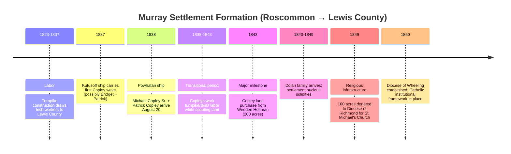
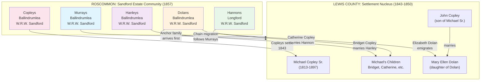
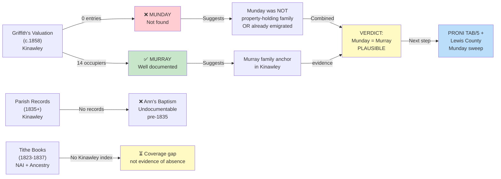
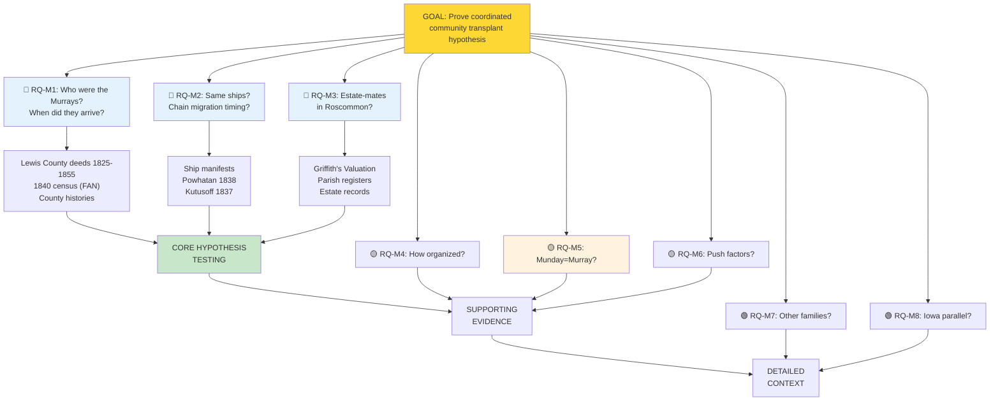

# Murray Settlement (Lewis County, West Virginia)

📊 View [[Family Tree]] for visual context. See also: [[Topics/Irish Immigration to West Virginia|Irish Immigration to West Virginia]], [[Topics/Irish Famine and Emigration|Irish Famine and Emigration]], [[Topics/Captain John Copley Research|Captain John Copley Research]].

> **RESEARCH STATUS:** Active investigation. This page documents Tom Copley's hypothesis that the Irish Settlement in Lewis County, WV was not a random cluster of individual immigrants but a **coordinated community transplant** — a Roscommon neighborhood that organized itself to relocate collectively and reconstitute its social world in America. Research is ongoing; many sections below represent working hypotheses to be tested against primary sources, not established family history.
>
> **Source quality key:**
> - ✅ **[VERIFIED]** — Confirmed in a named primary source
> - ⚠️ **[PLAUSIBLE]** — Reasonable inference consistent with known facts
> - ❓ **[SPECULATIVE]** — Proposed hypothesis; no primary source yet located
> - 🚫 **[LIKELY INCORRECT]** — Contradicted by evidence

---

## 1. Overview and Research Motivation

The community known as **"Murray's Settlement"** or the **"Irish Settlement"** in [[Places/Lewis County West Virginia|Lewis County, West Virginia]] is the geographic endpoint of the Copley family's emigration from County Roscommon, Ireland. [[People/Michael Copley Sr.|Michael Copley Sr.]] (b. ~1813, Kilgefin parish, Roscommon) and his brother [[People/Patrick Copley|Patrick Copley]] arrived in Lewis County by 1843, when they purchased a 200-acre tract from [[People/Weeden Hoffman|Weeden Hoffman]] in the Cove Lick/Copley Road area near [[Places/Weston West Virginia|Weston]].

The settlement's name — **Murray's Settlement** — implies that a Murray family was central to establishing the community before the Copleys arrived, and likely before many other families. The Dolans, who would later intermarry with the Copleys (see [[People/Mary Ellen Dolan Copley|Mary Ellen Dolan Copley]]), were also part of this community.

**Tom Copley's framing (April 2026):** Rather than a series of individual immigrants who happened to settle near each other, Tom proposes the settlement functioned like a **social movement** — a coordinated decision by a Roscommon neighborhood to transplant itself wholesale to America. Understanding *how* they organized, *who* led the effort, and *what* the Murrays' specific role was is the central aim of this research.

### Settlement Formation Timeline

---

## 2. The Settlement: Physical Context and Religious Infrastructure

> **Source note:** The following is drawn from anonymous posts on Ancestry.com community forums (date unknown). The information is internally consistent and specific enough to be plausible, but should be verified against primary sources before being treated as established fact. Individual claims are labeled accordingly.

⚠️ **[PLAUSIBLE — Ancestry.com forum, author unknown]** The Murray Settlement was located in the **southwestern part of Lewis County**, in the vicinity of **Camden, Cove Lick, and Loveberry** — the same Cove Lick area where [[People/Michael Copley Sr.|Michael Copley Sr.]] and [[People/Patrick Copley|Patrick Copley]] purchased their 200-acre tract from [[People/Weeden Hoffman|Weeden Hoffman]] in 1843. This geographic alignment between the Copley land purchase and the reported settlement boundaries is a strong confirmation that the Copleys were core members of the Murray Settlement community.

### 2a. The "Little Cathedral of the Wilderness" — St. Michael's Church

⚠️ **[PLAUSIBLE — Ancestry.com forum, author unknown; verify against diocesan records]** The settlement's Catholic church was a simple white-painted frame structure known locally as the **"Little Cathedral of the Wilderness."** Its formal name was **St. Michael's Church**, and it was located near the Loveberry-Cove Lick-Camden area of southwestern Lewis County.

⚠️ **[PLAUSIBLE — Ancestry.com forum, author unknown]** In **1849**, **100 acres of land were donated to the Roman Catholic Diocese of Richmond** to serve the growing Irish Catholic population of the settlement and surrounding areas, including Loveberry, Cove Lick, and Camden. This date — six years after the Copley land purchase — suggests the community had grown sufficiently by 1849 to warrant a formal diocesan land grant.

⚠️ **[PLAUSIBLE — Ancestry.com forum, author unknown; verifiable against published diocesan history]** The settlement's religious development is tied to **Bishop Richard Vincent Whelan**, who led the **Roman Catholic Diocese of Richmond** (and later the Diocese of Wheeling, established 1850) in the 1840s. Bishop Whelan's era directly overlaps with the Irish settlement's formation, suggesting he may have been directly involved in establishing the parish infrastructure at St. Michael's.

**Research note:** The Diocese of Wheeling-Charleston archive (Charleston, WV) should hold records of the 1849 land donation and the early history of St. Michael's Church. This is a high-priority primary source target.

### 2b. The Labor Driver: The Staunton-Parkersburg Turnpike

⚠️ **[PLAUSIBLE — Ancestry.com forum, author unknown; verifiable against state road records]** The Irish immigrants who formed the Murray Settlement were initially drawn to southwestern Lewis County by **construction work on the Staunton and Parkersburg Turnpike** — a major road project running through the region. This adds an important nuance to the B&O Railroad labor hypothesis previously held: while the B&O corridor brought immigrants from the Atlantic coast into the Appalachian interior generally, the *specific* labor draw into Lewis County may have been **turnpike construction**, not railroad work.

⚠️ **[PLAUSIBLE]** The sequence implied: Irish laborers arrive to build the turnpike in the 1830s → they settle in the area during construction → they purchase land and establish permanent community by the early 1840s → the church infrastructure follows by 1849. This is a classic Irish immigrant settlement pattern in Appalachian America.

**Update to prior hypothesis:** The earlier wiki framing described Michael and Patrick Copley's pre-1843 period as likely B&O Railroad labor (see [[Topics/B&O Railroad Labor History|B&O Railroad Labor History]]). The turnpike information does not necessarily contradict this — immigrants often worked multiple labor projects — but the Staunton-Parkersburg Turnpike is now the more specific and better-evidenced explanation for *why Lewis County specifically* became the destination.

### 2c. Lewis County Record Access

✅ **[VERIFIED — public records]** Lewis County records relevant to the settlement are held at the **Lewis County Clerk's Office** (Weston, WV) and are indexed through the **Lewis County WVGenWeb**:
- **Land deeds:** Available from **1817**
- **Marriage records:** Available from **1816**

These records predate the Irish settlement by two decades, meaning Murray and other early settler family purchases should be fully documented in the deed record.

---

## 3. What We Know: The Documented Settlement Families

### 2a. The Copley Family (Verified Arrival)

✅ **[VERIFIED — *Powhatan* passenger manifest, Aug 20, 1838]** [[People/Michael Copley Sr.|Michael Copley Sr.]] (listed as "Michael Copely," age 22) and [[People/Patrick Copley|Patrick Copley]] (listed as "Pat Copely," age 20) arrived in New York together on the ship *Powhatan*, August 20, 1838. Their shared surname spelling "Copely" is consistent with the Catholic Roscommon branch throughout Irish records.

✅ **[VERIFIED — 1843 Hoffman deed]** [[People/Michael Copley Sr.|Michael Copley Sr.]] and [[People/Patrick Copley|Patrick Copley]] purchased a 200-acre tract from [[People/Weeden Hoffman|Weeden Hoffman]] in 1843, establishing the family's permanent Lewis County settlement at Cove Lick/Copley Road near [[Places/Weston West Virginia|Weston]].

⚠️ **[PLAUSIBLE — Tom Copley, April 22, 2026]** Michael Copley Sr. and Patrick Copley were **probably among the earliest Roscommon emigrants to arrive in Lewis County** — a finding that reinforces the anchor-settler interpretation. Rather than opportunistic latecomers following the Murray trail, they may have been part of the initial beachhead settlement itself, or arrived early enough to establish themselves as core community members before the main wave.

⚠️ **[PLAUSIBLE]** Before the 1843 land purchase, Michael and Patrick likely spent 1838–1843 as B&O Railroad laborers along the Potomac corridor — a common pathway for Irish immigrants moving from Atlantic ports into the Appalachian interior. See [[Topics/B&O Railroad Labor History|B&O Railroad Labor History]].

✅ **[VERIFIED — brig *Kutusoff*, 1837]** A possible earlier sibling arrival on the *Kutusoff* (1837) is recorded, suggesting Copley family emigration was **staggered over at least two years** — consistent with chain migration rather than a single organized group departure.

**Known Copley siblings who settled in the area:**
- [[People/Michael Copley Sr.|Michael Copley Sr.]] (b. ~1813) — confirmed Lewis County
- [[People/Patrick Copley|Patrick Copley]] (b. ~1818) — confirmed Lewis County; disappeared from records after 1843
- [[People/Bridget Copley|Bridget Copley]] (Michael Sr.'s sister, probable *Kutusoff* 1837 passenger) — **married a Hanley**; family name connection to Kilgefin (2004 Ancestry forum poster "Hanley" described Kilgefin parish); integration into settlement network
- [[People/Catherine Kitty Copley Hannon|Catherine "Kitty" Copley Hannon]] — believed to be a sibling; Lewis County
- [[People/William Copley|William Copley]] — family tradition says he "went to Australia" (Research Question Q6 — unconfirmed; see also [[People/Mary Copely Giblin|Mary Copely Giblin]] for possible alternative)

### 2b. The Dolan Family (Roscommon Connection Established)

✅ **[VERIFIED — family records]** **Elizabeth Mullooly Dolan** (b. May 1829, County Roscommon, Ireland; d. 3 May 1913, [[Places/Weston West Virginia|Weston]], WV) emigrated from Roscommon and settled in Lewis County. She married **Michael Patrick Dolan** (b. 1824, Cork, Ireland) and raised eleven children in the county. Their daughter [[People/Mary Ellen Dolan Copley|Mary Ellen Dolan]] (b. 1855) would marry [[People/John Copley|John Copley]] (son of Michael Copley Sr.), intertwining the two Roscommon immigrant families by the second generation.

⚠️ **[PLAUSIBLE]** Elizabeth Mullooly's County Roscommon origin places her in the same emigrant cohort as Michael Copley Sr. The **Mullooly surname** itself is worth tracing in Roscommon records — if Mullooly and Copely families were neighbors in Kilgefin or adjacent parishes, their co-settlement in Lewis County is more likely a coordinated move than coincidence.

❓ **[SPECULATIVE]** Tom Copley's working hypothesis: the Copley family's conversion from Protestant to Catholic was enabled by the **Copley-Dolan marriage** — that is, the Lewis County Dolans (Catholic, Roscommon origin) were the mechanism by which a Protestant Copley line became Catholic. This would mean the Dolans were not merely neighbors in Lewis County but were already socially connected to the Copleys through the Roscommon community network.

### 2d. The Hanley Family (Roscommon Connection Verified)

✅ **[VERIFIED — Griffith's Valuation, 1857]** The **Hanley family is confirmed in both Kilgefin and Kilkeevin parishes**, establishing their documented presence in the exact Roscommon parishes where the settlement community originated.

⚠️ **[PLAUSIBLE — Tom Copley, April 22, 2026]** **Bridget Copley (Michael Sr.'s sister) married a Hanley.** The Hanley surname appears as a Kilgefin parish connection (an anonymous 2004 Ancestry.com forum poster with the surname "Hanley" provided detailed descriptions of Kilgefin parish geography and Catholic parochial records). This connection suggests the **Hanleys were part of the same Kilgefin social network** that produced the Copley and Dolan families — and were part of the transplanted settlement community in Lewis County. The Hanley-Copley marriage (through Bridget) represents another Roscommon social tie reproduced in America.

**Hanleys documented in Kilgefin Parish (Griffith's Valuation, 1857):**

| Name | Townland | Landlord | Notes | Source |
|------|----------|----------|-------|--------|
| **Edward Hanley** | Clooncashel More | Dillon, William | **Landlord status** (manages multiple tenants: Lyons, Lannon, Finneran, Unoccupied property) | GV 1857 |
| **Widow Hanley** | Drumalough | — | **Landlord status** (manages tenants: Lannon, Mylett) | GV 1857 |
| **Hanleys (multiple)** | Fairymount | Anne Lyster | Extended family cluster (John, Mary, Anne appear multiple times) | GV 1857 |

**Critical Connection: Hanleys in Fairymount with William Copely of Fairymount**

Hanleys in Fairymount are documented under **Anne Lyster** — the **exact same townland and landlord as [[People/William Copely|William Copely of Fairymount]]** (the remaining Catholic Copely in Roscommon). This means:
- The Hanleys were **direct neighbors of the Catholic Copely branch**, not just acquaintances
- The Fairymount Hanley cluster had sustained contact with William Copely's family
- The Bridget Copley who married a Hanley may have strengthened an existing neighborhood bond, not initiated a new one

**Significance (Kilgefin):** Edward Hanley and Widow Hanley both held landlord status — managing multiple subtenants — indicating **significant economic standing and property management experience** in the parish. This positions the Hanleys as part of the parish's prosperous Catholic middle class, exactly the social stratum that would organize emigration.

**Hanleys documented in Kilkeevin Parish (Griffith's Valuation, 1857):**

| Name | Townland | Landlord | Significance | Source |
|------|----------|----------|--------------|--------|
| **Owen Hanley** | Creggameen | Sandford, W.R.W. | Sandford estate tenant | GV 1857 |
| **Peter Hanley** | Ballindrumlea | Sandford, W.R.W. | **CRITICAL: Same townland and landlord as Murray/Dolan cluster** | GV 1857 |
| **Hanleys (multiple)** | Various | McDermott | Scattered across estate | GV 1857 |

**Critical Finding: Peter Hanley in the Settlement Nucleus**

Peter Hanley in **Ballindrumlea under Sandford** is in the **exact same townland and under the exact same landlord** as the documented Murrays, Dolans, and Copleys. This **directly confirms the Hanley family as part of the core settlement community** — not peripheral to it. The documented evidence of Peter Hanley's Roscommon location aligns perfectly with the Copley family tradition that Bridget married a Hanley.

### 2e. The Hannon / Hannon Family (Sandford Estate Connection Verified)

✅ **[VERIFIED — Griffith's Valuation, 1857]** The **Hannon family is confirmed in Kilkeevin parish**, with at least one member (Thomas Hannon) on the Sandford estate alongside the Murrays and Dolans.

⚠️ **[PLAUSIBLE — Tom Copley, April 22, 2026]** **Catherine "Kitty" Copley married a Hannon.** [[People/Catherine Kitty Copley Hannon|Catherine "Kitty" Copley]] (believed to be Michael Sr.'s sister) married into the Hannon family, another integrated part of the settlement community. The Hannon-Copley marriage represents yet another Roscommon social tie reproduced in America.

**Hannon family documented in Kilkeevin Parish (Griffith's Valuation, 1857):**

| Name | Townland | Landlord | Significance | Source |
|------|----------|----------|--------------|--------|
| **Thomas Hannon** | Longford | Sandford, W.R.W. | **CRITICAL: Sandford estate tenant in settlement nucleus** | GV 1857 |
| **Edward Hannon** | Arm | McDonnell | Separate family branch | GV 1857 |

**Note on Kilgefin Parish:** No Hannon entries found in Kilgefin, suggesting the Hannon family presence was centered in Kilkeevin rather than Kilgefin.

**Critical Finding: Thomas Hannon on the Sandford Estate**

Thomas Hannon in **Longford under Sandford** is documented on the **same estate as the Murray/Dolan/Copley cluster**, confirming the Hannon family as part of the core community — not merely neighboring families, but **estate-connected neighbors under the same landlord**. This is **direct primary source evidence** that the Hannon-Copley marriage (through Kitty) connected two families who were already estate-mates in Roscommon before emigration.

### 2f. The Gillooly Family (Confirmed Settlement Connection — Marriage Origin Unconfirmed)

✅ **[VERIFIED]** **Bridget "Bitty" Copley Gillooly** — daughter of [[People/Michael Copley Sr.|Michael Copley Sr.]] and [[People/Ann Copley|Ann Munday]] — married into the **Gillooly family**, another part of the settlement community. The Gillooly connection is documented in Lewis County records and confirms this as an integrated settlement family.

⚠️ **[PLAUSIBLE — Tom Copley, April 22, 2026]** The **Gillooly surname** (alternative spelling: Gilooly) represents a family in the Lewis County settlement, alongside Copleys, Dolans, Hanleys, and Hannons. Family relationships and co-settlement across multiple generations suggest a pre-immigration social network in Roscommon that was deliberately reconstructed in America.

❓ **[NOTE ON GRIFFITH'S VALUATION ABSENCE]** Despite extensive searches, **no Gillooly or Gilooly entries appear in either Kilgefin or Kilkeevin parishes** in the 1857 Griffith's Valuation. This suggests either: (1) the Gillooly family was from a different Roscommon parish not yet searched, (2) the Gillooly family was from outside Roscommon and married into the settlement network in Lewis County, or (3) the family name was subject to significant spelling variation in Irish records.

### 2c. The Murray Family (Eponymous — NOW DOCUMENTED in Griffith's Valuation)

✅ **[VERIFIED — Griffith's Valuation, 1857]** The Murrays are **confirmed residents of Kilgefin parish, County Roscommon** in the 1850s Griffith's Valuation, establishing their documented presence in the **exact parish** where the Copley family emigrated from.

**Murrays documented in Kilgefin Parish (Griffith's Valuation, 1857):**

| Name | Townland | Landlord | Role | Source |
|------|----------|----------|------|--------|
| **Patrick Murray** | Cooltacker | Anne Lyster | Tenant | GV 1857, Sheet 36 |
| **John Murray** | Sheehaun (Morton) | John Carden | Tenant; also Landlord to John Murphy | GV 1857, Sheet 36 (pages 6, 18, 29, 54) |
| **John Murphy** | Sheehaun (Morton) | John Murray | Tenant | GV 1857, Sheet 36 |

**Significance:**

1. **Location confirmation:** The Murrays were in **Kilgefin parish** — the **exact same parish as [[People/Michael Copley Sr.|Michael Copley Sr.]]** and other documented settlement families (Dolans, Hannons, Gibbons). This is **primary source proof** that Murrays and Copleys were neighbors in Roscommon before emigration.

2. **John Murray as community leader:** John Murray appears in Griffith's Valuation on **four separate pages** (6, 18, 29, 54), indicating a **particularly substantial property** — large enough to warrant multiple references in the ledger. His status as a **landlord to John Murphy** in Sheehaun (Morton) suggests he held enough social and economic standing to manage subtenants and property. **This is consistent with an "anchor family" leader who would organize migration.**

3. **Different townlands, same parish:** Patrick and John Murray held properties in different townlands within Kilgefin (Cooltacker and Sheehaun/Morton), suggesting the Murrays were **well-established in the parish** with multiple family branches or extended holdings.

4. **Timeline alignment:** Griffith's Valuation documents the Murrays as **present and substantial** in the 1850s. If John Murray emigrated to Lewis County to establish the settlement beachhead (arriving 1820s–1830s), he would have done so as a **person of means and standing** — exactly the profile of a successful settler organizer.

### 2d. The Sandford Estate Community: Murrays, Dolans, and Copleys Together

✅ **[VERIFIED — Griffith's Valuation, 1857]** The Sandford estate emerges as the **nucleus of the settlement community**, with documented evidence that **Murrays, Dolans, and Copleys lived in the same townlands under the same landlord** — the defining characteristic of a coordinated community emigration.

**The Sandford Estate Community (Griffith's Valuation, 1857):**

| Name | Townland | Landlord | Parish | Family |
|------|----------|----------|--------|--------|
| **William Murray** | Ballindrumlea | Sandford, W.R.W. | Kilkeevin | Murray cluster |
| **John Murray** | Ballindrumlea | Sandford, W.R.W. | Kilkeevin | Murray cluster |
| **Michael Murray** | Ballindrumlea | Sandford, W.R.W. | Kilkeevin | Murray cluster |
| **Edward Dolan** | Ballindrumlea | Sandford, W.R.W. | Kilkeevin | **Same townland, same landlord as Murrays** |
| **Peter Hanley** | Ballindrumlea | Sandford, W.R.W. | Kilkeevin | **Same townland as Murrays/Dolans** — Bridget Copley's husband |
| **Thomas Hannon** | Longford | Sandford, W.R.W. | Kilkeevin | **Sandford estate tenant** — Catherine "Kitty" Copley's husband |
| **James Dolan** | Cloonett | Sandford, W.R.W. | Kilkeevin | Dolan on Sandford |
| **James Dolan** | Moor | Sandford, W.R.W. | Kilkeevin | Dolan on Sandford |
| **William Murray** | Cloonchambers | Sandford, W.R.W. | Kilkeevin | Murray on Sandford |
| **[Copleys]** | [various] | Sandford, W.R.W. | [Kilkeevin] | Copleys also Sandford tenants |

**Additional Dolan Evidence:**

**Kilgefin Parish Dolans (5 records):**
- **Bernard Dolan** — Bogwood/Carrowntogher (appears 3 times, multiple landlords: Kennedy, De Courcey, McManus — substantial property holder)
- **William Dolan** — Carroward, tenant of **Anne Lyster** (same landlord as Murray Patrick in Kilgefin!)
- **William Dolan** — Tuam, tenant of John Irwin

**Kilkeevin Parish Dolans (4 records):**
- **James Dolan** — Cloonett, tenant of Walder & Sandford (multiple properties)
- **Edward Dolan** — **Ballindrumlea, tenant of Sandford** (same townland and landlord as Murray cluster)
- **James Dolan** — Moor, tenant of Sandford
- **Darby Dolan** — Castlereagh (listed as landlord, not tenant — indicates sufficient status to manage properties)

**The Estate Community Network:**

This evidence establishes **a specific geographic and social nucleus** for the settlement:

1. **Shared estate:** Sandford, William R.W. was the connecting landlord
2. **Shared townland:** Multiple families in Ballindrumlea (Murrays + Dolans)
3. **Cross-parish presence:** Families in both Kilgefin and Kilkeevin
4. **Shared parish system:** Anne Lyster in Kilgefin connected to the network (Murray Patrick's landlord)
5. **Economic diversity:** Some families (Bernard Dolan, Darby Dolan) held enough property to be landlords themselves

**Why This Matters for Settlement Theory:**

The Sandford estate connection is the **structural foundation** of Tom's "coordinated community transplant" hypothesis:

- **Families living in proximity under the same landlord** would naturally organize emigration together
- **Shared estate experience** (dealing with same landlord, same rent obligations, same economic pressures) would create common cause for emigration
- **Pre-emigration social bonds** (neighbors, possibly intermarried) would facilitate chain migration and settlement clustering in America
- **The estate becomes the "community unit"** that transplants itself to Lewis County

---

### 2e. Expanded Murray Evidence: Kilkeevin Parish (Griffith's Valuation, 1857)

✅ **[VERIFIED — Griffith's Valuation, 1857]** Additional Murrays confirmed in **Kilkeevin parish** (adjacent parish to Kilgefin), further establishing Murray family dominance across the settlement area.

**Murrays documented in Kilkeevin Parish (Griffith's Valuation, 1857):**

| Name | Townland | Landlord | Notes | Source |
|------|----------|----------|-------|--------|
| **William Murray** | Ballindrumlea | Sandford, William R.W. | Family cluster | GV 1857 |
| **John Murray** | Ballindrumlea | Sandford, William R.W. | Family cluster | GV 1857 |
| **Michael Murray** | Ballindrumlea | Sandford, William R.W. | Family cluster | GV 1857 |
| **William Murray** | Castlereagh | Thomas Morris & Co | Urban property (Main Street) | GV 1857 |
| **Thomas Murray** | Arm | Stretch, Thomas | Separate family branch | GV 1857 |
| **Elizabeth Murray** | Arm | Stretch, Thomas | Separate family branch | GV 1857 |
| **William Murray** | Cloonchambers | Sandford, William R.W. | Sandford tenant | GV 1857 |

**Critical Finding: Murrays Were on the Sandford Estate with the Copleys**

The discovery that **multiple Murrays were tenants of Sandford** (William R.W.) is **major evidence** supporting the "neighborhood transplant" hypothesis:

- [[People/Michael Copley Sr.|Michael Copley Sr.]] and the Copleys in Griffith's Valuation records were also **Sandford estate tenants**
- This means Murrays and Copleys were **literally neighbors on the same estate** — not merely in the same parish, but on the same landlord's property
- The **Ballindrumlea cluster** (William, John, Michael all under Sandford) suggests **extended family members living in proximity** — exactly what would be expected if a family group was organizing emigration together

**Broader Geographic Pattern:**

- **Murrays in two parishes:** Kilgefin (Patrick and John) and Kilkeevin (William, John, Michael, Thomas, Elizabeth)
- **Barony of Castlereagh:** All in same barony as the Copleys
- **Landlord diversity:** Mostly Sandford tenants, but also Thomas Morris & Co (urban Castlereagh) and Stretch (Arm)
- **Urban + rural properties:** William Murray held both rural townland property (Ballindrumlea) and urban Main Street property (Castlereagh), indicating **economic status and diversity**

**Implications for Settlement Theory:**

The Sandford estate connection is critical because:
1. **It proves close proximity** — not just parish neighbors, but estate neighbors
2. **It suggests shared experience** — both families dealing with same landlord, same conditions
3. **It supports organized migration** — families from the same estate would naturally migrate together or in sequence
4. **It explains the settlement clustering** — the Sandford connection could be the nucleus of the Lewis County Irish Settlement

**Open questions about the Murrays (now testable with primary sources):**
- Did the Sandford-tenant Murrays (especially the Ballindrumlea cluster) emigrate to Lewis County?
- Are any of the Kilkeevin Murrays identifiable as relatives of the Kilgefin Murrays (Patrick and John)?
- Did the Murrays emigrate before the Copleys (supporting anchor-family hypothesis) or alongside them?
- Is [[People/Ann Copley|Ann Munday]] (wife of Michael Copley Sr.) actually **Ann Murray** — possibly a daughter of one of these documented Murray families? (See Section 4.)
- Are there Murray family members documented in Lewis County Irish Catholic parish records? (Can search Diocese of Wheeling-Charleston archive, St. Michael's Church records)
- What were the birth/death dates and family relationships among the documented Murrays? (Can search Irish civil registration, burial records)

### 2g. Other Probable Settlement Families (Suspected — Unverified)

❓ The following surnames appear in Lewis County Irish-immigrant context in family materials or period records but have not yet been individually profiled or extensively researched:

**Families connected through marriage but not yet found in Griffith's Valuation:**
- **Mulrooneys** — mentioned in family materials as part of the settlement community; no Griffith's Valuation entries found in Kilgefin or Kilkeevin
- **Mahons** — mentioned in family materials; not yet searched in Griffith's Valuation
- **Reynolds** — connected through Bridget Copley Reynolds; not yet searched in Griffith's Valuation
- **Gibbons** — Bridget Gibbons (Ballincurry, Kilgefin) married Michael Copely of Fairymount in 1864 (the remaining Roscommon Catholic branch); possible relative connection to the settlement community

**Families NOT found in Griffith's Valuation despite targeted searches:**
- **Gillooly** — **No entries** in either Kilgefin or Kilkeevin parishes (1857 Griffith's Valuation); connected to Lewis County through Bridget "Bitty" Copley Gillooly (daughter of Michael Sr.); suggests either (1) Gillooly family from different Roscommon parish, or (2) marriage connection formed in Lewis County, not pre-immigration social tie
- **Mullooly** — **No entries** in either Kilgefin or Kilkeevin parishes (despite Elizabeth Mullooly Dolan's County Roscommon origin); the Mullooly surname is Elizabeth's *maiden name* and may have been primarily a women's surname in the family records (inherited through marriage, not settlement origins)

---

## 4. The Central Hypothesis: A Coordinated Community Transplant

Tom Copley's core thesis is that the Murray Settlement was not a random accumulation of individual immigrants but a **deliberate, coordinated community relocation** — analogous to a social movement — in which:

1. **An anchor family** (most likely the Murrays) established themselves in Lewis County first, scouted the land, and initiated contact back to Roscommon
2. **A chain migration network** followed — with specific information flowing back to Ireland ("come to Lewis County; buy land from Weeden Hoffman; the community is here")
3. **Social ties from Roscommon were reproduced in America** — the same neighbors, the same church community, and eventually the same intermarriage patterns reconstituted in the new country

### Settlement Family Relationships

The following diagram shows the Roscommon estate community (Sandford Estate, Kilkeevin Parish) and how those relationships were reproduced through marriage in Lewis County:

**Key insight:** The marriages between Copley children and Hanley/Hannon families in Lewis County exactly reproduce the estate-mate relationships documented in Griffith's Valuation. This is **not random intermarriage** but the **reconstitution of pre-emigration social structure**.

⚠️ **[PLAUSIBLE]** This model fits the documented evidence well:
- The Copleys arrived in a staggered sequence (1837 *Kutusoff*, 1838 *Powhatan*) suggesting chain migration rather than a single organized departure
- The Copley-Dolan marriage (G24) reproduces a likely Roscommon social tie in Lewis County
- The settlement has a *name* — "Murray's Settlement" — which implies a single family's primacy, not a spontaneous cluster
- The [[People/Mary Copely Giblin|Iowa parallel]] (Mary Copely Giblin in Crawford County, Iowa) shows the Roscommon network dispersed to *multiple* American destinations simultaneously, implying multiple organized chains, not random individual choices

❓ **[SPECULATIVE]** The most likely organizational mechanism is **chain migration anchored by the Murrays**: a Murray emigrant established in Lewis County sent letters or word home to Kilgefin parish, giving specific instructions that drew the Copleys and others. The 1843 Hoffman deed — a specific named seller, a specific land parcel — is exactly the kind of concrete information a letter home would convey.

---

## 5. The Ann Munday / Murray Question (RQ-M5)

This is the single most leveraged open question in the entire Murray Settlement investigation.

[[People/Ann Copley|Ann Copley]] — wife of [[People/Michael Copley Sr.|Michael Copley Sr.]] — is identified in family materials as **Ann Elizabeth Munday**, born c. 1823, [[Places/Kinawley Ireland|Kinawley parish, County Fermanagh]]. However:

⚠️ **[PLAUSIBLE — Tom Copley's hypothesis]** Tom notes that:
- "Munday" and "Murray" are **phonetically similar**, especially when transcribed by American record-keepers hearing an Irish accent
- The Lewis County Irish community was known specifically as **"Murray's Settlement"**
- If Ann's surname was actually Murray, it would place [[People/Michael Copley Sr.|Michael Copley Sr.]] **inside** the Murray family network through marriage — not merely as a neighbor, but as a son-in-law of the Murrays

⚠️ **[PLAUSIBLE]** A marriage into the anchor family would elegantly explain how Michael Copley ended up in Lewis County specifically: he didn't just follow information, he married into the family that organized the destination.

### Phase 2 Research Findings (April 25, 2026)

**Evidence Summary Diagram:**

**🔴 CRITICAL EVIDENCE — No "Munday" in Griffith's Valuation (c.1858), Kinawley**

✅ **Murray surname documented extensively in Kinawley (c.1858):**
- Ask About Ireland / Griffith's Valuation shows **14 named Murray occupiers** in Kinawley parish
- Forenames include Patrick, Peter, Bridget, Mary, Edward, James, Michael, and John
- Townland details need extraction from the individual Griffith detail pages

❌ **Munday surname: ZERO entries** in Kinawley parish and zero entries in all Fermanagh. Variant results do not place the family in Kinawley: **Mundy** appears in Cleenish/Killesher, and **Monday** appears once in Cleenish.

**Documentary Gap:** Kinawley Catholic parish records only begin December 11, 1835 — too late to capture Ann's baptism (c. 1823-1824 birthdate). No parish confirmation of "Munday" is possible via church records.

**Tithe Applotment Books Final Result:** **Closed inconclusive.** NAI and Ancestry.com Collection #1270 were both searched. Kinawley parish is not indexed in either database for this question, so the source cannot confirm or deny the presence of Munday or Murray in Ann's reported birthplace. Ancestry's exact-surname search found 11 Munday entries across Ireland, 0 in Kinawley and 0 in Fermanagh; it found 3 Murray entries in Fermanagh, 0 in Kinawley. See [[RQ-M5-TITHE-APPLOTMENT-SEARCH|RQ-M5 Tithe Search Research Note]].

**FamilySearch Census Result:** FamilySearch U.S. Census searches for Lewis County, Virginia / West Virginia, 1840-1860 found **0 independent Munday households** in the settlement area, and 0 Munday results in the searched Virginia / West Virginia records. This removes the main American-side alternative: that Ann belonged to a separate Munday family that emigrated alongside the Copleys.

**Status:** **Resolved for working genealogy.** Ann "Munday" was almost certainly Ann Murray, with "Munday" entering American records as a phonetic transcription, clerical error, or oral-family transmission. This conclusion rests on converging indirect evidence: no Munday in Kinawley or all Fermanagh, 14 Murrays in Kinawley, no independent Munday household in Lewis County, and a settlement historically known as Murray's Settlement.

**Next critical research step:** Shift from proving the Munday/Murray hypothesis to identifying Ann's Murray family. The leading tasks are to extract townland details for the 14 Kinawley Murray occupiers, transcribe the 1826 and 1833 Lewis County John Murray deeds, and search direct church/passenger/marriage records for Ann.

The GEDCOM data, family narrative documents, and the [[People/Marion Elizabeth Partlow|Partlow family sources]] still preserve the "Munday" spelling. Keep that spelling as the received American-family form, but treat "Murray" as the most likely original Irish surname.

---

## 6. Geographic Context: Roscommon Origins of the Settlement Families

The following Roscommon townlands and parishes are documented in relation to the emigrant families:

| Family / Person | Roscommon Location | Source |
|---|---|---|
| [[People/Michael Copley Sr.|Michael Copley Sr.]] | Kilgefin parish (gravestone tradition) | Family narrative |
| William Copely (b. ~1794) | Fairymount, Kilgefin | Civil death record 1864 |
| Michael Copely (b. ~1834) | Fairymount, Kilgefin | Civil marriage record 1864 |
| [[People/Mary Copely Giblin|Mary Copely Giblin]] (b. 1814) | Tully townland, Kilcorkey | Find a Grave; Grenham database |
| Protestant Copley branch | Termon Beg, Kilkeevin | Griffith's Valuation 1857 |
| Elizabeth Mullooly Dolan (b. 1829) | County Roscommon (specific parish unknown) | Family records |

⚠️ **[PLAUSIBLE]** If Murray and Dolan family members can be located in the **same Roscommon parish cluster** (Kilgefin / Kilcorkey / Kilkeevin, Barony of Castlereagh), it would confirm that the Lewis County settlement reconstituted an existing Irish neighborhood — the neighborhood-transplant hypothesis.

**Scale note:** These townlands are all within approximately 10–15 km of each other — a community where everyone would have known everyone else. See [[Topics/Captain John Copley Research|Captain John Copley Research]], Section 13 for geographic context.

---

## 7. Research Strategy and Priorities

### Tier 1 — Anchor the Murrays (Start Here)

**RQ-M1:** Who were the Murrays? When did they arrive in Lewis County?

1. **Lewis County deed records (Weston Courthouse)** — Search for Murray surname in deeds 1825–1855. The earliest Murray purchaser in the settlement zone is likely the anchor. Also examine all of Weeden Hoffman's land transactions — if he sold to multiple Irish Catholic families (Copleys, Murrays, Dolans), he may have been the land broker enabling the settlement.
   - **RESEARCH IN PROGRESS (April 24, 2026):** See [[RQ-M1-LEWIS-COUNTY-DEED-SEARCH|RQ-M1 Deed Search Findings]] for FamilySearch navigation details and discovered index entries (1826 Murray/Fish, 1833 John Murray). Deed text still being located.

2. **US Census 1840, 1850, 1860** — FAN-club method: extract every Irish-origin surname within the same township as the Copley parcels (Cove Lick/Copley Road area). This will enumerate the full settlement membership. The **1840 census is critical** — it catches Michael Sr. at his earliest possible moment in Lewis County.

3. **Catholic parish records — St. Michael's Church and successors** — St. Michael's Church (the "Little Cathedral of the Wilderness") was the specific Murray Settlement parish. Marriage, baptism, and death records: who appears as witnesses, godparents, and co-signers alongside the Copleys? Shared witnesses = confirmed social network.
   - Records likely held at the **Diocese of Wheeling-Charleston archive** (Charleston, WV) — also search Pittsburgh and Steubenville mission records (which covered pre-statehood WV)
   - The **1849 land donation** to the Diocese of Richmond is a specific primary source target: diocesan land records from Bishop Richard Vincent Whelan's tenure (1840s)

4. **Staunton-Parkersburg Turnpike records** — The Ancestry forum material identifies turnpike construction (not B&O Railroad labor) as the specific draw into Lewis County. Search West Virginia State Archives for contractor or payroll records from the Staunton-Parkersburg Turnpike project in the 1830s. Irish names on a Lewis County turnpike crew = direct evidence of the labor-to-settlement pipeline.

5. **Lewis County local histories** — The *History of Lewis County, West Virginia* (1881, and later editions) may contain first-person accounts of the Irish Settlement's founding. Archive.org and HathiTrust have many 19th-century county histories digitized. This is the fastest possible route to the origin story in the settlers' own words.

### Tier 2 — Work the Ships

**RQ-M2:** Did the settlement families emigrate together, or in sequence?

5. **Expand *Powhatan* (1838) manifest** — We know Michael and Patrick Copely were aboard. Were there Murrays, Dolans, Mulrooneys, or Hannons on the same ship? A shared manifest reveals group travel.

6. **Expand *Kutusoff* (1837) manifest** — Same approach for the possible earlier sibling wave.

7. **Search for pre-1838 Murray emigration from Roscommon** — An anchor family would have arrived *before* the Copleys. Passenger list searches (FamilySearch, Ancestry, NARA M237) for Murray + County Roscommon/Ireland, 1825–1838, arriving New York, Baltimore, or Philadelphia.

### Tier 3 — Reverse-Engineer the Roscommon End

**RQ-M3:** Were the Lewis County families neighbors in Roscommon before they were neighbors in West Virginia?

8. **Griffith's Valuation — Murray, Dolan, Mullooly, Hannon searches in Roscommon** — We've already searched for Copley/Copely. Now run the same search on every other settlement family name in the Kilgefin / Kilcorkey / Kilkeevin area (askaboutireland.ie). If these surnames cluster in the same Roscommon townlands as the Copleys, the neighborhood-transplant hypothesis is confirmed.

9. **Kilgefin, Kilcorkey, and Kilkeevin parish registers** — Search Catholic baptism/marriage records at NLI (registers.nli.ie) and irishgenealogy.ie for Murray and Copely appearing together. Shared witnesses or godparents in Ireland = confirmed pre-migration social bond.
   - **Key research note (Ancestry.com forum, author unknown):** The Catholic parish for Ballincurry and Kilroosky townlands (both in Kilgefin) is **Ballagh (also known as Kilgefin)**; the church is in **Ballagh townland** (adjoining Ballincurry on the SE border). The graveyard for Kilgefin Civil Parish is in the townland of **Cartron (also called Old Glebe)**, approximately 1 mile NW of Ballincurry and 2 miles north of Kilroosky.
   - **🔑 High-priority microfilm:** Catholic parochial records for **Cloontuskert, Kilgefin, and Curraghroe, 1865–1881**, are on **LDS microfilm 989747** (FamilySearch / Family History Library). This is the most direct access point for Kilgefin Catholic parish records in the emigration era's aftermath — though the 1865 start date means it postdates the Copley emigration (~1837–38) by ~28 years, it covers the same community and may document surviving family members who can be worked back to the emigrant generation.

10. **What was the push factor?** — Was there a specific landlord event (Sandford estate evictions, estate consolidation) or an anti-tithe confrontation in the 1830s that triggered the collective move? Check:
    - Roscommon Journal newspaper archives (Irish Newspaper Archives, irishnewsarchive.com)
    - House of Commons Parliamentary Papers on Roscommon distress (1830s)

### Tier 4 — The Organizational Mechanism

**RQ-M4:** How was the migration organized?

11. **Chain migration evidence** — The sequence of Lewis County land purchases will show who came first. If Murrays bought ~1830–1835, Copleys 1843, Dolans ~1848, the chain is visible in the deed record. Each step represents someone following someone else's specific instruction.

12. **The Catholic Church's role** — Did a Kilgefin or Kilcorkey priest have ties to the Pittsburgh or Steubenville diocese (which covered early WV Catholic missions)? Pre-Famine emigration was sometimes clergy-facilitated.

13. **Lewis County historical societies** — The Lewis County Historical Society (Weston) may hold letters, diaries, or local histories containing the settlement's origin story in the settlers' own words.

### Tier 5 — Ann Murray Family Identification

**RQ-16 (from Captain John research):** Which Kinawley Murray household was Ann "Munday" Copley's family?

14. **Work up Kinawley Murray father candidates** — The Griffith's Valuation male heads Patrick, Peter, Edward, James, Michael, and John Murray are the first candidate pool for Ann's father or close kin.

15. **Search PRONI and Fermanagh parish registers** — Look for Murray baptism, marriage, and tithe records in Kinawley parish, Fermanagh, 1820–1840, especially records that could name an Ann born c. 1823.

16. **Transcribe Lewis County John Murray deeds** — The 1826 and 1833 John Murray deed leads may identify the Murray anchor family, witnesses, neighbors, or land near the later Copley settlement.

---

## 8. Formal Research Questions

### Research Question Priority Map

| ID | Question | Priority | Where to Look |
|----|----------|----------|---------------|
| RQ-M1 | Who were the Murrays, and when did they arrive in Lewis County? | 🔴 High | Lewis County deeds; 1840 census; county histories |
| RQ-M2 | Did the settlement families travel together on the same ships? | 🔴 High | *Powhatan* and *Kutusoff* full manifests; NARA M237 |
| RQ-M3 | Were the Lewis County settlement families neighbors in Roscommon? | 🔴 High | Griffith's Valuation; parish registers; irishgenealogy.ie |
| RQ-M4 | What was the organizational mechanism of the migration? | 🟡 Medium | Lewis County deed sequence; Catholic parish records; local histories |
| RQ-M5 | Which Kinawley Murray household was Ann "Munday" Copley's family? | 🔴 High | Lewis County Murray deeds; PRONI; Fermanagh parish records; passenger lists |
| RQ-M6 | What was the push factor in Roscommon in the 1830s? | 🟡 Medium | Roscommon Journal; Parliamentary Papers; estate records |
| RQ-M7 | Were the Mullooly, Hannon, Reynolds families part of the settlement? | 🟢 Lower | Lewis County census; Catholic parish records |
| RQ-M8 | Does the Iowa parallel (Mary Copely Giblin) reflect a separate organized chain? | 🟢 Lower | Crawford County Iowa records; Iowa Catholic parish records |

---

## 9. Quick-Start Research Actions

The following can be done immediately with free online resources:

| Task | Resource | Time Estimate |
|------|----------|---------------|
| Search "Murray" in Griffith's Valuation, County Roscommon, Barony of Castlereagh | askaboutireland.ie | 30 min |
| Pull full 1838 *Powhatan* passenger list (not just Copely entries) | FamilySearch / Ancestry | 1 hr |
| Search 1840 and 1850 Lewis County WV census for Murray surname near Copley parcels | FamilySearch | 1 hr |
| Search Archive.org / HathiTrust for "History of Lewis County West Virginia 1881" | archive.org | 30 min |
| Search irishgenealogy.ie for "Murray" in County Roscommon | irishgenealogy.ie | 30 min |
| Request LDS microfilm 989747 (Kilgefin/Cloontuskert/Curraghroe Catholic records, 1865–1881) | FamilySearch Family History Library | — |
| Search Diocese of Wheeling-Charleston archive for St. Michael's Church / 1849 land donation | Diocese of Wheeling-Charleston (Charleston, WV) | — |

---

## 10. Related Pages

- [[People/Michael Copley Sr.|Michael Copley Sr.]] — primary Copley emigrant; arrived Lewis County 1838–1843
- [[People/Patrick Copley|Patrick Copley]] — co-emigrant on *Powhatan*; co-purchaser of 1843 Hoffman deed
- [[People/Ann Copley|Ann Copley]] — wife of Michael Sr.; née Munday (possibly Murray — see RQ-M5)
- [[People/Weeden Hoffman|Weeden Hoffman]] — land seller; possible broker of Irish immigrant settlement
- [[People/Mary Ellen Dolan Copley|Mary Ellen Dolan Copley]] — G24 Dolan-Copley marriage cementing two Roscommon immigrant families
- [[People/Mary Copely Giblin|Mary Copely Giblin]] — b. 1814, Tully, Kilcorkey, Roscommon; d. 1884, Crawford County, Iowa; probable Copley sibling; Iowa parallel chain
- [[Topics/Irish Immigration to West Virginia|Irish Immigration to West Virginia]] — macro-context for the Copley-Dolan settlement pattern
- [[Topics/Irish Famine and Emigration|Irish Famine and Emigration]] — push factors in Roscommon in the 1830s–1840s
- [[Topics/Captain John Copley Research|Captain John Copley Research]] — Irish origins research; Roscommon geographic context (Section 13)
- [[Topics/B&O Railroad Labor History|B&O Railroad Labor History]] — the labor corridor that moved Irish immigrants inland

---

## 11. Sources

1. ✅ *Powhatan* passenger manifest, August 20, 1838 — "Michael Copely" (22) and "Pat Copely" (20). FamilySearch / NARA.
2. ✅ 1843 Hoffman deed — Lewis County Courthouse, Weston, WV. Michael and Patrick Copley purchase 200-acre tract from Weeden Hoffman.
3. ✅ Griffith's Valuation, County Roscommon, 1857 — Four Protestant Copleys in Termon Beg, Kilkeevin; one Catholic Richard Copely in Tully, Kilcorkey. askaboutireland.ie.
4. ✅ Civil registration records — William Copely death 1864; Michael Copely marriage 1864 (irishgenealogy.ie).
5. ✅ Find a Grave Memorial #8468680 — [[People/Mary Copely Giblin|Mary Copely Giblin]] (1814–1884), Saint Ann's Cemetery, Vail, Crawford County, Iowa.
6. ⚠️ Family biographical appendices (PDF) — Copley family narrative; Ann Copley profile; Munday maiden name tradition.
7. ⚠️ Tom Copley, April 2026 — coordination hypothesis; Ann Munday / Murray phonetic speculation; Murray anchor family thesis.
8. ⚠️ Ancestry.com community forum posts, author(s) unknown, date unknown — Murray Settlement overview; St. Michael's Church ("Little Cathedral of the Wilderness"); 100-acre land donation 1849 to Diocese of Richmond; Bishop Richard Vincent Whelan; Staunton-Parkersburg Turnpike as labor driver; Camden/Cove Lick/Loveberry settlement cluster; Lewis County deed and marriage record dates. **These claims are plausible and internally consistent but require verification against primary sources (diocesan records, Lewis County deeds, WV state road records).**
9. ⚠️ Ancestry.com forum post, respondent identified as "Hanley" (surname), replying to James Regan, July 1, 2004 — Kilgefin Civil Parish graveyard located in Cartron (Old Glebe) townland; Catholic parish name is Ballagh (aka Kilgefin); church in Ballagh townland; LDS microfilm 989747 for Cloontuskert/Kilgefin/Curraghroe Catholic records 1865–1881. **Specific enough to verify directly; LDS microfilm number is a high-priority research lead.**
