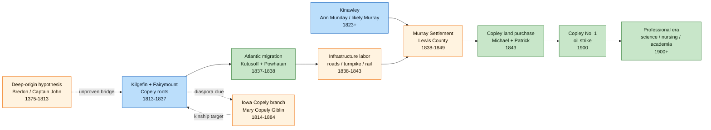
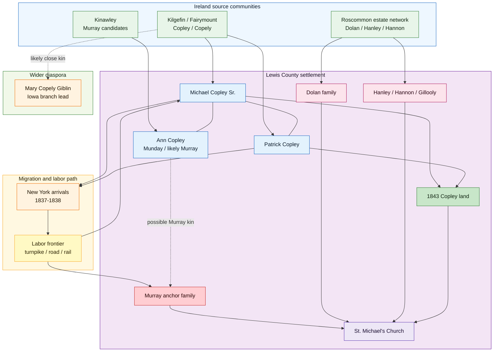
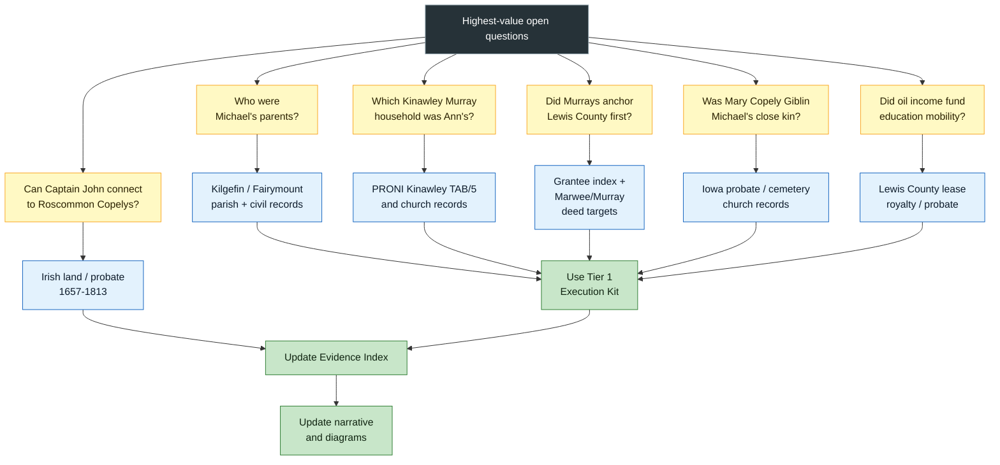

# Visual Story Atlas

This atlas is the diagram-first guide to the Copley family project. Use it when you want the whole story before diving into detailed profiles, source notes, and research tasks.

For relationship details, keep [[Family Tree]] nearby. For claim strength, use [[Sources and Evidence Index]].

## 1. Family Journey Map

## 2. Kinship and Settlement Network

## 3. Evidence Status Dashboard

```mermaid
graph TB
    ROOT["What do we know?"]:::root
    
    ROOT --> VER["Verified"]:::verified
    ROOT --> STR["Strong working conclusions"]:::strong
    ROOT --> PLA["Plausible frameworks"]:::plausible
    ROOT --> UNR["Unresolved"]:::unresolved
    ROOT --> REJ["Rejected"]:::rejected
    
    VER --> V1["1843 Michael + Patrick<br/>land purchase"]:::verified
    VER --> V2["Fairymount Catholic<br/>Copely presence"]:::verified
    VER --> V3["Copley No. 1<br/>oil strike"]:::verified
    VER --> V4["Captain John<br/>documented records"]:::verified
    
    STR --> S1["Ann Munday<br/>likely Murray"]:::strong
    STR --> S2["Ann from<br/>Kinawley"]:::strong
    STR --> S3["Michael from<br/>Kilgefin"]:::strong
    
    PLA --> P1["Murray Settlement<br/>community framework"]:::plausible
    PLA --> P2["Turnpike / labor<br/>pathway"]:::plausible
    PLA --> P3["Mary Copely Giblin<br/>close kin"]:::plausible
    PLA --> P4["Oil helped<br/>education mobility"]:::plausible
    
    UNR --> U1["Michael's parents"]:::unresolved
    UNR --> U2["Ann's exact<br/>Murray household"]:::unresolved
    UNR --> U3["Captain John to<br/>Roscommon bridge"]:::unresolved
    UNR --> U4["Oil lease / royalty<br/>records"]:::unresolved
    
    REJ --> R1["Arigna 1641<br/>Captain John claim"]:::rejected
    REJ --> R2["1824 Kilmacough<br/>Tithe claim"]:::rejected
    REJ --> R3["Munday impossible<br/>as surname"]:::rejected
    
    classDef root fill:#263238,stroke:#90a4ae,color:#ffffff
    classDef verified fill:#c8e6c9,stroke:#2e7d32,color:#102411
    classDef strong fill:#bbdefb,stroke:#1565c0,color:#0d1b2a
    classDef plausible fill:#fff3e0,stroke:#ef6c00,color:#1f1300
    classDef unresolved fill:#fff9c4,stroke:#f9a825,color:#2a2100
    classDef rejected fill:#ffcdd2,stroke:#c62828,color:#2b0707
```

## 4. Research Quest Map

## Reading Paths

- Start with [[The Copley Family Narrative]] for prose.
- Use [[Family Tree]] for generation-by-generation relationships.
- Use [[Sources and Evidence Index]] to check what is verified, plausible, unresolved, or rejected.
- Use [[Research Priorities and Action Items]] and [[Tier 1 Research Execution Kit]] when you want to advance the research.
