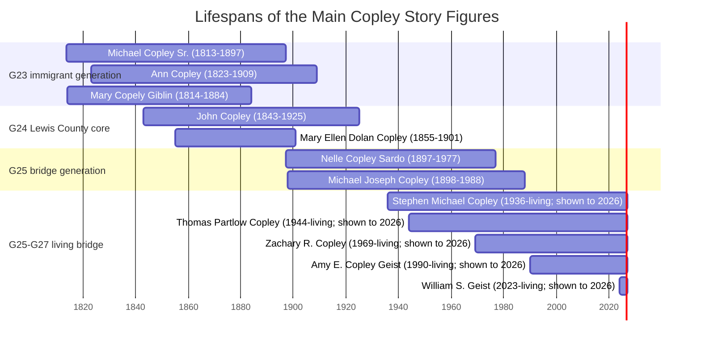
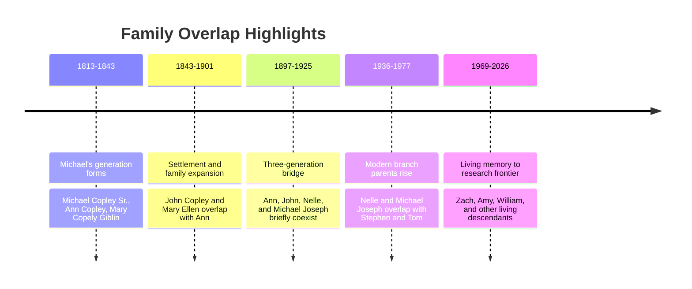
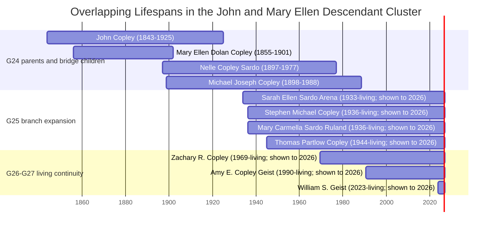

# Who Was Alive When

This page is for readers who understand stories best through **time**. Use it when you want to see who overlapped with whom, which generations coexisted, and which family members lived through the major turning points in the Copley story.

For relationships, keep [[Family Tree]] nearby. For the big-picture story, pair this page with [[Visual Story Atlas]] and [[The Copley Family Narrative]].

## What This Page Helps Answer

- Who was alive when [[People/Michael Copley Sr|Michael Copley Sr.]] immigrated?
- Which family members overlapped with the [[Topics/1900 Copley Oil Strike|1900 oil strike]]?
- How do [[People/Ellen Bernadine Nelle Copley Sardo|Nelle Copley Sardo]] and [[People/Michael Joseph Copley|Michael Joseph Copley]] bridge the immigrant era to the modern family?
- Which generations are still living in **2026**?

## Lifespan Overview

**Reading note:** living people are shown through **2026** so readers can see overlap, not because a death date is being implied.

## Era Snapshots

### 1838 — Migration Era

| Person | Approx. Age in 1838 | Why the Overlap Matters |
|---|---:|---|
| [[People/Michael Copley Sr|Michael Copley Sr.]] | 24-25 | Central immigrant figure on the American crossing. |
| [[People/Ann Copley|Ann Copley]] | about 15 | Still years from the later Lewis County household, but already part of the same migration-generation world. |
| [[People/Mary Copely Giblin|Mary Copely Giblin]] | about 24 | Shows that the wider Roscommon-era cohort was contemporary with Michael, not a later parallel line. |

### 1843 — Land Purchase and Settlement Consolidation

| Person | Approx. Age in 1843 | Why the Overlap Matters |
|---|---:|---|
| [[People/Michael Copley Sr|Michael Copley Sr.]] | 29-30 | Old enough to appear as a land purchaser with Patrick. |
| [[People/Ann Copley|Ann Copley]] | about 20 | Places Ann squarely in the settlement-generation frame. |
| [[People/John Copley|John Copley]] | newborn | Shows how early the next Lewis County generation begins. |

### 1900 — Oil Strike Moment

| Person | Approx. Age in 1900 | Why the Overlap Matters |
|---|---:|---|
| [[People/Ann Copley|Ann Copley]] | about 77 | The immigrant matriarch was still alive at the family land's industrial turning point. |
| [[People/John Copley|John Copley]] | about 57 | The oil strike lands in the middle of his household and property era. |
| [[People/Mary Ellen Dolan Copley|Mary Ellen Dolan Copley]] | about 45 | She lived into the oil-strike year but died soon after, making 1900-1901 a hinge moment. |
| [[People/Ellen Bernadine Nelle Copley Sardo|Nelle Copley Sardo]] | about 3 | The first documented bridge to the later Maryland branch was already alive. |
| [[People/Michael Joseph Copley|Michael Joseph Copley]] | about 2 | The future scientist generation begins while the old farm economy is changing. |

### 1944 — Modern Branch Bridge

| Person | Approx. Age in 1944 | Why the Overlap Matters |
|---|---:|---|
| [[People/Ellen Bernadine Nelle Copley Sardo|Nelle Copley Sardo]] | about 47 | Active adult bridge between the Lewis County past and later Maryland descendants. |
| [[People/Michael Joseph Copley|Michael Joseph Copley]] | about 46 | Deep into the education-and-science transition era. |
| [[People/Stephen Michael Copley|Stephen Michael Copley]] | about 8 | Already part of the rising postwar generation. |
| [[People/Thomas Partlow Copley|Thomas Partlow Copley]] | newborn | Marks the emergence of the later Tom-line branch as a living timeline node. |

### 2026 — Living Generations and the Research Frontier

| Person | Approx. Age in 2026 | Why the Overlap Matters |
|---|---:|---|
| [[People/Stephen Michael Copley|Stephen Michael Copley]] | about 90 | Connects living family memory to the children of Michael Joseph. |
| [[People/Thomas Partlow Copley|Thomas Partlow Copley]] | about 82 | Key bridge between 20th-century family memory and current research. |
| [[People/Zachary R. Copley|Zachary R. Copley]] | about 57 | Current steward of the public research project. |
| [[People/Amy E. Copley Geist|Amy E. Copley Geist]] | about 36 | Represents the still-expanding modern professional generation. |
| [[People/William S. Geist|William S. Geist]] | 2 | Shows that the documented line already reaches into a very recent generation. |

## Overlap Highlights

## Dense Lifespan View: John and Mary Ellen Descendants

This denser chart follows the core line from [[People/John Copley|John Copley]] and [[People/Mary Ellen Dolan Copley|Mary Ellen Dolan Copley]] into the Sardo, Stephen, and Tom branches. It is meant for readers asking not just "who came next?" but "which people actually shared time together?"

### What This Dense View Shows

- [[People/Mary Ellen Dolan Copley|Mary Ellen Dolan Copley]] lived long enough to overlap only briefly with [[People/Ellen Bernadine Nelle Copley Sardo|Nelle]] and [[People/Michael Joseph Copley|Michael Joseph]], making **1897-1901** a short but important hinge period.
- [[People/John Copley|John Copley]] overlapped with Nelle and Michael Joseph for more than two decades, which makes him the direct living bridge between the 1843 settlement generation and the children who carried the line into nursing, science, and later national dispersion.
- [[People/Ellen Bernadine Nelle Copley Sardo|Nelle]] and [[People/Michael Joseph Copley|Michael Joseph]] are the longest and strongest bridge figures in the whole project: they connect the farm-and-oil world to the still-living family lines.
- [[People/Sarah Ellen Sardo Arena|Sarah Ellen Sardo Arena]], [[People/Mary Carmella Sardo Ruland|Mary Carmella Sardo Ruland]], [[People/Stephen Michael Copley|Stephen Michael Copley]], and [[People/Thomas Partlow Copley|Thomas Partlow Copley]] create the next major overlap band, where living family memory still reaches back into the children of John and Mary Ellen.
- [[People/Zachary R. Copley|Zach]], [[People/Amy E. Copley Geist|Amy]], and [[People/William S. Geist|William]] show that the chronology is not closed history; the documented line still extends into a very recent generation.

## Fast Interpretive Takeaways

- [[People/Ann Copley|Ann Copley]] is the strongest single bridge between the immigrant era and the oil-strike era.
- [[People/John Copley|John Copley]] and [[People/Mary Ellen Dolan Copley|Mary Ellen Dolan Copley]] sit at the pivot between settlement history and the family's property-and-oil period.
- [[People/Ellen Bernadine Nelle Copley Sardo|Nelle Copley Sardo]] and [[People/Michael Joseph Copley|Michael Joseph Copley]] are the clearest bridge figures from the 19th-century Lewis County world into the 20th-century professional branches.
- The family story is not just a sequence of generations; it is a series of **overlapping lives**, with memory, land, migration, religion, and education all passing through living intermediaries.

## Use This Page With

- [[Family Tree]] for relationship structure
- [[Visual Story Atlas]] for the big-picture migration and evidence map
- [[The Copley Family Narrative]] for prose history
- [Timeline](/family-timeline/) for the larger event-and-context chronology
- [[Sources and Evidence Index]] when a date or claim needs source-status checking
